# Table of Contents
- [Introduction](#Introduction)
- [Reasons to have anal sex](#Reasons-to-have-anal-sex)
- [Safety](#Safety)
- [Anatomy](#Anatomy)
- [Anatomy (Female)](<#Anatomy-(Female)>)
- [Anatomy (male)](<#Anatomy-(male)>)
- [PC muscle](#PC-muscle)
- [Health](#Health)
- [Diet](#Diet)
- [Cleansing](#Cleansing)
- [Mental preparation](#Mental-preparation)
- [Lube](#Lube)
- [Warmup](#Warmup)
- [Anal massage](#Anal-massage)
- [Sex toys](#Sex-toys)
- [Materials](#Materials)
- [Poses](#Poses)
- [Butt plugs](#Butt-plugs)
- [Orgasms](#Orgasms)
- [Orgasms (female)](#Orgasms-%28female%29)
- [Orgasms (male)](<#Orgasms-(male)>)
- [Other anal sex methods](#Other-anal-sex-methods)
- [Aneros](#Aneros)
- [Stretching](#Stretching)
- [Fisting](#Fisting)
- [Random tips](#Random-tips)

# Introduction

| WARNING: While this guide is meant to contain mostly technical information, it may also contain some explicit content, you are not allowed to read the contents of this document unless you are at least 18 years old. |
| --- |

| WARNING: This document is not medical advice and you should use the information in this document on your own risk. |
| --- |

Anal sex has been known for a while, probably even as long as human history is recorded, but even then there is a lot of misinformation out there. To prevent this misinformation to spread further, this guide will give you details about anal sex and everything around it you need to know to have a pleasurable experience for you and your partner.

While it may seem that anal sex is simple, it is actually a lot more complex than regular intercourse and requires quite a lot of knowledge to make it safe and pleasurable. This guide will try to focus on the anatomy of both male and female bodies, hygiene, health, preparation, techniques, equipment, recommendations and much more to make sure you do it properly. Beginners will be tempted to skip various sections, but it is highly recommended that you read the entire document to understand the details of various aspects for anal.

Anal sex (and sex in general) is an area that sometimes lack scientific evidence and sometimes it is hard to make rational conclusions, whether it is due to lack of evidence or because of arguments that are logical fallacies. While this guide will contain some scientific facts, a lot of information will come from anecdotal reports, where people report their success with various methods, but a lot of these methods will lack scientific proof, there will also be an issue with the absolute truth since sources of claims will be subjected to selection bias by definition. The guide will try to explain some of the methods and why they could be true, but it is up to the reader to decide what to believe in. This guide should be considered as a compilation of reports and it is up to the reader how he or she uses the information and whether he or she acknowledges possible logical fallacies or not.

# Reasons to have anal sex

To many it may be hard to understand why would you want to have anal sex. According to a [study](https://www.ncbi.nlm.nih.gov/pmc/articles/PMC4379393/) done in 2014, women engage into anal sex due to various reasons, including to avoid vaginal intercourse (period, pregnancy), to pleasure her partner, desire for own pleasure, prostitution, under influence of drugs and didn't know she can refuse anal sex. While some of those reasons we should not discuss, the other reasons are quite beneficial to women, specifically to gain pleasure and to avoid vaginal intercourse.

While there have not been a widespread study that specifically researches the success rate of reaching orgasm through anal sex (the National Survey of Sexual Health and Behavior did not have sufficient participants), there do seem to be a noticeable amount of reports from individuals that they can reach an orgasm through anal sex. The results of this survey are reviewed in an article that females that engaged into anal sex reached orgasms a lot more often than with any other type of sex, you can read more about this in the article [here](https://metro.co.uk/2015/08/25/this-is-the-best-way-to-give-a-woman-an-orgasm-apparently-5359272/)

An article tries to example how women that engage into anal sex are more likely to reach any type of an orgasm, you can read about this [here](https://slate.com/technology/2010/10/why-do-women-who-have-anal-sex-get-more-orgasms.amp).

Another article describes how similar are the PC muscle contractions during anal and vaginal orgasms, you can view the article [here](https://lioness.io/blogs/sex-guides/anal-orgasms-vs-vaginal-orgasms-double-penetration).

You will most likely encounter people that are completely against anal sex, a lot of them might be self critical and lack mindfulness that is going to come as an obstacle to reach orgasms for both men and women, but you do need to remember that sex is a mutual agreement and requires consent from both (or more) parties. If you do convince your partner to try it, then there are a lot of interesting sensations awaiting for the (if done properly), as long as they are able to put aside the unhelpful thoughts.

Through this guide we will discover some of the very interesting features our anal sex related organs have during anal sex and will try to explain why anal sex probably is going to be a stronger orgasmic experience.

# Safety

While there is a lot of misinformation available regarding anal sex, the most devastating myths are related to safety in anal sex. This chapter is devoted to clear the misinformation so you can participate in anal sex safely. Below you can find some very crucial information regarding safety.

Anal sex is ```NOT``` supposed to hurt: For some reasons the Internet advocates that it is ok for anal sex to hurt a little and that you get used to the pain, but this is ```FALSE```, you are ```NOT``` supposed to feel any pain during anal sex. In the proceeding chapters you will find information on how fragile is your rectum and other parts involved into anal sex. Pain is always going to be an indicator that something is wrong and that you need to stop. If you feel sharp sudden pain, it is an indicator you need to stop immediately, no second thoughts. Anal sex can be dangerous, if not done properly, so you need to ensure you listen to your body. Your rectum and colon does not have a lot of nerve endings, this means you are less likely to feel pain when you have an injury.

Little big of blood is ```NOT``` normal: Another bizarre claim can be found on the Internet that you have an "anal hymen" ånd it is ok that you experience blood for the first times, but this is extremely dangerous and wrong even from anatomical standpoint. There is no "anal hymen" nor any amount of blood is acceptable during anal sex. Since your rectum and colon is very fragile and it is quite easy to break the tissues that the rectum and colon is made of, then blood directly indicates you have an injury (even if you feel no pain, because these areas don't have a lot of nerve endings). Red means stop, no second thoughts. Depending on the amount of blood and color of the blood, you might even need to seek immediate medical attention from doctors.

Discomfort is ```NOT``` normal: If you feel discomfort, this is another indicator that something is not right. Anal sex should be pleasurable, discomfort indicates that either your position, angle, lubrication, warmup, materials, relaxation or list of other things are not right. One of the most common complaints during anal sex is that you have an urge to poop, but even this urge should not exist and that indicates you need to revaluate your preparation for anal sex. Discomfort is another signal from your body that you need to stop whatever you are doing. One common myth is that discomfort goes away after a while, but this is not something you should rely on either, it is better to prepare properly to eliminate discomfort from the beginning.

Pushing yourself is ```NOT``` ok: When engaging into anal play with various toys, it is tempting to push yourself onto a toy using force, but this is very dangerous. For most people the anus is going to be the muscle that limits the size of the toy/penis they can insert (for more advanced people the limiter might be the rectum or even the colon), but you must remember that your anus is a muscle and it is quite easy to damage the muscle by making a muscle tear. Anal play should be considered as "anal yoga", where you learn to relax your muscles rather than force them. Leave your weight lifting mentality at the gym, don't bring it into anal play. This also applies to anal sex with a penis (or even a finger), the penis should slide in with a very small amounts of force, otherwise you are doing something wrong.

Spit is ```NOT``` a substitute for lubricant: Your rectum does not produce a natural lubricant the way a vagina does, in fact your anus and rectum is very dry on its own, nowhere near suitable for anal sex. In fact, your saliva has enzymes that naturally break down oils, this means that your spit will make the area more dry (for example, your lips become more chapped as you lick them more). Do not skip the lubricant part, you need lube quite a lot, you even need to reapply it regularly. Without lubrication you increase the risk of creating micro-tears in your rectum and even in your colon, not to mention the discomfort for you and your partner. With lube anal sex is much more pleasurable as well.

You do ```NOT``` switch from anus to vagina: Your rectum has a certain micro-biome with various bacteria that is suitable for defecating, the vagina is quite easy to infect with the bacteria living in your rectum. To prevent infection, it is best to simply avoid switching from anus to vagina (you can switch from vagina to anus, but not the other way around). Some people even go to extreme lengths and cover the vagina during anal sex to minimize the chances. Similarly it is not recommended to switch from anus to oral (ass to mouth) either.

You do ```NOT``` insert toys into your anus without a flared base (or a string): Many people find it quite arousing to insert various items completely into their rectum, such as round balls, but is can be very dangerous. Your rectum can work as a vacuum and "suck" various toys inside completely, but since you are most likely relaxing your various anal related muscles, then you are most likely having a quite straight path into your rectum. What can happen further is that the toy slides deeper and past the rectosigmoid junction, which is most likely straightened out enough so a toy can easily go into your colon. At the moment you stop relaxing your anal related muscles, you can re-create the acute angle of rectosigmoid junction and your toy is stuck inside completely, at this point you WILL need to seek immediate medical attention. The best thing you can do is to always use toys that have a flared base to prevent the toy completely going in. In case such an accident does happen, try to stay calm since stressing out will cause your muscles to contract. Be careful, toys disappear in matter of seconds.

Do ```NOT``` use random objects as sex toys: Your rectum and your colon is very fragile, random household objects can have sharp edges you don't even feel with your fingers. The material of the object might not be suitable for anal sex either and might give you complications such as infection. If you have the absolute necessity to use household objects as sex toys, then at least consider putting on a condom to reduce the chances of injury. 

Do ```NOT``` use numbing agents or pain killers: Many people think that they can remove the discomfort by using numbing agents (such as lube that has a numbing effect), but this can be dangerous since you are preventing your body to send signals that something is wrong. You always need to listen to your body during anal sex, numbing agents and pain killers will prevent you from sensing an injury before it becomes a medical emergency. It can be tempting to use numbing products to "speedup" the process of anal sex, but it is not worth the risk and it actually decreases the overall pleasure.

Do ```NOT``` combine drugs with anal sex: There are many types of drugs and each of them work differently, while there are some drugs that increase the sensitivity of your senses and some people report interesting sensations during anal sex, but some drugs decrease the sensitivity of various senses (including alcohol) and that pose a risk similar to numbing agents and pain killers. Some drugs even do the opposite effect and don't relax your muscles, for example, alcohol can even tighten muscles involved in anal sex. Some people claim alcohol to be a great drug for anal sex, but remember that alcohol has a sedative effect that reduces your sensitivity to pain, which is dangerous. Another effect you get by using drugs is distorted rational thought process, this can lead to making dangerous decisions such as spontaneous urge to fulfill an extreme sexual fantasy. A very popular drug in anal sex scene is "poppers", which have an effect to relax anal sphincters, but it is considered as a very dangerous drug due to reports of losing vision or experiencing hearth problems. For obvious reasons none of the drugs can be recommended for anal sex, it is best for your own safety to simply enjoy anal sex without any drugs, they are not worth the risk.

Do ```NOT``` pour in random liquids into your rectum: For some reasons there are people, who have decided to pour alcohol into their rectum through enema, but this is a terrible idea and can result into death ([source](https://www.healthline.com/health/alcohol/alcohol-enema#risks)). When you pour alcohol into your rectum, it is absorbed quite fast into your body and you become "drunk", the problem comes when you underestimate the efficiency of how well alcohol is absorbed. This probably can be done somewhat safety by pouring only very small amounts of alcohol and diluted with water, but in general pouring any liquid that is not water is not recommended for your own safety.

Do ```NOT``` be impatient: This is a reminder to be patient, warmup properly and be careful when sizing up. It is very important to take it slow, rushing things will only make things worse.

Just like vaginal sex, anal sex can transmit STDs as well, for this reason it is highly recommended to use a condom, if you are unsure about your partner. Another thing to keep in mind is that your rectum has a micro-biome containing various bacteria, these bacteria can infect a penis, so it is better to use a condom for anal sex in any case.

Sadly the safety of anal sex is a topic that many people do not take seriously enough, as a result many people injure themselves and some even end up in a hospital. The embarrassment of seeking medical help due to a sexual activity might be something you may think is a good reason not to seek medical help, but remember that sharp pain and blood can indicate internal organ damage, which in most cases is fatal. Foreign objects in your colon can easily cause internal organ damage due to movements. Don't neglect seeking medical attention, when it is required.

**IMPORTANT**: The classification of "when to seek help" is quite ambiguous and as stated in beginning of this guide that this is not a medical document, then don't rely too much on the recommendations, but do take them into consideration. As always, doing (or not doing) anything is at your own risk.

Consider the scenario of finding light blood during anal sex and you conclude that there are a few light blood drops, but the bleeding has stopped: In this case it may be a small micro-tear in your rectum's upper tissues and it is most likely to heal within a week or more. Avoid any anal sex for a week or more and check if the bleeding reoccurs after you have let the injury heal. If bleeding does reoccur, then avoid anal sex for even longer periods of time. Consider changing the sex toy, your position, depth, lube and other variables to prevent injury in the future.

Consider the scenario of feeling sharp pain during anal sex, but you conclude that there is no bleeding. The sharp pain indicates that you need to stop anal sex immediately and make sure you have not started bleeding since it can take time for blood to appear. If blood does not appear, that means that it is most likely (but not definitive) that you don't need medical attention right now, but you cannot be certain and you might want to see a doctor to make sure there is no permanent organ damage.

Consider the scenario of finding dark red blood during anal sex (regardless of feeling pain). In this case, there is no doubts, you NEED immediate medical attention, right now. Whatever you have injured, it is most likely a fatally dangerous injury that needs medical intervention.

Consider the scenario of losing the ability of removing a sex toy (gets stuck). At first, try to stay calm, don't make sudden movements. There is a chance that the object you inserted has not rotated and can be removed by getting into a squat pose and very gently pushing the toy out like you were defecating (do NOT put a lot of strain). If the object is still stuck, then sadly you will need to seek immediate medical attention (you cannot wait till tomorrow since you can injure your colon during your sleep).

As you can see, in many cases your anal sex can end up in the hospital. There is no doubts, anal sex can be dangerous, but it can be safe enough for you and your partner to enjoy. It might seem from this chapter that anal sex is too risky, but remember that many people engage into anal sex (and some people engage into only anal sex or the "anal only lifestyle"), all you need is a little precaution and knowledge to prevent an accident from happening. Continue reading to better understand the anatomy of various organs related to anal sex and how to prevent injury.

# Anatomy

While males and females are quite similar in many aspects, the anatomy of anal sex related organs are quite different. To better understand the differences, we should first examine the similarities. Lets first examine the colon to understand better the involved parts of the organ in anal sex. Consider the following diagram ([source](https://www.cancer.gov/publications/dictionaries/cancer-terms/def/colon)):

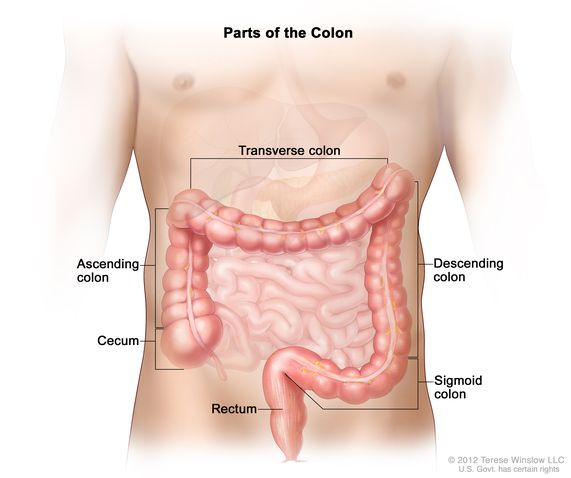

In anal sex we are mostly interested in the following parts:
- Anal sphincters
- Rectum
- Sigmoid colon
- Descending colon
- Transverse colon

Depending on your skill level and the type of anal sex you participate in, you are going to be interacting with these parts of the colon (in that specific order). Most people will be interacting with the rectum and the sigmoid colon, the other parts of the colon are for very experienced people. Each person is different and each part of the colon will have a different measurement and characteristics, but it is very important to understand the possible dimensions of various parts of the colon so you can prevent injury. Consider the following diagram ([source](https://www.dynalook.com/14th-international-ls-dyna-conference/simulation/looping-formation-during-colonoscopy-a-simulation)):

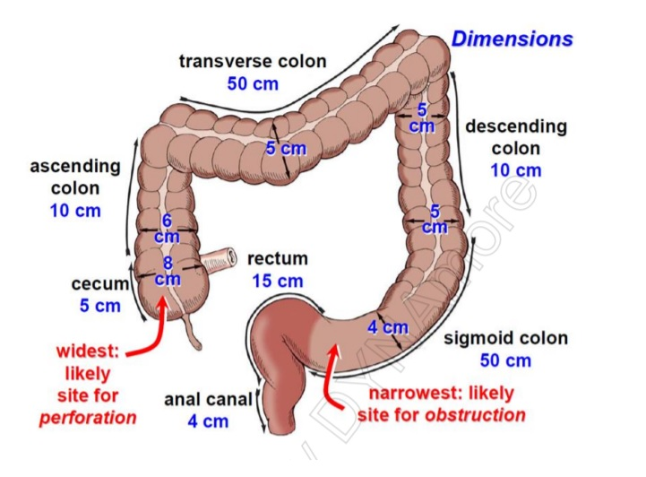

From the diagram you can see that the rectum on average is 4+15cm long (and that is including a curve). This is very important since an average penis is very near the total length of the rectum, but some penises are longer and can exceed the rectum's length, which can be an issue since there is a possibility to injure a person this way. Some people report that over the years they have increased the length of their rectum using various sex toys so they can use even longer toys or penises, though such reports are based on anecdotal experiences.

A very important part of the colon (and rectum) is the tissues that the colon is made of. Most common injuries from anal sex are related to punctures or bruises of the colon's tissues. Reason for the common injury is because these tissues are not designed to be abused, but rather they are only strong enough to handle defecation, not foreign objects. Consider the following diagram ([source](https://medivisuals1.com/a-section-of-the-wall-of-the-colon-505138-01xg.aspx)):


This is a simple diagram of the "colon wall" (gastrointestinal wall), these are the tissues that make up your colon. It may seem that these tissues are thick, but these tissues are very delicate and can easily be damaged. The muscosa is the most upper layer that contains a gel-like substance that is meant to prevent your colon from drying out. The "muscularis mucosa" is a thin layer of muscle tissues. Right underneath is the submucosa that contains blood vessels and lymph nodes ([source](https://www.kenhub.com/en/library/anatomy/the-colon)). This diagram should make you aware of the possible risk of damaging the tissues of your colon that can result in various degrees of bleeding or even immediate medical attention. Use this information to better understand your limits since it is quite easy to injure yourself.

Note: You must assume that your colon does not have lubrication on its own during anal sex. The mucus that lubricates your colon is only sufficient for transporting stools in your colon, but far from being able to prevent bruises of your colon during anal sex. Always add more lubrication, it is NEEDED, spit is not a sufficient lubricant.

Before the rectum we encounter the anus. This is a group of muscles that prevent you from releasing your stool unintentionally. These muscles are also quite flexible and can be stretched quite a lot and can withstand extensive stretching as long as it is done properly and slowly. Consider the following diagram ([source](https://teachmeanatomy.info/abdomen/gi-tract/anal-canal/)):

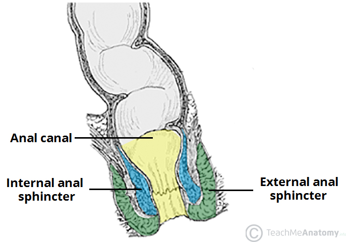

Note: The anus is packed densely with nerve endings, it is extremely sensitive and it can sense even the lightest stimulation. This can be very useful for some types of anal play, but this can also cause a lot of pain, if you are not careful.

The focus here is on two muscles called the external and internal sphincter. They can be imagined as ring-like muscles that can be relaxed or contracted, but there is a significant difference between them. The external sphincter is what most people call the anus, it is the "seal" that you can see yourself, it is a voluntary muscle, this means you can control it at any time. The internal sphincter is a muscle that is located behind your external sphincter (and the external sphincter even wraps around the internal sphincter), it is not a voluntary muscle and takes practices to learn how to indirectly control it ([source](https://teachmeanatomy.info/abdomen/gi-tract/anal-canal/)). The most common complaint that anal sex is painful is most likely going to be caused by either one of these muscles, but very likely caused by the lack of some kind of control over the internal sphincter. While the external sphincter can be opened easily, the internal sphincter requires warm up, practice and proper care. These muscles are the ones you should be focusing on, if you are a beginner since they make the difference between "painful" and "pleasurable", more details on how to treat these muscles can be found later in the guide.

Above the sphincters you can find the pectinate line. This is a landmark in anatomy since the structure of tissues change after this line ([source](https://www.statpearls.com/ArticleLibrary/viewarticle/32348)). Above this line you can find anal columns that are vertical folds on the rectum's walls, you can sometimes feel a slight change in the texture on these anal columns ([source](https://www.imaios.com/en/e-Anatomy/Anatomical-Parts/anal-columns)). In anal sex, this part does not serve a very important role (though this part has an important role in anatomy due to the structural change), but this line can have a texture and this line does mark a part where a more delicate tissue starts. Consider the following diagram ([source](https://teachmeanatomy.info/abdomen/gi-tract/anal-canal/)):

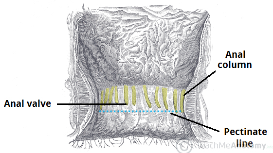

One thing that we will encounter later in the guide is hemorrhoids and it deserves a special attention right next to the anal columns. Hemorrhoids are swollen or enlarged veins inside or outside the rectum. They can cause pain and/or bleeding ([source](https://my.clevelandclinic.org/health/diseases/15120-hemorrhoids)). In general, we all have some degree of hemorrhoids, but if they are causing discomfort, then anal sex should be avoided. It is important to understand the possible locations of hemorrhoids so you can seek medical attention in case this is a problem. Consider the following diagram ([source](https://doctorbutlers.com/resources/what-are-hemorrhoids/)):

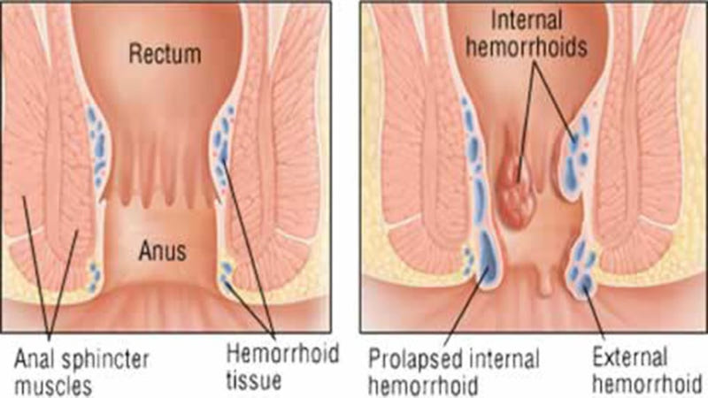

When both internal and external sphincters are opened, you encounter the rectum. This is a quite delicate part of your body and the same precautions that were in effect for your colon, those also are in effect for your rectum since the structure is (almost) the same. Before we can insert sex toys into the rectum, we encounter the anorectal angle, this is an angle that is created by a muscle called "puborectalis" that is (sort of) wrapped around the rectum forming a slingshot-like muscle, the angle of the rectum this muscle creates is called "anorectal angle". This muscle works in association with the internal and external anal sphincter in the process of defecation ([source](https://www.ncbi.nlm.nih.gov/books/NBK556078/)). What this means is that the muscle is relaxed when your body receives the signal to defecate. You can decrease the anorectal angle by pointing your toes inwards and putting your knees together, this also reduces tension on the pelvic floor muscles. Consider the following diagram ([source](https://gut.bmj.com/content/59/9/1288)):

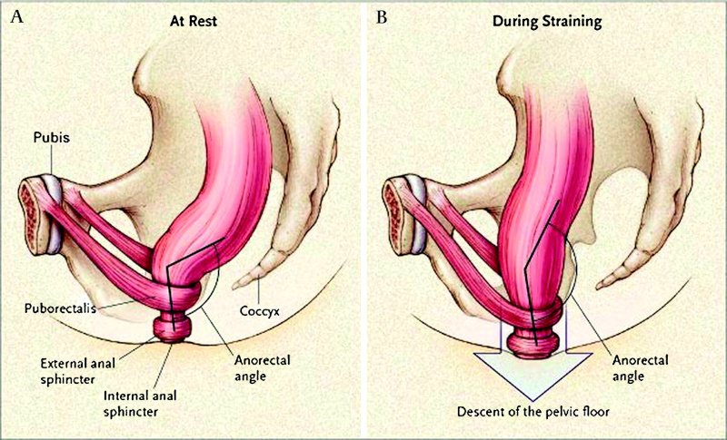

This acute angle will prevent you from inserting various objects into your rectum without discomfort. The muscle does seem to react to very slight pressure (not a lot) and just keeping the pressure until you feel the acute angle reducing, but there are other methods as well that should be used into your warmup routine. One very crucial feature of the rectum is its folded structure and it MUST be taken into account when having anal sex. Consider the following diagram ([source](https://oncohemakey.com/rectal-anatomy-clinical-perspective/)):


The folded structure consists of 3 rectal valves that create a path that may seem slightly bended, but is actually quite noticeable and ignoring this feature can result either in discomfort or even severe injury. The function of these rectal valves seem to be to support fecal matter's weight so it does not immediately reach your anal sphincters therefore prevents the immediate urge to defecate ([source](https://en.wikipedia.org/wiki/Transverse_folds_of_rectum)). During anal sex these folds prevent you from having a straight entry into the rectum since the rectum is more of a S-shape than being straight. The walls of the rectum are quite flexible and individuals seem to report that with a proper warm up you can straighten out the S-shape to something quite a lot more straight. The folds are not the only curvature in your rectum, the rectum itself is angled more to your backside, consider the following diagram ([source](https://cdn.citl.illinois.edu/courses/CHLH206/ch3_4_anatomy_lecture/web_data/file17.htm)):

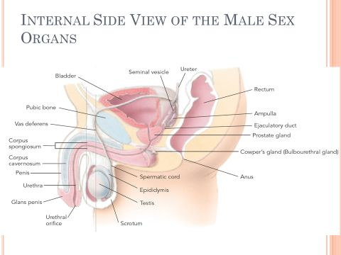

Although this is a male's anatomy, the female's anatomy does not differ at the part where the rectum lies (the reproductive organs change). In a standing position, the rectum is angled a lot from the anus, this means penetration during anal sex while standing cannot be done at the same angle as the anus (other positions are more forgiving), this is something you must take into account since the penetration can be dangerous, you must understand the angle of the rectum in each positions. This also means that sex toys that are straight are not the most suitable for anal sex, slightly curved ones are much more suitable. The following diagram illustrates the angle of a penis or sex toy to reduce the discomfort during penetration:

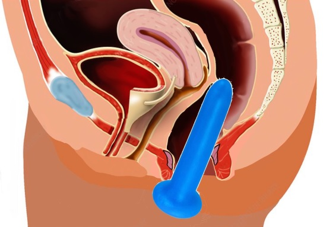

A whole chapter must be devoted to positions that are suitable for anal sex, but should give you basic understanding of the shape of the rectum, that is very crucial to prevent injury. Connected to the rectum is the sigmoid colon, but before that we encounter a special landmark in anatomy called the rectosigmoid junction. This is an area that many people refer to as "the bend" since this area has a curvature for your colon at a very sharp angle. When anal sex is done using longer toys or longer penises, it is quite likely to reach the rectosigmoid junction and because of the sharp angle you can cause discomfort or even injury. The direction of the colon is angled on two directions, the exact angle might not be so important for beginners since the direction becomes a lot more important for those who want to practice anal depth play, though it is still useful to know the approximate direction. Consider the following diagram ([source](http://www.endoscopy-colon-explorer.com/colon-3d-2/)):

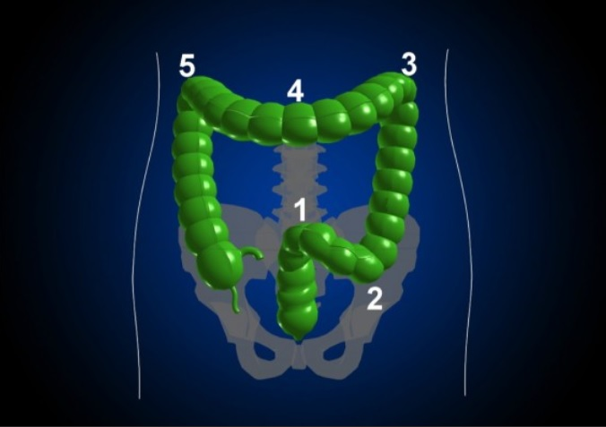

The curvature of the rectum in resting state is angled towards your back side, then has a sharp angle at the rectosigmoid junction and makes the sigmoid colon curve towards your abdominal muscles (stomach), then curves to the left side of the body.

At resting state, the rectum has a very acute anorectal angle, but your colon also creates a sharp angle at the rectosigmoid junction, this is suitable to keep fecal matter inside the colon so you don't have the urge to defecate all the time. When you give your body the signal to defecate, the anorectal angle is not acute anymore, the rectum is quite straight, your colon straightens out and this is synchronous action is suitable to release fecal matter from your colon. The goal in anal sex often involves learning to relax the puborectalis muscle and the colon WITHOUT using drugs or forcing it. Very dangerous misinformation is spread over the Internet that you should force the muscle back using various objects or even fists and to help this they even suggest using drugs such as "poppers", all of this is a very bad advice that can create severe internal organ damage. Puborectalis does not become relaxed with more external force nor is the colon relaxed using external force, it actually does the opposite when these muscles are strained, there is no other safe way to decrease the acuteness of the anorectal angle and rectosigmoid junction other than practice. Luckily there are some poses that can help to straighten the rectosigmoid junction, one of the most popular poses is the squatting pose that naturally relaxes the puborectalis muscle and colon itself ([source](https://www.researchgate.net/figure/Puborectalis-muscle-in-the-sitting-and-squatting-postures-sources-and-Natures_fig3_277276701)). Consider the following diagram ([source](https://medicalxpress.com/news/2016-08-toilet-squatting.html)):


While we mentioned that puborectalis should not be relaxed using a lot of force, you can use a slight amount of force. Later we will introduce a simple anal warmup method involving squeezing and relaxing the muscles, during the relaxation we will encounter how easy it is to stretch the anal sphincters and decrease the anorectal angle with a very small amount of force. The amount of force required to stretch the puborectalis muscles is small, a normal penetration using your partner's penis is enough to stretch it and give more space for stimulation for the orgasmic parts of the rectum. Consider the following diagram ([source](https://www.researchgate.net/figure/Anorectal-examination-Note-Reprinted-from-GastroClinics-vol-383-Bouras-eP-Tangalos_fig2_279170248)):

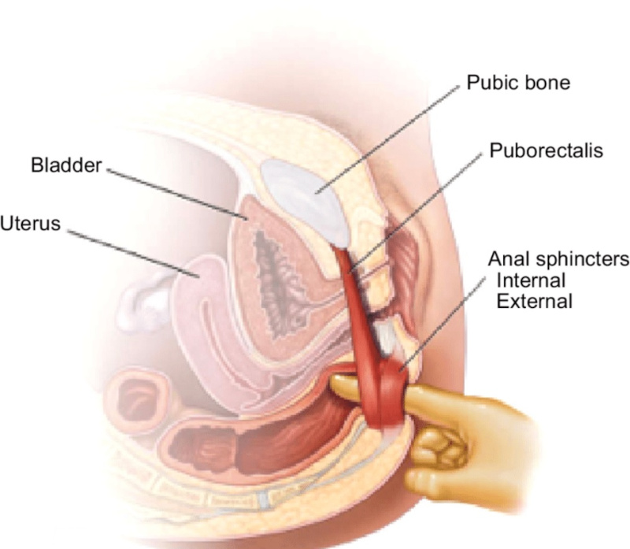

Over time you can learn to relax the puborectalis muscle and the colon (using various techniques), this improves the overall comfort during anal sex. When the rectosigmoid junction is passed, the rectum becomes the sigmoid colon, which is an area that quite experienced people use for anal depth play. The sigmoid colon is quite narrow, about 4cm wide for most people ([source](https://www.dynalook.com/14th-international-ls-dyna-conference/simulation/looping-formation-during-colonoscopy-a-simulation)), but it is quite flexible and can be stretched over time. Stretching parts of the colon (including the sigmoid colon) is quite dangerous since there are almost no nerve endings in the colon, but you can feel distention ([source](https://www.blairlewismd.com/services/colonoscopy)). This means you will not feel pain, touch or temperature changes in your colon, you might no feel lethal injury at first. The colon's walls are even more delicate than the rectum's walls and for that reason anal depth play must be done very carefully.

Between the sigmoid and descending colon you encounter a slight bend. Usually it is not something people even notice during anal depth play, but sometimes they notice the narrow part of the colon and sometimes they even help to move the anal probe (the sex toy) using their hands on their stomach, they guide the anal probe through the colon. There is a sharper bend between the descending and transverse colon, this is usually the area that most experienced people try to reach and requires a lot of practice.

This chapter has covered the anatomical basics that are common for both males and females, but this is where the similarities end. In next chapters we will review how each gender is different from anatomical stand point.

# Anatomy (Female)

The most significant difference between males and females is in the reproductive organ area, but these differences also bring some changes to the anatomy of rectum. Consider the following diagram ([source](https://www.magonlinelibrary.com/doi/abs/10.12968/bjon.2018.27.22.1306)):

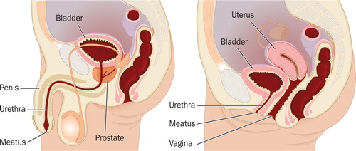

From these diagrams you can compare that there is a slight difference in the organ placement near the rectum. Females seem to have a uterus located between the bladder and the rectum. This might explain why anal sex is enjoyable for females since this diagram could suggest that stimulation of the vagina is happening through the uterus, though this might not be entirely true. One important aspect of female anatomy is that the bladder is not located right next to the rectum. Stimulating the bladder through rectum is not a sensation that many people seem to enjoy since it creates an urge to pee. Luckily women's bladder is located quite far from the rectum, though this does not mean you can ignore the curvature of the rectum, too intense stimulation might not be desired either.

Another difference is in the pelvic bone. Female's hips are wider, but shorter, female's pelvic bone is more suitable for giving birth to a child. Consider the following diagram ([source](https://www.registerednursern.com/male-vs-female-pelvis/)):

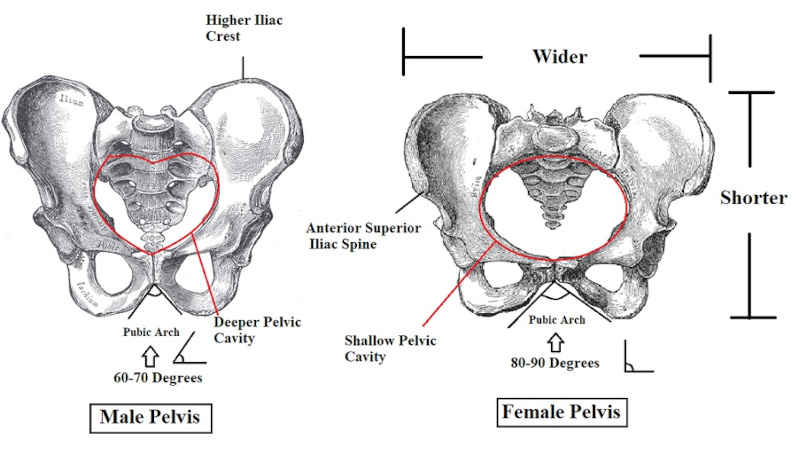

The pelvic cavity is also wider in females and the pubic arch is also wider (this makes female buttocks look more rounded at the bottom). The pelvic cavity is surrounded by two smaller bones called ischial spine that are fused onto your pelvic bone. Consider the following diagram ([source](https://www.open.edu/openlearncreate/mod/oucontent/view.php?id=36&printable=1)):

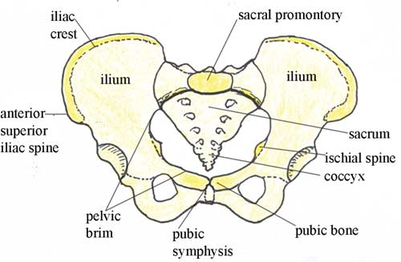

These small bones are the bones you feel on your lower part of your buttocks, almost right next to the anus. During anal sex these bone features are not very crucial, but it comes quite crucial when you are getting into more advanced anal play using larger sex toys. The rectum and colon is quite stretchable over time, but the pelvic bone is not. Most bones in your pelvic bone is fused together during puberty and bones are fused together when reached age of 17 ([source](https://carta.anthropogeny.org/moca/topics/age-pelvic-bone-fusion)). The pelvic bone should be considered as solid and impossible to change before you reach the age of 18, while some bones continue to fuse, this is not important for anal sex.

Due to bones fusing, you are going to have a very distinct limit of sex toy size you are able to insert into your rectum. Your ischial spine is going to limit the diameter of the sex toys you can use for anal play. There is no way around it, though this limits the diameter of an round-shaped sex toy, it does not limit the diameter for an oval-shaped sex toy. This limit can cause frustrations for advanced people that are into more extreme activities such as fisting. It is recommended to accept the limit and simply focus on other types of stimulations.

The most important part that you must take into account when having anal sex with a female is the nerve anatomy since that is quite different from males, possible cause is due to reproductive organ placement. Lets first examine the nerves for female's vulva. Consider the following diagram ([source](https://courses.lumenlearning.com/atd-herkimer-biologyofaging/chapter/anatomy-and-physiology-of-the-female-reproductive-system/)):

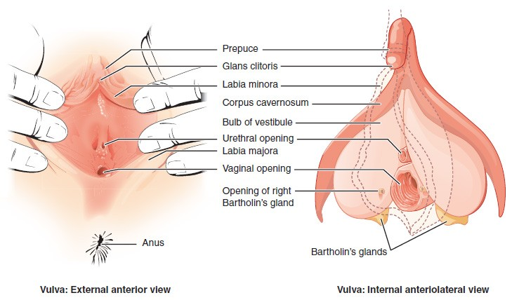

The most sensitive part of the female's vulva is going to be the clitoris. While other parts of the vulva such as "labia minora" and "labia majora" are quite sensitive, the clitoris is quite sensitive since it contains a very dense erectile tissue. Externally you can access the clitoris right under the clitoral hood, but that is only a small part of the nerve that the clitoris is connected to. The erectile tissue that makes clitoris is placed on top of the pelvic bone. Consider the following diagram ([source](https://quizlet.com/ca/488283155/ana300-lecture-11-flash-cards/)):

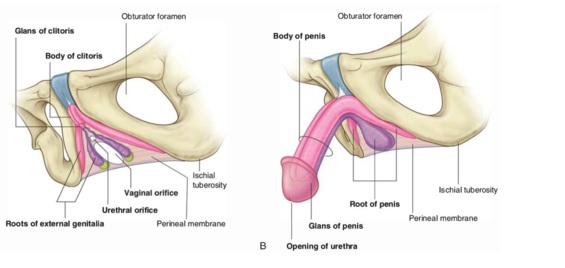

Most females can orgasm when the clitoris is properly stimulated. This is not the only type of orgasm females can have, but many women have a large chance of reaching such orgasm since many of them have developed a personal method. Vaginal orgasm might be a trait for those women, who prefer longer penises ([source](https://pubmed.ncbi.nlm.nih.gov/23006745/)). The clitoral orgasms may suggest that stimulating the erectile tissue can give a female an orgasm. Near the reproductive organs there is a nerve called "pudendal nerve" that branches into multiple smaller nerves, it runs along the base of the pelvic floor and reaches the rectum and clitoris. Consider the following diagram ([source](https://www.alilamedicalmedia.com/media/f2807b32-9a5f-11e3-90f3-83cc20702c19-pudendal-nerve-in-female-lateral)):

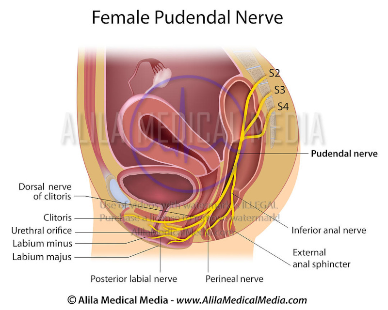

The function of the pudendal nerve is to supply sensation to the dorsal nerve of the clitoris (a nerve that branches off pudendal nerve into the clitoris) ([source](https://en.wikipedia.org/wiki/Pudendal_nerve#Function)). Research also seems to suggest that damage to the pudendal nerve causes sexual dysfunction ([source](https://www.ncbi.nlm.nih.gov/pmc/articles/PMC8261452/)). The feature of the pudendal nerve to supply nerves to the clitoris seems to suggest that you can stimulate the pudendal nerve to receive sexual stimulation and that is what many people use to explain anal orgasms in females, though many women report needing to stimulate their clitoris to reach anal orgasm, yet many of them manage to remove clitoral stimulation with practice.

These nerves are surrounded by a muscle called "pelvic floor muscle" or the "pubococcygeus", but most commonly called th "PC muscle", but this muscle deserves a chapter on its own since it is very significant in achieving anal orgasms and requires special exercises to increase the chances of reaching an orgasm.

Another nerve that is embedded into female's reproductive organs is the hypogastric nerve. The function of the nerve is to send signals via the sympathetic nervous system to block bladder contraction and contact the internal urethral sphincter ([source](https://www.sciencedirect.com/topics/neuroscience/hypogastric-nerve)). This nerve stretches from the spine into the rectum and interior erogenous zones of the vagina. Consider the following diagram ([source](https://www.kenhub.com/en/library/anatomy/hypogastric-nerve)):

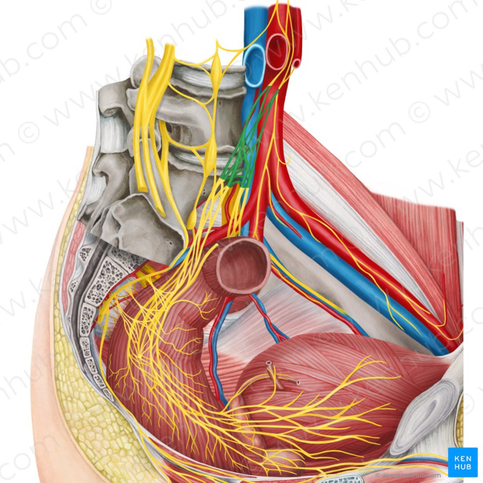

When we are interested in stimulation, we usually are interested in the G-spot that is somewhat right under the front side of the pelvic bone at quite a sharp angle, and we are interested in the fornix (A-spot) that is quite deeper into the rectum than G-spot is in the vagina. This can very crucial when you want to make sure you are stimulated the right region. Consider the following diagram ([source](https://www.anatomynote.com/human-anatomy/reproductive-system-anatomy/sectional-view-of-female-reproductive-organ-diagram/)):

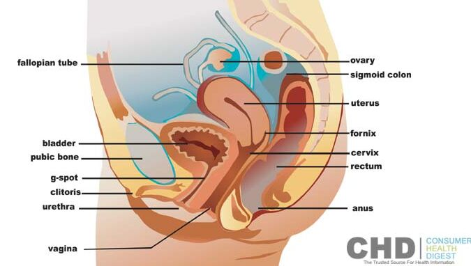

Some (maybe all) women have a special glands around the G-spot called the Skene's glands that is more like a collection of glands. These glands are believed to be the source of female ejaculates (one type of squirting) ([source](https://www.ncbi.nlm.nih.gov/books/NBK547703/)). The amount (if any) of liquids this organ produces varies between people and finding these glands can sometimes be hard as well. The liquids are expelled through Skene's ducts, sadly the exact anatomy can vary and they can be located on the sides of the uterus or even outside it. Consider the following diagram ([source](https://www.newscientist.com/article/dn2495-bigger-is-better-when-it-comes-to-the-g-spot/)):

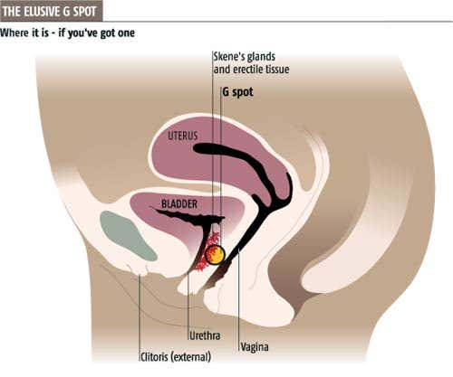

The Skene's glands are usually called the "female prostate". The complete purpose of this organ is not very clear and you can find anatomical diagrams of various ducts that are connected to this gland or other glands that are responsible of creating lubrication for the vagina during arousal. One thing to note from the image above is that the "female prostate" is not located directly accessible from the rectum (in contrast to the male's anatomy), this means you will not be able to stimulate this part using just anal sex, but you might be able to stimulate it indirectly by angling your thrusts in the rectum. Consider the following diagram to better see the location of various erogenous zones ([source](https://www.researchgate.net/figure/Deep-Vaginal-Erogenous-Zones-DVZs_fig3_333616787)):

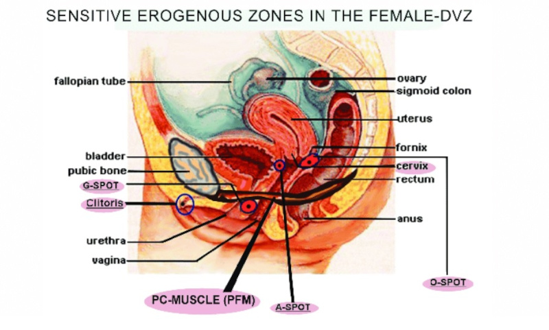

# Anatomy (male)

The most significant difference between males and females is in the reproductive organ area, but these differences also bring some changes to the anatomy of rectum. Consider the following diagram ([source](https://www.magonlinelibrary.com/doi/abs/10.12968/bjon.2018.27.22.1306)):


You can revisit the [Anatomy (female)](<#Anatomy_(female)>) section to read about the differences, but the most significant difference is that the prostate is located very close to the rectum and so is the bladder. Another thing to note is that the prostate is quite near the perineum (the area between the anus and vagina/penis). When stimulating prostate it is quite easy to stimulate the bladder by accident, this creates an undesirable sensation that many describe as urge to pee.

Another difference is in the pelvic bone. Male's pelvic bone is narrower, but longer, male's pelvic bone was never meant to give birth to child. Consider the following diagram ([source](https://www.registerednursern.com/male-vs-female-pelvis/)):


The pelvic cavity is narrower, but deeper in males and the pubic arch is also narrower (this makes male buttocks look more square at the bottom). The pelvic cavity is surrounded by two smaller bones called ischial spine that are fused onto your pelvic bone. Consider the following diagram ([source](https://onlinesciencenotes.com/differences-between-male-pelvis-and-female-pelvis/)):

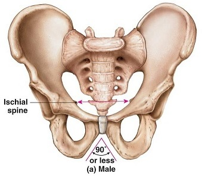

These small bones are the bones you feel on your lower part of your buttocks, almost right next to the anus. During anal sex these bone features are not very crucial, but it comes quite crucial when you are getting into more advanced anal play using larger sex toys. The rectum and colon is quite stretchable over time, but the pelvic bone is not. Most bones in your pelvic bone is fused together during puberty and bones are fused together when reached age of 17 ([source](https://carta.anthropogeny.org/moca/topics/age-pelvic-bone-fusion)). The pelvic bone should be considered as solid and impossible to change before you reach the age of 18, while some bones continue to fuse, this is not important for anal sex.

Due to bones fusing, you are going to have a very distinct limit of sex toy size you are able to insert into your rectum. Your ischial spine is going to limit the diameter of the sex toys you can use for anal play. There is no way around it, though this limits the diameter of an round-shaped sex toy, it does not limit the diameter for an oval-shaped sex toy. This limit can cause frustrations for advanced people that are into more extreme activities such as fisting. It is recommended to accept the limit and simply focus on other types of stimulations.

The most important part that you must take into account when having anal sex with a male is the nerve anatomy since that is quite different from females, possible cause is due to reproductive organ placement. Lets first examine the nerves for male's penis. Consider the following diagram ([source](https://www.britannica.com/science/penis)):

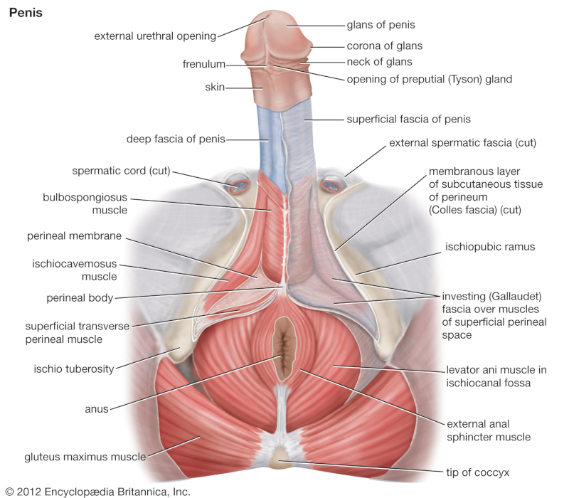

The most sensitive part of the male's penis is going to be the glans (commonly called the penis'es head). Other parts of the penis such as shaft and testicles are quite sensitive, the glans are the most sensitive since it contains a very dense erectile tissue. A uncircumcised penis will have foreskin covering the glans (a circumcised penis will not have the foreskin) and compared to female's clitoris the penis glans are quite well exposed externally, but a lot of erectile tissues are still located on the pelvic bone. Consider the following diagram ([source](https://quizlet.com/ca/488283155/ana300-lecture-11-flash-cards/)):


Most males orgasm when their glans are properly stimulated. While there are a few types of orgasms that a male can achieve, only the ejaculatory orgasm seems to be the most common one in males. Similar to females, males seem to be able to reach an orgasm when sensitive areas around the glans are stimulated, this also may suggest that stimulating erectile tissue can give a male an orgasm. Near the reproductive organs there is a nerve called "pudendal nerve" that branches into multiple smaller nerves, it runs along the base of the pelvic floor and reaches the rectum and the penis. Consider the following diagram ([source](https://www.alilamedicalmedia.com/media/f2807b32-9a5f-11e3-90f3-83cc20702c19-pudendal-nerve-in-female-lateral)):

Most females can orgasm when the clitoris is properly stimulated. This is not the only type of orgasm females can have, but many women have a large chance of reaching such orgasm since many of them have developed a personal method. Vaginal orgasm might be a trait for those women, who prefer longer penises ([source](https://pubmed.ncbi.nlm.nih.gov/23006745/)). The clitoral orgasms may suggest that stimulating the erectile tissue can give a female an orgasm,n ear the nerves that builds the erectile tissues in females is surrounded by a nerve called "pudendal nerve", it runs along the base of the pelvic floor and reaches the rectum and clitoris. Consider the following diagram ([source](https://www.alilamedicalmedia.com/media/174e771a-9a70-11e3-b43c-ebb24c8a68db-male-pudendal-nerve)):

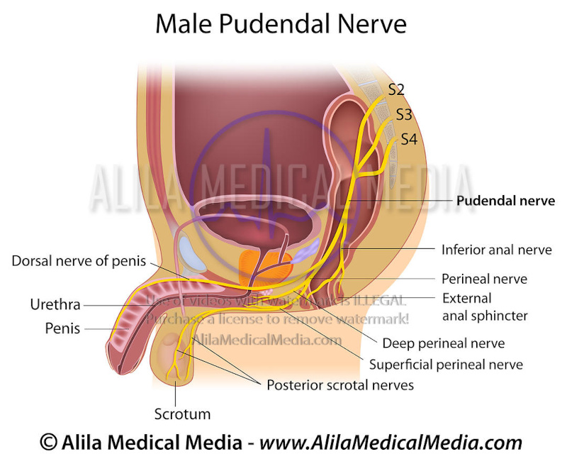

The function of the pudendal nerve is to supply sensation to the dorsal nerve of the penis (a nerve that branches off pudendal nerve into the penis) ([source](https://en.wikipedia.org/wiki/Pudendal_nerve#Function)). Research also seems to suggest that damage to the pudendal nerve causes sexual dysfunction ([source](https://www.ncbi.nlm.nih.gov/pmc/articles/PMC8261452/)). The feature of the pudendal nerve to supply nerves to the penis seems to suggest that you can stimulate the pudendal nerve to receive sexual stimulation similar to females, but many men report much larger success by stimulating the prostate directly rather than stimulating the surrounding nerves. There are a lot of anecdotal reports of various methods men have used to reach orgasm involving anal and that deserves a chapter on its own. From the diagram you can see that the pudendal nerve also reaches the testicles, this might explain why men report intense orgasms during oral sex when their partner has included some testicle stimulation as well. You can also thee from the diagram that the pudendal nerve is located very near the perineum.

These nerves are surrounded by a muscle called "pelvic floor muscle" or the "pubococcygeus", but most commonly called th "PC muscle", but this muscle deserves a chapter on its own since it is very significant in achieving anal orgasms and requires special exercises to increase the chances of reaching an orgasm.

The area between the anus and the penis is quite sensitive and is called the perineum. This area contains two important muscles called ischiocavernosus and bulbospongiosus, these muscles directly connected to your penis base and these muscles contract during the most common type of orgasm males experience and these muscles seems to be related to creating ejaculation. One trick that some males use is to press against the perineum fingers moments before ejaculating to increase the intensity of the orgasm. Consider the following diagram ([source](https://en.wikipedia.org/wiki/Transverse_perineal_muscles)):

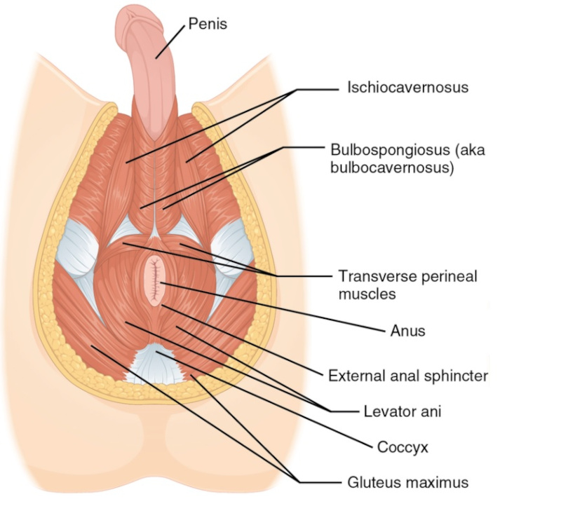

Right next yo the prostate you can find seminal vesicles. These are two small glands that store and produce the majority of the fluid that makes up semen. During ejaculation, the fluid from the seminal vesicles is expelled into the ejaculatory duct where it can then move on to mix with sperm and other reproductive fluids ([source](https://www.healthline.com/human-body-maps/seminal-vesicles/male#:~:text=The%20seminal%20vesicles%20are%20two,sperm%20and%20other%20reproductive%20fluids.)). Since these glands are very close to the prostate and it is responsible of making the majority of seminal fluid, then isolated the prostate and achieving a prostate induced orgasm is going to be a little difficult. Consider the following diagram ([source](https://www.macmillan.org.uk/cancer-information-and-support/prostate-cancer/the-prostate)):

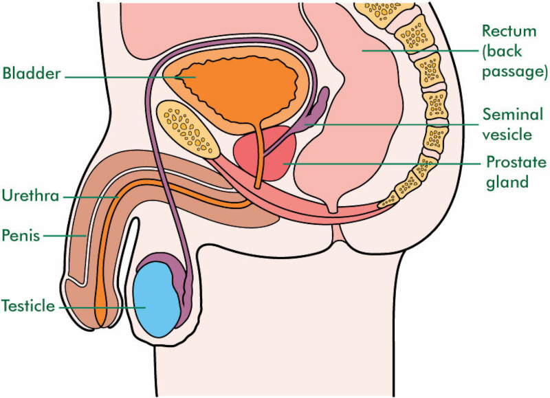

The cowper's glands (or bulbourethral glands) are pea sized glands present inferior to the prostate gland in the male reproductive system. They produce thick clear mucus prior to ejaculation that drains into the spongy urethra ([source](https://pubmed.ncbi.nlm.nih.gov/15811067/#:~:text=Cowper's%20glands%20are%20pea%20sized,drains%20into%20the%20spongy%20urethra.)). Many people call the fluids that these glands produce as "precum".  Consider the following diagram ([source](https://en.wikipedia.org/wiki/Male_accessory_gland)):

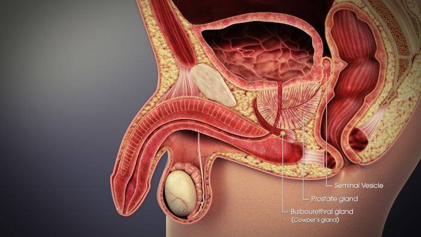

# PC muscle

The PC muscle (sometimes called the pelvic floor muscle) or "pubococcygeus" is a muscle that located on your pelvic floor and supports your bladder and rectum to help you control your urine flow. ([source](https://www.uclahealth.org/urology/prostate-cancer/kegel-exercises-for-men)). This is a special muscle that deserves attention since it is surrounding multiple areas that might be related of triggering an orgasm. There are some studies, that did not find a correlation between the toning of this muscle and increased sexual pleasure in women ([source](https://pubmed.ncbi.nlm.nih.gov/7345161/)), yet other studies report the opposite ([source](https://www.scielo.br/j/fm/a/Zy3kbm3dtcXT6TrcyZKVFkb/?lang=en)). As before, it is up to the reader to decide what to believe in and how to use the following information.

To make this chapter useful, we will need to assume that the PC muscle does play a role in reaching any type of orgasm. Understanding the exact placement of this muscle is quite hard in two dimensional pictures, though you only need to understand a rough estimate of the location. Consider the following diagram ([source](https://www.wikihow.com/Do-PC-Muscle-Exercises)):

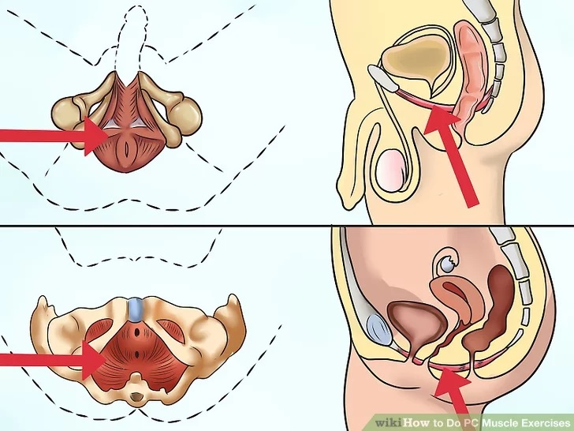

While the picture is only illustrative (the PC muscle is sitting right on top of the pelvic bone), but it does show a perspective how the PC muscle is reaching various organs. It is also useful to see a top-down view of the muscle as well, though good diagrams of the PC muscles are quite rare, so it is better not get very precise with the location. Consider the following diagram ([source](https://www.kenhub.com/en/library/anatomy/muscles-of-the-pelvic-floor)):

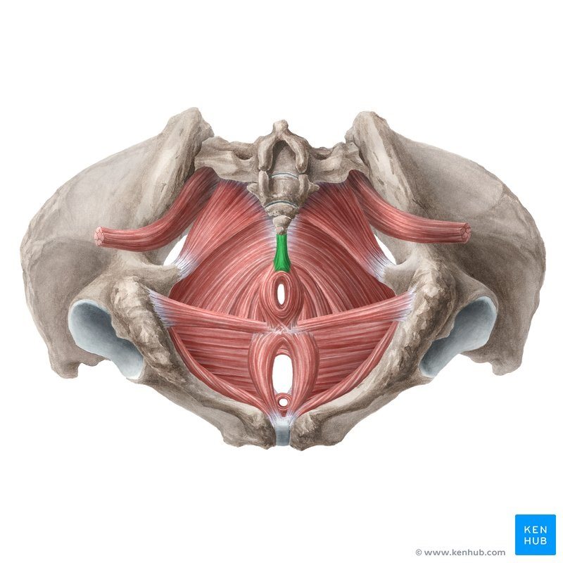

The obvious function of the PC muscle is to control the urine flow from your bladder. When you try to stop a running urine while you pee, you are flexing your PC muscle. It is quite a subtle movement of the muscle, but it is enough to stop the urine flow. Men can notice the muscle flex externally by observing their penis, it should contract by a small length, women might not be able to notice these muscle contractions externally so easily, but other areas show subtle movements. Some people are not able to stop their urine flow and that is an indicator that your PC muscle is too weak, the ability to stop the urine flow is an indicator that your PC muscle is toned enough.

These subtle muscle contractions might give a stimulation around the prostate, uterus, penis, clitoris, the pudendal nerve, rectum, erectile tissues and other from within. During orgasms the PC muscle can contract involuntarily, many people describe the sensation even more pleasurable and this might support that PC muscle is causing an internal stimulation. These subtle contractions can be very important for men trying to reach prostate orgasms since there is a special anal toy designed for men that deserves special attention, but this toy requires a lot of subtle PC muscle contractions for extended periods, which can be very exhausting. Women report similar success with PC muscle contractions, but it also requires quite a lot of endurance for the PC muscle. Whether you want to associate toned PC muscle with increases sexual pleasure or not, in theory you should at least have an increased chance of reaching an orgasm when your PC muscle is properly toned to withstand a lot of contractions.

The most simple way to tone your PC muscle is to stop your urine flow, though this is not such a great way to exercise your PC muscle for obvious reasons. A better way is to design a workout routine for just your PC muscles. Some guides suggest doing an exercise for your glutes called "glute bridge", but this exercise requires you to devote a separate attention to your PC muscles either way since a plain "glute bridge" will not contract your PC muscle to desired amount (usually you preform only a "squeeze" on your glutes), so you need contract it separately. You can try to incorporate PC muscle contractions in your glute workouts, but it is recommended to first understand the movement with a specific exercise.

The exercises are called "kegel exercises" and you can find various videos that explain these exercises, consider this video as an example for females:

[](https://www.youtube.com/watch?v=Wjb20SXIvA4)

Consider this video as an example for males:

[](https://www.youtube.com/watch?v=MJ7EfGu03-0)

Depending on your current state of your pelvic floor muscle, it can take 3 to six weeks to see some results for most people, but it can take even longer for some people. To see results it is important to do the exercises properly to ensure you are not wasting your time on the exercises since you might want to do these exercises multiple times a day for most days of the week. Make sure you follow a guide for kegel exercises such as the ones above so you get the best results.

It is actually quite uncommon to see weak PC muscle while at a young age. It is more common for people at old age, especially for women that are in the stage of post-menopause, did not have an active sexual life and spent most time sitting in a chair. To achieve anal or prostate orgasms, you will need to have more toned PC muscle and a trained ability to flex them and relax them on demand many times in a row. Be aware that you can have too much tension in this muscle as well.

That being said, many who are passionate about reaching prostate orgasms describe the need for kegel exercises as an athlete would need to train to reach a medal, in other words you will not going to be able to reach such intense orgasms without having a very strong PC muscle. Some even describe their ability as being able to do kegels for 3-4 hours, doing them while standing, sitting, eating, thinking and whenever they can.

# Health

In general anal sex is safe, but some conditions can create a lot of complications. Before engaging into anal sex, you should make sure you are in good overall health, humans were never meant to have anal sex, for this reason these organs are not suitable for such activities as penetration or stretching. In many cases people want to blame unwanted side effects as a result from anal sex while it is quite common that an underlying issue was the actual cause. While this guide will not go into details how to live a healthy life, this guide will mention health conditions that should be treated before having anal sex.

Note: For better understanding some health conditions, images might be required, though these images can contain disturbing material that many people rather not see. For this reason, only hints on how to find visual examples will be given.

A quite common condition is hemorrhoids, these are swollen, enlarged veins that form inside and outside the anus and rectum. ([source](https://my.clevelandclinic.org/health/diseases/15120-hemorrhoids)). Hemorrhoids can be caused by straining your bowel movement too much, overweight, pregnancy, anal sex and others ([source](https://www.webmd.com/digestive-disorders/understanding-hemorrhoids-basics)). As a result of swollen, enlarged veins around your anus or rectum, you can experience pain, itching, bleeding and other symptoms. If you do believe you have hemorrhoids, it is important to seek medical treatment before having any anal sex since it will make the condition worse. Search for "hemorrhoids" to find examples of this condition. While many sources do claim, that anal sex can cause hemorrhoids, some claim the opposite that they are not very likely to cause them ([source](https://www.medicalnewstoday.com/articles/324637)), this is something the reader need to decide since a clear causation might not exist. Many people have found that an active healthy lifestyle, having a fiber-rich diet, reducing the strain while sitting on the toilet (don't push too hard) and taking your anal training slow is enough to prevent hemorrhoids. Some people engage into "pumping" the anus or even the rectum, but that is highly not recommended due to high risks of causing hemorrhoids. There is also a strong correlation between people who sit all day and hemorrhoids, find whatever ways you can to keep yourself active.

Rectal prolapse is a more serious condition, it happens when your rectum slips outside the anus ([source](https://www.mayoclinic.org/diseases-conditions/rectal-prolapse/symptoms-causes/syc-20352837)). Although this is a condition that does not require immediate medical attention, it is something you should be really concerned about, if you experience an rectal prolapse. Many people would describe the result as "rectum came out". Search for "rectal prolapse" to find examples of this condition. Some people find it arousing to have a rectal prolapse, but this is a medical condition that needs treatment, failing to treat it can result in gangrene (death of an organ) ([source](https://www.betterhealth.vic.gov.au/health/conditionsandtreatments/rectal-prolapse)). To prevent rectal prolapse you should have a fiber-rich diet, reduce the amount of strain while you are sitting on the toilet (don't push too hard) ([source](https://www.medicalnewstoday.com/articles/319977)), avoid "anal pumping" of any kind, also include kegel exercises to strengthen the surrounding muscles ([source](https://myhealth.alberta.ca/Health/Pages/conditions.aspx?hwid=hw181291)). You should avoid any kind of anal sex if you have experienced anal prolapse.

Anal fissure is when you have a small tear in the thin, moist tissue (mucosa) that lines the anus ([source](https://www.mayoclinic.org/diseases-conditions/anal-fissure/symptoms-causes/syc-20351424#:~:text=An%20anal%20fissure%20is%20a,and%20bleeding%20with%20bowel%20movements.)). Similar situation can occur in your rectum or colon, sometimes called "micro-tears", as a result you can experience blood during anal sex, but this can happen during bowel movement (pooping) as well. It is normal to experience small amounts of blood at some point in your life, but that might be an indicator that you need to change up your diet to prevent such problems in the future. If you do experience light blood of just a few drops, then it is nothing you should be worried, but something to be aware of since you should be not having any kind of anal sex until the injury has healed properly. The rectum is densely packed with blood vessels and tears will cause bleeding, micro-tears might not cause bleeding and might feel as irritating, they usually heal on their own quite fast.

Anal tissues are very absorbent (very), this means you are very easy to get infected with various STDs/STIs. You are also causing a high risk of infecting your partner through small amounts of feces in your rectum. You should always make sure you and your partner is tested and is vaccinated from the most common diseases.

During longer sessions of anal sex you can start to notice white liquid-like substance on your sex toys or on the penis. This happens as mucus from your colon/rectum mixes with lube and with the help of friction starts to create a white-ish foam. In small amounts this is normal, you can expect a little  bit of excess mucus appearing after having anal sex, especially if you have preformed an enema to cleanse your colon, though it might indicate that your anal tissues were irritated. Having excess mucus on the next day might indicate that you are experiencing anal discharge that could have been caused by an infection. If you suspect you are experiencing anal discharge, then you should contact your doctor.

It is possible go get an infection, this can happen because of various reasons and most of them are related to hygienic concerns, for example, you can experience increased bacteria growth on your sex toys because of the type of material the sex toy is built from and eventually cause an infection. If you experience a fever the next day after your anal sex session, it is possible you have caused an infection and you might need to seek medical attention.

Many people are worried that anal sex is going to make their anal sphincters too loose and they are not going to be able to "hold in their poop". This is a very popular myth and many even report that they are now able to contract their anal sphincters even more strongly (going so far as to increase the please for the partner as well), there does not seem to be a correlation between anal sex and anal sphincter muscle disfunction, but this is only true as long as you do not rush your anal training and stretch your muscles slowly with a proper warm up. You can experience severe muscle tearing if you are not precautious, you should always go slow and increase the size of your anal sex toys very slowly.

From these conditions you should see a pattern, if you live a healthy life style, exercise, have a good diet, don't put a lot of strain on your rectum or anus (not pushing hard or not "pumping") and in general being precautious, then you can avoid these medical conditions.

Some people that are into more advanced anal play with very large toys or even fists, they sometimes get concerned about the long-term effects. This shouldn't be a concern for people that don't go much past the size of a penis, but this question becomes relevant for those, who are trying to test their limits. The short answer for the long-term effects is unknown, we simply do not have any studies done on this subject. The only evidence we have is multiple people that are into more extreme anal depth and anal size play for decades and don't experience any side effects, as long as they take it slow and taking a lot of precaution.

One of the most extreme forms of anal sex is anal fisting. This involves placing a fist inside a rectum or even deeper. This a very dangerous since you require another person of guiding the fist through a person's rectum and/or colon, but you must rely on that both the receiver and the giver is very experienced, which is not always the case. There is even a possibility you need to have a surgery that involves opening up your abdominal muscles to access the damage done by fisting ([source](https://www.fistclub.depthvortex.com/as_laparotomy.html)). That being said, fisting is a very intensely stimulating and can be done safely, but this deserves a different chapter. 

Some males like to use chastity devices and even make them permanent as an extreme form of a fetish in order to be forced to only be able to have an anal orgasm, but this does not seem to be safe. There are multiple studies that have linked a connection with frequent masturbation and reduced chances of getting prostate cancer later in life ([source](https://www.healthline.com/health/prostate-cancer/ejaculation-prostate-cancer)). The main issue with such ejaculatory orgasm denial is that it does not allow you to properly empty your prostate from seminal fluids that can lead to enlarged prostate or even cancer. There are types of anal paly that can cause an ejaculatory orgasm without touching your penis, this type of orgasm might reduce the chances of prostate cancer, but in general orgasm denial is an extreme fetish and you must be very cautious about it. 

There don't seem to be conclusive evidence about prostate cancer and its cause and there don't seem to be conclusive evidence that prostate massage helps to reduce the chances of prostate cancer, but what we do know is that prostate massage can create a relief from the symptoms that a prostate cancer might have caused. While we are not sure if prostate massage prevents prostate cancer to some degree, but we do know that prostate massage does help to alleviate pain and other symptoms and we do know that it does not make matters worse, rather it increases sexual pleasure. Various studies you can find do seem to correlate prostate massage with reduced chances of developing a prostate cancer and since it does increase sexual pleasure, then why not give it a try.

A popular kink that males like to satisfy is "sounding". This involves placing a metal rod into the penis in a way that it stretches the urethra. This is considered as an extreme type of sex and you should be careful. There is a risk of causing an infection into your urethra, if you don't clean the metal rods frequent enough, but there is also a risk of causing damage to the prostate. Some people have na idea to use a very long metal rod for sounding to stimulate the prostate from the urethra while you stimulate the prostate through your anus. While this may seem an interesting way to create a doubled-sided stimulation, this is quite dangerous as you create a risk to damage the prostate. If you still insist on trying such an extreme form of stimulating your prostate, then make sure you gain a lot of experience of doing such a stimulation separately before combining them. Always use a completely sterile sounding rod that is made out of 304 or 316 stainless steel (don't use chrome or aluminum), don't allow other substances touch your sounding rods. You will probably need a very long curved metal rod to reach the prostate. Again, this is highly not recommended as you can make a tear from the pressure from both sides and probably not even reaching your prostate with the sounding rod. Remember that your penis is much longer on the inside and requires a very long sounding rod and that creates new dangers of damaging your ejaculatory ducts as well.

# Diet

There is a dirty part of anal sex that many people don't like, for obvious reasons this is understandable, but luckily there are some things you can do to make the preparation for anal sex less intrusive. One of the things you can do to improve preparation and the quality of anal sex in general is diet. There are many, many, many reasons why you should eat healthy, but one of them actually is to make anal sex better and this can be done with a few simple steps that should improve your health in general. What we should be looking for foods that have an impact to our stool's consistency, all food will contribute something to the consistency, but some of the foods are quite dramatic in this effect. What we are looking for to achieve is an infrequent bowel movement (not pooping often) and having a semi-soft, but one piece-like stool (not many lumps). Below you can find a list of foods that are known to make your stool more liquid-like (avoid these foods):

- Dairy products (milk, cream, cheese, yogurts, whey protein and others), they seem to accelerate bowel movement in some people, but not all of them ([source](https://pubmed.ncbi.nlm.nih.gov/17522613/))
- Red meat, some people don't seem to be able to properly digest high amounts of fat and protein ([source](https://www.geelongmedicalgroup.com.au/2018/02/signs-that-your-body-might-not-be-properly-digesting-meat)), one indicator of improper fat digestion is that your stool floats
- Junk/processed foods, these foods leave your digestion system fast since they are highly processed and your body will discard the excess quite fast, these foods can also irritate your colon
- Spicy foods, they trigger process to accelerate bowel movement that can be related to irritation ([source](https://www.verywellhealth.com/why-does-spicy-food-cause-diarrhea-1088717)), this also includes garlic and onion
- Artificial sweeteners, even some of them have a label warning that they have a laxative effect (these can be found in a lots of sodas, chewing gums, candy and so on) ([source](https://www.ncbi.nlm.nih.gov/pmc/articles/PMC6363527/))
- Caffeine, it is a stimulant and known to stimulate your digestion system as well ([source](https://www.healthline.com/health-news/does-coffee-help-your-digestive-system-experts-arent-convinced)), remember that coffee, most teas, sodas and many more things contain it
- Excess fructose, it is a natural sugar found in fruits, but in excess amounts (usually found excessively in candies) it can have a laxative effect for some people, even from fresh fruits ([source](https://www.webmd.com/digestive-disorders/news/20030714/fructose-may-cause-digestive-problems))
- Broccoli and cauliflower, they contain high amounts of vitamins that some people might not be able to tolerate ([source](https://www.livestrong.com/article/349377-stomach-cramps-after-eating-broccoli/))
- Alcohol, it can change the way your body absorbs liquids (it can either cause diarrhea or constipation), this is especially true for beer and wine ([source](https://www.medicalnewstoday.com/articles/does-alcohol-make-you-poop))

This is quite a long list and you do need to understand that there is no point to cut all of these foods from your diet, this is only a list of some of the most common foods that can cause bowel movements. If you do experience too frequent bowel movements or your stool is too soft, then consider going through this list to find foods that may have been causing you this. Experiment with various combinations to see if you can find a way keep your stool's consistency.

Note: Each individual is different and there might be some foods that a person is not able to tolerate and causes problems with the bowel movement. If you are not sure what is causing issues, then consider keeping a record of eaten foods and try to spot a pattern when you are seeing symptoms such as diarrhea.

There are a lot of foods you should be eating, but this is mostly going to be fiber and unprocessed, raw foods. Fiber is special since it adds bulk to your stool, this is suitable for your digestion system since it allows food to travel through your colon slowly. Below you can find a list of foods that are going to decrease the frequency of your bowel movement:

- Whole grains, these foods are unprocessed and contain complex carbohydrates that take a long time to digest, but they also contain fiber ([source](https://healthyeating.sfgate.com/whole-grains-bowel-movements-10363.html)), these are quinoa, rya, brown rice, lentils, wholegrain pasta and many others
- Vegetables, most of them will contain fiber, some examples are carrots, beets, artichokes and many more
- Fruits, most of them also contain fiber, some examples are apples, bananas, oranges and many more
- Berries, some examples are raspberries, strawberries, blueberries and many more
- Beans, some examples are white beans, kidney beans, navy beans and many more
- Nuts, some examples are almonds, pistachios, pecans and many more
- Seeds, some examples are chia seeds, flax seeds, pumpkin seeds and many more
- Many more, most unprocessed, raw, fresh foods will contain a significant amount of fiber

Note: To find more foods that have a complex carbohydrate structure to slow down your digestion, you can look for foods with a low GI (Glycemic Index), though foods with a low GL (Glycemic Load) are also suitable as long as they don't have an excess amount of fructose.

Eating too much fiber is also not desirable, you can end up with digestive problems such as constipation, bloating or releasing a lot of gas. To prevent constipation, where you have too much fiber, you can increase your water intake. Rather than calculating the required amount of fiber for each person, you should be simply keeping an eye on your stool, there are multiple guides found online ([example](https://www.healthline.com/health/digestive-health/types-of-poop)) that can help you find some problems in your current diet. A healthy gut helps you be healthy, without a healthy gut studies have even found correlation with autism ([source](https://www.ncbi.nlm.nih.gov/pmc/articles/PMC4425030/)).

There is a possibility of creating a balanced diet, but your feces are still too soft. One possible cause is due to lack of "binding" foods. To fix this, you can consider doing a "BRAT diet", which consists of bland, low fiber foods, in many cases the recommended diet includes eating more Bananas, Applesauce, Rice, and Toast (BRAT). Some more examples of foods that have a binding effect on your feces are crackers, cooked cereals (like oatmeal or cream of wheat), weak tea. apple juice or flat soda, broth, boiled or baked potatoes ([source](https://www.healthline.com/health/brat-diet)).

Note: Having a liquid-like stool is not desirable either as it puts a lot of strain to your colon and rectum. As you are young, the chance of developing hemorrhoids and rectal prolapse is smaller, but as you age you increase the risk of creating hemorrhoids and unintentional prolapse. Keep and eye on your diet.

Related to the health of your digestive system is the topic of probiotics. Some foods, for example, fermented dairy products (such as yogurt) can improve the micro-biome of your gut, this can help to digest foods and improve health. You can also drink supplements that contain probiotics to achieve a similar effect. Some studies even have found that you can prevent various skin diseases by a proper amount of probiotics intake ([source](https://pubmed.ncbi.nlm.nih.gov/24364369/)). While studies have shown the importance of probiotics, there do not seem to be studies that have shown benefits of taking probiotics, if your digestive system is already functioning properly. This raises some questions about your gut health when you incorporate a lot of intrusive cleansing for anal sex, but the answer to this question is inconclusive, there is a lack of evidence, yet many people claim they feel improvements either way, this will be left to the reader to decide whether to drink probiotics or not to minimize the disruption of your gut micro-biome.

In case you eat very acidic foods or lack proper fiber intake, then you may experience "anusitis", which is an irritation around the tissue of anus. This can cause itching, pain and even blood. If you do experience such issues, then consider looking into your diet to find the cause of it, avoid using rough toilet paper. Compared to hemorrhoid that are usually found only on one side of the anus or rectum, anusitis is usually around the whole anus.

In case you experience multiple farts after cleansing using an enema while bending over during anal sex, then you might be facing an issue over-cleansing combined with a diet problem. Fiber allows to absorb various oils and sugars in your gut, but without sufficient fiber you can experience these oils and sugar starting to ferment and causing gas releases. Consider adding fiber to your diet, you can even add fiber as a mix of seeds to your current meal.

The reason why you should really keep an eye on your digestive system is because most people will use very intrusive cleansing methods (such as enema) to prepare for anal sex. These methods are going to disrupt your gut's micro-biome to some extent, though the amount of disruption is not very clear. Another reason is that a "liquid" stool usually requires the person to put a lot of strain of your anal muscles to start the bowel movement, this can lead to hemorrhoids, the same issue can appear when your stool is too hard and even cause constipation, for all of these reason you want to make sure your stool is not too soft and not too hard. If you want to avoid various health issues and have a more enjoyable anal sex, then it is recommended to fix your diet before engaging into anal sex.

# Cleansing

Most people will want to do proper cleansing before engaging into anal sex, with cleansing you can reduce the "messiness" and increase the pleasure of anal sex. Without any type of cleansing you can experience some amount of feces during anal sex, which you and your partner might find as a turn-off, but the presence of feces can also make you feel discomfort due to an urge to poop. Whenever your rectum senses the presence of feces, then you can get a reflex to start defecating, which many people will find discomforting. There are multiple methods of cleansing and each has its own benefits and drawbacks.

Before getting into the possible methods, we should touch the topic of depth. Some cleansing methods are only effective for anal play that does not involve long sex toys, some are suitable for a quick anal sex, some are more suitable for longer sessions, in most cases it will come down to requirements of each individual. As previously discussed in chapter [Anatomy](#Anatomy), the rectum is the first section you will want to cleanse for anal sex, but you must make sure you do not relax your colon completely (you must not straighten out the rectosigmoid junction), otherwise you will end up with an un-cleansed section of a colon accessible during anal sex. Many will find this tricky at first, you sometimes want to relax the muscle, but sometimes don't, yet you don't have a direct control of the muscle. For this reason, beginners might be better off to use a deeper cleansing than required before they learn to control the required muscles better. For those, who are somewhat experienced, you will need to decide how deep you want to go and then cleanse only those parts, for example, for regular anal sex with a penis it is not really needed to cleanse anything beyond the rectosigmoid junction (RSJ).

The cleansing part is something most people find as a turn-off (unless you have an enema fetish) since the process can take anything from 10 minutes to more than an hour (depending on the chosen method and depth requirements), luckily you can expect the required cleansing time to go down with practice. If you follow diet recommendations found in chapter [Diet](#Diet), then you should experience infrequent bowel movements, this also means you should expect less pieces of feces coming out (the amount should be the same, but it should come out more easily), but something that many people have reported is that anal depth play (engaging into anal training past the RSJ) has eased their cleansing dramatically, which should happen since you are stretching a narrow part of your colon that prevent you to move feces at a faster rate and larger size.

There are currently 3 known methods for cleansing, these methods are listed in order from less intrusive to most intrusive:
- Sitting on the toilet
- Douching
- Enema

You might be thinking that going to the toilet is not really a method of cleansing, but this is actually quite enough for some people and the reason is because of your diet. We devoted a whole chapter to diet and talked about how important is to keep an eye on your stool's consistency, but a less obvious benefit of a good diet is a predictable bowel movements. People, who have a well balanced diet can easily predict when they will need to poop. The frequency of bowel movements is something each individual needs to figure out, but knowing this schedule can reduce your need to cleanse to just sitting on the toilet before anal sex and empty your colon in the most natural way possible. Do remember that you must not put a lot of strain while pushing out your feces, otherwise you can cause minor issues in long-term (more on that in chapter [Health](#Health)). If you are not confident about your bowel movements, then this method is probably not going to be for you.

Note: During anal sex, sometimes it is normal to encounter some amount of poop. You should be understanding and your partner should be understanding as well.

Douching is an act of flushing your rectum with a liquid (most commonly water), this means water should not get past your rectosigmoid junction (RSJ). This is a method of cleansing that is not very intrusive and is actually quite fast to be done. The way it is done is by using special equipment (some variations can be built at home using household objects, though not recommended), the exact type of equipment will be listed later in this chapter. Douching can be a little tricky since you must make sure you do not let water get past your rectosigmoid junction (RSJ), determining this is not very straight forward, but most people would describe it as a sudden release of pressure inside your rectum (this means water escaped your rectum and escaped into your colon). Whether water will escape past your RSJ or not will depend on the amount of water and the pressure, so for douching purposes you should be using a small amount of water with a small amount of pressure each time you release liquid into your rectum (small water squirts). This method is fast, quite simple, but still creates a chance of you accidentally releasing feces into your rectum from your colon due to relaxation.

Enema is an act of flushing your rectum and your colon with a liquid (most commonly water), the difference of douching is that with enema you allow water go past your rectosigmoid junction (RSJ), this allows a much deeper cleansing. Enemas require special equipment, the same equipment can be used for both enemas and douching. Enema seems simple, but it carries some risks, since it requires a noticeable amount of water and pressure. Risks can be avoided with some precaution, there even exists specialized equipment to lower the risks, in general the risks arise from accidentally creating too much pressure in your rectum and colon, this happens usually with shower-head enemas where you can create a very powerful stream of water that can in some causes damage the tissues of your colon or rectum. Enemas are going to be very intrusive since you flush a large part of your digestive system with water, disrupting the micro-biome in your gut. This cleansing method can take a lot of time, even more than an hour for some people.

Note: Avoid pushing water out using a lot of force, over time you can develop hemorrhoids since you put a lot of strain to the blood vessels when you try to push anything out your rectum using a lot of force.

To preform an enema or douching you are going to require some kind of equipment, below you can find some common types of equipment that can be used:
- Enema bags, place them on a stand higher than yourself, insert a lubed nozzle in your anus and gravity will force water into your rectum, best results can be achieved while laying on your side. This method can be quite slow, but probably the safest option of them all (that include flushing your rectum/colon), [example](cleansing_enema_bag.jpg)
- Enema bulbs, you squeeze them to suck in water, insert a lubed nozzle into your anus and squeeze the bulb again to release water into your rectum/colon, can be large and small, you can create your desired amount of pressure easily (and you can create too much pressure as well, be sure not to squeeze too hard), can be quite intrusive, takes a little bit of time, easy to transport or store, [example](cleansing_enema_bulb.jpg)
- Enema shower-head attachments, you replace your shower-head with a special attachment, insert a lubed nozzle into your anus and open the valve for your faucet, you have a large variety of amount of water and pressure you can create (always start slow and be very careful not to accidentally cause a high water flow), very intrusive, though can speed up your cleansing time by a lot and probably is the most throughout cleansing method, [example](cleansing_enema_showerhead.jpg)
- Enema bottle attachment, fill a plastic bottle with water, replace the cap of a plastic bottle with a nozzle, you insert a lubed nozzle into your anus and squeeze the bottle, this is very similar to enema bulbs, [example](cleansing_enema_bottle.jpg)

Most people will decide to use a shower-head attachment since it is the most effective cleansing tool. There are a couple of considerations before buying one, the first is to look for a silicone nozzle to reduce the chance of infections and irritation, second consideration is to look for a nozzle that has multiple opening (preferably with openings on various sides of the nozzle, for example, on the side and top, not just on the top of the nozzle), third consideration is to look for a nozzle that has somewhat larger openings (not with small holes). The reason why you should look for a nozzle that has a lot of larger holes on all sides of the nozzle is that the water pressure is going to be distributed and that will reduce the chance of injuring yourself during cleansing due to high water pressure. You should also pay attention whether the enema shower-head attachment is compatible with your current shower-head (or look for adapters).

Note: Some enema shower-head attachments will come with a flow-control valve or similar way to limit the flow of the water to reduce the chance of injury. You should look for such features, but be aware that they are not foolproof.

To cleanse your rectum with either a enema bulb or shower-head attachment, prepare your water and make sure it is luke-warm, but not cold nor hot (large temperature changes can cause undesirable effects). Lube the nozzle and slowly insert the nozzle into your anus. If you are using a shower-head attachment, then open your faucet SLOWLY and let your rectum fill up with water, but if you are using an enema bulb, then squeeze the bulb and the repeat the process (if needed) until you can feel slight pressure in your rectum (and stop filling yourself for a while). When you feel that a significant part of your rectum is filled with water, you have an option to release the water instantly by sitting on your toilet (or elsewhere, but remember that this will create a mess), this will prevent water from going past your rectosigmoid junction. You also have an option to wait for a bit to let your body to adapt to the slight pressure and then continue to filling yourself up with water.

If you do decide to let water past your rectosigmoid junction, then you should feel a relief after a while from the pressure that water in your rectum has created, this is usually an indicator that rectosigmoid junction has straightened and you can continue filling yourself with water. It will take quite a long for you to start feeling pressure again, you will notice very significant increase in stomach size (belly bulge), you can go quite far, but remember to do this SLOWLY to prevent injury. At some point you should feel pressure build-up and that is where you should stop the water flow and release the water.

Some people like to do a few squats, shake the body a bit, jump around, walk around and other activities before they release the water into the toilet. They do this to make sure water has reached deeper areas of the colon/rectum, but if you decided to go for a "belly bulge", then be very careful of making any sudden movements since there is a lot of pressure in your colon when a "belly bulge" is created. Pushing the water out should also be done gently without using almost any force (don't put a lot of strain). Releasing the water can take quite a lof of time for all the water to be released, you can almost be certain that a small amount of water will always be there and will show up eventually.

Note: Using soap-water is really not recommended. Soap is very harsh and will disrupt your gut's micro-biome to a large extent. You should be used filtered water for the enema when possible. Consider creating a saline water solution for the enema to make it less disruptive.

In case you need to preform douching, then there is an option to do so using just a small plastic bottle. Remove the cap of the bottle and make sure to remove the ring of the cap as well so you don't have any sharp edges. Fill the bottle with luke-warm water, lube the top part of the bottle and insert only the top part of the bottle into your anus, then squeeze the bottle. This a very quick, but not very efficient method of cleansing when you don't have any equipment available. This method is not suitable for enema-type cleansing and should only be used to cleanse your rectum. It is not a very good method either since most plastic bottle will have sharp edges and there is a risk of creating small cuts in your anus.

There is always a question of how frequent enemas are safe, sadly not a lot of research has been done in this topic. What we do know, there is some correlation between douching and increased risk with HIV ([source](https://sti.bmj.com/content/95/6/428?rss=1)) and this seems to be related to increased risks of small anal fissures, but not much has been studied on the rate of gut's micro-biome regeneration so we cannot conclude how often enema can be done safely. Currently the most common recommendation is not to do enema every day and limit enema to 2-3 days a week, same should apply for douching.

*TIP:* Go to the toilet right before having anal sex (or warming up), usually there is still a small amount of water left inside after cleansing.

# Mental preparation

Anal sex (and sex in general) requires some form of mental preparation that we could divide into either relaxation or arousal. Unlike other forms of sex, anal sex if probably going to be a form of sex that requires the most preparation from a mental aspect. The pleasure of anal sex largely depends on the state of your relaxation and your sexual arousal. this chapter will give some quick tips on this topic so you can prepare properly.

Most beginners make the mistake of being too stressed when engaging into anal sex, but those who practice yoga will know that your muscles are much easier to be relaxed when your mind is relaxed. During anal sex you are not supposed to strain your muscles almost at all, you are supposed to be in a very relaxed state. Before anal sex you should find a routine that you as an individual find relaxing. Depending on your likes and dislikes, you consider engaging in the following activities:
- Take a warm bath
- Take a semi-hot shower
- Listen to relaxing music
- Massaging (either with some kind of equipment of with a partner)
- Use guided breathing exercises
- Use guided imagery (or other sensory routines)
- Do yoga
- Meditate
- Many more

A lot of people neglect this step, but it is quite important and it becomes incredibly important for those men, who wish to achieve a prostate orgasm, but women also need to pay special attention to their state of relaxation. Find whatever works for you and is suitable for your environment, but take your time to be relaxed, it can be 10 minutes, but it also can be hours. A special form of massage exists called an "anal massage", it is a very relaxing procedure and it can be used as a warmup for anal sex, but it requires you to start massaging your partner in a regular way without involving the anus, this form of massage requires a chapter on its own since it can be very sensual and does not have to involve inserting anything into the anus.

Not only you need to be relaxed, but you also need to be aroused, which is a bit tricky. Women might find it easier to achieve such a combination of states since they are more familiar with such a condition, but men can also achieve such a condition. Some people take this to a more serious extent and devote hours before the sexual act to seduce their partner, for individuals arousing themselves is most likely going to involve engaging into something erotic or pornographic. Find whatever method works to arouse yourself, many people report that they had the greatest success reaching anal orgasms if they included a light stimulation of clitoris or penis in this preparation stage, but avoiding intense stimulation.

One thing you can incorporate into your arousing routine is to use erogenous zones, these are areas that excite sexual feelings when being touched. The exact points depends on the gender and the exact stimulation method (either circular motions, rubbing, vibrations, poking, pinching or other) depends on the individual and each individual should explore whatever they like the best. Below you can find a diagram most common areas that most people find sexually arousing when stimulated, use these areas to increase your sexual arousal before engaging into anal sex ([source](https://ro.co/health-guide/erogenous-zones-women-men/)):


# Lube

Most guides for better anal sex will mostly say to take it slow and use a lots of lube. In previous chapters we discussed why taking slow is important, but the same reasons apply when it comes why to use lots of lube and a proper lube. Human body naturally does not produce (enough) lubricant to achieve the required slipperiness, you might be familiar that a vagina produces a natural lubricant whenever the female ir aroused, but such mechanism simply does not exist when it comes to anus or any other part that is involved into anal sex. Without lube you can experience not only discomfort, but also severe injury. For this reason it is very important to use lots and lots of lube.

There are multiple types of lubes, most of those lubes are suitable for anal sex (with few exceptions), but choosing a proper lube is important depending on the exact act, whether it be just regular penetrative anal sex, stretching, long-term plugging, fisting or other. In general, there are 3 types of lubes you can choose:
- Oil based lubes
- Water based lubes
- Silicone based lubes
- Hybrid lubes

Note: No, saliva is not a good lube, you need a proper lube.

Oil based lubes are going to the highest slipperiness, they are long lasting and some people use some of the oil based lubes as a massage oil. These oils are suitable for long sessions since you don't have to reapply the lube frequently, but it does come down to some major drawbacks. Oil tends smooth out small surface imperfections (such as pores), this can cause some problems with sex toys that are made from porous material such as TPR, TPE, or PVC, these materials can degrade over time and develop bacteria that is hard to clean. Oil based lubes usually contain some kind petroleum jelly's variation (vaseline), it is quite inert, but can damage various materials including latex. Oil based lubes SHOULD be safe to use with metal, glass, and ceramic sex toys, but silicone sex toys are only safe as long as the sex toy is made out of pure silicone, which is in most cases hard to determine. To be sure if your sex toys are compatible with oil based lubes, check the sex toy's manufacturer home page.l Oil based lubes are messy and some people can develop acne on their skin due to some oils clogging the pores of the skin. That been said, oil based lubes are very slippery and long lasting, because of this it is the lube that is preferred by those, who engage into more advanced anal play such as fisting. Oil based lubes tend to be quite expensive, but a lot of people like to use unrefined coconut oil since it is widely available and cheaper when comparing to alternatives. Remember to wash your sex toys after using them with a oil based lube. Using oil based lubes for vaginal sex is not recommended ([source](https://www.self.com/story/6-lube-ingredients-to-avoid)).

**IMPORTANT**: Oil based lubes are NOT recommended to use with condoms, in some cases you can experience oil based lubes deteriorating condoms and eventually break them. Some oil based lubes are compatible with some condoms and it is best to refer to the manufacturers home page to make sure their products are compatible.

Water based lubes are quite slippery, but they tend to dry out fast and require frequent reapplication. They are easy to wash off, they are cheap and most people will not develop any skin issues from them. These lubes can be used with any type of sex toys, though you still need to wash the sex toys after using them, especially toys that are made from porous materials. These are the most popular option to those, who have regular penetrative anal sex. Usually these lubes with contain xanthan gum, in fact you can easily make your own lube with it ([source](https://sexualhealth.naturally-holistically.com/diy-personal-lubricants/xanthan-based-lubricant/)). Some lubes will contain glycerin that is also quite slippery, but for some people it can cause laxative effect when used in large amounts ([source](https://www.drugs.com/mtm/glycerin-rectal.html)), glycerin is also not recommended for vaginal sex ([source](https://www.self.com/story/6-lube-ingredients-to-avoid)). Some people might experience irritation from water-based lubes, this might have been caused by glycerin, if this is the case, then consider looking for a lube that does not contain it. Some lubes will contain a variation of PEG (polyethylene glycols), these molecules requires a lot of water since the chains PEG molecules absorb it, but be aware that cytotoxicity of all molecular weight PEG compounds are still not known ([source](https://pubs.rsc.org/en/content/articlelanding/2017/ra/c7ra00861a)), the safest option is to look for water based lubes that have a good reputation. Water based lube is going to be used a lot and many people have started mixing up powder-form lubes with water, currently a good reputation is for lubes called "X-Lube" and "K-Lube", you simply mix the powder with water and can make a large amounts of lube, many suspect that a popular sex toy company called "Bad Dragon" is using a very similar lube in their products. There have been some reports that do have doubts about about the manufacturing process and safety of "J-Lube" and its quality of PEG, as for now this lube is not recommended. Water based lubes are the defacto standard for anal sex, but it might not be the best option in dry or air conditioned areas since water based lubes tend to dry up very fast in those areas. Remember to wash your sex toys after using them.

Note: If your lube relies on PEG to provide the slipperiness, then you should be able to restore some the slipperiness of your lube by just spraying some water on the dried out area.

Silicone based lubes are lubes that is made mostly out of silicone. These lubes is a middle ground of oil based lubes and water based lubes. They are more slippery than water based lubes, they are hypoallergenic (meaning they are not likely to cause allergic reactions), they require less frequent reapplication, they are easier to wash off than oil based lubes. When it comes to compatibility with sex toys, it is a bit complex, but similar to oil based lubes you can use silicone based lubes on hard materials such as metal, glass, and ceramic. Other materials such as TPR, TPE, or PVC should not be used together with silicone based lubes as they can deteriorate over time. Silicone toys used with silicone based lubes are a bit more complex topic, in short to avoid risks you should not used them together, but if you are certain of the quality of both your sex toy and your lube, then it should be fine to use them together, but you should still check the manufacturer's home page to be sure ([source](https://www.bloodandmilk.com/silicone-sex-toys-and-silicone-lube/)). Remember to wash your sex toys after using them.

Hybrid lubes are a mix of silicone and water based lubes, these lubes tend to combine best of both worlds. Some hybrid lubes contain 12% silicone, but the percentage can be anything, what it simply means is that a part of the lube is silicone, the other part is ingredients that can be found in water based lubes. While there are some concerns with using silicone lubes with soft material sex toys, the risk of causing damage to such toys is reduced with hybrid lubes since the concentration is smaller. They are quite easy to wash off, they are slippery, they are quite long lasting, this special type of lube is not very commonly advertised. Remember to wash your sex toys after using them.

It is even possible to make your own lube at home using very simple ingredients you can find at the store. There are multiple recipes found online, but they are more or less the same. To make your own lube at home, you will need 1 teaspoon of vegetable glycerin, 1/8th teaspoon of xanthan gum and 4 teaspoons of water. Mix the vegetable glycerin together with xanthan gum until it is completely dissolved and then add warm (not hot) water. This type of lube does not have any preservatives so it should be used in couple of days.

**IMPORTANT**: Avoid using lubes that contain numbing agents, they prevent you from sensing injuries before they cause you long-term damage to your organs. If you feel you need to use numbing agents, then you need to spend more time warming up and training for anal sex, not numb pain that prevents you from causing severe injury.

Many beginners neglect the importance of lube, the general rule is that you cannot have too much lube (though don't try to find the limit of lube amount, it probably does exist). The downside of not using enough lube is a possible injury and discomfort, but the downside of using too much lube is slightly more mess, this comparison should give you an idea that it is better to be safe than sorry. A neat trick a beginner can use is to use a "lube shooter" before warming up for anal sex, you can fill this device ([example](lube_shooter.jpg)) with lube, insert it into your anus and release the lube inside you. Not only this is quite arousing, this is enough to make sure you have enough lube for your warmup. During warm up you are supposed to insert a lubed finger (or small sex toy) into your anus, but a lot of areas in your rectum has not been lubed yet, so having a "lube shot" is going to help a lot to lubricate you up.

Many passionate anal sex lovers like to use butt plugs for long-term anal stretching, but they eventually come across an issue that most lubes dry out too fast (even oil based ones). The solution to this issue and similar issues, where you want to prolong the slipperiness effect of a lube, is to combine lubes. Consider using a water based lube first on the sex toy and then use an oil based lube on top of it while it is still slippery, this is a neat technique that many people use to prolong the slipperiness of the lube.

*TIP*: Consider getting a lube that can be used with just one hand. Makes anal play much easier.

# Warmup

Most complains and issues you have heard beginners saying is most likely going to be caused by improper warmup. In general, a warmup is a process that you do to get your body (in this case your anus and rectum, maybe even colon) ready for anal sex. Many like to neglect the importance of this process since it takes times, which they think could be used to have actual anal sex, but this is a very bad assumption. You should be paying more attention to warmup and the most convincing reason is simply because warmup is going to be the factor that will makes the most impact for distinguishing your anal sex session from a frustration and discomfort or even injury full experience and from a pleasant unforgettable experience. With time and experience you can develop your own routine that is sufficient for you, but for beginners it is very important to spend the extra time to just make sure you are prepared.

While there are many possible warmup routines you can take, we will only focus on few of them since they seem to be the most popular and the most suitable for beginners, yet these methods can help even more experienced people. There is no strict limit of time to take for warm up, but consider spending at least 5 minutes for a warmup, beginners should spend even more or until they can easily insert at least two fingers into their anus, but that should not be a goal and rather it should be as an indicator that you can proceed to the next warmup phase.

Lets divide warmup into three phases:
- Anal sphincters warmup
- Rectum warmup
- Rectosigmoid junction warmup (might not be needed, depends on desired depth of anal play)

In the first phase, you should be focusing on your anal sphincters to make sure they are relaxed. This phase can be ended whenever you can insert at least two or more fingers into your anus with almost not force, the fingers should slide just in. If you are planning to insert larger toys, then consider warming up starting with a very small diameter (one or two fingers) and gradually increasing the diameter to something close to the target diameter (all fingers, partial fist or even a full fist, you can also use various toys of different diameters). Below we will introduce a few methods you can use to warm up your anal sphincters, you can choose one of the methods or mix of multiple methods.

**IMPORTANT**: Your anal tissues are very delicate and sharp objects such as your nails can easy make a small injury. To avoid injury consider cutting and using a nail file to smooth out any rough edges, but better yet use rubber gloves such as nitrile gloves whenever you are fingering yourself or your partner.

The squeeze method: One of the best methods to stretch your both anal sphincters at the beginning and it is very easy to learn. As we learned in chapter [Anatomy](#Anatomy) we have two anal sphincters (external and internal), but we directly can only control the external anal sphincter (the visible one). This method relies on the fact you are able to loosen up the external anal sphincter and allow a part of your finger to enter your anus before reaching the internal anal sphincter. When your finger is partly inside, you start squeezing your anus as hard as you can (this is where exercises from chapter [PC muscle](#PC_muscle) are going to help) for a few seconds and then relax the muscles by stopping the squeeze. When you stop squeezing, you should feel your finger sliding in with almost no pressure past the internal anal sphincter, some people describe as the finger is being sucked in by the anus. When your finger has passed the internal anal sphincter, start pulling your finger to a side (either upwards or to sides), you should notice that you can stretch your anus to greater extent. Repeat the process again, insert your finger partly in, start squeezing, and when you stop squeezing then start pulling your finger to stretch your anus open. When you feel that your anus is stretched, repeat the process with two fingers. You can repeat the process with even more fingers or even a sex toy. This method is great for beginners since it is very simple and it is quite hard to misuse this method. This method is also suitable for those, who have skipped any anal training for multiple weeks and their anal sphincters have tightened over time. This method can be used in any pose and can be done to your partner as well. Remember to breath deeply and keeping a relaxed mindset. Search for "Anal Play 101 with Kenneth Play and Riley Reyes (Sex Hack how To)" to find a video demonstration of this method.

Note: Don't forget, you need lube!

The pinch method: More advanced method that requires stretched and relaxed both internal and external anal sphincters (consider doing the squeeze method first) that involves a pinching motion around your anus. This method relies on adding a small pressure on your anus that can trigger your muscles to relax by "pinching" your external anal sphincter gently. To preform this method, you should get into a doggy-style pose and lay your face down ([example](pose_doggy_facedown.jpg)). With one of your hands reach your anus and insert your index and your middle finger past your external anal sphincter and place your thumb on the outside of your anus (imagine creating a clay Pinch pot). Start lightly pinching your external anal sphincter and move the pinching around the anus, you can also use a rubbing motion (rolling a joint) or tapping motion or whatever you find more pleasurable. While pinching, create small rocking motions with your body by moving slightly forward and backward. After a while you should feel how air is able to come into your rectum and feeling that your both anal sphincters are completely relaxed open. From here you can proceed to a more advanced method - the farting method. Remember to breath deeply and keeping a relaxed mindset.

Note: Don't forget, you need lube!

The finger to fisting method: This method involves gradually increasing the number of fingers used to stretch your anal sphincters to be able to take your own fist. This is method is most likely going to useful for experienced people, who want play with larger toys or a fist, but beginners can also use this to warmup themselves for more ambitious anal play as this method is highly adjustable. This method requires you to be a comfortable pose that allows you to easy access your anus with both hands, it is quite simpler to do when someone else is using their fingers to stretch your anal muscles, but this method can make your partner stretch you further than you normally are able, so make sure your partner is aware of your limits. If you are doing this method by yourself (which is recommended), then you are most likely going to be either in downwards facing doggy-style pose ([example](pose_doggy_facedown.jpg)), legs behind head pose ([example](pose_legs_behind_head.jpg)), curled angel pose ([example](pose_curled_angel.jpg)), rocking horse pose ([example](pose_rocking_horse.jpg)) or other poses, whatever you find comfortable and capable of reaching your own anus with both of your hands. When you find a comfortable position, you start fingering your anus with one finger, slowly get into fingering yourself with two fingers and move up to four fingers. Use circular motions and add pressure to the sides of your anus to spread it open with slight force. As we learned in chapter [Anatomy](#Anatomy), the rectum has a certain angle that is pointing towards your abdominal muscles (stomach), acknowledge the curvature and curve your own hand in a way to match the angle of your rectum. When you reach four fingers, introduce additional one finger from your second hand and move up to 8 fingers, but don't use much force, you should be able to slide those fingers without using a lot of force, rather focus on relaxing the muscles. When you are able to insert all 8 fingers, try gently spreading open your anus by pulling GENTLY both hands in opposite directions, you should feel an even greater stretch. When you feel you have stretched your anus enough, consider trying to insert a whole fist into your anus and try gentle fisting to stretch your anus even more. While this method might sound very advanced, it is highly adjustable and you should be able to adjust this method even for beginners to stretch the anus to an appropriate diameter. Remember to breath deeply and keeping a relaxed mindset. Search for "Anal Training Vol. 5 Fisting - Mohawk Molly" to find a video demonstration of this method.

Note: Don't forget, you need lube!

The farting method: This method should be used together with another method to first stretch your anus open (recommended is the pinch method, but other methods will work as well). The principle behind this method is to create very loud farting noises on purpose using just air. To start the warmup, you need to get into downwards facing doggy-style pose ([example](pose_doggy_facedown.jpg)) and start stretching your anus with one of the methods above until you can feel your rectum filling up with air. Breath in air with your mouth (use your solar plexus muscles) so your abdominal muscles sag towards the floor to suck even more air in using your rectum/colon. When you are filled with air, use your solar plexus muscles again to push the air out (imagine trying to suck in your stomach) and you should start hearing a loud fart noise. Learn to make it even louder, but avoid putting strain on your rectum by contracting surrounding muscles, use only your solar plexus muscles. If your anus closes up again, redo one of the previous methods to open it up again. This method is quite advanced, but most people can learn it, it is considered advanced not because of its complexity (it is very simple), but rather because of its use case since method prepares your body for very deep anal play, this method can be used to warmup your rectum and your rectosigmoid junction as well since it relaxes all those parts. Remember to breath deeply and keeping a relaxed mindset.

When we have stretched your both internal and external anal sphincters, you should be able to insert your desired sex toys or penis without feeling pain, without feeling discomfort and without using almost any force, rather you should be feeling quite an enjoyable sensation whenever you insert an object into your anus and it stretches wider, but you might feel some discomfort whenever you try to insert the object deeper inside. To reduce the discomfort, we must warmup the rectum, but rather than stretching it wider, we must focus on making it "straighter". As we learned in chapter [Anatomy](#Anatomy), the rectum is slightly curved and it also has three folds that create an angled S-shape for the rectum. The straightening process works only to some extent, but this enough to reduce discomfort. Below you can find two methods you can use to warmup your rectum.

The dildo method: Previously in chapter [Anatomy](#Anatomy) we mentioned that your rectum is at a certain angle, but if you insert in such a way as the base of your sex toy is pointing more towards your penis/vagina, then it is easier to insert the toy. To warmup your rectum by taking advantage of this natural curvature of your rectum, you simply slowly insert your sex toy at an angle and let the toy sit inside your rectum for a while, you can see an example of the angle [here](anatomy_rectum_angle_dildo.jpg). You should experience after a while a slight relief, at this point you can start "wiggling" the toy to all sides as if you were trying to spread your rectum to all sides. What this wiggling motion does it attempting to straighten out the anal rectum's transverse folds. One common issue that beginners have is that during anal sex they feel a high urge to push the object outside, in many cases this discomfort is caused because of improper rectum's warmup and you put a lot of strain on the edges of rectum's transverse folds, though this is not the only cause of the discomfort. To reduce the strain external objects put on the transverse folds, continue to use your sex toy (preferably straight one) in a wiggling motion, take small pauses to let your body to adjust to the external object, continue with wiggling motion and gradually include short and slow strokes and start slowly a penetration. After a while you should feel the sex toy entering your rectum without any discomfort. Remember to breath deeply and keeping a relaxed mindset. Below you can find a simple diagram that illustrates how you should angle the sex toy so it fits somewhat in the middle in between the transverse folds: 

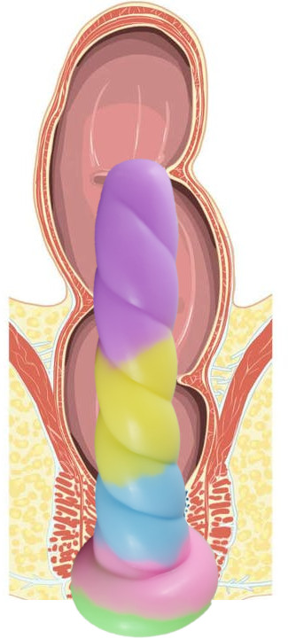

Note: Don't forget, you need lube!

The plugging method: Many people have reported great success with a very specific butt plug and apparently it works by adding slight pressure to the transverse folds in such a way that it keeps them straight. The exact toy is called "Doc Johnson Mood - Naughty 2 XL", pay special attention to the name and size, it is very important as other models and sizes don't seem to have this effect. The butt plug is 15cm (6 inches) long and 3.8cm (1.5 inches) wide, this is not exactly a small toy and not everyone will be able to use it for warmup. This toy also acts as a good way to warmup your anal sphincters for anal sex, but in general this toy is not going to be very suitable for beginners. To use this toy for warmup, simply plug in the toy slowly in your anus and insert it all the way in, pay attention to the curvature of the toy so it matches your natural rectum's angle. The downside of this method is that you might need 30 minutes or even an hour to feel the effects, but you can use this toy freely while you are not fully focused on anal sex, meaning you can insert the toy long before having anal sex and still benefit from it. This method might relax your rectosigmoid junction as well, be aware of the possibility if you have not preformed a full enema.

Note: Don't forget, you need lube!

The farting method: Previously described, this method can also be used to relax your rectum, but can also relax your rectosigmoid junction too. Be aware of that if you have not preformed a full enema.

When you have warmed up your rectum, you are ready for actual anal sex. But if you are interested in anal depth play, you need to do the last warmup phase. By depth play here we mean any sex toy that reaches your rectosigmoid junction by length, shorter toys probably do not need warming up your rectosigmoid junction. Remember that your rectum can be anywhere from 15cm to 30cm long and determining the length is a matter of simply trying different length objects, 15cm is can be considered as the average penis size in some areas, but longer penises can also be found, this means that there is a possibility you do want to warmup your rectosigmoid junction to decrease discomfort. As we learned in chapter [Anatomy](#Anatomy), we learned that rectosigmoid junction is a very sharp bend that is created by how your colon is placed at resting state, but if you insert a straight sex toy into your rectum, the top end of the toy can start "poking" your rectum's walls and cause a lot of discomfort. To remove this discomfort you need to learn to relax your colon and make the rectosigmoid junction's created bend less acute, sadly this muscle cannot be controlled on demand, rather people have learned to control it indirectly.

Relaxing the colon takes practice, sadly not a lot of suggestions exist, though you might still find the following information useful and figure out a routine that works for you. Firstly lets remember that a squatting pose aligns the colon with the rectum very well ([example](anatomy_rsj_squat.jpg)), you can use this pose to reduce the angle of the rectosigmoid junction and start using longer sex toys to insert the toy near the rectosigmoid junction. Carefully start stroking the toy, but don't use a lot of force since area past your rectosigmoid junction is even more delicate and does not have a lot of nerve endings, meaning it is easy to create an injury. You can leave the sex toy there for a while to let your body to adjust to the foreign object. At this point the goal is not to push the toy past the rectosigmoid junction, but rather let it sit near the junction and let your body relax the colon in the presence of a foreign object.

Another thing you can use to your advantage is slight clenching. Your body reacts to clenching motion since it a signal that you want to defecate, this will trigger a chain reaction of relaxing your colon, relaxing the transverse folds, relaxing the anal sphincters and other changes, but this only works as long as you do NOT put a lot of strain. Many people use this during anal sex as well, they slightly push the foreign object slightly outwards (imagine just relaxing your anal sphincters while sitting, you can feel a slight clenching).

Another adjustment you can make is being in a pose that makes your body curve the rectosigmoid junction in the opposite direction, this can be done is a semi doggy-style / semi squat position, in yoga this is called as the "cow pose", but with a modification - you need to look past your right shoulder. In this position you curve your upper body so the rectosigmoid junction aligns straight with anus and reduces the anorectal angle. The semi squat position gives you a slight advantage since you align your colon in all direction, though this is not as effective as a full squat pose. During anal sex in doggy style position with the modification of looking past your right shoulder you will find this is also helpful since the pose still aligns your colon and straightens the rectosigmoid junction (without the hunched back). You can find an example of the pose [here](warmup_shoulder.jpg) with a diagram of your rectum's and colon's alignment.

Previously mentioned "the farting method" is also good for relaxing your rectosigmoid junction, consider incorporation it in you routine as well.

Lastly we can recommend using a very soft and flexible sex toy to be inserted past the rectosigmoid junction, but this must be done after you have started to relax your colon, you cannot force a sex toy past the rectosigmoid junction as it would put a lot of strain on both the muscle and the colon. A common mistake for those, who are involved into deep fisting, is to rely on force to straighten the bend created by rectosigmoid junction, in other words the fisting giver inserts their fist deep into the rectum and forces the colon to be straight using force, but this is highly dangerous and results in severe injury in many cases. You must have straightened the rectosigmoid junction by other means before inserting a toy past the rectosigmoid junction. The idea is NOT to stroke the toy, but rather gently sliding past the rectosigmoid junction at let the toy sit there. For this purpose you will need to use the same toys as you would use in anal depth training, examples of such toys can be found in later chapters.

**IMPORTANT**: When you have inserted a sex toy past the rectosigmoid junction, do NOT make sudden movements or contract your muscles suddenly. The sex toy will prevent your colon to fully create the rectosigmoid junction's angle back and will cause a lot of strain to the muscle. This will result in sharp pain and potentially injury.

At this point you should have relaxed and warmed up internal and external anal sphincters, your rectum and depending on your choice even your colon. You should be able to insert your desired sex toy, penis or fist, but if you don't, then either you have not warmed up properly or you are experiencing irritation caused by your sex toy. In later chapters we will discuss the material choice to reduce the chances of further discomfort. If you feel an urge to push your sex toy or penis out, then something is not right, this discomfort is not very likely to go away on its own, you should revaluate your warmup routine and try again.

Note: Porn stars are professionals and the scenes you see are not showing how the porn stars have warmed up a lot (maybe even hours of preparation). They are highly trained and experienced, just because they can insert a round ball or sex toy completely into their rectum does not mean you can do it too. The professional actors are able to preform such stunts since they have practiced it for many years and learned how to relax their muscles to prevent embarrassing trips to the doctors office. 

# Anal massage

Anal massage is a special form of massage that focuses on stimulating the nerves around the anus and partly in the rectum. This type of massage can be used as a warmup since it mostly stimulates the nerves from the outside and optionally can be used to stimulate the inside of the rectum (internal anal massage). It is a very relaxing activity and can be preformed on males and females, many people find it very sensual since the anus is densely packed with nerve endings.

**IMPORTANT**: When preforming an anal massage to a female, it is important to prevent any liquids flowing from the anus to the vagina as that can cause an infection. It is best to cover the vagina with a towel or other object to prevent any lube of fluid dripping from the anus to the direction of the vagina.

To preform an anal massage on a person, the person can have cleansed themselves using enema or other methods, but it is not an requirement, the person should have emptied their bowel beforehand by going to the toilet and they should not experience pieces of feces appearing as long as the person has a good diet. After cleansing (or justs using the toilet), consider washing the area from the outside using wipes. Place the person on a bed or a massage table or any other surface that they can find comfortable, place the person in a position that is comfortable. Some positions you can try is the "yoga child pose", you can try laying on your stomach, you can try laying on the side and pulling one knee towards the chest or any other pose. The focus is to make sure the person is comfortable, consider doing a full body massage beforehand.

*TIP*: Use a pillow to make the person feel more comfortable, for most poses a pillow under the chest is going to increase the comfort.

Note: As with any massage, consider using a massage oil. For internal anal massage consider using a lube, oil and silicone based lubes work the best for anal massages.

Start the massage on the butt cheek area, use light, but noticeable strokes around the butt area, don't to light touches, you need to add some pressure to massage the muscles. Communicate with the person to better understand how much pressure you need to apply, ask what feels better by increasing pressure. Sometimes the person will want a lot of force on those butt cheeks to even feel the pressure through the fat of the butt cheeks. Vibrations on the butt cheeks and the thighs can also feel pleasant for some people. Focus on the lower back, butt cheeks and thighs. Consider squeezing the sit bones (the lower part of the butt cheeks), those are highly sensitive and can bring a lot of sensation.

Try spreading the butt cheeks with your hands lightly in circular motions or try rubbing the butt cheeks against each other gently. Try blowing the anus area with hot or cold air to bring a different sensation, ask the person what they find more pleasant. Try massaging the tailbone, it does not need a lot of pressure since the skin is very close to the bone in that area, but you need to keep a lookout for signs that the person starts to feel you are massaging the area since it is also possible to not add enough pressure, consider asking the person whether the person would like more pressure on that area or not.

*TIP*: Increase the pressure and ask the person to say "when" it is too much to find the amount of pressure the person prefers.

Note: For preforming an internal anal massage (and for external anal massage as well) you will want to use gloves, but make sure you size them properly. Small folds on the tip of your fingers can feel unpleasant. Remember to use gloves that don't have irritating materials, consider using nitrile gloves since some people are allergic to latex.

Slowly introduce touches to the anus. One very simple way to introduce stimulation to the anus is by simply placing fingers on the anus and holding them on for a while, ask about the pressure. Try gliding your hands along the middle of the butt cheeks. The hair growth direction changes around the body and the person will find most pleasant massages in the direction of hair growth, for the butt area the hair usually grows upwards, it also grows upwards on the back of the thighs. Vibrations on the anus with your hand can be very pleasant while holding butt cheek with the other hand. Try using a loose fist on the anus to introduce different kind of vibrations.

*TIP*: Encourage the person to breath deeply and slowly to increase the relaxation.

Stroke the anus with your fingers, try using the following motions:
- Circular motions around the anus
- Crawling motions around the anus using your fingers
- Gliding motions using the side of your hands
- Pressing motions
- Up-and-down motions
- Paddle the anus with your thumbs from both sides

Note: People get accustomed to stimulation, but don't change the motion too often. Allow the person to adapt to the sensation and then change.

Tease the person with your thumb on the anus, look for relaxation on the anus as the person is willing to allow the entrance. Add enough pressure with your thumb so it is about to enter, but don't push it through immediately, tease the person before going in. When the person has relaxed the external anal sphincter and allowed your thumb to enter past it, let your thumb sit before the internal anal sphincter while you are massaging the butt cheeks with your other hand. Consider removing your thumb and continuing motions around the anus then returning to insert your finger into the anus for multiple times. Insert your index finger past the internal anal sphincter and let it sit there for a while. You can ask the person to squeeze the finger and then relax to allow your finger to slide in further.

When your finger is inside, consider using circular motions, up-and-down motions, pressing (come hither) motions and vibrations inside the anus. Remember to massage the butt cheeks with your other hand, try kneading, pressure or tapping motions to add some variety. Consider sliding the finger in and out with pressure around the anus. Consider switching to the thumb to preform similar motions, kneading motions, circular motions, sliding motions and other. The part of the rectum that is closer to the stomach (not the tailbone) is going to be more stimulating for most people. You can always remove the finger from the anus and continue massaging externally.

*TIP*: When you introduce a new motion to the massage and the person changes or even stops breathing, then it most likely your new motion is something the person does not enjoy.

Anal massage is a great way to introduce anal play to beginners and you can use it as a warmup or as a form of relaxation by itself. It is a great addition to prostate massage since you can stimulate and relax the receiver.

# Sex toys

The variety of sex toys is probably limited only by the imagination, they come in all shapes, sizes, colors, stiffness and many more characteristics, but we can make a few categories so you have better chances of finding your perfect sex toy. You can probably skip getting a sex toy and just rely on your own fingers (or your partner's fingers), or rely on your partner's penis, but as you saw in the chapter [Warmup](#Warmup) it is much easier to warmup for anal sex with dedicated sex toys, they also are capable of bringing completely new sensations to your sex life. Below you can find a comprehensive list of most common types of sex toys that are used in anal sex.

Dildo: Probably the most common type of sex toy, it is an object that resembles the shape of a penis or any size or length. There are realistic dildos, solid dildos, double ended dildos, dildos with suction cup, dildos with testicles, squirting dildos, vibrating dildos and all sorts of variations. They bring sensations by adding pressure to your walls of rectum and by stimulating surrounding nerves with penetration. It is quite important to pick a dildo that is NOT completely smooth, this might sound counterintuitive since the tissues of your rectum are delicate, but lack of any variation on the surface makes stimulation less effective, for this reason the best option is to get a realistic dildo that has very pronounced veins and glans. Make sure you pick a dildo that has a flared base so you reduce the risk of the toy accidentally slipping into your anus completely.

Vibrator: This is an object that usually looks like a oversized and long bullet, they bring sensation by vibrating. They can come in any shape or size, some are remote controlled, some have multiple vibrating motors, some have a gentle vibration, some have intense vibration, some are quiet, some are loud. They usually have a smooth surface, which makes most vibrators not very useful for anal sex, but this does not mean they cannot be used, you still can get a stimulation from just these vibrations, though this sex toy is more suitable for women and vaginal sex. Vibrators rarely come with a flared base, which makes them a bit dangerous to use in anal sex since there is a risk for the toy to slip in too deep to get it out.

Butt plug: Specially designed sex toy for anal sex. They can come in various sizes and lengths, but also in shapes to be more suitable for a certain task. The main idea of a butt plug is to insert it and allow it to stay stationary without falling out of your anus. They can have various shapes for their bases as well to make them more suitable for various occasions. Butt plugs are very popular in anal sex scene and they deserve a separate chapter since there is quite a lot to learn about them. They work great for males and females since they create an internal pressure inside your rectum and stretch your anal sphincters, which many people find very sensual. Some butt plugs have a vibrating function, some butt plugs are inflatable, some have a hallow center (tunnel) and many other variations. These sex toys are even used for so called "long-term plugging" where you leave the butt plug in for hours or even days, but that requires very specific butt plugs.

Anal beads: A toy that consists of multiple spheres connected together with a string or a string-like object. This sex toy creates a stimulation by repeatedly stretching your anal sphincters while you insert or remove the toy. While this toy does not seem to create a lot of stimulation like a dildo would, the sensation of opening and closing your anal sphincters can be very intense and many people enjoy it. Make sure your anal beads have a flared bottom as there is a risk of the toy slipping in completely into your rectum.

Prostate massagers: These sex toys are specifically designed for males to stimulate the prostate. A separate chapter is required to talk about prostate massagers since that is the most common reason why men are interested in receiving anal penetration. They can take the form of a butt plug, as a dildo or a wand. They can be vibrating or requires manual stimulating (by you or by your partner), there is a special type of device called "Aneros" (actually a brand) and it deserves a separate chapter as it holds a crucial technique for reaching prostate orgasms. 

Speculum: Medical device used by doctors to access your rectum (or uterus) for surgery purposes, but many people found that this device can be used a sex toy for various stimulations. Speculums are not devices for beginners since it is quite easy to injure yourself by spreading your anal sphincters too much. The designs are different, but there are a few designs that have a very small surface area and because of that puts a lot of pressure on your anal sphincters ([example](sex_toys_dilator.jpg)), you should look for speculums that have a large surface area when inserted ([example](sex_toys_speculum.jpg)). These toys are fun to play with, usually people like to use them for playing with liquids.

Artificial fists: Just like the name suggests, these are sex toys that are shaped as fists. The purpose of such a toy is to imitate the stimulation of a real fist while it is fisting you. They can come in various sizes, they can be a fist with pointing fingers, they can be in the regular fist shape, they can even be multiple fists fused together. This toy is something that only the most advanced people are able to use, but many people describe the large pressure that the size and the shape of the knuckles create as very stimulating.

Depth probes: For accessing very deep regions such as your rectosigmoid junction or your colon you are going to need a special toy designed for this purpose. These depth probes are highly flexible (they don't hold up their own weight) and are very long (20cm+), they usually don't have a large diameter (usually it is around 4cm, which is the tightest point in your colon for most people) and usually they don't have any texture on its surface (but some are highly textured). The purpose of this special sex toy is to slowly slide into your colon with the least possible friction, they easily adapt to your colon's curvature since the toy is highly flexible. Anal depth training is an advanced topic and deserves a separate chapter.

Strap-on harness: Resembles an underwear that allows you to install a sex toy in front of it. The purpose of a strap-on harness is to allow females (or in some cases males) to be (anal) sex givers, not just receivers. Since the harness allows you to install almost any toy (that has an appropriate adapter), then it allows the (anal) sex receiver experience a wide range of stimulations while experiencing a somewhat realistic sensation of having sex with a person. Pay attention to the type of adapter the harness requires for the toy to have before buying a strap-on harness or a new sex toy, some strap-on harnesses include a sex toy.

Magic wand: This is a sex toy specifically designed for vaginal sex, sadly the vibrations and the shape of this toy is not going to give anymore stimulation that a regular vibrator.

Sex machine: A device that you can use for penetrative sex, these devices come in various sizes and power ranges. They work by placing a toy that has a compatible harness and uses an electrical motor to create strokes. Some of these devices are very loud, but some don't have a lot of noise. These devices can be very brutal and can be very dangerous to use as accidental knob twist can instantly use full force to penetrate your rectum and cause severe injury, sex machines are not for beginners. Most sex machines will come with either a "Vac-U-Loc" adapter or a "XLR" adapter, to use your toys you need to make sure that they are compatible with your sex machine, you can buy various converters that allow you to use different types of adapters with your sex machine, including a regular suction cup.

Enema bags: Some people find it highly arousing to have water inside them while it creates distributed pressure in many areas of your rectum and colon. You can also use an enema bag to bring the same stimulation from your doctor's office to your home. Enema bags are going to be much safer than shower-head attachments since the water pressure is not going to be large enough to cause injury.

Inflatable toys: A special caution must be taken when using inflatable toys. These are toys that can be inflated to a larger size. On one hand, they are a great tool to have in order to substitute many different sized sex toys that you may use for anal training, a convenient inflatable toy would save space, but this does come at a risk. Many people like to inflate the toy while it is inserted and feeling how the toy expands, but this can cause injury since you are not fully aware of the size and overstretch your muscles. Many people also like to inflate the toy and push it out, but this is also not recommended since you put a lof of strain of your muscles that can create medical conditions over time (such as hemorrhoids or rectal prolapse). The best way to use inflatable toys is to inflate them while they are not inserted and play with them like they were a regular dildo or a regular butt plug. 

There are a lot of other sex toys, but they are not worth mentioning here since they are not common or simply not suitable for anal sex. There are a lot of sex toys mentioned above, but you might still be wondering, what kind of properties should you look for a sex toy that is going to be used for anal sex. The best sex toys for anal sex are going to be made from semi-flexible, smooth surface, but with ridges (like veins and pronounced glans), soft material, body-safe, easy to clean and for maximum pleasure you want a sex toy that has a slight curve somewhat matching your rectum's natural curvature.

*TIP*: Sometimes you cannot find your perfect toy, there are companies that design a custom "fantasy sex toy" just for you with your measurements.

**IMPORTANT**: Some of you will have an idea to use various household items as sex toys, but there is a risk of injury and poisoning. We cannot recommend using any household item as a sex toy. If you do want to risk it and use such items as sex toys, at least consider using a condom on them, but remember that even condoms break. Whatever is your reason not getting a dedicated sex toy, consider finding ways to buy a high quality sex toy that lasts you years, sex toys are specially designed to bring the maximum amount of pleasure that they can, household items are not designed for that.

# Materials

Sex toys can be made out wide range of materials, these materials have different properties that results in sex toys that have different features and price ranges. There are materials that make sex toys cheaper, some materials make the toy see-through, some materials make the toy extremely flexible and some materials can be dangerous to use to some people. When shopping for toys, you will encounter a long list of possible materials and to make matters worse, some companies market their special blend of different materials as their own type of material and makes determining the properties of this material much harder.

There are a few causes that make sex toy materials potentially dangerous to use and the most common is by using porous materials. Sex toys made out of materials that are porous tend to be a lot cheaper since you can have air pockets to increase the volume of the toy, but this comes at a significant drawback. Since porous sex toys have small air pockets, these pockets can be a perfect breeding ground for various bacteria, sadly not even dedicated sex toy cleaners are not able to remove the bacteria completely and you can experience significant bacteria growth over time that can result in infection ([source](https://www.nytimes.com/wirecutter/guides/how-to-clean-sex-toys/)). The best option to avoid is to simply avoid cheap toys made out of porous materials.

Another crucial aspect is that some toys can contain phthalates. These are chemical compounds that make plastic much softer, phthalate are used in various products including cosmetics, but there have recently been concerns about its toxicity, some studies even have found correlation between problems with neurodevelopment , hyperactivity syndrome, damage to kidneys and even reproductive organs ([source](https://noharm-uscanada.org/issues/us-canada/phthalates-and-dehp)). Some studies even go as far to claim that plastic intake may be shrinking the size of male's penis ([source](https://www.menshealth.com.au/study-links-plastic-to-smaller-genitals?category=news)). There are some caveats in the studies that concluded this correlation, but for your own safety you should look for toys that do not contain phthalates, this is usually a strong advertisement point for companies so they usually make it quite visible, if their toys are phthalates-free.

As mentioned before, companies can create their own blend to create a new material, but usually they fall into known categories. Below you can find the most common types of materials that CAN be toxic:
- TPR/TPE, most common material found in sex shops, is porous, these toys have a very distinct and strong smell, usually very cheap, older sex toys most likely will contain phthalates, newer generation TPR/TPE sex toys can be phthalates-free.
- PVC, a cheap material, is porous, these toys have a very distinct and strong smell, it is very likely they will contain phthalates.
- Fanta Flesh/CyberSkin, this material does feel like actual skin, but it is very porous.
- Jelly, a common material since it is highly flexible and cheap, but it is very porous.
- Latex, latex does not seem to have the same risks as porous toys or ones that contain phthalates, but many people have allergic reaction to latex, they develop rashes, breakouts and even burns, make sure you are not allergic to latex first.
- Metal, this material is not porous, it is usually quite smooth, but risks arise from the possibility of low quality metals that can be poisonous, cheaper toys usually are made out of questionable quality metals and should be avoided.

Note: Some people do buy sex toys with these materials and treat the sex toys as disposable toys. They use them a couple times and then throw them out, because it is impossible to properly clean them. If you really like a toy, then just put a condom on the sex toy.

Most toys you can find actually do contain one of these materials, this makes finding a good sex toy complicated. Luckily there are few materials that CAN be considered safe:
- Silicone, the number one go-to material for all sex toys, easy to clean, can be boiled (for cleaning), can be very flexible, toys are usually very expensive since the material is not porous and the toys are heavy, make sure you get a high quality silicone toy, cheap silicone is not body-safe.
- ABS plastic, a cheap material, but safe to use, it is not very smooth material and requires a lot of lube, it is usually very stiff (not flexible at all),
- Glass, a very smooth material, does not require a lot of lube, not porous, easy to clean, can be boiled (for cleaning), but is usually very expensive and not flexible at all, there is a small risk of breaking the toy as well.
- Wood, not a very common material for sex toys, but they are not porous as long as the finish of the wood is smooth, easy to clean, can be boiled (for cleaning) they have no flexibility at all, might be quite hard to find these days.
- Metal, it can be a safe material as long as you know that the metal is high quality, can be quite expensive.

Sadly there have been some cases when companies were not fully disclosing the purity of their materials and as a result there have been some controversies. While some of these controversies include misuse of celebrities, we only want to focus on the materials they have used, it is up to the reader to decide how much business ethics is important to him/her. Below you can find a list of toy that MAY have toxic toys even though the advertise as non-toxic toys:
- Doc Johnson (some toys known to contain phthalates)

Note: If a company is found in this list, it does not mean all of their toys have a low quality material. This list should tell you to be more precautious with these companies when choosing sex toys.

Choosing a high quality toy is crucial to your own safety, but finding a toy that has a high quality is a bit difficult, Luckily we can make a list of currently known companies that use high quality materials in their sex toys:
- Bad dragon (platinum silicone toys)
- Hankey's Toys (platinum silicone toys)
- SquarePegToys (platinum silicone toys)
- Sinnovator (platinum silicone toys)
- Njoy (316L stainless steel toys)
- OXBALLS (platinum silicone toys)

Note: Making your own silicone toys is possible, though the process is long, expensive and very complicated. It is a lot better option to simply just buy a high quality silicone sex toys.

Many people that participate into fisting tend to use rubber gloves to reduce the chances of injury. Some people use latex rubber gloves, but some people have allergic reaction to latex. The same option to use for anal fisting (and fingering as well) is to use nitrile gloves. These are the same gloves that doctors use in medical treatments. They can be in various colors, but commonly they have a distinct blue-ish color. They are cheap and comes in large packs, they are considered to be disposable gloves ([example](materials_nitrile.jpg)).

Note: If you experience burning sensation, urge to remove the sex toy or general irritation, then it is possible that you are allergic to the material of the sex toy. For this reason, it is better to spend a little more money on platinum silicone toys rather than buying multiple plastic-based sex toys to find out you are allergic to them or they caused infection.

# Poses

When we have chosen our "instruments" for anal sex, we should quickly touch the topic of sex poses. It is possible that any sex pose can be used for anal sex in some way or another, but some poses are very suitable for anal sex and are recommended for beginners. If we listed all possible sex poses you can use for anal sex, the list would require a guide of its own, rather we will list some common and interesting poses that are worth trying. Some of these poses are good with a partner and some of them are good for anal play with sex toys, some are good for both occasions. Below you can find various sex poses for anal sex.

Classic doggy-style: Probably the most common pose for anal sex, this pose suitable for anal sex since your rectum is aligned almost horizontally to the ground. There are a lot of variations for the doggy-style pose, but here we are going to focus on the most common one that involves placing your head somewhat in level of your hips and arching your back. This is a great pose for beginners as well since in this pose you let your rectum sag using gravity and you almost align it with your rectosigmoid junction, this pose also allows the rectum to "suck" in air and allows the rectum to be expanded with just air, though this effect in the classic doggy-style is minimal, yet it does remove quite a noticeable amount of pressure on the rectum's walls. This pose also allows the anal sex receiver move forward and backward, you can regulate the depth of penetration (though not by much). A lot of sex poses can be exhausting, but this pose is easy to hold, you can rest on your elbows or rest on your palms. A lot of people tend to hump their back during this pose, but this creates strain on your rectum and does not look very appealing either. Below you can find an example of this pose:


Facedown doggy-style: A variation of the doggy-style pose, but rather than resting on your elbows or palms, you rest on your torso making a 45 degree angle (or even larger angle, if you are flexible enough). This pose requires a bit of a flexibility of your lower back muscles and hips. Comparing to the classic doggy-style position, this variation "sucks" air into your rectum and colon as soon as both internal and external anal sphincters are relaxed, this effect is much more noticeable in this variation and will expand your rectum allowing you to enjoy more the penetration. Most videos you have seen with "giant anal gape" are usually done in this pose since this pose keeps your anus open the most when muscles are relaxed. Movement during this position is considerably smaller than in the classic doggy-style position. The anal sex giver might need to be on top of you rather then in-level with you (a semi-squatting position) so the angle of his penis matches with your rectum's angle. Below you can find an example of this pose:

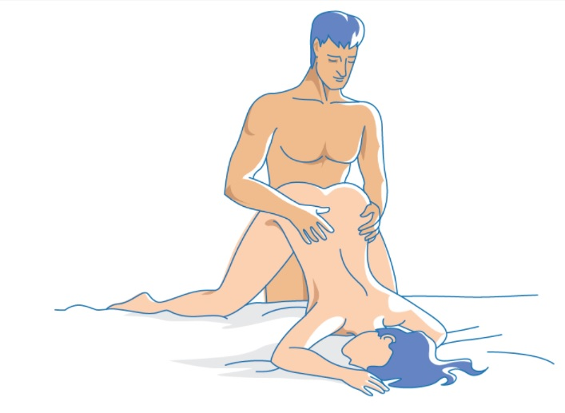

Standing doggy-style: You don't have to be standing, but the angle of your torso makes the difference between different variations of doggy-style pose. This pose will most likely require some equipment, you need to hold up a sharp angle of about 60 degrees upwards, you can create such an angle by asking your partner to hold you upwards, hold you against a wall or against a chair. Previously we mentioned a variation of a squat pose that aligns your rectum and colon ([example](warmup_shoulder.jpg)), the same principle will apply to a doggy-style position that makes you place your torso upwards. In this position your poartner most likely is going to need to be on the same level as your hips. Below you can find an example of this pose:

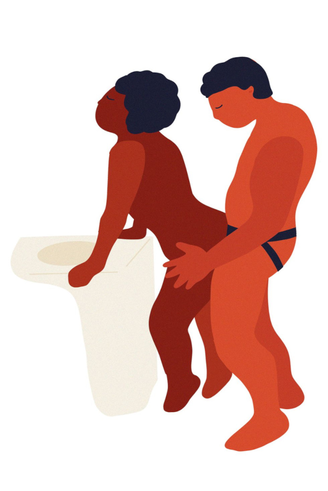

Note: By adjusting the width of your legs (spreading legs or keeping them together) you can vary the amount of pressure you feel from the penetration. If you close your legs, you will feel more pressure on the walls of your rectum, but you will also increase the intensity of the stimulation, this is a trick that many people use, if they find that the sex toy or penis is not giving them the desired amount of stimulation. The opposite effect can be achieved when you open up your legs, this way you can allocate more space for larger sex toys or penises and reduce the intensity of stimulation.

Cowgirl: A position where your partner lays flat and sit on the penis or sex toy while you are on your knees. This is a great position for beginners since it gives full control of both speed and depth to the anal sex receiver, this is very recommended for beginners since they can adjust to whatever they find more comfortable. The cowgirl position has a few variations, but the most common are the classic and the reverse cowgirl, they differ by the rotation of your body (either you are facing your partner (cowgirl), or you are facing away from your partner (reverse cowgirl)). A slight advantage is to the reverse cowgirl since a penis usually has a slight curvature upwards and that will align better with your rectum, but the difference might not be noticeable to everyone. Below you can find an example of this pose:

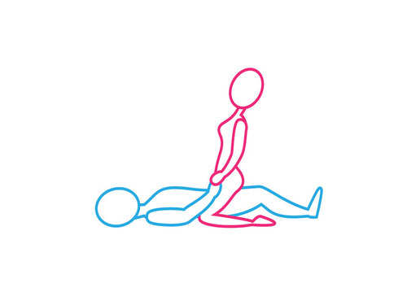

Squat: As we discussed previously in chapter [Anatomy](#Anatomy), by squatting you align your rectum and colon naturally and you also have a reflex to relax the surrounding muscles. What a squat also does is allocate a lot of space in your rectum, this pose is probably the best pose for very large insertions and many experienced people use it to increase their anal stretching abilities. For sex with a partner this pose might not work out very well since the pose is quite exhausting and you probably want to hold on to something to distribute the weight of your body to more locations, you might find this pose to be a bit more comfortable when wearing high heels and when standing on steady ground. Below you can find an example of this pose:

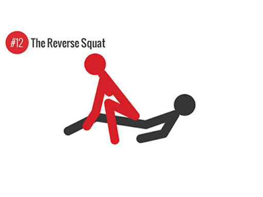

Lean on to left side: This is a special pose that does not make sense to do with a partner, but it is very special if you are into anal depth training. In chapter [Anatomy](#Anatomy) we learned that your colon is curved and goes along your left side, your colon creates the rectosigmoid junction and makes your colon curve to the left side. You can lay on the right side and help gravity pull the colon down to make the rectosigmoid junction's angle less acute, but you can also curve your body to help to make the colon straighter. The pose is a bit hard to master, but you should feel a difference at some point. Lay on your back and angle yourself slightly towards the left side so your right leg pushes you upwards on the right side, but your left leg is free to move, then you curve your stomach so the curve is on the left side, this curvature should make the colon align to the left side to your rectum and allows you to insert a long sex toy from the right side towards the left side inside the colon. Consider searching for "HotKinkyJo Pink Dress belly bulge", this porn star seems to use this pose whenever doing deep anal penetration.

Spoon: This snuggling-like sex pose is also suitable for anal sex, since the legs are not spread open, then you can feel quite intense stimulation. This is a very beginner friendly position and has the benefit of having both hands free. The angle of your rectum is also suitable and you should not experience large amounts of pressure in single point as well. There are some variations of this pose, including one where you raise one leg to reduce the intensity of the stimulation. This sex pose is also quite popular for pregnant woman. Below you can find an example of this pose:


There are a lot of more poses to try out, but the listed positions should give you an idea what to expect from a pose that is not listed here. Hopefully you understand now that for pleasant penetration it is important that you align your rectum with your anus as straight as possible. You might be wondering, why is not the missionary pose listed here and you should probably understand by now that the pose is not very suitable for anal sex. This does not mean it cannot be used in anal sex, many people do enjoy it, but it has the caveat of making a quite sharp angle between the rectum and the anus, which makes longer insertions uncomfortable and sometimes even painful. You can adjust almost any sex position to be suitable for anal sex, but if you remember from chapter [Anatomy](#Anatomy) the small extension at the shallow end of your rectum, then the insertions must be done very shallow (only a few centimeters deep), which might be enough in some cases, but requires a lot of practice not to injure your partner. Keeping in mind that it is possible to injure your partner in this position, this seems to be a acceptable pose for males when they get their prostates stimulated since you don't need to have a deep penetration to stimulate the prostate, but you do need to be aware of the angle.

Even with the possible discomfort, you might still find the missionary pose very well suited for anal sex. We will later learn in chapter [Orgasms](#Orgasms) that the erogenous zones are not very deep and with practice it can be suitable for both males and females. To reduce the discomfort to some extent, consider placing a pillow behind your back and behind your head. Below you can find an example of this pose (adjusted for anal sex):

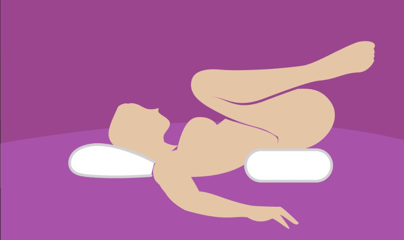

**IMPORTANT**: Making sudden moves during anal sex can be dangerous. With time you will learn how much movement is acceptable for you not to change the angle of your rectum (or even colon), but for beginners it is advised to limit your hip and torso movements to reduce the chances of receiving pain. If your partner is inexperienced, then warn him/her to take the first few strokes slow so the body can adjust to the change. This is extremely crucial to those who use a sex machine for penetration, these machines do not care about your pain, the continue to penetrate you at the angle you set it up to penetrate, changes in your pose can result in forceful thrusts at an undesirable angle.

# Butt plugs

Butt plugs are a huge part of anal sex since they bring a very specific sensation of inside pressure that most people find very pleasant. There are many types of butt plugs and they all come if various shapes and sizes, but here we are going to focus on a few important principles when using a butt plug.

Most butt plugs will have the distinct shape of having a flared base, narrow neck, wide bulb and pointy tip. The idea behind the narrow neck is that you can inside the butt plug into the anus and it should not fall out. Butt plugs will have enough long neck so that the bulb of the butt plug sits right above the internal anal sphincter and right where your rectum starts and has plenty of room, for most people the bulb is going to be the part that creates the stimulation since it adds pressure to the surrounding nerves and should increase arousal. The neck of the butt plug is going to determine how much of a constant stretch it is going to create to your anal sphincters and the neck is what most people look for when trying to train for larger diameter sex toys since holding a butt plug with a wider neck is going to increase the amount of stretch that your both anal sphincters receive. Wearing a wide neck butt plug for extended periods of time is not going to be very pleasant since your anal sphincters want to return to the closed state, but preventing that will cause some discomfort.

The base of the butt plug can be any shape, but most butt plugs will come with either circular base or a T-bar base. What kind of shape for the base you choose depends on the personal preference, but if you are intending to wear the butt plug for extended periods of time and wear them while sitting as well, then consider getting a T-bar base, those sit between your butt cheeks and reduces the friction on the butt cheeks, which is a common complaint about circular bases. Men will find T-bar bases more stimulating since they tend to massage the prostate externally, but women can find T-bar bases more stimulating as well since the tabs of the base can stimulate the pudendal nerve through the perineum.

Many people like to use butt plugs for constant stimulation to nerves that surround the rectum and creates a constant arousal, even during the night. Most butt plugs are not suitable for wearing them at night and cause a lot of discomfort while you are sleeping. It is important to choose a material that is not porous to reduce the possibility of causing an infection, but is also important to choose a soft material to prevent the possibility of injuring yourself during yourself because of a hard object inside your rectum. There seems to be only one material that satisfies both of these requirements and that is silicone and the butt plug still needs to be a platinum silicone butt plug. Butt plug enthusiasts tend to recommend the [SquarePegToys Egg Plug](toys_eggplug.jpg) as the most ergonomic and the best butt plug for night-time wear. Most butt plugs will become uncomfortable after wearing a few hours, this can be caused by the lube drying up and starts to irritate your both internal and external anal sphincters. To reduce the chances of the lube drying up during the night, many people apply oil-based lube (such as coconut oil) on the butt plug and then add water-based lube on top of it, this prevents the lube completely drying up.

Note: If you feel that the but plug's lube has dried up, you can push the butt plug a bit further into your anus and allow a small amount of lube to drip down into the anal sphincters from the rectum.

Some people like to wear a butt plug all day long, this is possible and such people prepare for such extended butt plug wearing. In general, you should have a proper diet and don't have very frequent bowel movements and your stool is supposed to be solid, this means you can wear the butt plug all the time and remove it as soon as you need to go to the toilet without facing too many inconveniences. People even take a small amount of lube with them to reapply it on the butt plug after finishing going to the toilet or feeling that the lube has dried up during the day and to reapply the lube. You do need to clean the butt plug from time to time to prevent bacteria growth and you can expect your butt plug to have a very distinct smell.

Note: It is not recommended to use very long sex toys (such as those, which pass the rectosigmoid junction) while sleeping. During your sleep, you tend to move unconsciously and your colon and rectum is meant to move unrestrictedly, but a sex toy can prevent that and cause a lot of strain to your muscles. It is best to use only butt plugs that sit at the shallow end of the rectum during sleep.

Special attention must be given to a butt plug called "Doc Johnson Mood - Naughty 2 XL" that has been mentioned before as a butt plug that helps to straighten out the transverse folds into your rectum. This butt plug has a distinct shape that works great as a warmup before anal sex. Wearing this butt plug 30minutes or an hour before anal sex can greatly reduce the discomfort many people feel during anal sex.

# Orgasms

When a person reaches an orgasm, the body goes through a lot of different processes, but reaching an orgasm can be quite frustrating. To increase the chances of reaching an orgasm we first learned the anatomy of your reproductive organs, but now we should discuss what CAN trigger an orgasm in your body. Since the anatomy of male and female is quite different in their reproductive organ area, then the details of orgasms will be separated into two chapters for each gender, but there are a few similarities to take info consideration first.

We first must acknowledge how the anus is packed with a lot of nerve endings, this makes any stimulation around the anus immediately noticeable. The area around your rectum is also packed with nerve endings, but rectum's interior wall gives access to organs that we can target for stimulation through the rectum.

While the following chapters are going to be divided into information that is relevant to females and another chapter for information that is relevant to males, they still share some useful information and you might a technique that works for the opposite gender as well. Also, you never know when this information is going to become useful to you too.

One of the most common mistakes in reaching an orgasm through anal stimulation is forcing it. It is crucial to take your time to enjoy the stimulation, but a more common reason why many people cannot seem to be able to reach an orgasm is because of causing a lot of strain on your anal muscles. When you have an urge to push a sex toy or a penis out (imagine you ate something spicy and now it irritates your rectum, you use a lot of force to push everything out), then that is an indicator you are doing something wrong. Some people tend to keep going until they reach leakage of some kind of fluid through their penis or vagina, but this is more likely to be caused by forced muscle contractions due to irritation on your rectum walls rather than due to actual orgasm. To prevent this irritation you must go back to chapter [Warmup(#Warmup) and make sure you have properly warmed up your muscles, beginners should consider trying doggy-style position to remove weight off your rectum. As you force a sex toy or penis through the transverse folds, they will sense the penetration as irritation and will cause a reflex to push the object out, you do not want to trigger this reflex for a number of reasons that we described in chapter [Health](#Health) since it can leave a long-term damage.

Note: Pausing the penetration and then returning to it usually does not solve the irritation problem. You need a proper warmup.

Many people prefer shaving their anus area since body hair increases the amount of friction and that can cause reduced pleasure during anal sex either with a penis or with a sex toy. Shaving is not the only option, you can only use waxing to pull the body hair out. While waxing is more painful (but can get used to), shaving has an increased risk of ingrown hair and irritation (that can be minimized with proper skincare). You can also skip the hair removal, but then you will have an increased amount of friction, most people say that it is more pleasurable to have the area free of body hair.

It is quite common to feel sense of "downfall" or "sadness" after sex, this can be linked to  the sudden drop of endorphins after climaxing. This is more pronounced to people who were raised in cultures that are  sexually repressive, such people will have a hard time appreciating their own bodies. Anal sex can have a similar effect if the anal sex gives the person a sense of submission, this is quite common for people who participate into BDSM and this effect can be more pronounced since the submission gives even higher rush of endorphins, which later drops ("sub drop"). Probably the best way to minimize this effect is to simply acknowledge that it is a neurochemical phenomena and prepare for it. In BDSM communities the submission can be taken to the extreme and they like to use an "aftercare" where the partner shows how much the other person means to them, this is also a good time for various snacks to refill the lost energy. A similar effect can be seen in so called "sissy" communities, where people regret their actions after climaxing (sometimes called "nut clarity"), but this also is caused by the same drop of endorphins and requires some kind of replenishing. When reaching orgasm alone (without a partner), some people like to fantasize the aftercare of cuddling and affirmation with a partner they rather have done the sexual act together. You can also benefit from finding activities after sensing the drop in endorphins by simply keeping your mind off it.

It is quite common for people to be able to take large sex toys when doing a solo session since you are anticipating each thrust, angle, speed and so on. When you are having sex with a person, you are going to be submissive to your partner and you cannot anticipate the complete movements. For this reason many people will have a more difficult time taking larger sex toys and you should account for this whenever planning anal sex in advance with a partner.

During anal sex with a partner, the receiver should be making PC muscle contractions and these movements will seem to the giver as his penis is being squeezed. Many men will enjoy the increased stimulation of their penis being squeezed inside the rectum, these PC muscle contractions will increase the chances for the receiver to reach an orgasm. This is regardless of the gender, both males and females will makes these contractions to stimulate surrounding organs and nerves.

Some people can experience a drop in arousal when starting anal play. This is most likely a psychological issues. One possible cause is to have too high expectations when engaging into anal sex, it is not a very strong sensation at the beginning so many are a bit disappointed when the first thrusts have passed, but have not given a lot of pleasure, it takes time and practice to reach a level of sensation that gives a mind blowing orgasm. Another possible cause can be due to fear of releasing fecal matter, for this you can simply ensure that you have properly cleansed yourself and such "accidents" won't happen, you must learn to relax and give into the penetration. Another possible cause is that anal sex is still a "taboo", for this you must overcome this feeling by learning more about anal sex and understanding that a lot of people does it. Arousal is crucial in reaching anal orgasms, you must be highly aroused before anal sex and during anal sex, do whatever it takes to keep your levels of arousal very high.

Note: Large sex toys or penises stimulate a large area at once, some people might enjoy the overwhelming sensation of many sensitive areas being stimulated, but some like to be able to focus on a single area at once. That is a personal preference that each individual should explore. Stimulating a single area can seem a bit "boring" after a few minutes, the best approach seems to be to figure out ways that gives the most promising results and then focus on those methods in such a way you constantly increase the intensity until you build up to an orgasm.

Edging is quite popular for people who want to reach anal orgasms and it is a very popular way for orgasm denial in BDSM communities. In general, edging is a way to treat premature ejaculation (mostly for men), it is fine to use edging to increase the intensity of an orgasm, but it should not be used on regular basis multiple times a day. When used multiple times a day for extended periods without giving the chance to orgasm, you are very likely to change levels or arousal over time. As everything, things are good when used in moderation.

While women will enjoy a more intense pressure towards the Skene's gland, men's prostate tend not to respond well to intense pressure and most likely are going to reduce the changes of reaching an anal orgasm. This can be somewhat explained that women have the Skene's gland located on the front of the pelvic bone, this means during anal sex stimulating this area requires you to penetrate two different tissues that are not very thin either way. Men on the other hand will have their prostate very close to the rectum's wall and does not require nearly as much pressure.

Anatomically it seems that there is not much point stimulating anal spots deeply embedded into the rectum, for females the A-spot and the G-spot is quite near the anus and for males the P-spot and seminal vesicles are also very near the anus, but it should be possible to give a sensation by stimulating deeper tissues in the rectum. The rectum is surrounded with a lot of nerve bundles called pelvic plexus and they seem to be able to hijack the stimulation and cause a sensation that reproductive organs are directly stimulated, they also seem to be responsible for sending signals about arousal to your brain. A similar analogy can be used for a condition for some people when they see a bright sunlight and it causes sneezing, this effect is called photic sneeze reflex and a similar effect seems to exist in anal sex.

Note: You can use a P-spot massager for G-spot massaging and vice versa!

To reach an orgasm, it is crucial to address the stressors first. Many of us have complications in our daily lives and this is going to get into the way for enjoying sex. This is especially true for males and most cases of not being able to enjoy themselves during anal stimulation is related to stress. Consider all possible ways to remove stressors before having anal sex. If you are worried that someone will hear you, put on some music. If you are worried that you will make a mess, clean yourself using an enema and put a towel underneath you. Men tend to be insecure about what their partner will think and how their masculinity will be affected, in this case the partner must reassure that this is not going to impact anything outside the bedroom. If the stress is caused because of more complicated issue, then look for ways to solve the issue first. You must prevent yourself from worrying during anal sex.

There are two mental approaches to reaching an orgasm, they are called tantra and fantasy. Tantra is being relaxed throughout the whole session, keeping focus on the present stimulation and ignoring other thoughts, the idea of this approach is keep your head clear and enjoy the moment. The second approach is to fantasize about a more erotic experience while enjoying the current stimulation, this usually involves fantasizing about a partner or some kind of circumstances like location or type of stimulation. You should explore both of these options and see what works best for you.

Note: You will see a lot of different tips in the upcoming chapters for reaching an orgasm, but remember that the key is rhythmic internal contractions.

# Orgasms (female)

While this guide is focusing on the pleasures of anal sex, we must include an overview of other types of sexual pleasure a female can experience since anal orgasms depend on the overall arousal. We will discuss here the large variety of orgasms a female can experience, the G-spot, the U-spot, the clitoris, the A-spot and more. Not all women are successful on experiencing orgasms so this guide can help you and your partner to achieve orgasms for her.

Before we jump into physical aspects of an orgasm, we must touch the topic of sexuality in (especially young) women. Even in modern days in most countries young women are though about sex as an act that has risks, has diseases and woman's reproductive organs create periods and pregnancy, while this is important, this also sets a depressive and fearful view against sex. Many women will have difficulties to enjoy themselves during sex simply because nobody really have told them that they can, luckily this is changing, but because of various trends in our hyper-social lives we can expect younger women to be insecure of their bodies and use their partner's sexual satisfaction as a measure of their own satisfaction. The trend even goes to extreme measures and cause some women to get plastic surgeries for their genitalia (changing the lips of the labia), and that causes even more problems not because such surgeries are dangerous, but also because it can decrease own's sexual pleasure. Women tend to remove pubic hair since they think that a hair-less genitalia area will make them "cleaner" and men will not be disgusted. All this should give you an idea how afraid are some women to talk about their own sexuality and this becomes a major issue in anal sex. If a female cannot accept their own genitalia as something they can use to gain sexual pleasure, then you will have a hard time ensuring a female enjoys sexual stimulation that is done through a "taboo". Before engaging into any sexual activity with a female, you should make sure your partner understands that it is completely acceptable to ask for a sexual pleasure from their side and let them tell you what they want. It will take time until we learn the lessons from "The Dutch Sex Ed Model", until then you will have to be the educator to make sure your woman feels accepted as they are. Consider watching this lecture by Peggy Orenstein about female's sexuality:

[](https://www.youtube.com/watch?v=mWA2uL8zXPI)

Note: In these days you can encounter many women that will be insecure about either their large/small labia, large/small clit or many other insecurities about their reproductive organs. Such women need to find self acceptance and understand their sexuality first before they can properly enjoy such activities as anal sex. Cosmetic surgeries have high risks and are very likely reduce the sensitivity when stimulation is done for their genitalia, this also reduces the chances of reaching an orgasm.

In chapter [Anatomy (female)](<#Anatomy_(female)>) we introduced the pudendal nerve and as you saw in the [diagram](anatomy_female_pudendal.jpg) the nerve stretches deep into vaginal lips (labium minora/majora), passes through the PC muscle, goes along the rectum and passes the spine. When we want to understand female anal orgasms, we usually simply assume that stimulation of this nerve "hotwires" the stimulation of such parts as the clitoris or uterus. Females tend to describe anal stimulation as if their primary genitalia is being stimulated and in this case the "hotwire" effect can explain it, though there is not evidence of it being true. We also saw in the same chapter that [hypogastric nerve](anatomy_female_hypogastric.jpg) connected to the reproductive organs, some sources even suggest that both of these nerves are related to female orgasms, causing shuddering, muscle spasms and so on ([source](https://www.myvmc.com/lifestyles/female-orgasm/)). This means that you should be able to trigger an orgasm when stimulating both of these nerves and the way pudendal nerve are distributed along the exterior of the anus also makes anal play promising for creating sensual orgasms (the nerve endings are closer to the anus than in men).

Some women find that direct clitoral stimulation is too intense for them and they usually ask to stop the stimulation as they cannot take it too much. The anal approach can be a good alternative to not overstimulate the clitoris and meanwhile you can stimulate multiple nerve to create a diversity of the stimulation. Most sex positions that are suitable for anal sex are going to be stimulating the [fornix](anatomy_female_spots.jpg) (A-spot), but as you can see you need to adjust the angle in some cases to you are able to stimulate the correct area and adjust the length as the correct area is a few centimeters deeper than the G-spot is in the vagina. Above the G-spot are the Skene's glands to stimulate this area through the vagina you need quite a lot of pressure towards the front side of the uterus, this can also imply that you need to create a quite a large forward facing angle through anal stimulation, though a large angle can cause some discomfort since you put a lot of pressure on the rectum's walls.

Note: It can be quite hard to reach orgasm when female's legs are spread open. You have a higher chance of stimulating the crus of clitoris (part of the erectile tissues that the clitoris is connected to) when legs are put together.

If you feel that a female is not relaxed and both external and internal sphincters are still tight even after warmup, then consider stimulating the clitoris to an orgasm. This will relax both of the sphincters for females, this does not happen with males and ejaculatory orgasm will tighten the internal anal sphincter, females tend to relax this muscle during clitoral orgasm. This can also be useful when preforming an analingus on a female.

Some people like use a butt plug while the female is penetrated by a penis or a different object, but the butt plugs "neck" and "base" can make it quite uncomfortable for "double penetration". There are multiple types of butt plug bases, but the most common are either a "T-bar" shape or "circular", during vaginal sex the best option is going to be a circular base since the "T-bar" shape is going to constantly get into the vaginal opening, though some butt plugs will allow you to twist the "T-bar" base to the side while the butt plug still stays inside. The "neck" of a butt plug (the part that is the thinnest before the base) is going to cause some undesirable sensations due to sharp change in width that the female will notice during penetration, for this reason soft butt plugs that gradually increase in width are going to be the most suitable, you need to look for butt plugs that have a wide "neck" that matches the "bulbs" width as close as possible.

It is possible to preform a double penetration with a male and a dildo. The main idea of this technique is to use the male's body for the dildos suction cup and making sure testicles for both the males and dildo point in opposite directions. In case the male is penetrating the vagina, get into a doggy-style position, let your male's testicles hang downwards, then insert the dildo with testicles facing upwards and use the pubic bone of the male for the suction cup (if the male's body is shaved). In case the male is penetrating the anus, get into missionary pose, let your males testicles hang downwards, insert the dildo into the vagina with testicles facing upwards. This way both the penis and the dildo is pointing in the same direction and allows the male to control both thrusts with his body. Be aware that the suction cup can cause hickey if the suction cup is very strong, even getting it of can be a bit tricky.

**IMPORTANT**: In porn videos you can often see how porn actors switch between anal and vaginal sex multiple times, but DO NOT DO THIS, this is extremely dangerous and will most likely cause severe infection for the vagina, remember that actors in those videos are professionals (or don't show the aftermath of this mistake). You can switch from vagina to anus, but you CANNOT switch from anus to vagina. If you want to switch from anus to vagina, then you MUST change your condom.

As you probably noticed in chapter [Anatomy (female)](<#Anatomy_(female)>) and in this chapter above that you have the highest chance of triggering an orgasm if you stimulate both the A-spot and the G-spot (and other spots), but from the diagrams you might have noticed that the are quite a lot apart. To have the highest chance to for proper stimulation you should angle the penis or sex toy at about 45 degree angle, but remember that large force is going to cause a lot of discomfort and possibly even injury. For best thrusting stimulation consider using soft silicone toys rather than solid metal or glass toys, soft toys will tend to adjust to the curvature of the rectum and increase the chances of stimulating [all spots](anatomy_female_allspots.jpg) in a single thrust. If you do want to use a solid toy, then consider using "rocking" motions rather than trusts and let the tip of the toy hit multiple erogenous zones bu just rocking your hips. This is called the 45 degree rule ([source](https://www.refinery29.com/en-us/anal-sex-position-penetration-rules)). When stimulation is done on these erogenous zones, you can cause contractions of the pelvic floor muscles (PC muscle) and eventually you can make them automatic that can lead to an orgasm.

Pressure against the back of your spine in your rectum (on the opposite side of the erogenous zones) can cause the nerves to signal defecation and cause bowel movement. During this signaling, your colon starts to straighten and PC muscle contractions are stopped. This can be useful for those who engage into anal depth play since you can trigger the signal somewhat voluntarily, but this can be undesirable for those, who are trying to reach an anal orgasm since the automatic and rhythmic PC muscle contractions are prevented.

Note: Consider taking the recommendation of using "Doc Johnson Mood - Naughty 2 XL" butt plug 20-30 minutes before anal sex for relaxing the rectal folds and reduce the urge to push out the penis/toy during anal sex.

There is a different type of orgasm that females can experience that is slightly different from the regular anal orgasm, they are called anally induced orgasms. This type of orgasm originates from the anal sphincters and rectum itself rather than abdominal muscle area  or genitalia area. The orgasm can be described as flutters around your body that makes you shiver, but not as something you would describe as muscle spasms. If a sex toy or penis is removed during this type of orgasm, you can notice how the anus is making a lot of involuntary contractions and relaxations. It seems that you can increase the chances of reaching this type of orgasm by including a rhythmic breathing (making short exhales through the throat that originates from your stomach). Anally induced orgasms usually don't involve leaking any type of fluids from the prostate or seminal vesicles and they do not have a refractory period.

Note: Breathing can make a noticeable impact for increasing the chances of achieving any type of orgasm. Consider using short and rhythmic exhales through your throat using your stomach. Breathing and anal or rectal muscle flexing seems to be related.

Some females will have a hard time taking the full length of a penis in vagina or anal, this comes at a drawback in missionary pose as the pelvic bone of the male never reaches clitoris and does not create enough stimulation for it, the same problem exists in doggy-style position as the testicles might not reach the clitoris either. The average length of a vagina is about 10cm long when aroused, though there is a large variation in vagina sizes as there is in penis lengths. Porn actors take the advantage of having a larger penis and not thrusting it fully inside the female to make it more appealing on camera since you can see both genitals when the penis is not fully inserted. An advantage of a shorter penis is that women will be less likely to refuse giving anal sex a try.

Squirting is the act of ejaculating fluids from urinary tracts during sexual stimulation, many people think that is the ultimate indicator of reaching the climax of an orgasmic state, but this is not always the case. There are two types of ejaculates a female can produce, one is a milky-white fluid (maybe) coming from the Skene's glands (counterpart of male's prostate glands), the other is a diluted odor-less fluid (maybe) coming from the bladder. Science is not fully aware of what, where and why does this fluid appear, we are not entirely sure if all women have the required anatomy to experience squirting. While the milky-white fluid is extremely rare and in very small amounts, the diluted oder-less fluid is something you see a lot in porn and depending on the amount of water a female has consumed before the ejaculate amount can even be up to 900ml in some cases. While only up to 54% of women have experienced ejaculation ([source](https://pubmed.ncbi.nlm.nih.gov/23634659/)) and yet ejaculations are not frequent even between "squirters", some anecdotal reports that focus on squirting techniques have had better results. Squirting does not always mean that a female has a reached "the peak" of an orgasm, it can also mean that a female is in a mild orgasmic state, some women even report that squirting sometimes feel "weird" and not pleasurable. Women that do experience frequent squirting do report that they can cause squirting using the "come hither motion" or using external clitoral stimulation (the latter being less common), but a lot more frequent squirting seem to occur when both (come hither and clitoral stimulation) methods are used. Even between frequent squirters the level of orgasm when squirting varies, but they do tend to associate squirting orgasms as stronger orgasms.

Note: Some women describe squirting as an urge to pee and will contract their muscles to prevent the possibility of peeing, but this also disrupts the rhythmic contractions that are required for an orgasm. The ejaculations from female body during orgasms are not urine, just like men ejaculate sperm and not urine, the same thing applies to women, their body knows the difference.

During female's period she can have anal sex and for most people it will be enough to just use a tampon and it should be enough to hold menstrual flow even at its peak. You could use silicone menstrual cups, but these cups can get quite a lot of movement during anal sex since you are indirectly stimulating parts of the uterus through the rectum and there could be some unwanted stimulation due to a hard object inside sitting against the cervix that women might not be used to. There are many types of menstrual cups, different sizes, different shapes and hardness, you might be able to find a suitable one by experimenting. There is a risk of causing a suction effect that causes a lot of discomfort and might even require medical attention. Another option could be to use menstrual discs, but they might have a risk of causing a leak.

Note: Remember that females have the highest chance of becoming pregnant when she is ovulating, which usually occurs 12 to 14 days before your next period starts.

**IMPORTANT**: For some reasons people who are very passionate about the Anal-Only way of sex want to get pregnant by forcing the sperm from the anus into the vagina, but this very dangerous as you can easily infect the vagina with the bacteria from your rectum, causing miscarriage or even death. If you want to get pregnant, make an exception to your lifestyle.

As a little bonus, consider this diagram:


# Orgasms (male)

When it comes to reaching anal orgasms for men, it becomes a little more complicated since most men are not used to penetrative sensations and relaxing some of your muscles, women tend to be better at reaching anal orgasms, but that does not mean men cannot reach them, they can, and yes, they can be as strong as female orgasms.

Lets first talk about some types of orgasms that a male can experience during anal sex. This also touches a term called "refractory period" or the period in which a person is not very likely to be sexually aroused after an orgasm, many people describe this feeling as laziness after climaxing, this is what (most likely) all males experience during regular sex or masturbation using their penis. The time, which is required for an average male to be able to experience an orgasm again, it depends on age, teenagers are able to have an orgasm again in minutes, but as we age the time becomes longer and spans into even hours. It is quite common for females to experience multiple orgasms, but males are simply not able to do that, but males can experience different kinds of orgasms and some do not have a refractory period giving you the ability to have multiple orgasms.

Ejaculatory orgasm: The type of orgasm that almost all men are familiar with, this is the type of orgasm a male can achieve by preforming a typical masturbation or having penetrative sex (being the "giver"). During this type of orgasm you empty the contents of seminal vesicle into your prostate and the contents of it are expelled in a large stream of fluid most people are familiar ar sperm. The fluid does not come in small clear or translucent drips, but comes in large amounts in a very milky and opaque substance. Ejaculatory orgasms are most likely induced by multiple nerve being stimulated at the same time rather than just the prostate (though even isolated stimulation of the prostate can induce this type of orgasm by indirectly stimulating seminal vesicles and causing a full ejaculation). Both the ischiocavernosus and the bulbospongiosus muscles are responsible of expelling fluid into a stream, but the orgasm can simply make the same fluid flow out the urethra without involved the mentioned muscles. Ejaculatory orgasms have a refractory period and are not capable of giving a person multiple orgasm experience since ejaculatory orgasms require the seminal vesicles to refill. In this type of orgasm it is possible that the fluid from the seminal vesicles and the prostate is diverted from the end of the penis into the bladder, which is called a "retrograde ejaculation" (or sometimes "dry orgasm"), it is not harmful, but can be related to infertility. A simple rule to determine if you are going to experience a refractory period is by examining the expelled fluid, opaque white means refractory period, translucent means no refractory period. For simplicity, we will refer to "ejaculatory orgasm" as the orgasm that you can achieve from a typical masturbation using your penis.

Prostate induced orgasm: This is the type of orgasm you are most likely looking for. To achieve a prostate orgasm you need to stimulate only the prostate in such a way to cause rhythmic involuntary contractions. It usually takes very light touches to induce involuntary contractions. If the prostate is simply pressed up and down without causing the involuntary rhythmic contractions, then you are going to force out contents of the prostate, which is usually called "prostate milking" is not considered as a prostate orgasm, but rather an intensive version of an ejaculatory orgasm, yet a lot less intense than prostate induced orgasms. You can experience small drips of clear or translucent prostatic fluid during a prostate orgasm. Prostate orgasms do NOT have a refractory period (but prostate milking orgasm does have a refractory period), this means you can have multiple orgasms from your prostate since prostate refills its contents much quicker than seminal vesicles, but you can also have orgasm spasms without any prostatic fluid. Prostate orgasms usually feel as they have originated somewhere around your abdominal muscles (stomach) followed by involuntary muscle spasms around your whole body rather than just the genitalia area that describes a regular ejaculatory orgasm, they can come in waves and give muscle spasms all around the body that gives a warm sensation. Not all prostate massages lead to prostate orgasms, these orgasms cannot be forced like penile or clitoral orgasms, you need a lot of mental and physical relaxation, but also the proper stimulation.

Anally induced orgasm: This type of orgasm originates from the anal sphincters and rectum itself rather than abdominal muscle area  or genitalia area. The orgasm can be described as flutters around your body that makes you shiver, but not as something you would describe as muscle spasms. If a sex toy or penis is removed during this type of orgasm, you can notice how the anus is making a lot of involuntary contractions and relaxations. It seems that you can increase the chances of reaching this type of orgasm by including a rhythmic breathing (making short exhales through the throat that originates from your stomach). Anally induced orgasms usually don't involve leaking any type of fluids from the prostate or seminal vesicles and they do not have a refractory period.

Note: Breathing can make a noticeable impact for increasing the chances of achieving any type of orgasm. Consider using short and rhythmic exhales through your throat using your stomach. Breathing and anal or rectal muscle flexing seems to be related.

Most people are here just to read more about prostate massage to reach prostate orgasms because people describe them as amazing. From anecdotal reports we can conclude that prostate orgasms feel like your whole body is being stimulated and the sensation originates from your penis (but not at the tip of the penis, rather from the root of the penis), gives you a warm sensation, involuntary muscle spasms that reach your whole body in a very pleasant sensation, must more intense orgasmic sensations compared to ejaculatory orgasms and much longer in terms of time, ejaculation lasts longer and is more intense. If you compare the experience that females have during G-spot stimulation and with the experience that males have during P-spot stimulation, then you start to see a great similarity. This does bring to an issue of subjective opinion, some people describe these orgasms as incredible, some describe them as intense, but some describe them as slightly more pleasant than regular ejaculatory orgasms and some even say that the intensity is different from time to time. We cannot predict how you are going to experience this orgasmic sensation, but you should find it very pleasant. Don't try to associate prostate examination with prostate massage, your doctor is trained to make it as neutral as possible, but also trained to not make it sexual.

Note: If you think people will think you are weird because you are interested in prostate massage, then simply don't tell them. It is a common issue among men that the misconception "only gays and losers get penetrated" circulates around and prevents males from enjoying sexual pleasure in other ways than just their penis (there are more pleasurable ways to enjoy sex). This seems to be related to some kind of stereotype of "real man", but interestingly it seems that those men, who refuse to do anal play with themselves are the ones, who are insecure.

From the chapter [Anatomy (male)](<#Anatomy_(male)>) you should now have a sense for the location of the prostate. It might seem very simple, but a lot of people struggle finding the prostate and the most likely reason is that you cannot see it and most people are not able to reach the prostate using their own fingers (your partner can find it easily though). There is a toy called "Aneros" and it will have a separate chapter since this is a very special toy that helps you locate your prostate by flexing your PC muscle, but similar effect can be achieved by inserting a dildo and rocking back and forth (from tailbone to prostate) until you start to sense a stimulation. 

The bottom part of the prostate is usually located somewhere about 5cm inside your rectum, the top part is usually located about 10cm inside your rectum and the top part is what most people describes as most pleasurable. The prostate fills up itself with fluids and becomes enlarged as you are fully aroused, you should find a way to arouse yourself as much as possible to find the prostate with highest chances. Above the prostate you will find seminal vesicles and just above it is the bladder. Some people describe the top of the prostate as a "hump" or "ledge" and this is the highest point you can go without stimulating your bladder and causing an urge to pee.

Interestingly ancient meditation techniques depend on "chakras" to focus your energy, one of these chakras are associated with the prostate (and other reproductive organs) and is called "the second chakra" (or "the root chakra", depends who you ask) and it is linked to wellbeing. Maybe our ancestors were onto something.

Consider using a dildo inserted half way (you should now know that the prostate is actually not very deep inside your rectum) and using the tip of the dildo to locate various spots. The first area you will most likely find is the seminal vesicles, it is a bit deeper inside than the prostate, this area will feel very pleasant and some describe stimulating this area as a similar experience when you are about to ejaculate (but a lot less intense at the beginning). The second area you will most likely find is the bladder, it is a bit deeper inside than the seminal vesicles and stimulating this area will make you feel like you want to pee. From this you can create a simple rule: If you REALLY need to pee, then go lower and if you don't feel pleasurable stimulation, then go higher, but if you still don't feel anything, then consider getting yourself more aroused by some other means first. What most people prefer is aiming in the area between the seminal vesicles and the prostate as you tend to not overstimulate either one of the area. Some people recommend aiming with the shaft of the dildo at the seminal vesicles and allow the the glans of a realistic dildo to rub the prostate as you create thrusts with your sex toy, this stimulation should feel like the start of an ejaculation or peeing.

Note: You don't want to go fast and rough at the beginning. It is very easy to desensitize your prostate if you use too much force. You must use gentle tapping motions, gently "tickling" the prostate and so on. Vibrations on the prostate combined with thrusts will most likely numb your prostate and you will not experience an anal orgasm. Take it slow, gradually build up the intensity.

A bit different method to stimulate the prostate is to insert your sex toy and angle it towards your stomach, as you gently press the toy you look for a point where you start to feel a similar sensation as you are about to ejaculate since the same area is involved when you are ejaculating. When you have found this area, this means you have found your prostate. Instead of pressing the toy against your prostate, you start to flex your PC muscle as you wanted to stop yourself from peeing. If you have done enough kegel exercises, you will be able to flex the PC muscle, but you don't need to flex the PC muscle with full force, consider using 1/2 or 2/3 of the full strength. As you have flexed this muscle, try moving your sex toy slightly (very small distance, think about the size of the prostate) back and forth. For this (and any other method) to work, you need to squeeze your muscles rather than creating a strain on your muscles as you wanted to push something out. Later in the chapter you will find an interesting guide that uses this method.

Note: Younger men will probably have a harder time finding the prostate as the prostatic tissue tends to grow very slow. The prostate for young men tend to be something of a walnut size, but for older men it can even be something of a plum size. This also means that younger men will tend to have their prostate deeper inside than older men. As you become older, it is easier to find because the area you can stimulate becomes bigger. 

The usual indicator that you have found your prostate is the sense of needing to pee or about to ejaculate, but nothing seems to come out. This is due the fact that the urethra goes through the center of the prostate. If you are participating into deeper anal play, then you can experience an area deeper inside, where you feel a lot stronger urge to pee, this is most likely going to be your bladder and you need to move your stimulation more at the shallow end of your rectum. The prostate becomes a lot more enlarged as you are about to ejaculate since fluids from seminal vesicles are expelled into the prostate. Overall, patience and gentle pressure is important, but high levels or arousal is very important. Prostate is not supposed to be hard, it has a "squishy" texture.

Note: Don't have high expectations for the level of pleasure anal play and prostate stimulation in particular is going to give you. If you are not very aroused, you will only feel a very slight sensation when massaging the prostate, but when you are highly aroused, you will feel a very noticeable sensation. Don't try to compare the stimulation to masturbation with your penis, prostate takes a lot longer to reach a high level of sensation and the sensation is different from the sensation you get from stimulating your penis. If you do lose arousal when starting to play with your anus, then the problem is most likely psychological. Remember that the focus must not be on the prostate either, you can simply enjoy the whole stimulation your body can give while various parts of your anus, perineum or any other erogenous zone is stimulated. If you don't feel very stimulated or aroused today, then try anal play the next day.

Many times you can find various males venting that the "feel nothing". This is quite common for many men and the most likely reason is that you have found your prostate but it is not swollen enough to experience stimulation. The best way to solve this is to get aroused, a ton of arousal. You need to be very aroused, repeat this sentence many times. People are different and different things create different levels of arousal, but if you are unable to create a sufficient arousal using mental stimulation, then consider stroking your penis near the point of no return that leads to ejaculation and practice edging in the same session. When you are about to ejaculate, your prostate enlarges dramatically and it becomes very easy to find it, but you can also use edging to create an orgasmic state and linger between ejaculating and being orgasmic, though it takes practice. At the moment of feeling orgasmic, you should be able to feel stimulation to prostate very intensely and you can use this to create very intense ejaculation.

Note: Hormone replacement therapy (HRT) can impact the intensity of prostate massage. It is possible that men that start HRT can find the sensation of prostate stimulation less intense.

When you are preforming a prostate massage with a partner, your partner is going to be able to find your prostate quite easily, unless you are not aroused, so you need to make sure you are aroused so your partner is able to find the correct spot. You should also direct your partner to the right spot by constantly communicating, consider asking "does that feel good, or does this feel better?" or similar questions, relying on "mind-reading" is not going to be a good approach. To stimulate your partner's prostate, ensure that your fingernails are not sharp (run your fingernails against your lips to find sharp edges) or use gloves that do not cause irritation. Use plenty of lube and consider using entry methods describes in chapter [Warmup](#Warmup), choose a pose that is suitable, some males prefer a doggy-style position, some prefer a standing against a wall position, some like to lay on their back, this is something you need to experiment with. If you are a female and giving a prostate massage to your male partner, then make sure you are nothing creating a power exchange and being too dominant (unless your partner has asked you to be so), some males might have psychological difficulties in sudden role exchanges. Consider being respectful about the entry and let your partner invite you to start the penetration, a simple "are you ready?" can go a long way and reduce the possible stress for beginners. You should feel a small walnut sized bump a few centimeters inside the rectum towards the stomach, but if you don't find it, consider increasing the arousal for your partner.

When massaging the prostate, you must remember "poke = BAD", but "pull = GOOD", you always want to create sliding motions, some do like upwards motions, but most males will enjoy a downwards motion using the "come hither motion". There are lots of possible motions you can create, you can try a circular motion, you can try imitating a vibration, you can try a "windshield wiper" motion and remember to ask your partner what feels better. It is possible that something your partner did not like 10 minutes ago, suddenly becomes very pleasant 10 minutes later, consider changing the motion, but avoid changing it too frequently, let your partner adapt to the motion for a few minutes and consider increasing the intensity then. Avoid using just the fingertips, this creates too much pressure on the prostate, rather use your whole finger as much as you can. Try stroking with your finger, try stimulating the upper part of the prostate as that seems to be the most pleasurable for most males. Watch your partners movement, it is most likely that if your partner moves his hips towards you, then he might find the current stimulation pleasurable and wants more intensity, but if he is trying to move in non-rhythmic way, then you might be doing something wrong, either way you need to communicate. When removing your finger, always do it slowly. Consider combining internal prostate massage with an external prostate massage.

Pegging has become quite popular, this is an act of using a strap-on dildo to penetrate a male. This is quite popular among female-male couples and many of couples report increase in respect for each other after they understand how much work each partner must put into giving sexual pleasure. A lot of men want to bring this sexual activity into their bedrooms, but many fear that their partner will not enjoy this, the most common approach to this issue seems to be showing interest with confidence, for example, bringing the subject up and saying "I read an article and found it very interesting" or similar. Some partners don't like the idea of pegging, don't be disrespectful, rather try to find common grounds that work for both of you, consider educating your partner, but don't force what they don't want. Pegging can be done without a strap-on and it might be easier for the female to better understand the angle and speed of the penetration without using a strap-on. The actual technique does not differ much from prostate stimulation methods using a sex toy in a solo session, for tips about the solo anal play read further down. The anal sex giver must remember that the speed must gradually increase, you must not start with fast thrusts, you need to allow the anal sex receiver adapt to the current stimulation before going faster. Consider giving feedback about pegging (or other type of stimulation) before the next session, giving feedback right after the session can give a bad impression and make your partner feel unappreciated, rather communicate about what you would like to try right before starting your next session. 

Note: When a male is ejaculating, his muscles contract, including the anal sphincters. This makes removing sex toys, fingers or a penis more difficult. Always remove the object of his anus very slowly after ejaculation, the object in many cases will not want to come out easily and will require some muscle relaxation by the male.

Many men do fantasize about pegging or having sex with a real penis, but in many cases beginners tend to be highly stressed due to inexperience and causes anal sex to be even painful, not to even mention being uncomfortable. To overcome this it is highly recommended to participate into a solo anal play to better understand your own body. Consider using a sex toy to explore the sensations yourself without any outside pressure from your partner. Below you can find a very interesting guide for prostate stimulation using a dildo, the same principles will apply to pegging and even fingering.

A very interesting guide was posted a long time ago by Jenna Chaste, sadly the original post is deleted, but we can recreate the steps that the guide described (DISCLAIMER: Everyone is different and what works for one person does not mean will work for a different person. There is a different between milking that ends with ejaculation and prostate orgasm that ends with a sensation inside in your body):
- Avoid masturbating for at least 10 days, use chastity cages if necessary
- Give yourself a full enema and remove body hair around the anus area to reduce the friction
- Select a dildo that has very pronounced glans and pronounced veins ([example](orgasms_male_dildo.jpg)), you are not supposed to poke your prostate, you are supposed to firmly scrape it using a dildo with the pronounced glans (the circles part is the most important). Forget about your penis at this point.
- Relax, don't rush it. Explore your anus slowly with lots of lube until the penetration does not feel uncomfortable anymore. Keep stimulating your prostate without worrying how much time has passed. Watch some porn to visualize anal sex better and climaxing from it.
- Get into the right position, each person is different so you need to find your pose that works the best.
- Don't be lazy, many people stimulate their prostate and expecting a miracle, you rather need to make rhythmic PC muscle contractions around the prostate area ([example](orgasms_male_flex.gif)). During the penetration your both anal sphincters are supposed to stay relaxed and flexing the area around the dildo scraping against the prostate.
- Practice, it may take even years to learn to do this properly. The first time to achieve an orgasm can take multiple hours of playing with the prostate, but with time you can achieve it within minutes, if the mood is right. Don't be discouraged if you don't succeed, just rest for a few days and try again. Remember that nothing of this should hurt at all.
- Good luck and happy assturbating!

The simple guide above outlines the most critical aspects for achieving prostate orgasm. You can easily expand the routine with whatever you feel is necessary, for example, include a relaxing massage or stimulate your erogenous zones, include a proper warmup and pick a position you might feel the most comfortable and so on. The guide does make it seem very simple, though many people will have difficulties, it is important to ignore the frustration and keep going while keeping a relax and aroused mind. If this does not work, don't feel bad, there are more things to try.

Note: Butt plugs that are at least 9cm long (without the base) have the chance of stimulating the prostate, but it greatly depends on the location of the bulb of the butt plug. Most butt plugs are symmetrical and tend to have the bulb at the shallow end, this makes the bulb stimulate your internal anal sphincter rather than the prostate since it is considerably higher (and to the direction of your pubic bone). Some butt plugs are specifically designed for stimulating the prostate and they will have a unsymmetrical tear-drop shape.

There is a difference between prostate massage and prostate milking. The former is associated with involuntary muscle contractions around your genitalia area, but the latter is a forced ejaculation by expelling the contents of the prostate through the urethra. Those men, who like to use chastity cages, eventually experience a noticeable prostatic fluid build and creates an uncomfortable level of arousal, this excessive build up of prostatic fluid can be used for prostate milking by forcing the contents out of the prostate using fingers or sex toys by creating motions that are similar ar squeezing the contents of the prostate downwards. Prostate milking itself does not involve muscle spasms that many associate with an prostate orgasm (and prostate orgasm does not require any ejaculation) and the whole experience can be describes as less intense comparing to a prostate orgasm. For more intense prostate milking you will need to keep your level of arousal high for an extending period without ejaculation, but this is considered unhealthy as it can cause infections, cause urinary problems and accelerate the growth of prostate cancer, you should frequently release the contents of the prostate and let the prostatic fluid build up again rather than keeping it for extended periods. Prostate milking can be described as peeing against own will. The fluid that appears from prostate milking is usually clear or translucent. It is possible to incorporate the stimulation of seminal vesicles and create a forced ejaculation of sperm too. Both prostate massage and prostate milking do not have a refractory period, you still are highly aroused after reaching an orgasm and you are willing to continue the play. Prostate milking does not even usually result in an orgasm, it is only a high level of stimulation. It is quite likely to see fluids from the Cowper’s gland as a result from prostate milking, usually people refer to drops of this fluid as "precum". Avoid trying to push the sex toy forcefully, some people think that this is going to create an orgasm, but rather it simply forces out fluids from your prostate and seminal vesicles, but this actually is quite harmful for your blood vessels and your rectum since you put a lot of strain and you don't even experience an orgasm. You can find a very common advice that is actually a bad advice that tells you to use aggressive thrusts to create an orgasm, but that does not work, it only creates irritation.

You have a few options to cause a stimulation. One option is to stimulate your prostate by drawing seminal fluids from seminal vesicles into the prostate, which is somewhat how you describe a prostate milking. Another option is to stimulate the area and contract your surrounding muscles to create a tingling sensation caused by your muscles trying to squeeze our the contents of seminal vesicles and the prostate. Both of these options require you to be highly aroused, you can try edging for a while then switching to watching porn, then switch to massaging your prostate and you will notice how much have both of these glands increased in size. The orgasming part seems to be more psychologically related than you might think, a part of the learning process for those using specialized sex toys such as Aneros is to learn to associate arousal with orgasm and part of it includes arousing yourself to such a level you inevitably are forced to expel the contents of the seminal vesicles into the prostate and in some cases also the contents of the prostate into the urethra, a lot of people like to call this process "rewiring" since you need to change the way you associate orgasms. A lot of this process will include visual stimuli and mentally visualizing the arousal. Another way you can try at the beginning of the learning curve is to manually masturbate together with stimulation of the prostate together with rhythmic muscle contractions, though many like to leave the masturbation to the end of the session and keeping hands of the penis almost the whole time.

Most men will have difficulties reaching a prostate orgasm since they are trying to over-push the stimulation. Prostate requires very gentle pressure, most people can describe the movement as gentle tapping. There are specially designed sex toys for men called "Aneros" and this toy will have a chapter of its own since it is very special. Rather than allowing men to overstimulate the prostate and making it numb to further stimulation, Aneros (and similar toys) forces you to learn the muscle contractions that creates enough "tapping" for your prostate to trigger a prostate orgasm. Not everyone is successful with these types of toys, but they teach a very important principle.

Note: Stimulating your prostate with your own fingers can be done, but it is actually very difficult (at least for beginners that have not learned how to use the muscle contractions). Your fingers are not long enough to fully reach the prostate and far from reaching the seminal vesicles. When fingers are used, the top of the finger does not reach the top of the prostate and rather you are pushing the prostatic fluids upwards into the seminal vesicles and bladder, which is not what you want to do to achieve more pleasure. It is much easier when a sex toy is used.

Some men like to stay flaccid during anal sex and this is actually quite easy to whenever you are stretching your rectum with larger sex toys. Male's erection requires blood flow to various muscles, some of these muscles are the before mentioned ischiocavernosus and bulbospongiosus, they need to stay contracted to maintain the erection. One way to do it is by massaging or adding pressure on those muscles to limit the blood flow, but you need to constantly redo the procedure, though many men will find that with practice the erection goes away without much effort. There are a lot of conflicting evidence of whether chastity devices decrease the length and the intensity of the erection or not from the long-term perspective. Some men don't seem to like that they become flaccid while their partner is preforming a prostate massage or pegging or similar activities, this seems a psychological effect that the partner needs to help to overcome since during prostate stimulation the erection is not needed, all you need is arousal and lots of it.

Vibrating sex toys are not usually recommended for beginners. They have a tendency to easily overstimulate the area you are supposed to use for muscle contractions. As a result such organs as prostate become numb and you don't get the feedback you need that indicates you are using the right muscles. These vibrating sex toys will make you to use more force that in turn will make the are even more numb and further away from a prostate orgasm in just few minutes. It is best to use such toys as Aneros to first learn how to isolate the right muscles.

The ejaculation you get from anal stimulation can be a lot more intense than just regular masturbation or sex, you can expect a lot of fluids being expelled completely from seminal vesicles and the prostate. The intensity arises is going to be based on the anal stimulation and rhythmic contractions, together they can give an intense ejaculatory orgasm.

In general, your body will start to produce more seminal fluid the more you are aroused, this means you can build up the amount of seminal fluid by avoiding ejaculation, along with anal stimulation that is not desensitizing you can achieve a level of arousal that can make it more likely to reach a prostate orgasm, but you can also try ejaculating every day. By ejaculating every day, your body starts to build up prostatic fluid for your frequent ejaculation schedule (maybe masturbating multiple times a day with ejaculation for a week or less), but then you disrupt this schedule for a day or more to allow the prostatic fluid to build up for another regular ejaculation and then try to sense an urge to ejaculate. When you reach this state of "urge", you can start anal stimulation.

Chastity cages can help men to reach a prostate orgasm, not only by letting prostatic fluid to build up, but also by making you create small pulsating stimulation from your penis. When you are wearing a chastity cage, your penis is touching parts of the chastity cage, but when you flex your PC muscle you are also involving the ischiocavernosus and bulbospongiosus muscles that are responsible for sending blood into your erectile tissues to create an erection. Combining with the PC muscle contractions and the gentle pressure to the prostate and the small pulsating penis stimulation can cause a synchronous stimulation that may trigger a prostate orgasm.

You should not avoid ejaculating just because you can increase the level of arousal and increase the chances of reaching a prostate orgasm. From the medical perspective you need to ejaculate frequently to reduce the amounts of free radicals that appear when your prostate has built up prostatic fluid has not been released for a long time. Older spermatozoa is linked to birth defects, increased benign prostatic hyperplasia (prostate gland enlargement) and cancer in the prostate and testicles for older men. Frequent ejaculation regulates declining testosterone and ensures good psychological and physical health. The more "explosive" the ejaculation, the better you expel the contents of your prostate and seminal vesicles. Find whatever ways you can to have strong and frequent ejaculations, dismiss any orgasm denial reasons, dismiss any religious or spiritual reasons either, men's health depends on frequent ejaculation.

The angle you should use for stimulating the prostate with a sex toy or penis is about 45 to 75 degrees towards your stomach, this is due prostate being angled towards your belly. Many people will enjoy a rocking motion using a pillow or bed and inserting a sex toy to reach the prostate on one end, but allowing a soft surface (such as a pillow) to move the sex toy towards the prostate, you can even try leaning your back so your body makes a 120 degree angle (which most men find most comforting) and use the rocking motion, together with muscles contractions your puborectalis muscle and PC muscles draw the sex toy (or penis) towards the prostate and the bulbospongiosus muscle contributes to expelling fluids from the prostate through the urethra. Some people prefer thrusts with a sex toy or penis as a similar angle.

To stimulate the prostate, you need to make very gentle thrusts (or taps), applying very gentle pressure and making very short strokes. The most common complaint for men is that they start to feel a pleasant stimulation, but it fades away after a few minutes, this is most likely caused by overstimulating the prostate and prevented yourself from making involuntary muscle contraction that lead to the prostate orgasm. Prostate stimulation must be very slow and gentle at the start, with very small movements, the stimulation must be steady at the same pace and pressure, you must NOT make random changes and allow the prostate to adjust to the stimulation, prostate does not work like a penis to reach orgasm. For beginners it is recommended to use such toys as Aneros to learn the required amount of pressure first. Imagine rubbing your eyeball with a closed eyelid, the same amount of pressure you would use on your prostate. It is actually possible to bruise your prostate by applying too much pressure. By no means stimulating the prostate should be painful, so if you do feel pain, then either you are using way too much pressure, or you are trying to stimulate urethra under the prostate (with too much pressure either way) or there is some kind of underlying issue that deserves medical attention.

Note: If you desensitized the prostate, then reaching a prostate orgasm at the same session is very unlikely, it is best to just try again a different time.

Some anal toys designed for me (like Aneros) will have a "tab" towards the perineum, this is used for the so called "external prostate massage". By adding a pressure to the perineum you can add an extra stimulation to the prostate. Some men tend to really enjoy stimulation in this area since it is very sensitive. You can find an example of such a toy in an anatomical diagram [here](orgasms_male_perineum.jpg), many prostate massagers take advantage of stimulating both the prostate and the perineum. During arousal the dorsal nerve extrudes through the perineum making the anus appear "deeper" inside the butt cheeks, women tend not to have have the dorsal nerve so visibly extrude. Similar to internal prostate massage, you can find the prostate externally when you start to sense the feeling of needing to pee or ejaculate.

Note: It can be quite hard to reach orgasm when male's legs are spread open. Just like females, it is more likely to properly stimulate the prostate when the surrounding muscles are not stretched apart, by placing your legs together you are able to contract the PC muscle more tightly therefore increasing the chances of reaching a prostate orgasm.

Penetrative orgasms depend on the receiver being able to contract the muscles around the sex toy or penis, this is easier to done when your thighs are closer together. This rhythmic muscle contraction also prevents the partner that is the giver to speed up the penetration until the receiver adjusts to the current speed of stimulation. Longer thrusts and longer squeezes are suitable for the beginning of a stimulation, but towards reaching an orgasm these rhythmic contractions become faster and requires the anal sex giver to either speed up the penetration or decrease the length of the thrusts (and speeding up the thrusts either way)

For massaging the prostate the best beginner friendly toy is going to be Aneros (and similar knockoffs), these are very special toys and you should jump to chapter [Aneros](# Aneros) to learn more about Aneros before trying various other sex toys, but it has a drawback that you need to be a bit lucky to find a size and a design that works with your anatomy, which is mostly just guessing. Not everyone is able to achieve prostate orgasms from those toys for whatever reason. There is a very popular sex toy that is an alternative called [Njoy Pure Wand](https://www.njoytoys.com/product/purewand/), it is a very expensive toy, but has a very high quality that other manufacturers don't even challenge. The Pure Wand is a heavy toy and takes quite a lot of practice to get used to, but it does give the user a lot more adaptability for each individual's anatomy. A cheaper option is called [T-explorer Crystal Glass Dildo](https://www.amazon.com/T-explorer-Masturbation-Personal-Massager-Stimulation/dp/B00NK5JXYQ) that does seem to do the same function. We can call the last two sex toys as manual prostate massagers since you will need to both use your hands to stimulate the prostate and contract your PC muscle at the same time, while worrying of not using too much pressure on the prostate, they are not for beginners, but something you can give a try, if Aneros does not seem to work for you.

The "Njoy Pure Wand" gives you quite a lot of options when it comes to stimulation. You can lay on your back, you can lay on your back, you can be in doggy-style position and many more. One interesting feature of this toy is that you can use it while sitting and this might be the way you are looking for to reach a hands-free orgasm. Consider placing the sex toy in such a way that on the end that is not inside is facing your tailbone and you sit down on a pillow or padded chair and lean back so your body creates 120-140 degree angle, then using very small rocking motions and muscle contractions to stimulate the prostate. You can also flip the toy around so one end that is not inside is facing your penis with the same 120-140 degree body angle and again using small rocking motions with muscle contractions to stimulate the prostate.

One way to stimulate the prostate using various sex toys is laying on one side, drawing your legs towards your chest and putting your penis and testicles trough your thighs so they are facing the same direction your anus. At this position you have great access with one hand to the anus and this allows you to create a 45 degree angle for stimulating the prostate. Example of this pose can be found [here](pose_fatal.jpg).

Numbing the penis is is most likely going to prevent you from reaching a prostate orgasm. Numbing creams such as lidocaine cream will numb the pudendal nerve that also crossing the area near your prostate, such creams also numb the urethra and prevent you from feeling the sensation of building up to an orgasm. When directly stimulating the penis, you are creating a very strong stimulation and numbing agents will most likely not going to numb the nerve enough so you cannot feel anything, but the prostate is very sensitive and requires the surrounding nerves and tissues to be sensitive as well. If you want to prevent yourself from stimulating your penis, then it is better to use a chastity cage or a similar device. Some people seem to have some kind of fantasy of not getting erection ever again and completely devote themselves for anal stimulation, they even go as far as starting hormone replacement therapy (HRT) for this purpose, but you must remember that such intrusive methods are most likely going to reduce the sensation of prostate massage.

External prostate massage is another efficient way to stimulate the prostate and it does not even require any anal penetration, it is completely external. This type of massage is done by adding pressure to the perineum, the exact location depends on the person, but usually the most pleasurable spot is more towards the anus than the testicles. To stimulate your prostate externally, use circular motions to the perineum and you should find instantly that this area seems quite stimulating. You can use this spot in all sorts of sexual activities, it can be used during oral sex or even regular masturbating to vastly increase the overall pleasure and you can also use it to stimulate the prostate both internally and externally (as some sex toys do). Some people might not enjoy the anal penetrative method of internal prostate massage for various reasons, but external prostate massage might be preferred to those people and there are even specially designed sex toys that stimulate just the prostate externally, you can these sex toys by searching for "prostate cradle".

If you want to explore the topic of prostate orgasms further, then it is recommended to get a copy of a book called "Ultimate Guide to Prostate Pleasure: Erotic Exploration for Men and Their Partners" by Charlie Glickman, this book covers this single topic a lot more in depth than this guide does. Another book to explore is called "The Multi-Orgasmic Man: Sexual Secrets Every Man Should Know" by Mantak Chia.

# Other anal sex methods

While penetrative anal sex is the most common, it is not the only option to give sexual stimulation. Here you can learn about other types of stimulations you can use to create a diversity into your anal play.

A popular way to give stimulation is analingus (rimming), which is stimulating the anus using your tongue. While it may seem to many that the action means placing a tongue into an anus, it is actually not very common that the tongue reaches internal anal sphincter, rather most of the stimulation is done on the outside of the anus and (sometimes) slightly after it (external anal sphincter). When preforming analingus, consider placing your partner's butt on a towel or pillow so your partner is on a higher level to reduce the neck strain you might experience, your partner will also feel more relaxed when his/her butt is slightly higher (relaxation is very important in analingus). Lube is not required here, but you might want to have some lube in case you want to transition from analingus into penetrative sex. If you have a good diet and keep an eye on your bowel movements, you should be able to find moments where you have emptied your bowel and can participate into analingus by just washing the area externally, but you still might want to cleanse the rectum to reduce the risks of infection. Do NOT transition from analingus into clitoral/vaginal stimulation using your tongue without cleaning your mouth first, you can use 40% alcohol for that and later swallow it or you can use a non-menthol/non-mint/non-irritating mouthwash (but have a nearby place to spit it out, otherwise you will need to go the bathroom for that), otherwise you can easily cause infections to the vagina. To preform this type of stimulation, start by using a flat tongue and lick in slow motions from the perineum to the tailbone until you can sense your partner is relaxed, then engage into rhythmic and slightly varied (don't use too much of a variety, stick to a few variations) stimulation using your tongue in circular motions, you can use a tapping motion, you can use hot or cold air, but let your partner adapt to the stimulation and don't switch it too often. After you have done your stimulation, wash your mouth with 40% alcohol or mouthwash, consider even rinsing your mouth with water afterwards rinsing it with alcohol/mouthwash to reduce possible irritation to clitoris/vagina.

# Aneros

There is a very special type of sex toy designed specifically for men to massage their prostates. These toys can be called as bio-feedback prostate massagers and the most popular company that manufacture these sex toys is called "Aneros". They have a very distinct design of slightly curved tip and unique tabs at the bottom. What makes these sex toys special is their usage, they are prostate massagers, but rather than using your hands for stimulating, you use your PC muscle to create the stimulation. Reaching a prostate orgasm depends greatly on the ability to contract your PC muscle many times, but it also depends on being able to do it in a rhythmic manner. Aneros creates a very slight stimulation on the prostate every time you contract your PC muscle and this gentle tap you create with your muscles is enough to build up the sensation up to an orgasm. The reason this sex toy has its own chapter is because it has a great rate of success and many people are able to orgasm from it, but it also teaches the user how to contract the PC muscle and receive a stimulation from it, which is crucial in any type of anal stimulation. Below you can find an image of one of the best selling Aneros toy called "Helix Trident":

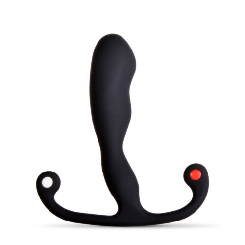

Note: By "Aneros" we will refer to any sex toy manufacturer that creates bio-feedback prostate massagers, Aneros is simply the most popular one.

A great webinar presented by Forrest Andrews, who used Aneros for a long time and later joined the company. Consider watching the "Prostate Massage 101 - The Ins and Outs of Prostate Play" webinar:

[](https://www.youtube.com/watch?v=xAWUvRrJHII)

Many people find it quite exhausting finding the Aneros toy that is suitable for each individual. It may even seem as their products are competing with themselves and makes it a lot harder to pick. Aneros price is not small and that makes it even more difficult to choose one. The best advice we can give here is to simply guess the right toy that might work for you. Luckily Aneros is not the only company that makes such toys. There are multiple companies that manufacture "Aneros-like" toys, they are knock offs and it is going to be a decision for each individual whether to support researchers that designed the toy and used high quality materials or just going with a copy. If you are interested in a cheaper alternative, search for sex toys called "Hunthold", "YOYOHOT" or "XCushio", you can even find more of these knock off brands by search for "Prostate massager", they will stand out quite well since they have this unique shape of tabs at the bottom.

Note: Many people find the original Aneros as too short to reach the top of the prostate so a knock off might be suitable more for them.

Aneros has a huge fan base and many communities exist that share techniques. We won't go over them since most of them rely on the same principles as regular prostate massage does. If you are interested in the techniques Aneros users share, you should look for "Super-o Aneros" and dig through various forums, yet the instructions that the sex toy provides when buying are also quite sufficient. Here we will hint at a video circulating around the web that can be found by searching for "Multiple Male Prostate Orgasms (MMO) Aneros Helix Syn", this video shows a 48 minute session of a male using Aneros with some comments during the session. This video shows very nicely how almost static seems the experience from the outside and you cannot see a lot of movement, but if you pay close attention you can notice how the male contract his PC muscle many times during the session. This video also shows another fact about such prostate play - it is very, very long, you need to assign a lot of free time and a lot of relaxation for reaching an orgasm. 

Note: You can use Aneros-type toys while having regular sex, you can experience an anal orgasm during the stimulation since the sex toy will stimulate your prostate during involuntary muscle contractions what you get during ejaculation.

One of the most common complaints about Aneros is that it does not seem to work. The problem is that many people have very high expectations from the sex toy and they tend to forget how the user needs to practice a lot to reach a hands-free orgasm that the Aneros proclaims to be able to provide. The best approach is to not have any expectations and rather just enjoy the moment.

# Stretching

There is not a lot of evidence that would show long-term effects on using large sex toys for stretching your anus, rectum or colon. Some people even report that while they stay under the largest "natural" bowel movement size, which is less than 5.7cm in diameter, then you can even experience stronger anal sphincter muscles, this is a similar effect of yoga since it stretches your muscles past the regular movement and makes your muscles more resilient. You can also go past that diameter and still not experience any long-term effects as long as you are creating a gentle stretch, but be warned that this is based on anecdotal reports since there simply is not enough research done for such a question. If you practice anal play in a slow manner, then you should not experience a lot of change in the external appearance of the anus either.

There are some stretches that can create a permanent change to your rectum, but this is relevant for more extreme types of anal play such as fisting and intentional prolapse play. Such extreme stretches can stretch an internal tissue that anchors the colon and rectum to the walls of abdomen (mesentery tissues) and eventually can create unintentional rectal prolapse. Some people like to create an intentional prolapse and usually the prolapse retracts inside as soon as the person stops pushing, but over time it is possible that the mesentery tissues get stretched and the intentional prolapse turns into an unintentional prolapse.

Note: The correct way to think about anal stretching is not as a goal driven activity, but rather a muscle relaxation activity. Think of anal stretching as anal yoga, you learn to control your muscles and relax them on demand.

During the guide we on purpose avoided the common "bear-down" method where you add strain to your rectum to insert a larger toy. This method is not recommended and should only be used for those that are highly experienced and understand that frequent strain on your anal muscles can result in permanent damage. This method relies on you to exhale and push your rectum so it adjusts to defecate larger stools, but rather than removing the stool, you force a sex toy inside, this can help you an additional amount of stretch, but this is also very dangerous as it can create muscle tear. 

It is always very tempting to push your limits and during high arousal you tend to ignore rational thinking, in many cases you will start to think that you can get the large sex toy in and all you need to to is push a little harder, but this is dangerous and such approach should be thrown out to prevent yourself from injuring. The recommend way of stretching your anal sphincters is by using sex toys with incremental size. There is no golden number for everyone, but consider the following path to stretching your anal sphincters:

- Beginners start with sex toys that are 2.0cm in diameter
- Play with the same size for multiple weeks until you can insert the sex toy with almost no force and discomfort
- Increase the diameter of your next sex toy by no more than 3mm, in our case look for a sex toy that is 2.3cm in diameter
- Play with the same size until you can feel no discomfort
- Increase the diameter again by no more than 3mm
- Repeat the process until you can feel the sex toy cannot be inserted because your pelvic bone does not allow it

There is always the question of how often should you do anal stretching and the answer is inconclusive, yet there are guidelines you should stay on. In general, stretching your anal sphincters are going to cause small micro-tears in your anal tissues and you will not even be able to see blood since those micro-tears are too small to notice, but they are going to limit your stretching abilities. When doing anal play, you can do it multiple times a week (you might have some concerns about the health of your colon because of frequent enemas) and as long as you have a good diet and don't push yourself, then a simple anal play without stretching your anal sphincters too much (being able to take a sex toy or penis with no effort) should not cause any issues. When you are trying to reach new limits, then doing anal stretching multiple times a week is not going to be a good idea, you need to let your tissues to heal and a week seems to be a decent period of time for most people, but you should always look for signals from your body. If you sense a burning feeling or general discomfort that was not there before your previous anal stretching session, then it is possible that you need to wait more to let your tissues to heal. Remember that anal stretching is quite brutal even when done very slowly.

You will end up with a lot of sex toys, but you will most likely stop using the smaller sex toys with time, but you cannot skip the smaller sizes at the beginning. You will most likely stop using sex toys that are smaller than 4.0cm in diameter with time or maybe even larger. Another approach is to get an inflatable dildo (not an inflatable butt plug), but you must be careful not to inflate it while it is inside you, it should not be used as a speculum, it should be used as a dildo that can change the size over the weeks. It is quite easy to injure yourself if you inflate the dildo (or butt plug) while it is inserted.

There is no specific way to stretch your anal sphincters to accommodate large sex toys, but here we will describe a few routines you can use to reach new limits. These are not going to be beginner friendly and beginners should stay with the small gradual width increase over multiple month period, but for more advanced people we can describe a routine for various goals. Below you can find these routines.

Note: When trying to reach new limits, your pose can make a huge difference and it becomes very obvious when doing more extreme anal play such as fisting. Each person is different, most people will be able to take larger objects in a [squat pose](pose_squat.jpg) or a more comfortable pose such as [cowgirl pose](pose_cowgirl.jpg) (by sitting down on the sex toy), some will prefer [doggy style pose](pose_doggy_style.jpg). Spreading or closing your legs can also make a difference, though most people will prefer spreading legs. Experiment with multiple poses and you should notice a difference in one pose over the others.

Gradual increase in width: This is a very straight forward method and it MUST be a part of your stretching routine, you should be a bit experienced to start increasing the width. Start with a warmup and move to playing with a dildo that you can comfortably insert, start with the smallest dildo you have, play with it for a few minutes and move to the next dildo, that is larger than the previous. You can make larger jumps than 3mm in size, but you should only do that if that is not your largest size you ever were able to insert and avoid making jumps larger than 1.0cm in diameter, be reasonable and if you feel discomfort, then reduce the size and play with a smaller size until you feel comfortable. When coming near your known previous limit, start increasing the width no more than 3mm in diameter. Insert your current last known widest sex toy and hold it in for a few minutes, then start slow thrusts for a few minutes, then hold in the sex toy for a few minutes, then start thrusting, repeat the process multiple times until you feel comfortable with the current width. Increase the width, try to insert the sex toy without using too much force and without creating strain to your anal muscles, consider changing poses to find an easier entry. Repeat the hold-thrust process until you feel comfortable with the new width. Even this gradual increase in width is going to cause small micro-tears and is going to cause discomfort at your next session, it is recommended that you use this method no more than once a week and repeat your sessions for at least 1 month before moving to larger size.

The DP with sex toys: Doing anal double penetration (or DP) is a fantasy for many people and it can be done with practice. You will need two dildos, one larger and one smaller, or they can be both the same size. The method is quite simple, you start with the smaller dildo and play with it until you can insert it without any discomfort or effort (5-10 minutes). Then you replace the smaller dildo with a larger dildo, play with the dildo until until you can insert it without any discomfort or effort (5-10 minutes). Replace the larger dildo with the smaller one again and this time use circular motions with the dildo while it is inserted, use the dildo to spread your muscles more open by thrusting the dildo from unusual angles so your anal sphincters get stretched more (5-10 minutes). Replace the smaller dildo with the larger dildo and repeat the circular motions and thrusts at an unusual angle to stretch the anal sphincters (5-10 minutes). When feeling comfortable, insert the larger dildo and slide a single finger on the side of the dildo, consider sliding your finger on the side that is closest to your tailbone. Circle your finger around the dildo and repeat the motion until you can easily slide the finger around. Repeat the procedure using 2 or 3 fingers, start by inserting at one side, circle around the dildo and insert next finger, then repeat. When feeling comfortable with multiple fingers along the larger dildo, remove your fingers and slide the dildo deeper then reapply lube on the smaller dildo. Slide the smaller dildo on the side that is closest to your tailbone, allow both the dildos sit in your rectum for a while and steadily start making thrusting motions. You should repeat this method no more than once a week for up 3-6 months (after you can move to more advanced stretching methods).

Note: When stretching your anal sphincters and rectum, large sex toys will create pressure on the parasympathetic nerve system that controls bodily functions when a person is at rest. For many inexperienced people this sensation creates a reflex to "push out", but you must learn to resist this urge and allow the sex toy to simply sit in your rectum. If you feel that the sensation is unbearable, then remove the sex toy, try to relax and return to try again after a few minutes.

The DP with penises: It is possible to receive a double penetration (DP) in anal with penises. Start by having anal sex with each penis for about 5-10 minutes. Lay the man with the largest penis on a bed or similar furniture so his legs are over the edge, then insert the penis into your anus as deep as you can while sitting on the layed down man. Lean yourself down so both of your chests are touching, then allow the second man insert his penis on the top side of your anus (closest to the tailbone). You might find it awkward and some people are not able to position themselves so they can receive a DP, the layed down man will find it complicated to make thrusts, so adjust angles, speeds and depths to find whatever works for you. This is a more advanced type of stretching since you have a lot less control over the thrusts and it is more likely to create micro-tears. You should repeat this method no more than once a week.

Increasing width and depth: To reach even further, you will need sex toys of various sizes, but do make sure you are not trying to reach width that is more than 3mm larger than your previous largest width. Consider training for "The DP with sex toys" first and use the added fingers method to increase the width gradually. When you feel that you have trained enough, then consider starting your stretching routine with a dildo that is about 4cm in diameter and at least 20cm in length, play with this dildo until you can comfortably insert at full length and make thrusts without feeling irritation. When inserted at full length, hold the dildo inside for a few minutes and continue thrusts, then hold the dildo inside fully inserted for a few minutes then start thrusting again, repeat the process for multiple times. Increase the width to something above 5.0cm in diameter and at a similar length, play with the dildo until you can comfortably insert it at full length, repeat the process until you can comfortably insert the dildo at full length, repeat the hold-thrust process. Increasing the width at depth can take many months, train the width over many sessions, don't push it in a single session. Increase the width to 6.0cm in diameter, play with the dildo until you can comfortably insert it at full length, repeat the hold-thrust process. 

Increasing the width can be very sensual experience as there is an even spread around your rectum and anus, which makes you feel "full". So called "size queens" (people, who enjoy large sex toys or penises) enjoy this sensation. Each person is different and each person has its own limits. Anal sphincters can stretch very far, but it must be done properly and slowly, it takes years to reach sizes such as 6.0cm and up, but it is possible that you cannot stretch it further, sometimes your muscles simply are not capable of such of a stretch or you are limited by the size of your pelvic bone. Sadly limits are going to exist and you need to accept them as they are. Some people like to explore other options when they reach their maximum width and try to reach the maximum depth.

You can stretch the depth of your rectum and colon, this is called depth training. You can reach incredible depths, there are even videos of people capable of inserting their arm in to the anus up to their armpits, this is possible due to the anatomy of the colon since it is quite straight after you have straightened your rectosigmoid junction. If you needed years to reach very large widths of sex toys, then it takes double of that to reach large depths since the colon is a lot more delicate than your anus and it is much easier to injure yourself than with width training. For depth training you are going to need special sex toys, sometimes called "anal probes" or "depth probes", they are very soft and long snake-like sex toys without much texture to not irritate your colon. One example of such sex toys is "SquarePeg Toys Depth Probe" ([example](stretching_probe.jpg)). Stretching your colon must be done very slowly, the general idea is to slowly slide the probe in and let it sit inside for a few minutes and then you can make very slow and gentle strokes. You are not going to be able to insert the depth probe at the same speed at all depths (you cannot insert it with a single thrust), you need to do it slowly and even pulling it back to try again on the next thrust, this means you cannot do fast and deep thrusts in your colon, they must be small and gradually increasing the depth. During depth play you need to pay special attention to relaxing your colon, this takes years of practice, the general idea is not to strain the muscles, don't try to push anything out, relax your muscles and allow the rectosigmoid junction to straighten out. In depth training the pose is very important, we went through multiple chapters of anatomy to understand the curvature of the rectum and colon, you should use this information to find the most suitable pose, the general idea is to make your colon and rectum as straight as possible, [squat pose](pose_squat.jpg) is one of those poses, another one mentioned before is to lean on to your left side that takes advantage of gravity to straighten out the rectosigmoid junction. You can switch between poses when doing depth training, some poses allow easier passage through the rectosigmoid junction and later other poses are better for getting deeper into the colon, consider switching poses, if you find it difficult to reach new depths. Remember, you need to take it very slowly, depth training is more of a process of guiding a sex toy through your colon rather than thrusting the sex toy inside and out.

Note: For most people the colon at the narrowest part is about 4.0cm wide (without depth training) and it is quite stretchable, but the pressure inside the colon is going to cause a very noticeable discomfort for beginners. Consider using a depth probe that is less than 4.0cm wide if you just started depth training.

**IMPORTANT:** If you feel sudden sharp pain, do NOT pull out the sex toy instantly, you will experience severe pain by not removing the sex toy slowly. Gently remove the sex toy and try to calm down as much as you can, during stress you are most likely going to cause the rectosigmoid junction to create an acute angle and makes it much harder to remove any objects from your colon.

# Fisting

Fisting is a very advanced form of anal sex that involves placing a whole fist inside the rectum (or vagina). It requires a lot of experience for both the giver and the receiver, but when done properly, it can give very intense stimulation due to the large pressure the fist creates. Male fists tend to be larger (average is about 7.0cm in diameter), female fists tend to be a bit smaller (average is about 5.5cm in diameter), but nevertheless both are very large objects, this does not prevent some very experienced people push their limits and take double fists, triple and even quadruple fists in the anus. Some people like to push the depth limits as well and are able to take a fist up to the arm pit. Fisting takes a lot of practice and skill, it takes years.

Anal sex does carry a risk of injury, but this risk increases dramatically when doing fisting. It is not because fisting itself is dangerous, we have discussed before that anal width play does not seem to have any evidence to cause long-term damage, but fisting tends to be quite brutal and that can damage surrounding organs. Slowly stretching the anal sphincters with a fist is going to be a very sensual experience, but in some cases the anal sex giver (fister) likes to go fast and intense (sometimes even preforming so called "punch fisting"), such fast and intense fisting is usually the cause of severe injury, the risk increase a lot more when fisting is done deeper than just the wrist. You need to be very delicate with the rectum's and colon's tissues, they are very fragile.

To train yourself for fisting, check out the [Stretching](#Stretching) chapter and only advance to fisting whenever you can easily insert sex toys without discomfort that are larger than 6.0cm or 7.0cm depending on what kind of fist you are intending to receive (female or male fist respectively). For warmup, you should use sex toys that are near the size of your fister's fist and when you feel ready, instruct your fister to use the finger to fisting method for warmup found in the [Warmup](#Warmup) chapter. Consider experimenting with various poses, try the [squat pose](pose_squat.jpg), try the [doggy style pose](pose_doggy_style.jpg) or try laying on your back. The fister should put his or her hand into a form that reassembles a "duck bill" ([example](fisting_duckbill.jpg)), this allows the easiest fist insertion, but the fister still ned to be patient and slowly insert the fist. For males, the pressure that a fist creates to the prostate is quite intense so it is best to slowly start making small thrusts with the fist. The fistee must resist pushing the fist out and the fister should keep the fist calm for a few minutes to let the fistee's body adjust to the fist. For the first few times you should not return to fisting for a couple weeks, later you can preform fisting up to once a week, but due to the brutality of fisting it is recommended to wait two weeks to make sure all your tissues have enough time to heal from micro-tears. Train for this type of fisting for 3 to 6 months to let your body to adapt to fisting.

**IMPORTANT**: If the fisting receiver (fistee) experienced pain, it is important NOT to pull the fist out immediately, rather slowly remove the fist and make sure the fistee is as relax as possible (even with pain and fear).

Note: It is possible to massage the prostate with the whole fist, but some people can find the stimulation too intense. It is best to ask to understand whether your partner enjoys the intense stimulation that the fister's fist brings.

When you are doing a solo session with sex toys, you can control all the thrusts, but when someone else is fisting you, then you don't have such control. Your fister must be able to read signals from your body and you as a fistee should consider exaggerating discomfort to let your partner know to stop whatever he or she is doing. If you have the same partner for a long time, then your partner will learn and remember movements that are allowed and those that are causing you pain, but with new partners this can be quite difficult to perfect. Consider remembering and writing down the fisting angles, poses, speeds and directions that worked for you the best.

When preforming fisting to someone else, pay attention to your fist's rotation, you might need to rotate your fist at a strange angle to find the easiest entry past the pelvic bone, but when you are past the entry, you should not immediately rotate the wrist, that is most likely going to cause discomfort to fistee. Allow the fist to sit in the rectum for a few minutes before proceeding to rotate the arm back to a comfortable place. The fister then can uncurl the hand from the "duck-bill" form and use the fingers to gently stretch the rectum and the internal anal sphincter. The fister must make sure that the fist is always in the middle of the rectum (or colon) and not pressing against the wall of rectum (or colon).

If you follow the guidelines in the [Stretching](#Stretching) chapter, you should be able to take large sex toys even past the rectosigmoid junction and with time you can try to fist past the rectosigmoid junction as well. This does take a lot of practice, it will take years to reach such a goal and it is very dangerous as it is very easy to create a severe injury. During fisting past your rectosigmoid junction, your internal organs even shift to accommodate the large fist inside your colon. The fister will have a small advantage over regular sex toys when reaching the rectosigmoid junction since the fister can twist and bend the arm to match the curvature of the colon. Usually the fister needs to rotate the whole arm gently in 180 degrees and bend it to point in the colon's direction, the fister has the advantage to gently stretch the rectosigmoid junction so it straightens out and allows further passage. With time it is possible to reach elbow deep fisting, but it must be done very slowly. You should not preform elbow deep fisting more than once a week and it can take years to stretch the colon to such extent to allow a whole fist inside it.

Note: It is very easy to cause injury during fisting and the most common cause is sharp finger nails. Consider using rubber gloves such as nitrile gloves for anal fisting, make sure they fit perfectly otherwise small folds of rubber will cause discomfort. Water based lubes are not very efficient for anal fisting, consider using silicone based lubes or even oil based lubes.

When you have mastered elbow deep fisting, the next step can be either double fisting or arm pit deep fisting. Just remember to take it very slow, porn is not a good place to learn how to fist.

# Random tips

Consider using flushable baby wipes to clean your partner whenever you wish

Jelqing (or stretching exercises to increase the length of a penis) can be very dangerous since when done forcefully you can burst the capillaries of the skin or you can even damage the veins of your penis that control the blood flow. The latter is very dangerous as it can lead to erectile disfunction (impotence) that cannot be corrected using surgery and it does not respond to drugs such as Viagra. Some penis lengthening traction devices are medically approved for reducing the curvature of a penis or restoring the lost length due to Peyronie’s disease ([source](https://www.ncbi.nlm.nih.gov/m/pubmed/30916626/)). Vacuum pumps are also not effective for increasing the length of the penis.

Don't be goal driven, you should not focus on achieving something, either it being an orgasm, width, length or whatever, you should only focus on having a good time. If you are going to be focused on a goal, you will most likely either not reach the orgasm or even injure yourself.

When laying on your side, you can arch your back backwards, this can make a very slight effect of parting the butt cheeks.

Rip the condom package at the corner, don't rip the package in the middle, you have a risk to break the condom by ripping the package through the center.

You can use a back massager as a vibrator when placed on a sex toy, though some back massagers can be very powerful and might even be irritating.