# 目录

- [目录](#目录)
- [引言](#引言)
- [简而言之](#简而言之)
- [进行肛交的理由](#进行肛交的理由)
- [安全须知](#安全须知)
- [解剖结构](#解剖结构)
  - [解剖结构（女性）](#解剖结构女性)
  - [解剖结构（男性）](#解剖结构男性)
  - [PC肌](#pc肌)
- [健康状况](#健康状况)
- [饮食调整](#饮食调整)
- [清洁准备](#清洁准备)
- [性欲](#性欲)
- [润滑剂](#润滑剂)
- [预热准备](#预热准备)
- [肛门按摩](#肛门按摩)
- [性玩具](#性玩具)
  - [肛塞](#肛塞)
  - [材料](#材料)
- [姿势](#姿势)
- [学会享受肛交](#学会享受肛交)
- [重新连接](#重新连接)
- [高潮](#高潮)
- [高潮（女性）](#高潮女性)
  - [方法](#方法)
  - [玩具](#玩具)
  - [前列腺按摩器](#前列腺按摩器)
- [其他肛交方法](#其他肛交方法)
  - [Aneros](#aneros)
- [训练](#训练)
  - [拉伸](#拉伸)
  - [深度](#深度)
  - [张开](#张开)
  - [拳交](#拳交)
- [随机提示](#随机提示)

# 引言

警告：本指南虽主要包含技术性信息，但可能也包含部分露骨内容。除非您已达到法定同意年龄（大多数国家为18岁或21岁），否则不得阅读本文档内容。

警告：本文档不构成医疗建议，您需自行承担使用其中信息所带来的风险。

肛交早已为人所知，其历史或许与人类有记载的历史一样悠久，但即便如此，外界仍存在大量错误信息。为防止此类错误信息进一步传播，本指南将为您提供有关肛交及其相关事项的详细信息，帮助您和伴侣获得愉悦的体验。

肛交看似简单，实则比常规性交复杂得多，需要掌握相当多的知识才能确保安全与愉悦。本指南将重点介绍男女双方的解剖结构、卫生、健康、准备工作、技巧、器具、建议等各方面内容，以确保您正确进行。初学者可能会想跳过某些章节，但我们强烈建议您通读全文，以全面理解肛交各个方面的细节。

肛交（以及性行为整体）这一领域有时缺乏科学证据，有时也难以得出理性结论，原因可能是证据不足，也可能是由于逻辑谬误所致。本指南虽会包含一些科学事实，但大量信息来源于个人经验报告——即人们分享自己使用各种方法的成功经历。然而，这些方法大多缺乏科学验证，且由于信息来源本身存在选择性偏差，因此难以保证其绝对真实性。本指南会尝试解释某些方法及其可能成立的原因，但读者需自行判断哪些内容值得相信。本指南应被视为一份经验报告汇编，读者可自行决定如何使用其中信息，以及是否承认其中可能存在的逻辑谬误。

# 简而言之

警告：本指南包含大量关键信息，可防止你对自己和他人造成伤害。强烈建议完整阅读本指南。

注意：如果你打算阅读完整指南，则建议跳过本章。本章省略了许多细节，跳过了大量可能的替代方式，仅提供一种最快但仍安全的肛交入门方法。

如果你不是那种喜欢阅读的人，只想直接开始，那么请注意：肛交并不简单。但如果你执意跳过关键信息，本章将提供最低限度的必要内容。请务必注意，如果你打算跳过所有其他章节，至少不要跳过本章。以下内容将默认你是接受肛交的一方（被插入者）。

**步骤:**

1) 从触摸开始：并非每个人都喜欢肛交，但很多人可以学着去享受它。在淋浴时触摸肛门数日。轻轻按压肛门以熟悉这种感觉。用手指在肛门周围摩擦，但先不要将手指插入肛门。<u>原则：习惯于有东西触碰臀部的感觉</u>。
*注意：灌肠或冲洗不适合此阶段。在淋浴时进行，可以洗掉任何粪便。目前请避免灌肠或冲洗。*

2) 购买合适的润滑剂：润滑剂是必需品，不要用肥皂，不要用唾液，你需要润滑剂，否则你很可能会受伤且根本感受不到任何快感。关于润滑剂有很多变量，但为简单起见，只需购买一款体面的水基润滑剂。在你所在地区或网上查看评价，现在还不需要买最好的润滑剂，几乎任何水基润滑剂都可以。<u>原则：购买水基润滑剂，任何你能在可信赖商店买到的润滑剂目前都可以。</u>
*注意：如果你对买哪种润滑剂感到迷茫，可以考虑查看这张[图片](lube_ph.jpg)，看看那些标记为pH值5或6的润滑剂。*

3) 清洁，首次：先不要使用灌肠或冲洗。在进行肛交游戏前几天规划你的饮食。避免辛辣食物，避免垃圾食品，避免加工食品。在进行肛交游戏前几天吃富含纤维的膳食。在你计划进行肛交游戏当天，照常去厕所排空结肠。<u>原则：肛交游戏前几天保持良好饮食，去厕所排便，不要使用灌肠或冲洗。</u>

4) 插入一根（或两根）手指：在淋浴中触摸肛门几天后，你可以开始使用手指。在其中一根手指上涂抹足量润滑剂。开始将手指插入肛门，但不要用力推入。尝试只插入指尖，然后挤压肛门，使你能感觉到手指被轻微挤压。保持挤压几秒钟，然后放松肛门。一旦你放松肛门，你应该会注意到手指几乎是自己滑进去的。重复挤压过程，直到你的手指完全插入肛门。将手指在肛门内停留一会儿，然后尝试在内部移动手指，轻轻摆动，做小的抽插动作。尝试两根手指。<u>原则：习惯于有东西在肛门内的感觉。</u>

5) 购买一个好的假阳具：购买一个小尺寸的（顶端直径小于3厘米开始）假阳具，材质要好（硅胶、不锈钢、玻璃；在了解更多知识前避免购买其他材质）。肛门塞也可以使用，但建议从假阳具开始。仿真的假阳具可以，实心的也可以，带珠的也可以，形状并不重要，只要小就行。不要使用家用物品，受伤或感染的风险太高。<u>原则：购买一个体面的假阳具，要小的。</u>
*注意：硅胶假阳具通常是首选，尽管一开始你可能想使用不锈钢或玻璃假阳具。使用硬质性玩具有很多缺点，但硅胶性玩具用于肛门时往往会留下明显的气味。*

6) 用假阳具进行肛交游戏，首次：保持良好饮食，在进行肛交游戏前去厕所排空结肠，不要使用灌肠或冲洗。最好在淋浴时进行。在手指上涂抹润滑剂，慢慢将一根手指插入肛门，如果需要可使用挤压方法。摆动手指，将手指向两侧移动以轻轻拉伸肛门。涂抹润滑剂插入另一根手指并重复。考虑尝试三根手指，别忘了添加润滑剂。当你感觉准备好后，在假阳具上涂抹润滑剂并慢慢将其插入肛门，如果需要可使用挤压方法。现在不需要将假阳具插得很深，进去几厘米就够了。让假阳具在直肠内停留一会儿。尝试将假阳具向两侧移动，尝试做小的抽插动作。<u>原则：用手指热身肛门肌肉，使用润滑剂，慢慢将假阳具插入直肠并进展到做小的抽插动作。</u>
*注意：如果你是初学者，切勿尝试在不热身的情况下插入假阳具。使用手指和挤压方法为接纳更大的物体做好准备。*

7) 倾听你的身体：肛交**不**应该疼痛。它应该是愉悦的。如果你感到疼痛甚至不适，那意味着你的身体正试图向你发出信号，表明某些地方不对劲。倾听这些感觉，它们至关重要。每当你感到疼痛，就意味着停下来尝试别的方法。不要等待疼痛消失，否则你可能需要去医院。出血意味着立即停止，无需多问。暗色血液意味着你**立刻**需要看医生。<u>原则：疼痛意味着你做错了什么，停下来。</u>
*注意：网上充斥着糟糕的建议。你能找到的最坏建议之一是"你会习惯疼痛的"。避免此类建议，避免提倡这种鲁莽行为的人。*

8) 通过肛交刺激自己：照常，保持良好饮食，在进行肛交游戏前去厕所，不要使用灌肠或冲洗。最好在淋浴时进行。重复步骤7中描述的步骤，但在抽插假阳具时，你应该开始慢慢用传统方式（阴茎/阴蒂/阴道）刺激自己。如果可以，尝试达到高潮。重复几次，直到你开始发现肛交令人愉悦。肛交刺激不要过快或过猛，不要太深，它暂时还不会像传统自慰那样令人愉悦。<u>原则：将肛交游戏融入你的传统自慰方式中，保持轻柔。</u>
*注意：慢慢地融入肛交游戏非常重要。你需要训练你的身体将肛交游戏与快感联系起来，这需要时间和大量练习。不要急于求成。在你以更传统的方式达到高潮时，假阳具几乎不动也是可以的。*

9) 冲洗，或许：只有当你开始觉得肛交令人愉悦时，**可选择性**地在肛交游戏前使用水或弱盐水溶液清洁自己。此阶段**不要**进行灌肠。灌肠使用大量水，你需要找到一个非常小的冲洗器并使用非常少量的液体（不超过100毫升，是的，就那么少）。冲洗前，去厕所排空结肠。将冲洗器灌入不超过100毫升的液体。在冲洗器喷嘴上涂抹润滑剂并将其插入肛门。将冲洗器液体挤出一半，让液体在直肠内停留一会儿，可以考虑跳跃并轻轻摇晃身体。坐在马桶上，让所有液体排出。用冲洗器内剩余的液体重复上述步骤。大约30分钟后去厕所排出任何残留物。<u>原则：不要使用大量液体，挤出并排出。</u>
*注意：灌肠或使用超过100毫升液体不适合初学者。专注于更好的饮食而非更多液体。大量液体会引起恶心，并将几分钟的冲洗过程变成长达数小时的不适过程。*

10) 更多的肛交：此时，你应该能够热身肛门肌肉并将肛交游戏融入你的常规自慰环节中。在你的肛交游戏过程中，你可能仍然有想上厕所的冲动。这是一种自然反射，会随着练习而消失。继续在自慰时用假阳具练习，在接下来的每次过程中慢慢将更多注意力放在肛交游戏上。多次重复此过程，直到你不再有排出假阳具的冲动。<u>原则：更多的肛交，学会忽略排出的冲动。</u>
*注意：如果你担心会弄脏，可以考虑在身下垫一条毛巾。肛交可能会弄得一团糟，习惯它。*

11) 与伴侣的肛交：只有现在你准备好了。是否使用冲洗器，由你决定。照常热身你的肛门肌肉，使用你的手指和你的假阳具，不要跳过热身。始终使用润滑剂。指导你的伴侣缓慢开始，并指导你的伴侣找到完美的速度、深度和姿势，直到你感到舒适。在被插入时结合阴茎/阴蒂刺激，以帮助你发现肛交更令人愉悦。不要去想可能会弄得一团糟。<u>原则：热身，**热身**，缓慢而轻柔，享受自己。</u>

**警告：** 切勿在同一次性爱过程中从肛交切换到阴道性交。这有非常高的引起感染的风险。你可以从阴道性交切换到肛交，但反之则不行。

*提示：* 肛交后（给予方和接受方）排尿以最小化感染风险。

**常见问题**:

1. 我把假阳具插入肛门后开始快速抽插，但毫无反应，为什么？
\- 肛交不能采用男性自慰的方式。那种方法根本行不通。
2. 但肛交高潮在哪里？
\- 要通过肛交达到高潮需要你阅读对应章节
3. 接下来该怎么做？
\- 探索！尝试不同类型的性玩具，试试更大尺寸的性玩具，但你真的应该阅读完整指南
4. 为什么没有关于放松的步骤？
\- 有的，多个步骤都涉及放松，本章给出的建议比单纯说"放松"更具体
5. 我听说肛塞对肛交很有帮助，是真的吗？
\- 肛塞可以是肛交前很好的准备工具，不过假阳具会更适合实际插入
6. 我什么都试过了还是觉得肛交不愉悦，为什么？
\- 尝试在开始肛交前大幅提升性兴奋度，但这也可能意味着肛交确实不适合你
7. 我看到粪便了，应该停止吗？
\- 用纸巾擦干净就好，肛交就是会有点混乱，接受这个事实

# 进行肛交的理由

对许多人来说可能很难理解为何要进行肛交。根据2014年的一项[研究](https://www.ncbi.nlm.nih.gov/pmc/articles/PMC4379393/)，女性进行肛交的原因多样，包括避免阴道性交（经期、怀孕）、取悦伴侣、自身快感需求、性工作、药物影响以及不知可以拒绝肛交。虽然其中某些原因我们不应讨论，但其他原因对女性相当有益，特别是获取快感和避免阴道性交。

虽然尚未有广泛研究专门调查通过肛交达到高潮的成功率（美国国家性健康与行为调查参与者数量不足），但确实存在相当数量的个人报告称能通过肛交达到高潮。这项调查的结果在一篇文章中被综述，显示进行肛交的女性达到高潮的频率远高于其他任何性行为方式，你可以在[此处](https://metro.co.uk/2015/08/25/this-is-the-best-way-to-give-a-woman-an-orgasm-apparently-5359272/)阅读更多相关信息。

有篇文章试图阐释进行肛交的女性为何更可能达到各类高潮，你可以在[这里](https://slate.com/technology/2010/10/why-do-women-who-have-anal-sex-get-more-orgasms.amp)阅读该文。

另一篇文章描述了肛交高潮与阴道高潮期间盆底肌收缩（这块肌肉包裹着连接生殖器的神经）的相似性，你可通过[此链接](https://lioness.io/blogs/sex-guides/anal-orgasms-vs-vaginal-orgasms-double-penetration)查看该文。

你很可能会遇到完全反对肛交的人，其中许多人可能自我批判且缺乏正念，这将成为男女双方达到高潮的障碍。但你需要记住，性行为是双方（或多方）的共同协议且需要彼此同意。如果你成功说服伴侣尝试，只要他们能摒弃无益的念头，（在操作得当的情况下）将有许多有趣的感官体验等待着你们。

通过本指南，我们将探索肛交过程中与肛交相关的器官所具有的一些非常有趣的特征，并尝试解释为何肛交可能带来更强烈的高潮体验。

# 安全须知

尽管关于肛交存在大量错误信息，但最具破坏性的谬论都与肛交安全相关。本章旨在澄清这些错误信息，让你能安全地进行肛交。以下是一些至关重要的安全信息。

肛交```不```应该疼痛：出于某些原因，网络鼓吹肛交可以有点疼痛且你会逐渐适应，但这是```错误```的，肛交过程中```不```应该感到任何疼痛。在后续章节中你将了解到直肠及其他肛交相关部位有多么脆弱。疼痛永远意味着出现问题需要停止。若感到尖锐剧痛，这表示你需要立即停止，不容迟疑。肛交如果操作不当可能很危险，因此必须确保倾听身体的信号。直肠与结肠神经末梢较少，这意味着受伤时可能不易感到疼痛。

少量出血```不```正常：网络上另一种奇怪的说法是存在"肛门处女膜"，且前几次出血是正常的——但从解剖学角度看这也是极其危险且错误的。不存在"肛门处女膜"，肛交过程中任何出血量都不可接受。由于直肠和结肠非常脆弱，极易损伤其组织构成，因此出血直接表明你已受伤（即使未感疼痛，因为这些区域神经末梢稀少）。红色意味着停止，不容犹豫。根据出血量和血液颜色，甚至可能需要立即就医。

不适感```不```正常：若感到不适，这是另一个异常信号。肛交应带来愉悦，不适感表明你的姿势、角度、润滑、预热、材质、放松程度或其他环节存在问题。肛交中最常见的抱怨之一是想排便的冲动，但即使这种冲动也不该出现，这意味着你需要重新评估准备工作。不适感是身体发出的另一个需要立即停止的信号。常见谬论认为不适感会随时间消失，但这也不应依赖，最好从一开始就通过充分准备消除不适感。

强迫推进```不```可取：使用各种玩具进行肛交时，容易试图用力将玩具推入体内，这非常危险。对多数人而言，肛门是限制可插入玩具/阴茎尺寸的肌肉（对更有经验者限制部位可能是直肠甚至结肠），但必须记住肛门是肌肉组织，极易因肌肉撕裂而受损。肛交应被视为"肛门瑜伽"，重点是学会放松肌肉而非强迫它们。请将举重心态留在健身房，勿带入肛交中。这也适用于阴茎（甚至手指）肛交，阴茎应以极小阻力滑入，否则就是操作有误。

唾液```不可```替代润滑剂：直肠不会像阴道那样分泌天然润滑液，事实上肛门与直肠本身非常干燥，完全不适合肛交。实际上，唾液含有能分解油脂的酶，这意味着唾液会使该区域更干燥（例如频繁舔唇会导致嘴唇更干裂）。切勿省略润滑步骤，你需要大量润滑剂，甚至需要定期补充。缺乏润滑会增加直肠乃至结肠微撕裂的风险，更不必说对你和伴侣造成的不适。使用润滑剂也能让肛交体验更愉悦。

```禁止```从肛门转换到阴道：直肠具有适合排便的特定微生物群与各种细菌，阴道极易被直肠细菌感染。为预防感染，最好完全避免从肛门转换到阴道（可从阴道转换到肛门，反之则不可）。有些人甚至会在肛交时遮盖阴道以最大限度降低风险。同样也不建议从肛门转换到口交（肛对口）。

```禁止```将无防脱底座（或系绳）的玩具插入肛门：许多人发现将圆形球体等物品完全插入直肠很刺激，但这非常危险。直肠可能产生真空效应而将玩具完全"吸入"，由于你很可能会放松肛门相关肌肉，此时很可能形成通向直肠的笔直路径。随后玩具可能滑得更深，越过直肠乙状结肠交界处——该部位很可能已充分伸直使玩具轻易进入结肠。当你停止放松肛门相关肌肉时，直肠乙状结肠交界处会重新形成锐角，导致玩具完全卡在体内，此时你```必须```立即就医。最佳做法是始终使用带防脱底座的玩具以防止玩具完全滑入。若发生此类意外，请保持镇静，因为紧张会导致肌肉收缩。注意，玩具可能在数秒内消失。

```禁止```使用随机物品作为性玩具：直肠与结肠非常脆弱，随机家用物品可能带有手指无法察觉的锋利边缘。物品材质也可能不适合肛交，可能导致感染等并发症。若必须使用家用物品作为性玩具，至少应考虑佩戴安全套以降低受伤风险。

```禁止```使用麻醉剂或止痛药：许多人认为可以通过麻醉剂（如具有麻醉效果的润滑剂）消除不适感，但这很危险，因为这会阻止身体发出异常信号。肛交过程中必须始终倾听身体的信号，麻醉剂和止痛药会让你在伤势发展为急症前无法感知损伤。使用麻醉产品来"加速"肛交过程可能很诱人，但风险不值得承担，实际上这会降低整体快感。

```禁止```将药物与肛交结合：药物种类繁多且作用各异，虽然某些药物能增强感官敏感性（有些人报告肛交时产生特殊感受），但有些药物会降低各种感官敏感度（包括酒精），这会产生类似麻醉剂和止痛药的风险。某些药物甚至产生反效果——非但不能放松肌肉，例如酒精反而可能收紧肛交相关肌肉。有人宣称酒精是肛交良药，但请记住酒精具有镇静作用会降低痛觉敏感性，这很危险。使用药物的另一影响是扭曲理性思维过程，可能导致危险决策，例如突然产生实现极端性幻想的冲动。肛交场景中非常流行的药物"poppers"（亚硝酸酯）具有放松肛门括约肌的效果，但因有导致视力丧失或心脏问题的报告而被视为高危药物。出于显而易见的原因，任何药物都不推荐用于肛交，为了自身安全最好完全不用药物享受肛交，它们不值得冒险。

```禁止```向直肠灌注随机液体：出于某些原因，有人决定通过灌肠将酒精注入直肠，这是极其危险的想法且可能导致死亡（[来源](https://www.healthline.com/health/alcohol/alcohol-enema#risks)）。当酒精灌入直肠时，会快速被身体吸收导致"醉酒"，问题在于人们常低估酒精的吸收效率。或许通过灌注极少量且经水稀释的酒精能相对安全，但为自身安全考虑，通常不建议灌注任何非水液体。

```禁止```缺乏耐心：请谨记保持耐心，充分预热并在增大尺寸时谨慎操作。循序渐进至关重要，操之过急只会让情况恶化。

与阴道性交类似，肛交也会传播性病，因此若对伴侣状况不确定，强烈建议使用安全套。另需注意的是，直肠内含有各种细菌的微生物群可能感染阴茎，所以无论如何最好在肛交时使用安全套。

遗憾的是，肛交安全是许多人未予足够重视的话题，导致许多人受伤，有些甚至最终住院。因性活动就医的尴尬可能让你认为是不就医的好理由，但请记住剧痛和出血可能意味着内脏损伤，这在多数情况下是致命的。结肠内的异物极易因身体活动导致内脏损伤。必要时切勿忽视就医需求。

**重要提示**："何时需要就医"的分类标准较为模糊，且如本指南开篇所述，本文并非医疗文件，因此请勿过度依赖建议，但仍需将其纳入考量。一如既往，采取（或不采取）任何行动的风险均由您自行承担。

考虑在肛交过程中发现少量鲜血且出血已停止的情况：此时可能是直肠表层组织出现微小撕裂，很可能在一周或更长时间内自愈。请避免进行任何肛交至少一周，待伤口愈合后观察是否再次出血。若再次出血，需延长避免肛交的时间。建议更换性玩具、调整姿势、深度、润滑剂及其他变量，以防未来受伤。

考虑在肛交时感到剧痛但未发现出血的情况：剧痛表明需立即停止肛交，并确认是否出现出血（血液可能需要时间才会显现）。若未出血，很可能（但非绝对）意味着目前无需就医，但无法完全确定，建议咨询医生以确保未造成永久性器官损伤。

考虑在肛交时发现暗红色血液的情况（无论是否感到疼痛）：此时毫无疑问，您```必须```立即就医。无论损伤何处，这很可能是需要医疗干预的致命性损伤。

考虑性玩具无法取出的情况（被卡住）：首先保持镇静，避免突然动作。若插入物未发生旋转，可尝试采用蹲姿，像排便般轻柔推出玩具（```切勿```过度用力）。若物体仍卡住，则遗憾地需要立即就医（不可等到次日，因为睡眠期间可能损伤结肠）。

如您所见，许多情况下肛交可能导致送医。毫无疑问，肛交存在危险性，但只要采取足够安全措施，您和伴侣仍可享受其中。本章内容可能显得肛交风险过高，但请记住许多人都在进行肛交（有些人甚至只进行肛交或选择"仅限肛交的生活方式"），您只需稍加预防并掌握相关知识即可避免事故发生。请继续阅读以更好理解肛交相关器官的解剖结构及如何预防损伤。

# 解剖结构

虽然男女生理在许多方面颇为相似，但肛交相关器官的解剖结构存在显著差异。为更好理解这些差异，我们首先应审视其共同点。让我们先研究结肠以更深入理解肛交涉及的器官部位。请参考下图（[来源](https://www.cancer.gov/publications/dictionaries/cancer-terms/def/colon)）：

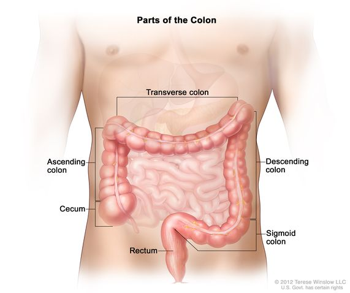

在肛交中我们主要关注以下部位：

- 肛门括约肌
- 直肠
- 乙状结肠
- 降结肠
- 横结肠

根据您的经验水平及参与的肛交类型，您将与结肠的这些部位产生交互（按此特定顺序）。大多数人主要与直肠和乙状结肠交互，结肠其他部位仅适用于经验丰富者。个体差异显著，结肠各部位的尺寸与特征各不相同，但理解结肠各部位的可能维度对预防损伤至关重要。请参考下图（[来源](https://www.dynalook.com/14th-international-ls-dyna-conference/simulation/looping-formation-during-colonoscopy-a-simulation)）：

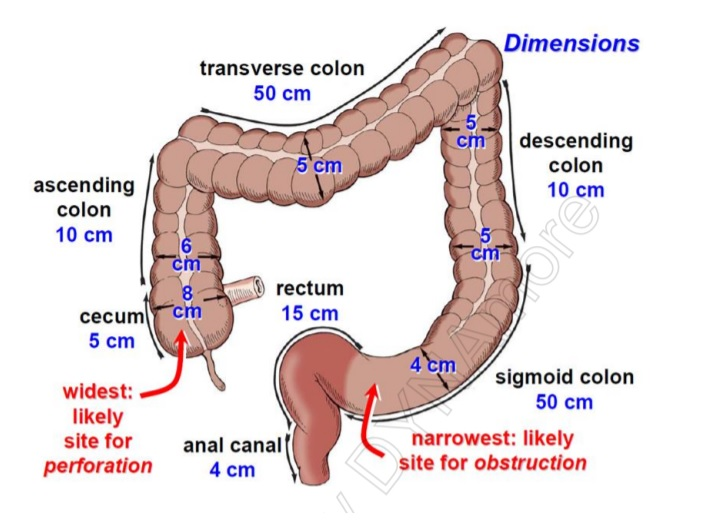

从图中可见直肠平均长度为4+15厘米（包含弯曲段）。这非常重要，因为平均阴茎长度接近直肠总长，但有些阴茎更长可能超过直肠长度——这可能造成问题，因为存在以此方式损伤人体的可能性。有人报告称通过多年使用各种性玩具增加了直肠长度，从而能使用更长的玩具或阴茎，不过此类报告基于个体经验。

结肠（及直肠）非常重要的组成部分是其构成组织。肛交最常见的损伤与结肠组织的穿刺或挫伤相关。常见损伤的原因是这些组织并非为承受外力而设计，其强度仅够处理排便需求，而非外来物体。请参考下图（[来源](https://medivisuals1.com/a-section-of-the-wall-of-the-colon-505138-01xg.aspx)）：


这是"结肠壁"（胃肠壁）的简图，这些是构成您结肠的组织。这些组织看似厚实，实则非常脆弱且易受损。黏膜是最表层，含有防止结肠干燥的凝胶状物质。"黏膜肌层"是薄层肌肉组织。其下方是包含血管和淋巴结的黏膜下层（[来源](https://www.kenhub.com/en/library/anatomy/the-colon)）。此图应让您意识到损伤结肠组织可能导致不同程度出血甚至需要立即就医的风险。请利用这些信息更好地理解自身极限，因为自我损伤相当容易。

注意：您必须假设肛交过程中结肠自身不产生润滑。润滑结肠的黏液仅足够输送粪便，远不足以防止肛交过程中的结肠挫伤。请务必添加更多润滑剂，这是```必需```的，唾液不是足够的润滑剂。

在直肠之前我们会遇到肛门。这是一组防止意外排便的肌肉群。这些肌肉也相当柔韧，可大幅拉伸且能承受广泛伸展——只要操作得当且缓慢。请参考下图（[来源](https://teachmeanatomy.info/abdomen/gi-tract/anal-canal/)）：

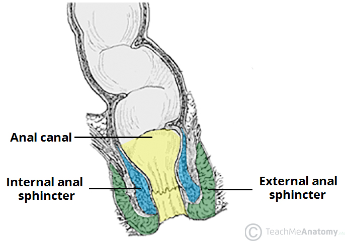

注意：肛门密集分布着神经末梢，极其敏感，甚至能感知最轻微的刺激。这对某些类型的肛交游戏非常有用，但若不谨慎也可能导致剧痛。

此处重点在于两块称为外括约肌和内括约肌的肌肉。它们可想象为环状肌肉，能放松或收缩，但两者存在显著差异。外括约肌是大多数人所谓的肛门，是您肉眼可见的"密封圈"，属于随意肌，这意味着您可随时控制它。内括约肌是位于外括约肌后方的肌肉（外括约肌甚至包裹着内括约肌），属于不随意肌，需要通过练习学习如何间接控制（[来源](https://teachmeanatomy.info/abdomen/gi-tract/anal-canal/)）。肛交疼痛最常见的抱怨很可能由其中一块肌肉引起，但更可能源于对内括约肌缺乏某种控制。虽然外括约肌可轻易打开，内括约肌则需要预热、练习和适当护理。如果您是初学者，这些肌肉应是关注重点，因为它们决定了"痛苦"与"愉悦"的差异，本指南后续将提供更多关于如何对待这些肌肉的细节。

在括约肌上方可见齿状线。这是解剖学的重要标志，因为此线之后组织结构发生变化（[来源](https://www.statpearls.com/ArticleLibrary/viewarticle/32348)）。此线上方可见肛柱——直肠壁上的垂直皱襞，您有时能感受到这些肛柱纹理的细微变化（[来源](https://www.imaios.com/en/e-Anatomy/Anatomical-Parts/anal-columns)）。在肛交中，此部位不扮演重要角色（尽管由于结构变化在解剖学上很重要），但此线可能具有纹理且标志着更脆弱组织的起始点。请参考下图（[来源](https://teachmeanatomy.info/abdomen/gi-tract/anal-canal/)）：

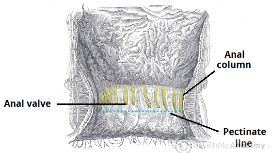

本指南后续将讨论痔疮，它值得在肛柱旁特别关注。痔疮是直肠内部或外部的静脉肿胀或扩大，可能导致疼痛和/或出血（[来源](https://my.clevelandclinic.org/health/diseases/15120-hemorrhoids)）。通常我们都有一定程度痔疮，但若引起不适则应避免肛交。理解痔疮可能的位置很重要，以便在出现问题时就医。请参考下图（[来源](https://doctorbutlers.com/resources/what-are-hemorrhoids/)）：

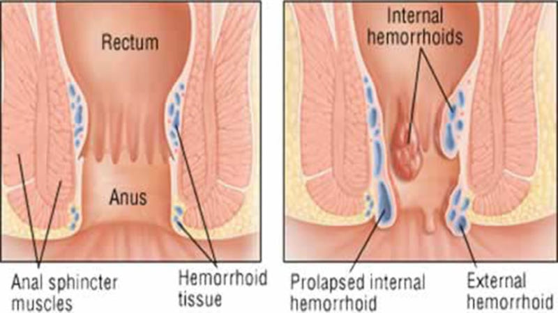

当内外括约肌都打开时，您将进入直肠。这是身体相当脆弱的部位，适用于结肠的预防措施同样适用于直肠，因为两者结构（几乎）相同。在将性玩具插入直肠前，我们会遇到肛直角，这是由称为"耻骨直肠肌"的肌肉形成的角度，该肌肉（某种程度上）包裹直肠形成弹弓状肌群，此肌肉创造的直肠角度称为"肛直角"。该肌肉在排便过程中与肛门内外括约肌协同工作（[来源](https://www.ncbi.nlm.nih.gov/books/NBK556078/)）。这意味着当身体接收到排便信号时该肌肉会放松。您可以通过脚尖内扣、双膝并拢来减小肛直角，这也能减少盆底肌的张力。请参考下图（[来源](https://gut.bmj.com/content/59/9/1288)）：

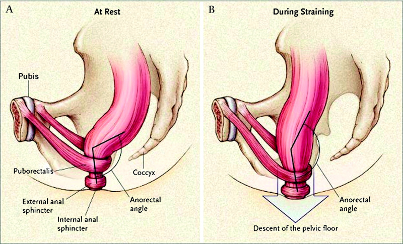

这个锐角会阻碍您无不适地插入各种物体进入直肠。该肌肉似乎对轻微压力（无需很大）有反应，只需保持压力直到感觉锐角减小，但还有其他方法也应纳入您的预热程序。直肠一个至关重要的特征是其折叠结构，肛交时```必须```考虑此点。请参考下图（[来源](https://oncohemakey.com/rectal-anatomy-clinical-perspective/)）：

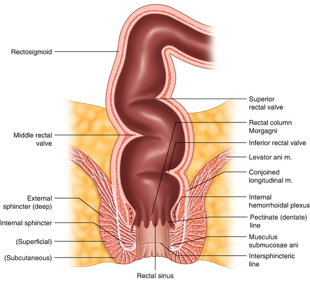

折叠结构由3个直肠瓣组成，形成看似微弯的路径，但实际上相当明显，忽略此特征可能导致不适甚至严重损伤。这些直肠瓣的功能似乎是支撑粪便重量，使其不立即到达肛门括约肌，从而避免立即产生便意（[来源](https://en.wikipedia.org/wiki/Transverse_folds_of_rectum)）。肛交过程中，由于直肠更多呈S形而非笔直，这些皱襞阻碍了直接进入直肠的路径。直肠壁相当柔韧，个体报告显示通过适当预热可将S形拉直许多。皱襞并非直肠唯一的弯曲，直肠本身更向背部倾斜，请参考下图（[来源](https://cdn.citl.illinois.edu/courses/CHLH206/ch3_4_anatomy_lecture/web_data/file17.htm)）：

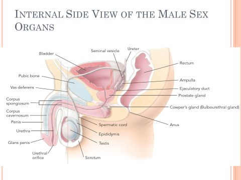

尽管这是男性解剖图，但女性直肠所在部位的解剖结构并无差异（生殖器官不同）。站立时，直肠与肛门形成较大角度，这意味着站立姿势肛交的插入角度不能与肛门角度相同（其他姿势容错率更高），这是您必须考虑的因素，因为插入可能危险，您必须理解每个姿势下直肠的角度。这也意味着笔直的性玩具并非最适合肛交，略带弯曲的玩具更为合适。下图展示了阴茎或性玩具的角度以减少插入时的不适：

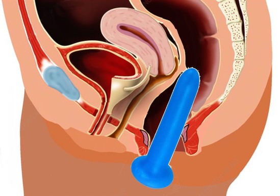

应有专门章节讨论适合肛交的姿势，但此处应让您基本理解直肠的形状——这对预防损伤至关重要。与直肠相连的是乙状结肠，但在此之前我们会遇到解剖学中称为直肠乙状结肠交界处的特殊标志。这个区域被许多人称为"弯道"，因为此处的结肠弯曲角度非常尖锐。当使用较长玩具或较长阴茎进行肛交时，很可能到达直肠乙状结肠交界处，由于角度尖锐可能导致不适甚至损伤。结肠的朝向在两个方向上成角，确切角度对初学者可能不那么重要，但对于想练习深度肛交者方向变得非常重要，不过了解大致方向仍有裨益。请参考下图（[来源](http://www.endoscopy-colon-explorer.com/colon-3d-2/)）：
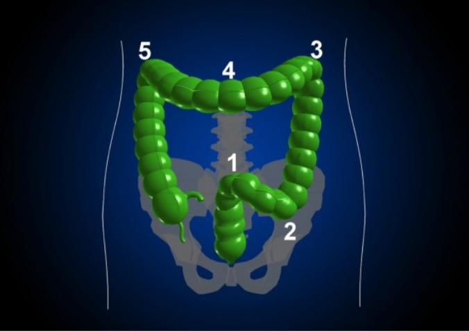

静息状态下，直肠的弯曲朝向您的背部，随后在直肠乙状结肠交界处形成锐角，使乙状结肠弯向腹部肌肉（胃部），继而转向身体左侧。

静息状态下，直肠具有非常尖锐的肛直角，但您的结肠在直肠乙状结肠交界处也形成锐角，这适合保持粪便在结肠内，使您不会持续产生便意。当您给身体发出排便信号时，肛直角不再尖锐，直肠变得相当平直，您的结肠也会伸直——这种同步动作适合排出结肠内的粪便。肛交的目标通常包括学会放松耻骨直肠肌和结肠，```而无需```使用药物或强迫手段。网络上传播着极其危险的错误信息，声称应使用各种物体甚至拳头强迫肌肉后推，并建议使用"poppers"等药物辅助——这些都是可能造成严重内脏损伤的极坏建议。耻骨直肠肌不会因更多外力而放松，结肠也不会因外力而松弛；当这些肌肉受压迫时实际会产生反效果。除了练习，没有其他安全方法能减小肛直角和直肠乙状结肠交界处的锐度。幸运的是，有些姿势可以帮助拉直直肠乙状结肠交界处，其中最受欢迎的姿势之一是蹲姿，它能自然放松耻骨直肠肌和结肠本身（[来源](https://www.researchgate.net/figure/Puborectalis-muscle-in-the-sitting-and-squatting-postures-sources-and-Natures_fig3_277276701)）。请参考下图（[来源](https://medicalxpress.com/news/2016-08-toilet-squatting.html)）：

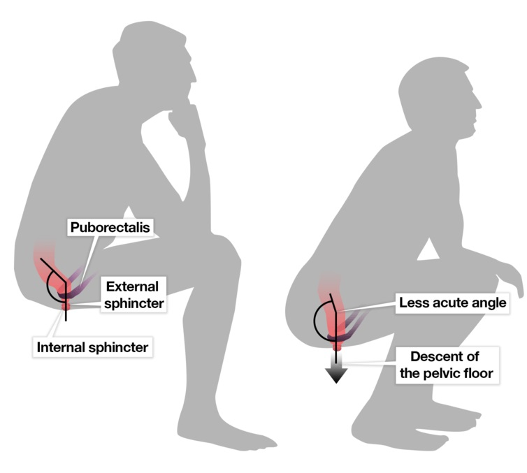

虽然我们提到不应使用大力放松耻骨直肠肌，但可以使用轻微力量。后续我们将介绍一种简单的肛门预热方法，涉及收缩和放松肌肉，在放松过程中我们将体会到拉伸肛门括约肌和减小肛直角所需的力量是多么微小。拉伸耻骨直肠肌所需的力量很小，使用伴侣阴茎的正常插入就足以拉伸它，并为直肠的性高潮相关部位提供更多刺激空间。请参考下图（[来源](https://www.researchgate.net/figure/Anorectal-examination-Note-Reprinted-from-GastroClinics-vol-383-Bouras-eP-Tangalos_fig2_279170248)）：

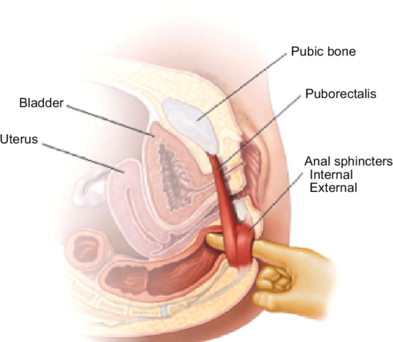

随着时间的推移，您可以学会放松耻骨直肠肌和结肠（使用各种技巧），这会提高肛交的整体舒适度。当通过直肠乙状结肠交界处后，直肠变为乙状结肠——这是经验丰富者用于深度肛交的区域。乙状结肠相当狭窄，对大多数人而言宽度约4厘米（[来源](https://www.dynalook.com/14th-international-ls-dyna-conference/simulation/looping-formation-during-colonoscopy-a-simulation)），但它相当柔韧，可随时间推移被拉伸。拉伸结肠部位（包括乙状结肠）相当危险，因为结肠几乎没有神经末梢，但您能感受到膨胀感（[来源](https://www.blairlewismd.com/services/colonoscopy)）。这意味着您不会在结肠中感受到疼痛、触觉或温度变化，最初可能无法感知致命损伤。结肠壁比直肠壁更为脆弱，因此深度肛交必须极其谨慎。

在乙状结肠与降结肠之间，您会遇到一个轻微弯曲。通常人们在深度肛交中甚至不会注意到它，但有时他们会注意到结肠的狭窄部分，有时甚至用手在腹部辅助移动肛探（性玩具），引导肛探通过结肠。降结肠与横结肠之间有一个更尖锐的弯曲，这通常是经验最丰富者试图到达的区域，需要大量练习。

本章涵盖了男女生理共有的解剖学基础知识，但相似性到此为止。在后续章节中，我们将从解剖学角度审视不同性别的差异。

## 解剖结构（女性）

男女之间最显著的差异在于生殖器官区域，但这些差异也给直肠解剖结构带来一些变化。请参考下图（[来源](https://www.magonlinelibrary.com/doi/abs/10.12968/bjon.2018.27.22.1306)）：

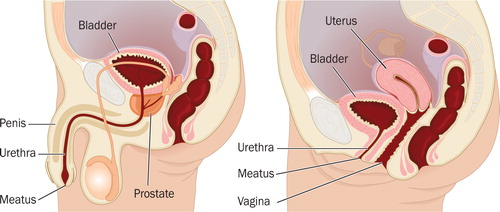

从这些图中可以比较出直肠附近器官位置的细微差异。女性似乎有子宫位于膀胱和直肠之间。这可能解释了为何肛交对女性而言是愉悦的，因为此图可能暗示通过子宫对阴道产生刺激，尽管这可能不完全准确。女性解剖的一个重要方面是膀胱并非紧邻直肠。通过直肠刺激膀胱并不是许多人似乎喜欢的感受，因为它会产生尿意。幸运的是，女性的膀胱距离直肠相当远，但这并不意味着可以忽略直肠的曲度，过于强烈的刺激也可能不受欢迎。

另一个差异在于骨盆。女性的髋部更宽但更短，女性骨盆更适合分娩。请参考下图（[来源](https://www.registerednursern.com/male-vs-female-pelvis/)）：

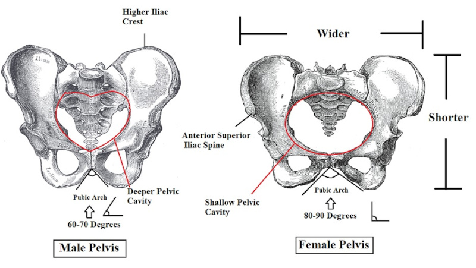

女性的盆腔也更宽，耻骨弓也更宽（这使得女性臀部底部看起来更圆润）。盆腔被两块称为坐骨棘的小骨头包围，它们融合在您的骨盆上。请参考下图（[来源](https://www.open.edu/openlearncreate/mod/oucontent/view.php?id=36&printable=1)）：

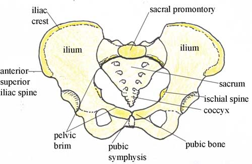

这些小块骨头是您在臀部下部感觉到的骨头，几乎紧邻肛门。在肛交过程中，这些骨骼特征并不非常关键，但当您使用更大的性玩具进行更高级的肛交游戏时，它们变得相当重要。直肠和结肠随时间推移相当可拉伸，但骨盆骨不可拉伸。您骨盆中的大多数骨头在青春期融合，并在17岁时完成融合（[来源](https://carta.anthropogeny.org/moca/topics/age-pelvic-bone-fusion)）。在18岁之前，骨盆骨应被视为坚固且无法改变的，虽然有些骨头继续融合，但这对肛交并不重要。

由于骨骼融合，您将有一个非常明确的性玩具尺寸限制，即能插入直肠的最大尺寸。您的坐骨棘将限制可用于肛交游戏的性玩具直径。这是无法绕过的限制，尽管这限制了圆形性玩具的直径，但并不限制椭圆形性玩具的直径。此限制可能让从事更极端活动（如拳交）的高级爱好者感到沮丧。建议接受此限制，并专注于其他类型的刺激。

与女性进行肛交时，必须考虑的最重要部分是神经解剖结构，因为这与男性有显著差异，可能原因在于生殖器官的位置。让我们首先检查女性外阴的神经。请参考下图（[来源](https://courses.lumenlearning.com/atd-herkimer-biologyofaging/chapter/anatomy-and-physiology-of-the-female-reproductive-system/)）：

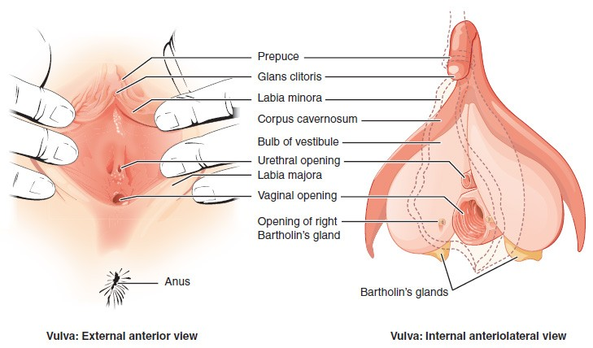

女性外阴最敏感的部分将是阴蒂。虽然外阴的其他部分如"小阴唇"和"大阴唇"相当敏感，但阴蒂因其含有非常密集的勃起组织而极为敏感。外部可通过阴蒂包皮下触及阴蒂，但这仅是阴蒂所连接神经的一小部分。构成阴蒂的勃起组织位于骨盆骨上方。请参考下图（[来源](https://quizlet.com/ca/488283155/ana300-lecture-11-flash-cards/)）：

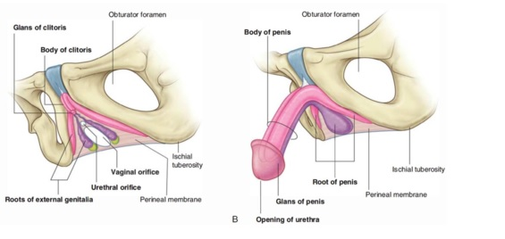

大多数女性在阴蒂受到适当刺激时可达到高潮。这不是女性唯一能达到的高潮类型，但许多女性有很大机会达到此类高潮，因为她们中许多人已发展出个人方法。阴道高潮可能是那些偏好较长阴茎的女性的特征（[来源](https://pubmed.ncbi.nlm.nih.gov/23006745/)）。阴蒂高潮可能表明刺激勃起组织可使女性达到高潮。在生殖器官附近有一条称为"阴部神经"的神经，它分支成多个较小的神经，沿着盆底底部延伸至直肠和阴蒂。请参考下图（[来源](https://www.alilamedicalmedia.com/media/f2807b32-9a5f-11e3-90f3-83cc20702c19-pudendal-nerve-in-female-lateral)）：

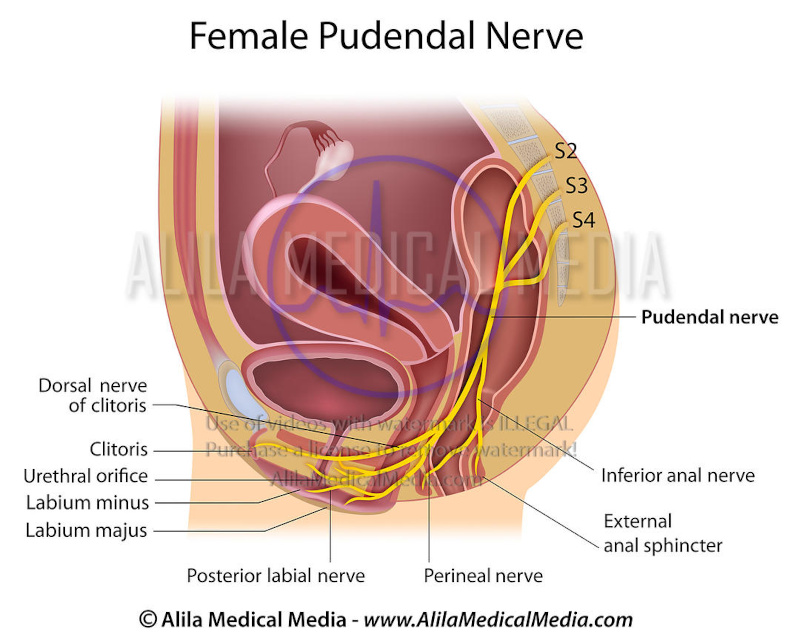

阴部神经的功能是为阴蒂背神经（从阴部神经分支到阴蒂的神经）提供感觉（[来源](https://en.wikipedia.org/wiki/Pudendal_nerve#Function)）。研究似乎还表明，阴部神经损伤会导致性功能障碍（[来源](https://www.ncbi.nlm.nih.gov/pmc/articles/PMC8261452/)）。阴部神经为阴蒂提供神经的特征似乎表明，您可以通过刺激阴部神经获得性刺激，这正是许多人用来解释女性肛交高潮的原因，尽管许多女性报告需要刺激阴蒂才能达到肛交高潮，但她们中许多人通过练习能够消除阴蒂刺激。

这些神经被一块称为"盆底肌"或"耻尾肌"的肌肉包围，但最常被称为"PC肌"，然而这块肌肉值得单独一章，因为它在实现肛交高潮中非常重要，并且需要特殊练习来增加达到高潮的机会。

嵌入女性生殖器官的另一条神经是腹下神经。该神经的功能是通过交感神经系统发送信号以阻止膀胱收缩并收缩尿道内括约肌（[来源](https://www.sciencedirect.com/topics/neuroscience/hypogastric-nerve)）。这条神经从脊柱延伸至直肠和阴道内部的性感带。请参考下图（[来源](https://www.kenhub.com/en/library/anatomy/hypogastric-nerve)）：

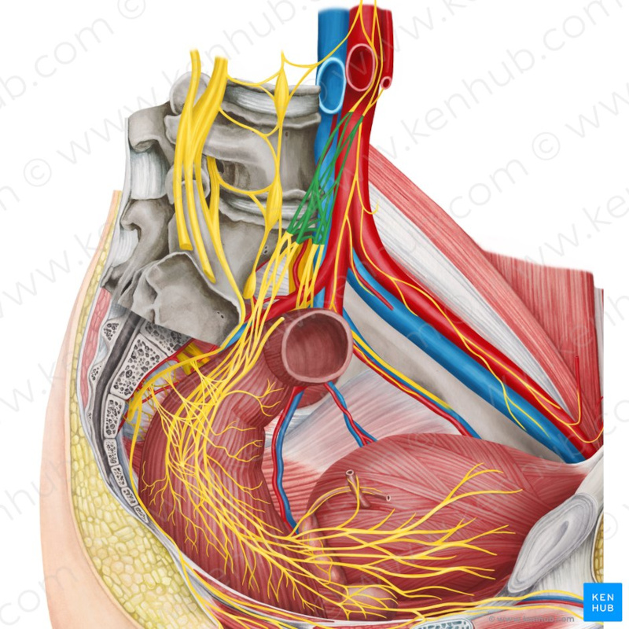

当我们关注刺激时，通常对G点感兴趣，它大致位于骨盆骨前侧下方一个相当尖锐的角度，并且我们对穹窿（A点）感兴趣，它比阴道中的G点更深地进入直肠。当您想确保刺激到正确区域时，这可能非常关键。请参考下图（[来源](https://www.anatomynote.com/human-anatomy/reproductive-system-anatomy/sectional-view-of-female-reproductive-organ-diagram/)）：

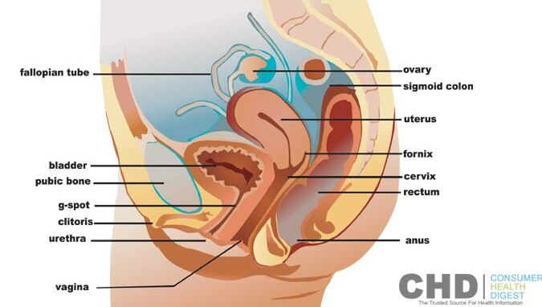

一些（也许是所有）女性在G点周围有特殊腺体，称为斯基恩氏腺，更像是一组腺体集合。这些腺体被认为是女性射精液（一种潮吹）的来源（[来源](https://www.ncbi.nlm.nih.gov/books/NBK547703/)）。该器官产生的液体量（如果有）因人而异，有时也很难找到这些腺体。液体通过斯基恩氏管排出，遗憾的是确切解剖结构可能有所不同，它们可能位于子宫侧面甚至外部。请参考下图（[来源](https://www.newscientist.com/article/dn2495-bigger-is-better-when-it-comes-to-the-g-spot/)）：

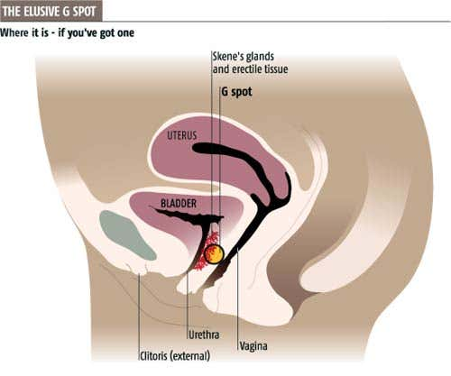

斯基恩氏腺通常被称为"女性前列腺"。该器官的完整目的尚不十分明确，您可以找到各种导管连接到该腺体或其他腺体的解剖图，这些腺体负责在性唤起期间为阴道产生润滑。从上图中需要注意的一点是，"女性前列腺"无法直接从直肠触及（与男性解剖结构相反），这意味着您仅通过肛交无法刺激此部位，但可能通过调整直肠内的插入角度间接刺激它。请参考下图以更好地查看各种性感带的位置（[来源](https://www.researchgate.net/figure/Deep-Vaginal-Erogenous-Zones-DVZs_fig3_333616787)）：

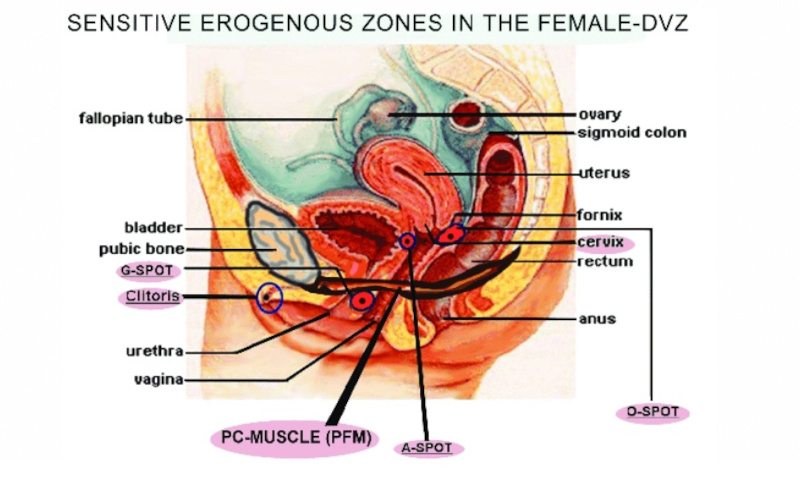

## 解剖结构（男性）

男女之间最显著的差异在于生殖器官区域，但这些差异也给直肠解剖结构带来一些变化。请参考下图（[来源](https://www.magonlinelibrary.com/doi/abs/10.12968/bjon.2018.27.22.1306)）：


您可以重新查阅[解剖结构（女性）](#Anatomy-female)部分以了解差异，但最显著的差异是前列腺非常靠近直肠，膀胱也是如此。另一点需要注意的是，前列腺非常靠近会阴（肛门与阴道/阴茎之间的区域）。刺激前列腺时很容易意外刺激到膀胱，这会产生许多人描述为尿意的不适感。

另一个差异在于骨盆。男性的骨盆更窄但更长，男性骨盆并非为分娩设计。请参考下图（[来源](https://www.registerednursern.com/male-vs-female-pelvis/)）：


男性的盆腔更窄但更深，耻骨弓也更窄（这使得男性臀部底部看起来更方正）。盆腔被两块称为坐骨棘的小骨头包围，它们融合在您的骨盆上。请参考下图（[来源](https://onlinesciencenotes.com/differences-between-male-pelvis-and-female-pelvis/)）：

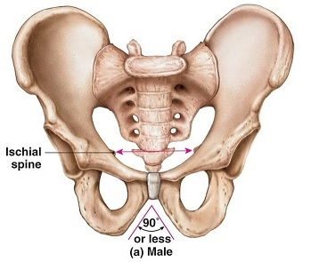

这些小块骨头是您在臀部下部感觉到的骨头，几乎紧邻肛门。在肛交过程中，这些骨骼特征并不非常关键，但当您使用更大的性玩具进行更高级的肛交游戏时，它们变得相当重要。直肠和结肠随时间推移相当可拉伸，但骨盆骨不可拉伸。您骨盆中的大多数骨头在青春期融合，并在17岁时完成融合（[来源](https://carta.anthropogeny.org/moca/topics/age-pelvic-bone-fusion)）。在18岁之前，骨盆骨应被视为坚固且无法改变的，虽然有些骨头继续融合，但这对肛交并不重要。

由于骨骼融合，您将有一个非常明确的性玩具尺寸限制，即能插入直肠的最大尺寸。您的坐骨棘将限制可用于肛交游戏的性玩具直径。这是无法绕过的限制，尽管这限制了圆形性玩具的直径，但并不限制椭圆形性玩具的直径。此限制可能让从事更极端活动（如拳交）的高级爱好者感到沮丧。建议接受此限制，并专注于其他类型的刺激。

与男性进行肛交时，必须考虑的最重要部分是神经解剖结构，因为这与女性有显著差异，可能原因在于生殖器官的位置。让我们首先检查男性阴茎的神经。请参考下图（[来源](https://www.britannica.com/science/penis)）：

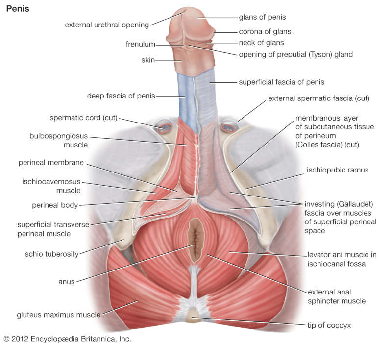

男性阴茎最敏感的部分将是龟头（通常称为阴茎头部）。阴茎的其他部分如阴茎体和睾丸相当敏感，龟头因其含有非常密集的勃起组织而最为敏感。未割包皮的阴茎有包皮覆盖龟头（割过包皮的阴茎则没有包皮），与女性阴蒂相比，阴茎龟头外部暴露得相当充分，但许多勃起组织仍位于骨盆骨上。请参考下图（[来源](https://quizlet.com/ca/488283155/ana300-lecture-11-flash-cards/)）：


大多数男性在龟头受到适当刺激时达到高潮。虽然男性能达到几种类型的高潮，但似乎只有射精高潮在男性中最常见。与女性类似，男性似乎在龟头周围的敏感区域受到刺激时也能达到高潮，这也可能表明刺激勃起组织可使男性达到高潮。在生殖器官附近有一条称为"阴部神经"的神经，它分支成多个较小的神经，沿着盆底底部延伸至直肠和阴茎。请参考下图（[来源](https://www.alilamedicalmedia.com/media/f2807b32-9a5f-11e3-90f3-83cc20702c19-pudendal-nerve-in-female-lateral)）：

大多数女性在阴蒂受到适当刺激时可达到高潮。这不是女性唯一能达到的高潮类型，但许多女性有很大机会达到此类高潮，因为她们中许多人已发展出个人方法。阴道高潮可能是那些偏好较长阴茎的女性的特征（[来源](https://pubmed.ncbi.nlm.nih.gov/23006745/)）。阴蒂高潮可能表明刺激勃起组织可使女性达到高潮，女性勃起组织周围的神经被一条称为"阴部神经"的神经包围，它沿着盆底底部延伸至直肠和阴蒂。请参考下图（[来源](https://www.alilamedicalmedia.com/media/174e771a-9a70-11e3-b43c-ebb24c8a68db-male-pudendal-nerve)）：

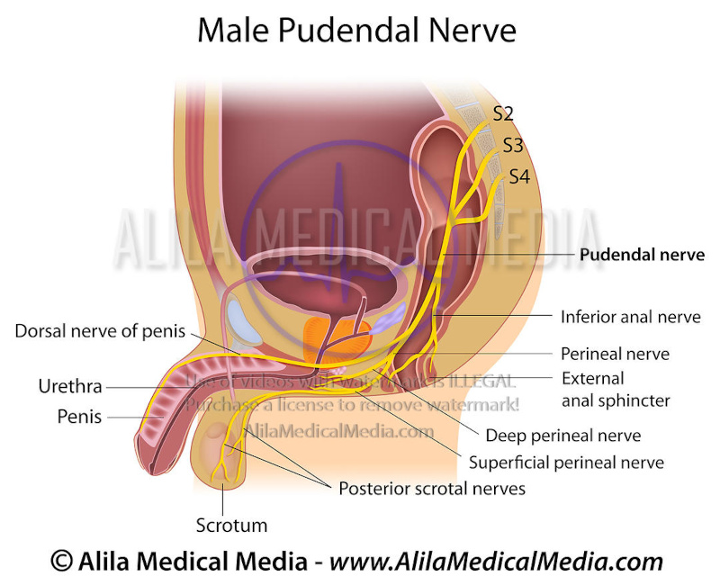

阴部神经的功能是为阴茎背神经（从阴部神经分支到阴茎的神经）提供感觉（[来源](https://en.wikipedia.org/wiki/Pudendal_nerve#Function)）。研究似乎还表明，阴部神经损伤会导致性功能障碍（[来源](https://www.ncbi.nlm.nih.gov/pmc/articles/PMC8261452/)）。阴部神经为阴茎提供神经的特征似乎表明，您可以像女性一样通过刺激阴部神经获得性刺激，但许多男性报告直接刺激前列腺比刺激周围神经的成功率更高。有许多关于男性通过肛交达到高潮的各种方法的个体报告，这值得单独一章讨论。从图中可以看出，阴部神经也延伸到睾丸，这可能解释了为什么男性报告在口交时，当伴侣也包括一些睾丸刺激时，会达到强烈的高潮。您还可以从图中看出，阴部神经非常靠近会阴。

这些神经被一块称为"盆底肌"或"耻尾肌"的肌肉包围，但最常被称为"PC肌"，然而这块肌肉值得单独一章，因为它在实现肛交高潮中非常重要，并且需要特殊练习来增加达到高潮的机会。

肛门与阴茎之间的区域相当敏感，称为会阴。该区域包含两块重要的肌肉：坐骨海绵体肌和球海绵体肌，这些肌肉直接连接到您的阴茎基部，并在男性最常见的高潮类型中收缩，这些肌肉似乎与产生射精有关。一些男性使用的一个技巧是在射精前用手指按压会阴以增加高潮强度。请参考下图（[来源](https://en.wikipedia.org/wiki/Transverse_perineal_muscles)）：

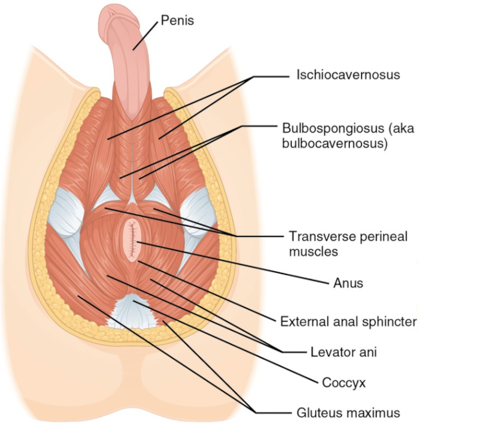

紧邻前列腺的是精囊。这是两个小腺体，储存并产生构成精液大部分的液体。在射精过程中，精囊中的液体被排入射精管，然后与精子和其他生殖液混合（[来源](https://www.webmd.com/men/seminal-vesicle-what-to-know)）。由于这些腺体非常靠近前列腺，并且负责产生大部分精液，因此隔离前列腺并实现前列腺诱导的高潮将有些困难。请参考下图（[来源](https://www.macmillan.org.uk/cancer-information-and-support/prostate-cancer/the-prostate)）：

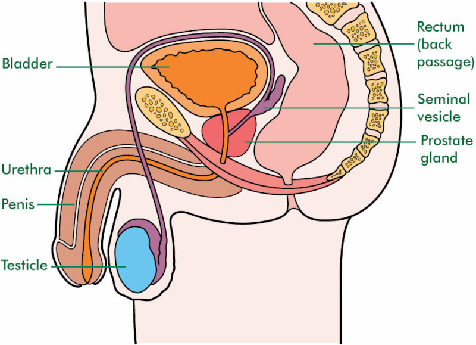

考珀氏腺（或尿道球腺）是男性生殖系统中位于前列腺下方的豌豆大小腺体。它们在射精前产生浓稠的透明黏液，排入海绵体尿道（[来源](https://pubmed.ncbi.nlm.nih.gov/15811067/#:~:text=Cowper's%20glands%20are%20pea%20sized,drains%20into%20the%20spongy%20urethra.)）。许多人称这些腺体产生的液体为"预射精液"。请参考下图（[来源](https://en.wikipedia.org/wiki/Male_accessory_gland)）：

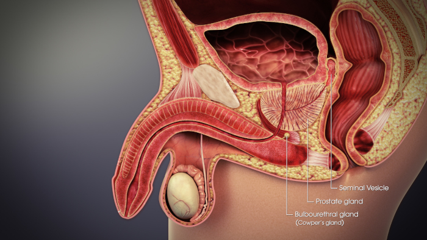

## PC肌

PC肌（有时称为盆底肌）或"耻尾肌"是位于盆底、支撑膀胱和直肠以帮助控制尿流的肌肉（[来源](https://www.uclahealth.org/urology/prostate-cancer/kegel-exercises-for-men)）。这是一块值得特别关注的肌肉，因为它包围着可能与触发高潮相关的多个区域。有些研究未发现该肌肉的紧实度与女性性快感增加之间存在相关性（[来源](https://pubmed.ncbi.nlm.nih.gov/7345161/)），但其他研究报告了相反结论（[来源](https://www.scielo.br/j/fm/a/Zy3kbm3dtcXT6TrcyZKVFkb/?lang=en)）。如前所述，由读者自行决定相信何种信息以及如何使用以下内容。

为使本章具有实用性，我们需要假设PC肌确实在达到各类高潮中发挥作用。在二维图片中理解该肌肉的确切位置相当困难，不过您只需了解大致位置即可。请参考下图（[来源](https://www.wikihow.com/Do-PC-Muscle-Exercises)）：

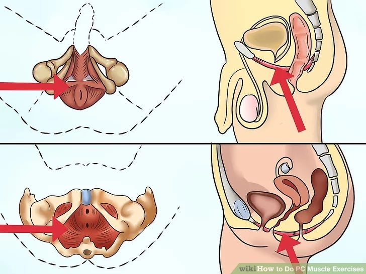

虽然此图仅为示意（PC肌实际位于骨盆骨正上方），但它展示了PC肌如何延伸至各个器官的视角。查看该肌肉的俯视图也很有用，但PC肌的优秀解剖图相当罕见，因此最好不要过于纠结精确位置。请参考下图（[来源](https://www.kenhub.com/en/library/anatomy/muscles-of-the-pelvic-floor)）：

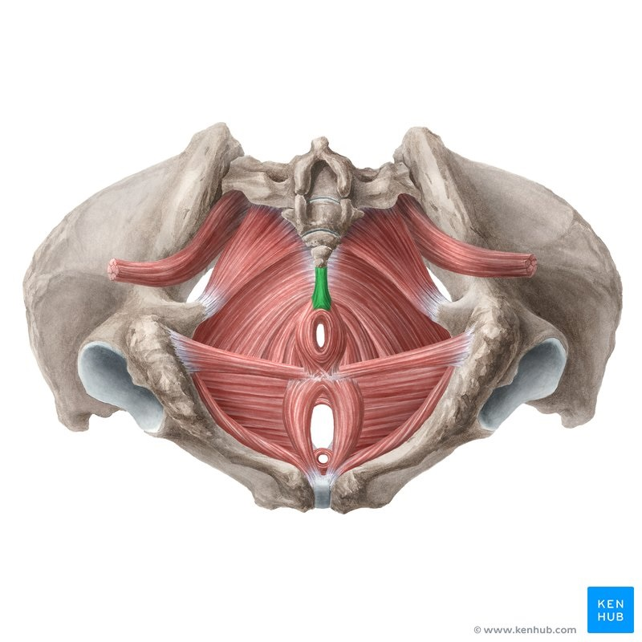

PC肌的明显功能是控制膀胱的尿流。当您在小便时尝试中断尿流，就是在收缩PC肌。这是相当细微的肌肉运动，但足以停止尿流。男性可通过观察阴茎注意到肌肉的外部收缩——阴茎会轻微缩短；女性可能不易从外部察觉这些肌肉收缩，但其他区域会显示细微运动。有些人无法中断尿流，这表明PC肌过弱；而能够中断尿流则表明PC肌足够紧实。

这些细微的肌肉收缩可能从内部对前列腺、子宫、阴茎、阴蒂、阴部神经、直肠、勃起组织及其他部位产生刺激。高潮期间PC肌会不自主收缩，许多人描述这种感受更加愉悦，这可能支持PC肌引起内部刺激的观点。这些细微收缩对尝试达到前列腺高潮的男性尤为重要，因为有一款专为男性设计的肛交玩具值得特别关注，但该玩具需要长时间持续的细微PC肌收缩，这可能非常耗费体力。女性报告PC肌收缩有类似效果，但同样需要PC肌具备相当强的耐力。无论您是否想将紧实的PC肌与增加的性快感联系起来，理论上当PC肌适当紧实以承受多次收缩时，您至少应有更高的达到高潮的机会。

紧实PC肌最简单的方法是中断尿流，但出于显而易见的原因，这不是锻炼PC肌的好方法。更好的方式是为PC肌设计专门的锻炼计划。有些指南建议进行称为"臀桥"的臀部锻炼，但此锻炼仍需您专门关注PC肌，因为单纯的"臀桥"不会使PC肌收缩到所需程度（通常您只对臀部进行"挤压"），因此需要单独收缩它。您可以尝试在臀部锻炼中加入PC肌收缩，但建议首先通过特定练习理解该动作。

这些练习称为"凯格尔运动"，您可以找到各种解释这些练习的视频，以下视频作为女性示例：

[](https://www.youtube.com/watch?v=Wjb20SXIvA4)

以下视频作为男性示例：

[](https://www.youtube.com/watch?v=MJ7EfGu03-0)

根据您当前盆底肌的状态，大多数人可能需要3到6周才能看到一些效果，但有些人可能需要更长时间。为取得效果，正确进行练习很重要，以确保不浪费时间，因为您可能需要在每周大多数日子里每天多次进行这些练习。请确保遵循凯格尔运动指南（如上述视频），以获得最佳效果。

实际上，年轻时PC肌较弱的情况并不常见。更常见于老年人，尤其是处于绝经后阶段、性生活不活跃且大部分时间坐在椅子上的女性。要达到肛交或前列腺高潮，您需要更紧实的PC肌以及经过训练的能力——能够按要求连续多次收缩和放松它们。请注意，此肌肉也可能存在过度紧张的情况。

尽管如此，许多热衷于达到前列腺高潮的人描述凯格尔练习的必要性，就像运动员需要训练才能获得奖牌一样——换句话说，如果没有非常强健的PC肌，您将无法达到如此强烈的高潮。有些人甚至描述他们的能力包括能够进行3-4小时的凯格尔运动，在站立、坐着、吃饭、思考以及任何时候都能进行。

# 健康状况

总体而言肛交是安全的，但某些健康状况可能造成许多并发症。在进行肛交之前，您应确保整体健康状况良好，人类本非为肛交而生，因此这些器官不适合进行插入或拉伸等活动。在许多情况下，人们想将不良副作用归咎于肛交，而实际上潜在问题往往是真正原因。虽然本指南不会详细说明如何保持健康生活，但会提及应在肛交前治疗的健康问题。

注意：为更好理解某些健康状况，可能需要图片，但这些图片可能包含令人不适的内容，许多人宁愿不看。因此，仅提供如何查找视觉示例的提示。

一种相当常见的状况是痔疮，即肛门和直肠内外形成的肿胀、扩大的静脉（[来源](https://my.clevelandclinic.org/health/diseases/15120-hemorrhoids)）。痔疮可能由排便过度用力、超重、怀孕、肛交等原因引起（[来源](https://www.webmd.com/digestive-disorders/understanding-hemorrhoids-basics)）。由于肛门或直肠周围静脉肿胀、扩大，您可能经历疼痛、瘙痒、出血等症状。如果您确实认为自己患有痔疮，在进行任何肛交前寻求医疗治疗很重要，因为肛交会使状况恶化。搜索"hemorrhoids"可找到此状况的示例。虽然许多资料声称肛交可能导致痔疮，但有些声称不太可能引起痔疮（[来源](https://www.medicalnewstoday.com/articles/324637)），这需要读者自行判断，因为明确的因果关系可能不存在。许多人发现积极健康的生活方式、富含纤维的饮食、减少如厕时的用力（不要过度用力）以及缓慢进行肛门训练足以预防痔疮。有些人进行肛门甚至直肠"泵送"，但强烈不推荐，因为极易导致痔疮。整天坐着的人与痔疮之间存在强相关性，请找到任何能让自己保持活跃的方法。

如果确实遇到痔疮，有一些家庭治疗方法。痔疮有两种类型：外痔（从外部可见）和内痔（从外部不可见），治疗方案因类型而异。对于外痔，通常有乳膏形式的局部解决方案，可在当地药店寻找含有氢化可的松、三苄糖苷或类似化合物的乳膏；用金缕梅轻柔擦拭该区域、冷敷、湿巾也可能有帮助（[来源](https://www.webmd.com/digestive-disorders/understanding-hemorrhoids-treatment-medref)），但效果可能有限。对于内痔，大多数直肠乳膏可能效果不佳，通常此类痔疮的治疗采用药丸形式，可在当地药店寻找含有地奥司明、橙皮苷或类似用于治疗血管状况的化合物的药物。请记住多喝水和保持活跃以进一步预防痔疮。
**重要提示**：如果您的痔疮状况在几天内没有改善，则应就医，因为您的状况很可能无法通过非处方药改善。

注意：扩张肛门以拉伸肛门括约肌可能改善痔疮状况（[来源](https://www.ncbi.nlm.nih.gov/pmc/articles/PMC1438823/)），尽管此类研究有限。也有人报告肛门扩张减少了痔疮发作频率，但此类报告也属个体经验。

直肠脱垂是更严重的状况，发生在直肠滑出肛门时（[来源](https://www.mayoclinic.org/diseases-conditions/rectal-prolapse/symptoms-causes/syc-20352837)）。虽然此状况不需要立即就医，但如果您经历直肠脱垂，应真正关注。许多人会描述结果为"直肠脱出"。搜索"rectal prolapse"可找到此状况的示例。有些人发现直肠脱垂很刺激，但这是需要治疗的医疗状况，未能治疗可能导致坏疽（器官坏死）（[来源](https://www.betterhealth.vic.gov.au/health/conditionsandtreatments/rectal-prolapse)）。为预防直肠脱垂，您应保持富含纤维的饮食，减少如厕时的用力程度（不要过度用力）（[来源](https://www.medicalnews.today.com/articles/319977)），避免任何形式的"肛门泵送"，并包括凯格尔运动以加强周围肌肉（[来源](https://myhealth.alberta.ca/Health/Pages/conditions.aspx?hwid=hw181291)）。如果您经历过肛门脱垂，应避免任何形式的肛交。

肛裂是指肛门内衬的薄而湿润的组织（黏膜）出现小撕裂（[来源](https://www.mayoclinic.org/diseases-conditions/anal-fissure/symptoms-causes/syc-20351424#:~:text=An%20anal%20fissure%20is%20a,and%20bleeding%20with%20bowel%20movements.)）。类似情况可能发生在直肠或结肠，有时称为"微撕裂"，结果可能导致肛交时出血，但也可能发生在排便时。一生中某个时刻出现少量出血是正常的，但这可能表明您需要改变饮食以预防未来此类问题。如果您确实经历仅几滴的少量出血，则无需担心，但应注意在伤口完全愈合前不应进行任何肛交。直肠密集分布着血管，撕裂会导致出血；微撕裂可能不会导致出血，可能感觉为刺激感，它们通常很快自愈。

肛门组织吸收性非常强（极其强），这意味着您很容易感染各种性传播疾病/感染。您也因直肠中少量粪便而具有感染伴侣的高风险。您应始终确保您和伴侣已接受检测并接种了最常见疾病的疫苗。

在较长时间的肛交过程中，您可能开始注意到性玩具或阴茎上有白色液体状物质。这是因为结肠/直肠的黏液与润滑剂混合，并在摩擦作用下开始形成白色泡沫。少量情况下这是正常的，您可以预期肛交后出现少量多余黏液，特别是如果您进行了灌肠清洁结肠，但这可能表明肛门组织受到刺激。第二天出现过多黏液可能表明您正在经历可能由感染引起的肛门分泌物。如果您怀疑自己有肛门分泌物，则应联系医生。

可能发生感染，这可能由各种原因引起，其中大多数与卫生问题相关，例如，由于性玩具的材质类型，您可能经历性玩具上细菌增加并最终导致感染。如果您在肛交后的第二天发烧，可能已引起感染，可能需要就医。

许多人担心肛交会使肛门括约肌过于松弛，导致无法"憋住粪便"。这是一个非常普遍的谬论，甚至有人报告他们现在能够更强烈地收缩肛门括约肌（甚至增加了伴侣的快感），似乎肛交与肛门括约肌功能障碍之间没有相关性，但这仅适用于您不急于进行肛门训练、并通过适当预热缓慢拉伸肌肉的情况。如果不谨慎，您可能经历严重的肌肉撕裂，应始终缓慢进行，并非常缓慢地增加肛交玩具的尺寸。

从这些状况中您应看到一种模式：如果您保持健康的生活方式、锻炼、良好饮食、不对直肠或肛门施加过大压力（不过度用力或"泵送"）并总体保持谨慎，则可以避免这些医疗状况。

一些进行更高级肛交游戏（使用非常大的玩具甚至拳头）的人有时会担心长期影响。对于不超过阴茎尺寸的人来说，这不应成为问题，但对于试图测试极限的人来说，这个问题变得相关。长期影响的简短答案是未知的，我们根本没有关于此主题的任何研究。我们拥有的唯一证据是多人从事更极端的肛门深度和尺寸游戏数十年，只要他们缓慢进行并采取大量预防措施，就没有经历任何副作用。

肛交最极端的形式之一是拳交。这涉及将拳头放入直肠甚至更深。这非常危险，因为需要另一个人引导拳头通过一个人的直肠和/或结肠，但您必须依赖接收方和给予方都经验丰富，而这并非总是如此。甚至有可能需要进行手术，打开腹部肌肉以修复拳交造成的损伤（[来源](https://www.fistclub.depthvortex.com/as_laparotomy.html)）。尽管如此，拳交是一种非常强烈的刺激，可以安全进行，但这值得单独一章讨论。

一些男性喜欢使用贞操带，甚至将其永久化作为极端恋物癖形式，以被迫只能获得肛交高潮，但这似乎不安全。多项研究已将频繁自慰与晚年降低前列腺癌风险联系起来（[来源](https://www.healthline.com/health/prostate-cancer/ejaculation-prostate-cancer)）。此类射精高潮剥夺的主要问题是它不允许您正确排空前列腺中的精液，可能导致前列腺增大甚至癌症。有些类型的肛交游戏可以在不接触阴茎的情况下引起射精高潮，此类高潮可能降低前列腺癌风险，但总体而言高潮剥夺是一种极端恋物癖，您必须非常谨慎。

似乎没有关于前列腺癌及其原因的结论性证据，也没有前列腺按摩有助于降低前列腺癌风险的结论性证据，但我们确实知道前列腺按摩可以缓解前列腺癌可能引起的症状。虽然我们不确定前列腺按摩是否在某种程度上预防前列腺癌，但我们确实知道前列腺按摩确实有助于缓解疼痛和其他症状，并且我们知道它不会使情况恶化，反而增加性快感。您可以找到的各种研究似乎将前列腺按摩与降低前列腺癌风险相关联，并且既然它确实增加性快感，为什么不尝试一下呢。

男性喜欢满足的一种流行癖好是"尿道探条"。这涉及将金属棒放入阴茎以拉伸尿道。这被视为极端性行为，您应小心。如果您没有足够频繁地清洁金属棒，存在导致尿道感染的风险，但也存在损害前列腺的风险。有些人有一个想法，使用非常长的金属棒进行尿道探条，从尿道刺激前列腺，同时通过肛门刺激前列腺。虽然这似乎是创造双面刺激的有趣方式，但相当危险，因为您创造了损害前列腺的风险。如果您仍然坚持尝试这种极端形式的前列腺刺激，请确保在结合它们之前分别获得大量此类刺激的经验。始终使用完全无菌的尿道探条，由304或316不锈钢制成（不要使用铬或铝），不要让其他物质接触您的尿道探条。您可能需要非常长的弯曲金属棒才能到达前列腺。再次强调，这强烈不推荐，因为您可能因两侧压力造成撕裂，甚至可能无法用尿道探条到达前列腺。请记住，您的阴茎内部更长，需要非常长的尿道探条，这也会造成损害射精管的新危险。

# 饮食调整

肛交存在一个令人不快的方面，许多人出于显而易见的原因对此反感，但幸运的是，您可以采取一些措施让肛交准备过程不那么侵扰性。改善肛交准备工作和整体质量的措施之一就是饮食调整。保持健康饮食有无数理由，其中之一实际上能让肛交体验更好，这可以通过几个简单的步骤实现，同时也能改善您的整体健康。我们应关注对粪便稠度有影响的食物，所有食物都会对稠度产生影响，但有些食物的影响相当显著。我们期望达到的目标是减少排便频率（不频繁排便），并形成半软但成型的粪便（非多块状）。以下列出已知会使粪便更稀薄的食物（应避免这些食物）：

- 乳制品（牛奶、奶油、奶酪、酸奶、乳清蛋白等），它们似乎会加速某些人的肠道蠕动，但并非所有人（[来源](https://pubmed.ncbi.nlm.nih.gov/17522613/)）
- 红肉，有些人似乎无法正常消化大量脂肪和蛋白质（[来源](https://www.geelongmedicalgroup.com.au/2018/02/signs-that-your-body-might-not-be-properly-digesting-meat)），脂肪消化不良的一个指标是粪便漂浮
- 垃圾/加工食品，这些食物因高度加工而快速通过消化系统，身体会迅速排出多余部分，这些食物还可能刺激结肠
- 辛辣食物，它们会触发加速肠道蠕动的过程，可能与刺激有关（[来源](https://www.verywellhealth.com/why-does-spicy-food-cause-diarrhea-1088717)），这包括大蒜和洋葱
- 人工甜味剂，甚至有些产品标签警告具有通便作用（常见于许多汽水、口香糖、糖果等）（[来源](https://www.ncbi.nlm.nih.gov/pmc/articles/PMC6363527/)）
- 咖啡因，它是一种兴奋剂，已知也会刺激消化系统（[来源](https://www.healthline.com/health-news/does-coffee-help-your-digestive-system-experts-arent-convinced)），请记住咖啡、大多数茶、汽水及许多其他食物都含有咖啡因
- 过量果糖，这是水果中的天然糖分，但过量摄入（通常过量存在于糖果中）可能对某些人产生通便作用，即使是新鲜水果（[来源](https://www.webmd.com/digestive-disorders/news/20030714/fructose-may-cause-digestive-problems)）
- 西兰花和花椰菜，它们含有高量维生素，有些人可能无法耐受（[来源](https://web.archive.org/web/20250116121324/https://www.livestrong.com/article/349377-stomach-cramps-after-eating-broccoli/)）
- 酒精，它会改变身体吸收液体的方式（可能导致腹泻或便秘），啤酒和葡萄酒尤其如此（[来源](https://www.medicalnewstoday.com/articles/does-alcohol-make-you-poop)）

这是一个相当长的清单，您需要理解无需从饮食中完全剔除所有这些食物，这只是可能引起肠道蠕动的一些最常见食物清单。如果您确实经历排便过于频繁或粪便过软，请考虑检查此清单以找出可能导致此问题的食物。尝试各种组合，看看是否能找到保持粪便稠度的方法。

注意：个体差异存在，可能有些食物某人无法耐受并导致排便问题。如果不确定是什么引起问题，请考虑记录摄入的食物，并尝试在出现腹泻等症状时发现规律。

有许多食物您应该摄入，但主要是纤维和未加工的生食。纤维很特殊，因为它能增加粪便体积，这对消化系统有益，因为它允许食物缓慢通过结肠。以下列出将减少排便频率的食物：

- 全谷物，这些食物未经加工，含有需要长时间消化的复合碳水化合物，同时也含有纤维（[来源](https://healthyeating.sfgate.com/whole-grains-bowel-movements-10363.html)），例如藜麦、黑麦、糙米、扁豆、全麦意面等
- 蔬菜，大多数含有纤维，例如胡萝卜、甜菜、洋蓟等
- 水果，大多数也含有纤维，例如苹果、香蕉、橙子等
- 浆果，例如覆盆子、草莓、蓝莓等
- 豆类，例如白豆、腰豆、海军豆等
- 坚果，例如杏仁、开心果、山核桃等
- 种子，例如奇亚籽、亚麻籽、南瓜籽等
- 更多选择，大多数未加工、生的新鲜食物都含有显著量的纤维

注意：要找到更多具有复合碳水化合物结构以减缓消化的食物，可以寻找低GI（升糖指数）食物，不过只要不过量摄入果糖，低GL（血糖负荷）食物也适合。

摄入过多纤维也不可取，可能导致便秘、腹胀或排气过多等消化问题。为预防因纤维过多引起的便秘，可以增加水分摄入。与其计算每个人的纤维需求量，不如直接观察粪便状况，网上有多种指南（[示例](https://www.healthline.com/health/digestive-health/types-of-poop)）可帮助您发现当前饮食中的问题。健康的肠道有助于整体健康，没有健康的肠道，研究甚至发现与自闭症存在相关性（[来源](https://www.ncbi.nlm.nih.gov/pmc/articles/PMC4425030/)）。

有可能建立了均衡饮食，但粪便仍然过软。一个可能原因是缺乏"收敛性"食物。为解决此问题，可以考虑采用"BRAT饮食法"，即清淡、低纤维饮食，许多情况下推荐饮食包括多吃香蕉、苹果酱、米饭和吐司（BRAT）。其他具有收敛粪便作用的食物示例包括饼干、熟麦片（如燕麦片或小麦奶油粥）、淡茶、苹果汁或无气汽水、肉汤、煮或烤土豆（[来源](https://www.healthline.com/health/brat-diet)）。

注意：稀水样粪便也不可取，因为它会给结肠和直肠带来很大压力。年轻时，发生痔疮和直肠脱垂的几率较小，但随着年龄增长，您会增加形成痔疮和意外脱垂的风险。请密切关注饮食。

纤维可分为两类：可溶性纤维和不可溶性纤维。当讨论粪便稠度时，可溶性纤维会使粪便更稀薄，而不可溶性纤维会使粪便更坚实。不可溶性纤维不在肠道内溶解，大部分直接通过，换句话说，它只是增加粪便体积，提高形成成型固体粪便的几率。可溶性纤维在肠道内溶解，但也会发生需要肠道细菌参与的发酵过程，此类纤维分解后产生更稀薄的粪便，在此过程中产生大量气体。建立均衡饮食以帮助形成柔软（但成型的固体）粪便的理念，是帮助您减少肛交前使用侵扰性清洁方法的需要，如果粪便状况良好，您甚至可能只需在肛交前坐在马桶上，就有信心不会弄脏。

大多数食物同时含有可溶性和不可溶性纤维，幸运的是有些食物含不可溶性纤维远多于可溶性纤维。以下列出高含量不可溶性纤维的食物：

- 生菜叶
- 菠菜
- 红薯
- 浅色扁豆
- 藜麦
- 甜菜根
- 糙米
- 橙子
- 菠萝
- 山核桃
- 蓝莓
- 熟香蕉
- 荞麦
- 西红柿
- 黄瓜
- 甜椒
- 切达干酪
- 葡萄
- 酸菜

注意：开始高纤维饮食的常见抱怨是胃胀气和排气过多。转向主要含不可溶性纤维的食物可减少高纤维饮食的副作用。

以下列出高含量可溶性纤维的食物，如果怀疑粪便过稀或经历胃胀气、胃气增多，请考虑从饮食中移除这些食物：

- 苹果
- 梨
- 意大利面
- 全麦食品
- 胡萝卜
- 未熟香蕉
- 大多数坚果
- 豌豆
- 大多数豆类
- 小麦
- 等等

注意：随着时间的推移，您的身体可能适应高可溶性纤维饮食并减少上述副作用。应逐渐增加纤维摄入量，或将饮食中的所有食物替换为不含大量可溶性纤维的食物。

与消化系统健康相关的话题是益生菌。有些食物，例如发酵乳制品（如酸奶），可以改善肠道微生物群，这有助于消化食物和改善健康。您也可以饮用含益生菌的补充剂以达到类似效果。一些研究甚至发现，通过适量摄入益生菌可以预防各种皮肤病（[来源](https://pubmed.ncbi.nlm.nih.gov/24364369/)）。虽然研究显示了益生菌的重要性，但似乎没有研究表明，如果消化系统已正常运作，服用益生菌有何益处。这引发了关于肛交中使用大量侵扰性清洁方法时肠道健康的问题，但此问题的答案尚无定论，缺乏证据，然而许多人声称他们感觉有所改善，这将留给读者决定是否饮用益生菌以最小化对肠道微生物群的干扰。

注意：益生菌可以帮助促进分解可溶性纤维的发酵过程。考虑在饮食中添加益生菌以帮助消化可溶性纤维。遗憾的是，研究无法证实益生菌有助于减少胃气，您需要摄入更多不可溶性纤维以减少胃胀气和胃气。

如果摄入过多酸性食物或缺乏适当纤维摄入，可能经历"肛门炎"，即肛门周围组织的刺激。这可能导致瘙痒、疼痛甚至出血。如果遇到此类问题，请考虑检查饮食以找出原因，避免使用粗糙的卫生纸。与通常仅出现在肛门或直肠一侧的痔疮相比，肛门炎通常环绕整个肛门。

如果在肛交时弯腰使用灌肠清洁后多次排气，可能面临过度清洁与饮食问题结合的问题。纤维允许吸收肠道中的各种油脂和糖分，但没有足够的纤维，这些油脂和糖分可能开始发酵并导致排气。考虑在饮食中添加纤维，甚至可以在当前餐食中添加混合种子。

您应密切关注消化系统的原因是，大多数人会使用非常侵扰性的清洁方法（如灌肠）为肛交做准备。这些方法会在一定程度上干扰肠道微生物群，尽管干扰程度尚不明确。另一个原因是，"稀水样"粪便通常需要个人对肛门肌肉施加很大压力才能开始排便，这可能导致痔疮；当粪便过硬时也会出现同样问题，甚至导致便秘。出于所有这些原因，您需要确保粪便既不太软也不太硬。如果想避免各种健康问题并获得更愉悦的肛交体验，建议在进行肛交前调整饮食。

# 清洁准备

大多数人在进行肛交前希望进行适当清洁，通过清洁可以减少"脏乱"并增加肛交快感。不做任何清洁可能在肛交过程中遇到一些粪便，您和伴侣可能对此反感，而且粪便的存在也可能因便意引起不适。每当直肠感知到粪便存在时，您可能产生开始排便的反射，许多人会感到不适。清洁有多种方法，每种方法各有优缺点。

在讨论可能的方法之前，我们应涉及深度主题。有些清洁方法仅适用于不使用长性玩具的肛交游戏，有些适合快速肛交，有些更适合长时间肛交，大多数情况下取决于个人需求。如先前[解剖结构](#Anatomy)章节所述，直肠是肛交时首先需要清洁的部分，但必须确保不完全放松结肠（不得拉直直肠乙状结肠交界处），否则最终会在肛交过程中接触到结肠未清洁部分。许多人起初会觉得这很棘手，有时想放松肌肉，有时又不想，但又无法直接控制该肌肉。因此，初学者在学习更好控制所需肌肉之前，最好使用比所需更深的清洁方法。对于有一定经验者，需要决定想达到多深，然后仅清洁那些部分，例如，对于使用阴茎的常规肛交，实际上不需要清洁直肠乙状结肠交界处（RSJ）以外的任何部分。

清洁部分是大多数人反感的（除非您有灌肠癖好），因为此过程可能需要10分钟到超过一小时（取决于所选方法和深度要求），幸运的是，随着练习，所需清洁时间会减少。如果遵循[饮食](#Diet)章节中的饮食建议，应经历较少排便，这也意味着应预期排出较少粪便（总量应相同，但应更容易排出），但许多人报告称，肛门深度游戏（进行超过RSJ的肛门训练）显著简化了清洁过程，这应该发生，因为您正在拉伸结肠的狭窄部分，该部分阻止粪便以更快速度和更大尺寸移动。

目前已知有3种清洁方法，这些方法按侵入性从小到大排列：

- 坐在马桶上
- 冲洗
- 灌肠

您可能认为上厕所并不是真正的清洁方法，但这实际上对某些人来说足够了，原因是您的饮食。我们专门用一整章讨论饮食，并谈到关注粪便稠度的重要性，但良好饮食的一个不太明显的好处是可预测的排便。饮食均衡的人可以轻松预测何时需要排便。排便频率是每个人需要弄清楚的事情，但了解此时间表可以将清洁需求减少到肛交前仅坐在马桶上，以最自然的方式排空结肠。请记住，排出粪便时不得过度用力，否则可能长期导致小问题（更多内容见[健康](#Health)章节）。如果对自己的排便没有信心，则此方法可能不适合您。

注意：肛交过程中，有时遇到一些粪便是正常的。您应理解，伴侣也应理解。

冲洗是用液体（最常见是水）冲洗直肠的行为，这意味着水不应通过直肠乙状结肠交界处（RSJ）。这是一种侵入性不大且实际上相当快速的清洁方法。具体操作是使用特殊设备（有些变体可以使用家用物品自制，但不推荐），确切的设备类型将在本章后面列出。冲洗可能有点棘手，因为必须确保不让水通过直肠乙状结肠交界处（RSJ），确定这一点并不直接，但大多数人会描述为直肠内压力突然释放（这意味着水已从直肠逸出进入结肠）。水是否会通过RSJ取决于水量和压力，因此出于冲洗目的，每次将液体释放到直肠时应使用少量水和较小压力（小水柱）。此方法快速、相当简单，但仍可能因放松而意外将粪便从结肠释放到直肠。

灌肠是用液体（最常见是水）冲洗直肠和结肠的行为，与冲洗的区别在于灌肠允许水通过直肠乙状结肠交界处（RSJ），这允许更深层的清洁。灌肠需要特殊设备，相同设备可用于灌肠和冲洗。灌肠看似简单，但存在一些风险，因为它需要显著的水量和压力。风险可以通过一些预防措施避免，甚至存在专门设备以降低风险，通常风险源于意外在直肠和结肠中产生过大压力，这通常发生在使用淋浴头灌肠时，可能产生非常强大的水流，在某些情况下可能损伤结肠或直肠组织。灌肠将非常侵入性，因为用水冲洗消化系统的大部分，干扰肠道微生物群。此清洁方法可能花费大量时间，对某些人甚至超过一小时。

注意：避免使用大力排出水，长期可能形成痔疮，因为尝试用力将任何东西排出直肠时会对血管施加很大压力。

进行灌肠或冲洗需要某种设备，以下列出一些可用的常见设备类型：

- 灌肠袋，将其放在高于自己的支架上，将润滑过的喷嘴插入肛门，重力将迫使水进入直肠，侧躺时效果最佳。此方法可能相当慢，但可能是所有（包括冲洗直肠/结肠的）方法中最安全的选项，[示例](cleansing_enema_bag.jpg)
- 灌肠球，挤压它们吸入水，将润滑过的喷嘴插入肛门，再次挤压球以将水释放到直肠/结肠，可大可小，可轻松创建所需压力（也可能产生过大压力，确保不要挤压过猛），可能相当侵入性，花费一些时间，易于运输或储存，[示例](cleansing_enema_bulb.jpg)
- 灌肠淋浴头附件，用特殊附件替换淋浴头，将润滑过的喷嘴插入肛门，打开水龙头阀门，可以创建多种水量和压力（始终缓慢开始，非常小心不要意外造成高水流），非常侵入性，但可以大大加快清洁时间，可能是最彻底的清洁方法，[示例](cleansing_enema_showerhead.jpg)
- 灌肠瓶附件，将塑料瓶装满水，用喷嘴替换塑料瓶盖，将润滑过的喷嘴插入肛门并挤压瓶子，这与灌肠球非常相似，[示例](cleansing_enema_bottle.jpg)

大多数人会选择使用淋浴头附件，因为它是最有效的清洁工具。购买前有几个考虑因素，首先是寻找硅胶喷嘴以减少感染和刺激的机会，其次是寻找具有多个开口的喷嘴（最好在喷嘴的各个侧面有开口，例如侧面和顶部，而不仅仅是喷嘴顶部），第三是寻找开口较大的喷嘴（不是小孔）。应寻找在喷嘴所有侧面有许多较大孔的喷嘴的原因是水压将分布，这将减少清洁期间因高水压受伤的机会。还应关注灌肠淋浴头附件是否与当前淋浴头兼容（或寻找适配器）。

注意：有些灌肠淋浴头附件将带有流量控制阀或类似限制水流的方法，以减少受伤机会。应寻找此类功能，但注意它们并非万无一失。

注意：如果淋浴头附件在顶部有单个开口，则无需将设备插入肛门。可以简单地将开口对准肛门，让液体进入直肠。与将喷嘴插入直肠内相比，这是进行灌肠的侵入性小得多的方式。

要使用灌肠球或淋浴头附件清洁直肠，准备水并确保是温水，但不冷也不热（温度变化大可能导致不良影响）。润滑喷嘴并缓慢将喷嘴插入肛门。如果使用淋浴头附件，则```缓慢```打开水龙头，让直肠充满水；如果使用灌肠球，则挤压球并重复过程（如果需要），直到感觉直肠有轻微压力（并暂时停止填充自己）。当感觉直肠的显著部分充满水时，可以选择立即坐在马桶上（或其他地方，但记住会造成混乱）释放水，这将防止水通过直肠乙状结肠交界处。也可以选择等待一会儿，让身体适应轻微压力，然后继续用水填充自己。

如果决定让水通过直肠乙状结肠交界处，则应在一段时间后感到直肠内水压带来的缓解，这通常是直肠乙状结肠交界处已拉直的指标，可以继续用水填充自己。需要相当长时间才会再次感到压力，会注意到腹部尺寸显著增加（腹部隆起），可以走得很远，但记住```缓慢```进行以防止受伤。在某个时刻应感到压力积聚，此时应停止水流并释放水。

有些人喜欢在将水释放到马桶前做几次深蹲、轻微摇晃身体、跳跃、走动和其他活动。他们这样做是为了确保水到达结肠/直肠的更深区域，但如果决定进行"腹部隆起"，则非常小心任何突然动作，因为当"腹部隆起"形成时结肠内压力很大。排出水也应轻柔进行，几乎不使用任何力（不要过度用力）。释放水可能需要相当长时间才能让所有水排出，几乎可以肯定总会有少量水残留并最终出现。

注意：使用肥皂水非常不推荐。肥皂非常刺激，会在很大程度上干扰肠道微生物群。可能时应使用过滤水进行灌肠。考虑创建盐水溶液进行灌肠以减少干扰。

如果需要进行冲洗，可以选择仅使用小塑料瓶。取下瓶盖并确保也取下瓶盖环，以免有任何锋利边缘。用温水装满瓶子，润滑瓶子顶部并将仅瓶子顶部插入肛门，然后挤压瓶子。这是一种非常快速但效率不高的清洁方法，适用于没有任何设备可用时。此方法不适合灌肠式清洁，应仅用于清洁直肠。这也不是很好的方法，因为大多数塑料瓶会有锋利边缘，存在在肛门造成小割伤的风险。

总是有一个问题：灌肠频率多高是安全的，遗憾的是对此主题研究不多。我们所知的是，冲洗与HIV风险增加之间存在一些相关性（[来源](https://sti.bmj.com/content/95/6/428?rss=1)），这似乎与肛门小裂伤风险增加有关，但对肠道微生物群再生速率研究不多，因此无法得出灌肠安全频率的结论。目前最常见的建议是不要每天灌肠，将灌肠限制在每周2-3天，冲洗也应如此。

**重要提示**：有些人进行灌肠（或冲洗）后可能感到恶心。这可能与结肠微生物群干扰有关，可视为刺激迹象。为最小化不良影响，可以创建盐水溶液替代水使用。要创建可用于灌肠球（或类似允许使用选定液体的设备）的非常简单盐水溶液，只需将1汤匙食盐（无添加剂）与2杯温蒸馏水混合。

*提示*：肛交前（或预热前）上厕所，通常清洁后内部仍有少量水残留。

# 性欲

任何性行为要带来快感都需要性欲，这对肛交尤其重要，因为生殖器没有直接刺激。虽然本章看似不必要（尤其对年轻人），但这是一个非常非常关键的主题，因为缺乏性欲是性行为不愉悦和无法达到高潮的最常见原因之一，这对试图达到前列腺高潮但不明白为何所有方法都不奏效的男性尤其如此。缺乏性欲是非常常见的问题，导致许多夫妻关系问题，幸运的是，您可以在没有治疗师的情况下做很多事情，仍然拥有充实的性生活。

注意：没有"神奇"的药丸、喷雾或液体可以增加性欲。性欲的内在运作非常复杂，科学尚未完全理解（目前）。性欲的主要成分似乎是心理性的，这意味着您更可能通过改变对性的看法甚至看性治疗师来修复性欲功能障碍，而不是浪费金钱购买网上未经验证的解决方案。信息素和类似产品无法修复性欲。

在性行为前和期间，您的身心经历的过程非常复杂且高度个体化，但我们可以做一些概括，创建一个（部分）性功能的简化模型。考虑每当您思考或进行性行为时，身心经历的以下过程：

1) 您发现与性思想产生关联的事物
2) 关联产生性思想
3) 性思想扩展
4) 您的身体为性行为做准备

在这个简化模型中有两个主要过程，前3步可称为"性欲"或使您想进行性行为的过程，最后第4步可称为"性唤起"或为性行为准备身体的过程。此模型也暗示您不能通过刺激生殖器自发想要性行为，但遗憾的是许多人拒绝接受需要心理刺激，并在达到（满意的）高潮时遇到问题。每当刺激生殖器时，您触发性思想，但没有适当的性欲，您是在"强迫"一个感觉不那么满意或根本不会发生的高潮。

性欲有许多方面，涉及性欲每个已知方面超出了本指南的范围，相反我们将关注进行性行为的最常见动机之一——感受性幻想。"感受"这个词非常关键，许多人有着奇怪甚至危险的性幻想，但只有少数人真正想实现它们。大多数人想要与性幻想相关的某种感觉，而不是完全实现幻想。性幻想可能复杂且不切实际，但大多数人追求的是身处性幻想中的感觉。

理解性幻想如何创造性欲的最佳方式是检查"强暴幻想"或"自愿非自愿幻想"，或简称为"被强迫性使用的幻想"。这些幻想可能不同，但共同主题是人们幻想被性虐待（被用作性对象或类似），但（几乎）没有人想被陌生人虐待，而是想感觉像被虐待（特别是对强暴幻想——被他们信任的人）。这一洞察让我们更好地理解性欲，从而可以调整前戏或性场景以更好地创造适当的性欲。相同概念可用于广泛的幻想，尤其是BDSM相关幻想，如鞭打（大多数人不想感受大量疼痛，大多数人想通过接受惩罚来表演疼痛）。

与伴侣的沟通非常重要，比您读过的任何关于沟通重要性的文章都重要。处理性功能障碍时，最佳修复方法是与伴侣交谈。大多数情况下，人们不习惯谈论性幻想，但应找到与伴侣沟通此类事情的方法，大多数情况下，好伴侣会理解甚至兴奋地表演您的幻想，记住要理解。与伴侣沟通性幻想时，少关注细节，多关注伴侣在性幻想中的感受方式，注意"不可抗拒"、"被填满"、"取悦他人"、"被惩罚"等线索，因为这些线索将为您提供如何增加伴侣性欲的提示。也可以要求自己描述性幻想并提取所需细节。如果性幻想看似平淡，考虑询问更多细节，如"房间颜色是什么"、"房间里还有谁"、"声音语调是什么"、"你穿着什么"。记住始终保持理解和非评判态度，这只是幻想，表演幻想只是一种表演。

由于性欲可以通过关联触发，应探索可能的癖好和恋物。您的思想可能发现某些物体或行为高度色情，并触发连锁反应以增加性欲。收集所有记忆，找出与性相关的事物，发现并利用所有恋物，幻想它们，并创造完美空间以享受唤起思想。如果尚未发现任何恋物，则可以从思考（或观看）最常见恋物的场景开始：

- 足部恋物
- 鞋子恋物
- 耳朵恋物
- 颜色恋物
- 头发恋物
- 内衣恋物
- 身体穿孔恋物
- 纹身恋物

注意：大多数人在年轻时通过条件学习发展恋物，通常人们在第一次性经历或以后生活中发展恋物，这不一定是第一次性交。恋物可能来自第一次勃起或性唤起期间的各种感觉，例如，年轻时在医疗检查期间勃起可能发展医疗场景恋物，年轻时在打屁股期间勃起可能发展打屁股恋物等等。这些关联可能伴随您一生，务必唤起童年记忆以发现隐藏的恋物。

虽然性欲在很大程度上受自身思想和周围场景影响，但还有许多其他因素会对性欲产生显著影响，有些问题可能难以解决，但大多数可以通过简单的生活方式改变解决，有些需要看医生，有些需要改善自身性格。以下列出可能降低性欲的一些常见因素：

- 关系问题
- 压力、焦虑或抑郁
- 激素水平失衡
- 酒精
- 不良饮食
- 超重
- 缺乏自信

注意：女性避孕药旨在增加某些激素水平以防止怀孕，但这种激素可能对性欲产生不利影响，使（某些）女性性欲降低。不要仅因怀疑降低性欲而停止使用避孕药，更可能是其他因素产生更大影响，医生开当前避孕药可能出于除避孕外的其他原因，可能是针对潜在医疗状况。

当性欲水平较高时，身体开始增加性唤起水平，对男性这通常意味着勃起，对女性这意味着开始分泌润滑液。在探索增加性唤起的方法之前，我们应理解称为"双重控制模型"的概念。大多数人熟悉"兴奋点"或增加性唤起的事物，但也有"扫兴点"会降低性唤起。双重控制模型最好通过假设性反应有加速踏板和刹车踏板来理解，人们有不同的敏感度踏板。考虑以下描述此模型极端的4种情况：

- 容易唤起但容易因某事扫兴的人（敏感加速器，敏感刹车）
- 容易唤起且容易保持唤起的人（敏感加速器，不敏感刹车）
- 难以唤起但容易保持唤起的人（不敏感加速器，不敏感刹车）
- 难以唤起且容易因某事扫兴的人（不敏感加速器，敏感刹车）

许多男性认为唤起始于刺激，他们假设思想因性敏感区受刺激而唤起，但这并非身体中发生的情况。唤起始于思想，思想向身体其他部分发出信号，触发为性行为准备身体的反应。虽然男性可以开始猛烈自慰并触发高潮，但这对女性无效，对肛门刺激也无效。思想有某些触发性反应的关联，这种关联触发身体反应的现象在实验中多次观察到，著名实验是巴甫洛夫的狗实验，狗被训练对与食物相关的铃声流口水（[来源](https://www.verywellmind.com/pavlovs-dogs-2794989)），类似实验也用于性反应。这些实验证明了经典条件反射的存在，它允许思想被训练将事物与反应关联。经典条件反射可能无意中发生，结果可能发展出恋物，物体或行为可能与色情或性活动甚至仅愉悦活动关联。

人们各不相同，对每个"踏板"有不同的敏感度。如果您是那种容易唤起且容易保持唤起的人，那么恭喜，但并非所有人都拥有这样的天赋。对于其他人，需要在自身思想上做一些工作。我们已经触及模型的一个方面，即唤起，除了简单地找到让您兴奋的事物、展现所有恋物、所有您发现唤起时刻的记忆外，没有太多关于唤起"加速"的内容。记住也关于触摸自己，思想可以将触摸与性快感关联，从而增加性唤起。可以纳入唤起程序的一件事是使用性敏感区，这些是触摸时激发性感觉的区域。确切点取决于性别，确切刺激方法（无论是圆周运动、摩擦、振动、戳刺、捏掐或其他）取决于个体，每个个体应探索最喜欢的方式。以下列出大多数人受刺激时发现性唤起的常见区域图，使用这些区域在肛交前增加性唤起（[来源](https://ro.co/health-guide/erogenous-zones-women-men/)）：

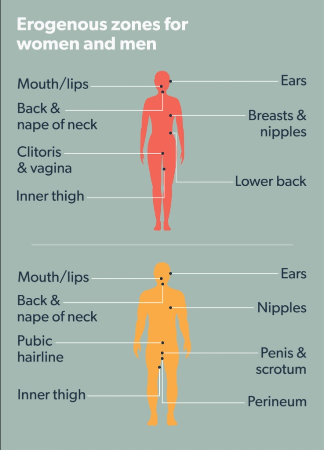

"刹车"方面复杂得多，可能让大多数人感到沮丧。容易扫兴的人对压力、疲劳、健康、外貌、心理问题等因素非常敏感。要保持性唤起，事情必须恰到好处，"恰到好处"对不同的人意味着不同的事物。在唤起期间，必须能够忽略日常问题，必须忘记需要缴税，必须忘记腿上有奇怪的胎记，必须忘记第二天早上需要为孩子准备餐食，必须为自己留出时间，享受时光而不担心任何事情，尤其不要担心因伴侣现在如此努力地试图唤起您或让您达到高潮而唤起不足。保持思想放松，保持身体放松，保持思想清晰，享受当下。

注意：在一方想要性而另一方不想要的关系中，更可能是一方需要更多时间来唤起和/或需要条件恰到好处。

大多数初学者在肛交时过于紧张，但练习瑜伽的人会知道，当思想放松时，肌肉更容易放松。肛交期间几乎不应紧张肌肉，应处于非常放松的状态。肛交前应找到作为个体觉得放松的例行程序。根据喜好和厌恶，考虑进行以下活动：

- 洗温水澡
- 洗半热水淋浴
- 听放松音乐
- 按摩（使用某种设备或伴侣）
- 使用引导呼吸练习
- 使用引导意象（或其他感官程序）
- 做瑜伽
- 冥想
- 等等

注意：伟哥和类似药物不增加唤起，它们仅增加勃起持续时间，此类药物不产生勃起，仍需要唤起以首先触发勃起。

每个人不同，每个人对他们发现唤起的事物反应不同，但在继续之前，我们必须解决称为唤起不一致的某些现象。这种现象可能让许多人困惑，请稍等片刻，因为它可能难以相信和理解这种现象可能影响性生活的程度。唤起不一致意味着性心理状态与性生理状态不匹配，换句话说，您可能被唤起，但身体不显示唤起迹象，**但**这是双向的，身体可能显示迹象，但您不感到唤起。

为更好理解，让我们举几个例子说明这在现实世界中可能如何表现。以下列出可以观察到唤起不一致的各种情况示例：

- 女性说她高度唤起，但阴道不产生天然润滑液
- 男性看到两只动物交配，男性勃起，但男性不认为看到动物交配是色情或色情内容，而是觉得恶心
- 男性刺激女性并注意到女性乳头变硬，男性假设女性高度唤起，但女性不感到唤起
- 男性的前列腺受刺激，但男性没有勃起，但男性感到高度唤起

男性倾向于将唤起与勃起关联，因为他们发现每当勃起时使用阴茎刺激容易达到高潮，但男性更能在没有高水平唤起的情况下强迫高潮。女性需要高水平唤起才能达到高潮，大多数女性需要大量关注她们发现唤起的事物（至少大多数女性）。男性往往难以理解勃起不意味着唤起，这让他们在无法通过肛门刺激达到高潮时感到沮丧，甚至女性在无法达到高潮时也可能变得沮丧。

注意：沮丧是即时的唤起杀手！

许多人一直非常担心，这对身体非常有害，压力是身心警觉的状态，如果长时间处于压力下，将对自身身体健康产生影响。慢性压力也将严重影响性表现。如果有压力，将难以唤起，许多男性会仅仅因为压力而经历突然的勃起功能障碍，如果开始担心，女性会失去生殖器敏感性。伴侣在性刺激期间思想走神并失去所有兴趣的情况太常见了。人们以目标为导向进行性行为也很常见，他们假设需要达到高潮，但这给个人带来很大表现压力（表现焦虑）。

应练习正念，训练自己不要因有扼杀唤起的想法而对自己生气，而是学习正念并使用其技术让思想清晰，活在当下，并简单地将自己的思想引导到真正想要的方向。表现焦虑非常常见，但以"乐趣为导向"是更好的主意，进行性行为以获得乐趣，如果性行为持续10分钟而没有高潮，那么祝贺自己，您获得了10分钟的愉悦。有些夫妻发现，通过改变心态可以处理表现焦虑，一方忽略自己的愉悦，确保另一方获得愉悦，这可能看似违反直觉，但想法是没有表现焦虑，看到伴侣获得愉悦给您一种轻松感。无论如何，确保专注于保持唤起。

当找出创造性欲和建立高水平性唤起的方法时，您大大增加了达到高潮的机会，但并非所有高潮都相等。如果所有高潮都相等，那么我们可以只是自慰并非常快速地完成，但人们发现各种性行为更令人满意，这种满意程度通常是人们追求的，而不是高潮本身。常见的谬论是，如果男性射精，那么他就满足了，但情况并非总是如此，男性也追求满足感，通常可以与性行为让他们感觉如何相关联，女性也是如此。专注于让您想要激情性行为的事物，而不是无聊的性行为，专注于行为本身，而不是高潮。

虽然女性性欲系统总是被描述为具有"旋钮和开关"的复杂系统，但男性性欲系统被描述为简单的"开/关开关"，但这根本不正确。对女性而言，性欲深深植根于情感联系，许多世纪以来，人们一直认为男性一直想要性行为，但直到最近人们才开始意识到男性的性欲与女性的性欲非常相似，两者都需要精力和缺乏压力才愿意进行性行为，但最重要的是男性也需要与伴侣的情感联系才能感到满足。男性往往更频繁地思考性，但女性对性敏感，这表明女性至少与男性一样愿意进行性行为，但需要满足某些条件。不要忽视男性性欲的复杂性，视觉刺激可能重要，但性感内衣并不总是让男性想要性行为，务必与男性伴侣沟通以更好地理解他们的需求。

# 润滑剂

大多数关于更好肛交的指南主要会说慢慢来并使用大量润滑剂。在前面的章节中，我们讨论了为什么慢慢来很重要，但同样的原因也适用于为什么要使用大量润滑剂和适当的润滑剂。人体自然不产生（足够的）润滑剂来达到所需的顺滑度，您可能熟悉女性在性唤起时阴道会产生天然润滑液，但这种机制在肛门或肛交涉及的任何其他部位根本不存在。没有润滑剂，您不仅可能感到不适，还可能遭受严重损伤。因此，使用大量润滑剂非常重要。

润滑剂有多种类型，大多数润滑剂适合肛交（少数例外），但根据具体行为选择合适的润滑剂很重要，无论是常规插入式肛交、拉伸、长期塞入、拳交还是其他。通常，您可以选择3种类型的润滑剂：

- 油基润滑剂
- 水基润滑剂
- 硅基润滑剂
- 混合润滑剂

注意：不，唾液不是好的润滑剂，您需要适当的润滑剂。

油基润滑剂将具有最高的顺滑度，它们持久耐用，有些人使用一些油基润滑剂作为按摩油。这些油适合长时间使用，因为不需要频繁重新涂抹润滑剂，但它确实有一些主要缺点。油倾向于平滑小的表面缺陷（如毛孔），这可能对由多孔材料（如TPR、TPE或PVC）制成的性玩具有些问题，这些材料可能随时间降解并滋生难以清洁的细菌。油基润滑剂通常含有某种凡士林的变体（凡士林），它相当惰性，但可能损坏包括乳胶在内的各种材料。油基润滑剂```应该```安全用于金属、玻璃和陶瓷性玩具，但硅胶性玩具仅当性玩具由纯硅胶制成时才安全，这在大多数情况下难以确定。为确保性玩具与油基润滑剂兼容，请检查性玩具制造商的主页。油基润滑剂很混乱，有些人可能因某些油堵塞皮肤毛孔而长痤疮。尽管如此，油基润滑剂非常顺滑且持久，因此是那些从事更高级肛交游戏（如拳交）的人首选的润滑剂。油基润滑剂往往相当昂贵，但许多人喜欢使用未精炼的椰子油或荷荷巴油，因为它们广泛可用且比替代品便宜。使用油基润滑剂后记得清洗性玩具。不建议将油基润滑剂用于阴道性交（[来源](https://www.self.com/story/6-lube-ingredients-to-avoid)）。

**重要提示**：```不推荐```将油基润滑剂与安全套一起使用，在某些情况下，您可能经历油基润滑剂使安全套劣化并最终破裂。一些油基润滑剂与一些安全套兼容，最好参考制造商主页以确保其产品兼容。

水基润滑剂相当顺滑，但它们往往干得快，需要频繁重新涂抹。它们易于清洗，价格便宜，大多数人不会因此产生任何皮肤问题。这些润滑剂可用于任何类型的性玩具，但使用后仍需清洗性玩具，尤其是由多孔材料制成的玩具。对于那些进行常规插入式肛交的人来说，这是最受欢迎的选择。通常这些润滑剂含有黄原胶，事实上您可以轻松用它自制润滑剂（[来源](https://sexualhealth.naturally-holistically.com/diy-personal-lubricants/xanthan-based-lubricant/)）。一些润滑剂含有甘油，它也很顺滑，但对某些人来说，大量使用时可能产生通便作用（[来源](https://www.drugs.com/mtm/glycerin-rectal.html)），也不推荐将甘油用于阴道性交（[来源](https://www.self.com/story/6-lube-ingredients-to-avoid)）。有些人可能对水基润滑剂产生刺激，这可能是由甘油引起的，如果是这种情况，请考虑寻找不含甘油的润滑剂。一些润滑剂含有PEG（聚乙二醇）的变体，这些分子需要大量水，因为PEG分子链吸收水，但请注意所有分子量PEG化合物的细胞毒性尚不清楚（[来源](https://pubs.rsc.org/en/content/articlelanding/2017/ra/c7ra00861a)），最安全的选项是寻找声誉良好的水基润滑剂。水基润滑剂将大量使用，许多人开始将粉末状润滑剂与水混合，目前声誉良好的润滑剂称为"X-Lube"和"K-Lube"，您只需将粉末与水混合即可制成大量润滑剂，许多人怀疑一家名为"Bad Dragon"的流行性玩具公司在其产品中使用非常相似的润滑剂。有一些报告对"J-Lube"的制造过程、安全性和PEG质量有疑虑，目前不推荐此润滑剂。水基润滑剂是肛交的事实标准，但在干燥或空调区域可能不是最佳选择，因为水基润滑剂在这些区域往往干得非常快。使用后记得清洗性玩具。

注意：如果润滑剂依赖PEG提供顺滑度，那么您应该能够通过在干燥区域喷洒一些水来恢复润滑剂的一些顺滑度。

硅基润滑剂是主要由硅胶制成的润滑剂。这些润滑剂是油基润滑剂和水基润滑剂的中间地带。它们比水基润滑剂更顺滑，低过敏性（意味着不太可能引起过敏反应），需要较少频繁重新涂抹，比油基润滑剂更容易清洗。当涉及与性玩具的兼容性时，有点复杂，但与油基润滑剂类似，您可以在硬质材料（如金属、玻璃和陶瓷）上使用硅基润滑剂。其他材料如TPR、TPE或PVC不应与硅基润滑剂一起使用，因为它们可能随时间劣化。硅胶玩具与硅基润滑剂一起使用是一个更复杂的话题，简而言之，为避免风险，不应将它们一起使用，即使是高质量的铂金硅胶性玩具也可能在使用多年后受损。在短时间内，您可能可以在铂金级硅胶性玩具上使用硅基润滑剂，但仍不推荐。您可以检查制造商的主页以确认（[来源](https://www.bloodandmilk.com/silicone-sex-toys-and-silicone-lube/)）。使用后记得清洗性玩具。

混合润滑剂是硅基和水基润滑剂的混合物，这些润滑剂往往结合了两者的优点。一些混合润滑剂含有12%硅胶，但百分比可以是任何值，简单来说，润滑剂的一部分是硅胶，另一部分是可以在水基润滑剂中找到的成分。虽然使用硅基润滑剂与软材料性玩具有些担忧，但混合润滑剂对此类玩具造成损坏的风险降低，因为浓度较小，但长期仍存在风险。它们相当容易清洗，顺滑，相当持久，这种特殊类型的润滑剂不是很常见广告。使用后记得清洗性玩具。

有些人报告使用各种润滑剂后产生刺激，可能是过敏反应，但更常见的是身体可能发现水基或混合润滑剂的pH水平和渗透压令人刺激。简单来说，pH水平描述水基溶液的酸性或碱性程度，渗透压描述溶解颗粒浓度与皮肤或阴道液体的比较。阴道发现pH水平4.5和渗透压小于1200 mOsm/kg最舒适，偏离这些值太多的润滑剂很可能引起不适，并使您更容易感染，尤其是尿路感染。对于直肠，pH水平5.5-7和渗透压小于1200 mOsm/kg最合适。使用最适合您所需性行为形式的润滑剂很重要，但遗憾的是并非所有供应商列出这些值。如果公司不披露其水基或混合润滑剂的pH水平，则应考虑寻找不同的制造商，遗憾的是渗透压很少列出。以下列出一些常见润滑剂的pH水平（[来源](https://dangerouslilly.com/lube-guide/)）：

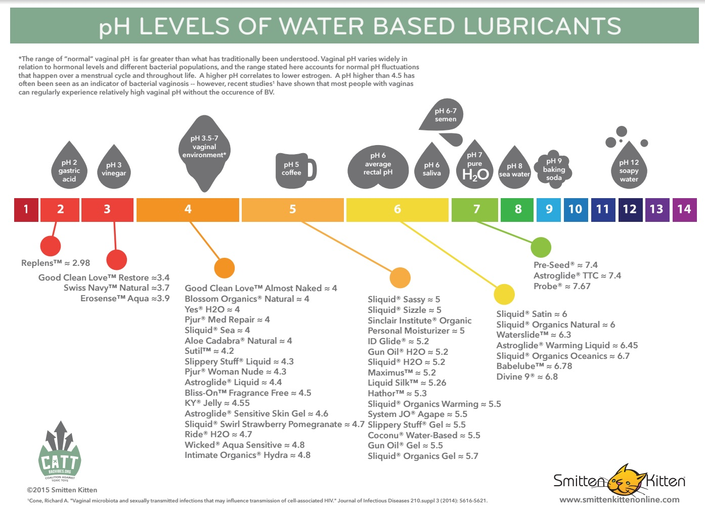

注意：硅基和油基润滑剂没有pH水平，因为它们不含水。

甚至可以使用在商店能找到的非常简单成分在家自制润滑剂。网上有多种配方，但它们大致相同。要在家自制润滑剂，您需要1茶匙植物甘油、1/8茶匙黄原胶和4茶匙水。将植物甘油与黄原胶混合直至完全溶解，然后加入温水（非热水）。此类润滑剂不含任何防腐剂，因此应在几天内使用。

**重要提示**：避免使用含有麻醉剂的润滑剂，它们会阻止您在器官受到长期损伤前感知伤害。如果觉得需要使用麻醉剂，那么需要花更多时间预热和训练肛交，而不是麻醉阻止您造成严重损伤的疼痛。

许多初学者忽视润滑剂的重要性，一般规则是润滑剂不会太多（尽管不要试图找到润滑剂量的极限，它可能确实存在）。不使用足够润滑剂的缺点是可能的损伤和不适，但使用过多润滑剂的缺点是稍微更混乱，这种比较应让您知道安全总比后悔好。初学者可以使用的一个巧妙技巧是在肛交预热前使用"润滑剂注射器"，您可以填充此设备（[示例](lube_shooter.jpg)）润滑剂，将其插入肛门并在内部释放润滑剂。这不仅相当唤起，这足以确保预热时有足够的润滑剂。预热期间，您应该将润滑的手指（或小性玩具）插入肛门，但直肠中的许多区域尚未润滑，因此进行"润滑注射"将大大有助于润滑。

许多热情的肛交爱好者喜欢使用肛塞进行长期肛门拉伸，但他们最终遇到大多数润滑剂干得太快的问题（即使是油基的）。此问题及类似问题的解决方案是结合润滑剂，其中您想延长润滑剂的顺滑效果。考虑先在性玩具上使用水基润滑剂，然后在仍然顺滑时在其上使用油基润滑剂，这是许多人用来延长润滑剂顺滑度的巧妙技术。

*提示*：考虑获取可以单手使用的润滑剂。使肛交游戏更容易。

**重要提示**：润滑剂的pH水平很重要。对于肛交，最好寻找pH在6-7之间的润滑剂，但对于阴道性交，最好寻找pH在4-5之间的润滑剂。如果使用阴道润滑剂进行肛交，可能会感到灼烧感。如果使用肛交润滑剂进行阴道性交，可能会感染。有些人对此不太敏感。

注意：未精炼的椰子油和荷荷巴油被认为pH水平约为7，适合肛交。注意油相当难清洁。

# 预热准备

您听到初学者的大多数抱怨和问题很可能由不当预热引起。通常，预热是让身体（此处指肛门和直肠，甚至结肠）为肛交做好准备的过程。许多人喜欢忽视此过程的重要性，因为它需要时间，他们认为这些时间本可用于实际肛交，但这是非常错误的假设。您应更关注预热，最令人信服的理由很简单：预热将是区分肛交体验的关键因素——是充满沮丧、不适甚至损伤的经历，还是愉悦难忘的经历。随着时间和经验的积累，您可以发展出适合自己的预热程序，但对初学者来说，花额外时间确保准备充分非常重要。

虽然有许多可能的预热程序，我们将仅关注其中几种，因为它们似乎最受欢迎且最适合初学者，但这些方法甚至可以帮助更有经验的人。预热没有严格的时间限制，但考虑至少花费5分钟进行预热，初学者应花费更多时间，或直到能够轻松将至少两根手指插入肛门，但这不应成为目标，而应作为可以进入下一预热阶段的指标。

让我们将预热分为三个阶段：

- 肛门括约肌预热
- 直肠预热
- 直肠乙状结肠交界处预热（可能不需要，取决于肛交游戏的期望深度）

在第一阶段，应专注于肛门括约肌以确保它们放松。当能够几乎不用力将至少两根或更多手指插入肛门时，此阶段可结束，手指应轻松滑入。如果计划插入更大的玩具，请考虑从非常小的直径（一根或两根手指）开始预热，逐渐增加直径至接近目标直径（所有手指、部分拳头甚至整个拳头，也可以使用不同直径的各种玩具）。下面我们将介绍几种可用于预热肛门括约肌的方法，您可以选择其中一种方法或混合多种方法。

**重要提示**：肛门组织非常脆弱，指甲等尖锐物体容易造成小损伤。为避免损伤，请考虑修剪并使用指甲锉平滑任何粗糙边缘，但更好的是，每当用手指插入自己或伴侣时，使用橡胶手套（如丁腈手套）。

挤压法：最初拉伸两个肛门括约肌的最佳方法之一，且非常容易学习。如我们在[解剖结构](#Anatomy)章节所学，我们有两个肛门括约肌（外括约肌和内括约肌），但我们只能直接控制外肛门括约肌（可见的那个）。此方法依赖于能够放松外肛门括约肌，并允许部分手指在到达内肛门括约肌之前进入肛门。当手指部分进入时，开始尽可能用力挤压肛门（这是[PC肌](#PC_muscle)章节的练习将有所帮助的地方）几秒钟，然后通过停止挤压来放松肌肉。停止挤压时，应感觉手指几乎无压力地滑过内肛门括约肌，有些人描述为手指被肛门吸入。当手指通过内肛门括约肌后，开始将手指拉向一侧（向上或向两侧），您会注意到可以更大程度地拉伸肛门。重复此过程，将手指部分插入，开始挤压，停止挤压时开始拉手指以张开肛门。感觉肛门被拉伸后，用两根手指重复此过程。可以用更多手指甚至性玩具重复此过程。此方法非常适合初学者，因为它非常简单且很难误用。此方法也适合那些跳过肛门训练数周且肛门括约肌随时间收紧的人。此方法可用于任何姿势，也可用于伴侣。记住深呼吸并保持放松心态。搜索"Anal Play 101 with Kenneth Play and Riley Reyes (Sex Hack how To)"可找到此方法的视频演示。

注意：别忘了，您需要润滑剂！

捏掐法：更高级的方法，需要拉伸并放松内外肛门括约肌（考虑先进行挤压法），涉及肛门周围的捏掐动作。此方法依赖于在肛门上施加轻微压力，通过轻轻"捏掐"外肛门括约肌来触发肌肉放松。要执行此方法，应进入狗爬式姿势并脸朝下趴着（[示例](pose_doggy_facedown.jpg)）。用一只手触及肛门，将食指和中指插入外肛门括约肌外，将拇指放在肛门外部（想象制作黏土捏制陶器）。开始轻轻捏掐外肛门括约肌，并在肛门周围移动捏掐，也可以使用摩擦动作（滚动关节）或轻拍动作，或任何您觉得更愉悦的动作。捏掐时，通过轻微前后移动身体创造小的摇摆动作。一段时间后，应感觉到空气能够进入直肠，并感觉两个肛门括约肌完全放松张开。从这里可以进入更高级的方法——排气法。记住深呼吸并保持放松心态。

注意：别忘了，您需要润滑剂！

手指至拳交法：此方法涉及逐渐增加用于拉伸肛门括约肌的手指数量，以便能够容纳自己的拳头。此方法很可能对想要玩更大玩具或拳交的经验者有用，但初学者也可以使用此方法为自己进行更雄心勃勃的肛交游戏预热，因为此方法高度可调。此方法要求您处于舒适的姿势，允许双手轻松触及肛门，当别人用手指拉伸肛门肌肉时操作更简单，但此方法可能让伴侣拉伸得比您通常能承受的更远，因此确保伴侣了解您的极限。如果自己执行此方法（推荐），则很可能处于脸朝下的狗爬式姿势（[示例](pose_doggy_facedown.jpg)）、腿绕头姿势（[示例](pose_legs_behind_head.jpg)）、蜷曲天使姿势（[示例](pose_curled_angel.jpg)）、摇马姿势（[示例](pose_rocking_horse.jpg)）或其他姿势，任何您觉得舒适且能够用双手触及自己肛门的姿势。找到舒适姿势后，开始用一根手指插入肛门，缓慢增加到两根手指，直至四根手指。使用圆周运动并向肛门两侧施加压力，用轻微力将其张开。如我们在[解剖结构](#Anatomy)章节所学，直肠有指向腹部肌肉（胃部）的特定角度，认识此曲度并以匹配直肠角度的方式弯曲自己的手。当达到四根手指时，从第二只手引入额外一根手指，增加至8根手指，但不要使用太大力量，应能够几乎不用力滑入这些手指，而是专注于放松肌肉。当能够插入所有8根手指时，尝试轻轻向相反方向拉双手以张开肛门，应感觉到更大的拉伸。感觉肛门拉伸足够后，考虑尝试将整个拳头插入肛门，并尝试轻轻拳交以进一步拉伸肛门。虽然此方法听起来非常高级，但它高度可调，应能够为初学者调整此方法以将肛门拉伸到适当直径。记住深呼吸并保持放松心态。搜索"Anal Training Vol. 5 Fisting - Mohawk Molly"可找到此方法的视频演示。

注意：别忘了，您需要润滑剂！

排气法：此方法应与其他方法结合使用，首先拉伸张开肛门（推荐捏掐法，但其他方法也有效）。此方法的原理是仅使用空气故意制造非常响亮的排气声。开始预热时，需要进入脸朝下的狗爬式姿势（[示例](pose_doggy_facedown.jpg)），并开始使用上述方法之一拉伸肛门，直到感觉直肠充满空气。用嘴吸气（使用太阳神经丛肌肉），使腹部肌肉向地板下垂，以用直肠/结肠吸入更多空气。充满空气后，再次使用太阳神经丛肌肉推出空气（想象试图吸气收腹），应开始听到响亮的排气声。学习使其更响亮，但避免通过收缩周围肌肉对直肠施加压力，仅使用太阳神经丛肌肉。如果肛门再次闭合，重新执行先前方法之一以再次打开它。此方法相当高级，但大多数人可以学习它，它被认为是高级的并非因为复杂性（它非常简单），而是因为其用例，因为此方法为非常深的肛交游戏准备身体，此方法也可用于预热直肠和直肠乙状结肠交界处，因为它放松所有这些部位。记住深呼吸并保持放松心态。

拉伸内外肛门括约肌后，应能够插入期望的性玩具或阴茎而不感到疼痛、不适，且几乎不使用任何力量，相反，每当将物体插入肛门并拉伸更宽时，应感到相当愉悦的感觉，但尝试将物体插入更深时可能感到一些不适。为减少不适，必须预热直肠，但不是拉伸更宽，而是必须专注于使其"更直"。如我们在[解剖结构](#Anatomy)章节所学，直肠略微弯曲，并且有三个皱襞，为直肠创造有角度的S形。拉直过程仅在一定程度上有效，但这足以减少不适。以下列出两种可用于预热直肠的方法。

假阳具法：先前在[解剖结构](#Anatomy)章节中提到，直肠有特定角度，但如果以性玩具基座更指向阴茎/阴道的方式插入，则更容易插入玩具。要利用直肠的自然曲度预热直肠，只需以一定角度缓慢插入性玩具，让玩具在直肠内停留一段时间，您可以在此处查看角度示例[此处](anatomy_rectum_angle_dildo.jpg)。一段时间后应感到轻微缓解，此时可以开始向各个方向"摆动"玩具，仿佛试图将直肠向各个方向张开。这种摆动动作试图拉直肠的横襞。初学者常见的一个问题是，肛交期间感到强烈推动物体向外的冲动，在许多情况下，这种不适由不当的直肠预热引起，并且对直肠横襞边缘施加很大压力，尽管这不是不适的唯一原因。为减少外部物体对横襞的压力，继续以摆动动作使用性玩具（最好是直的），短暂停顿让身体适应外部物体，继续摆动动作，并逐渐包括短而慢的抽插，并开始缓慢插入。一段时间后，应感觉到性玩具进入直肠而没有任何不适。记住深呼吸并保持放松心态。以下提供一个简单图示，说明应如何调整性玩具角度，使其大致位于横襞中间：

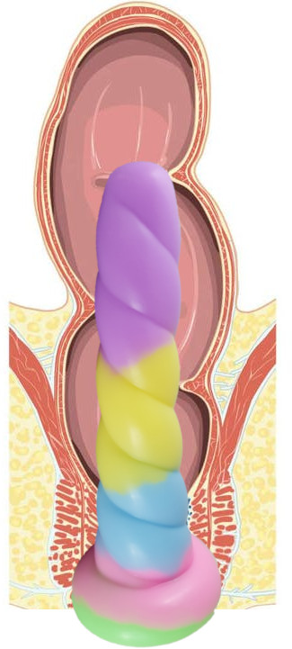

注意：别忘了，您需要润滑剂！

肛塞法：许多人报告使用非常特定的肛塞取得巨大成功，显然它通过向横襞施加轻微压力以保持其平直的方式起作用。确切的玩具称为"Doc Johnson Mood - Naughty 2 XL"，特别注意名称和尺寸，这非常重要，因为其他型号和尺寸似乎没有此效果。肛塞长15厘米（6英寸），宽3.8厘米（1.5英寸），这不是一个小玩具，并非每个人都能将其用于预热。此玩具也作为预热肛门括约肌进行肛交的好方法，但通常此玩具对初学者不太适合。要使用此玩具进行预热，只需缓慢将玩具塞入肛门并完全插入，注意玩具的曲度以匹配自然的直肠角度。此方法的缺点是可能需要30分钟甚至一小时才能感受到效果，但您可以在不完全专注于肛交时自由使用此玩具，意味着可以在肛交前很长时间插入玩具并仍从中受益。此方法也可能放松直肠乙状结肠交界处，如果未进行完全灌肠，请注意此可能性。

注意：别忘了，您需要润滑剂！

排气法：先前描述，此方法也可用于放松直肠，但也可放松直肠乙状结肠交界处。如果未进行完全灌肠，请注意此点。

预热直肠后，您已准备好进行实际肛交。但如果对肛门深度游戏感兴趣，需要完成最后一个预热阶段。此处的深度游戏指任何长度达到直肠乙状结肠交界处的性玩具，较短的玩具可能不需要预热直肠乙状结肠交界处。请记住，直肠长度可在15厘米至30厘米之间，确定长度只是尝试不同长度物体的问题，15厘米在某些地区可被视为平均阴茎尺寸，但也能找到更长的阴茎，这意味着有可能确实需要预热直肠乙状结肠交界处以减少不适。如我们在[解剖结构](#Anatomy)章节所学，直肠乙状结肠交界处是一个非常尖锐的弯曲，由结肠在静息状态下的位置形成，但如果将直的性玩具插入直肠，玩具的顶端可能开始"戳"直肠壁并引起很多不适。为消除此不适，需要学会放松结肠并使直肠乙状结肠交界处形成的弯曲不那么尖锐，遗憾的是此肌肉不能按需控制，而是人们学会了间接控制它。

放松结肠需要练习，遗憾的是建议不多，但您可能仍发现以下信息有用，并找出适合您的程序。首先让我们记住，蹲姿非常好地对齐结肠与直肠（[示例](anatomy_rsj_squat.jpg)），您可以使用此姿势减少直肠乙状结肠交界处的角度，并开始使用更长的性玩具将玩具插入靠近直肠乙状结肠交界处。小心开始抽插玩具，但不要使用太大力量，因为直肠乙状结肠交界处以外的区域更脆弱且没有很多神经末梢，意味着容易造成损伤。可以将性玩具留在那里一段时间，让身体适应外来物体。此时目标不是将玩具推过直肠乙状结肠交界处，而是让其停留在交界处附近，让身体在外来物体存在下放松结肠。

另一个可以利用的优势是轻微收缩。身体对收缩动作有反应，因为它是想要排便的信号，这将触发放松结肠、放松横襞、放松肛门括约肌和其他变化的连锁反应，但这仅在您```不```施加很大压力时有效。许多人在肛交期间也使用此方法，他们轻微向外推动外来物体（想象坐着时放松肛门括约肌，可以感觉到轻微收缩）。

另一个可以做的调整是处于使身体向相反方向弯曲直肠乙状结肠交界处的姿势，这可以在半狗爬式/半蹲姿势中完成，在瑜伽中称为"牛式"，但需要修改——需要看向右肩后方。在此姿势中，弯曲上半身，使直肠乙状结肠交界处与肛门对齐并减少肛直角。半蹲姿势给您轻微优势，因为您在所有方向上对齐结肠，尽管这不如完全蹲姿有效。在狗爬式姿势中进行肛交时，修改为看向右肩后方，您会发现此姿势也有帮助，因为它仍然对齐结肠并拉直肠乙状结肠交界处（不含驼背）。您可以在此处找到姿势示例[此处](warmup_shoulder.jpg)及直肠和结肠对齐图示。

先前提到的"排气法"也适用于放松直肠乙状结肠交界处，请考虑将其纳入您的程序。

最后，我们可以推荐使用非常柔软和灵活的性玩具插入直肠乙状结肠交界处，但这必须在开始放松结肠后进行，不能强迫性玩具通过直肠乙状结肠交界处，因为它会对肌肉和结肠施加很大压力。那些参与深度拳交的人的一个常见错误是依赖力量拉直直肠乙状结肠交界处形成的弯曲，换句话说，拳交给予者将拳头深深插入直肠，并用力强迫结肠变直，但这非常危险，在许多情况下导致严重损伤。必须在将玩具插入直肠乙状结肠交界处之前通过其他方式拉直肠乙状结肠交界处。想法```不是```抽插玩具，而是轻轻滑过直肠乙状结肠交界处并让玩具停留在那里。为此，需要使用与肛门深度训练中相同的玩具，此类玩具的示例可在后续章节中找到。

**重要提示**：将性玩具插入直肠乙状结肠交界处后，```不要```突然移动或突然收缩肌肉。性玩具将阻止结肠完全恢复直肠乙状结肠交界处的角度，并对肌肉造成很大压力。这将导致剧痛和潜在损伤。

此时，您应已放松并预热内外肛门括约肌、直肠，以及根据选择甚至结肠。应能够插入期望的性玩具、阴茎或拳头，但如果不能，则要么预热不当，要么正在经历性玩具引起的刺激。在后续章节中，我们将讨论材料选择以减少进一步不适的机会。如果感到推动性玩具或阴茎向外的冲动，则有问题，此不适不太可能自行消失，应重新评估预热程序并重试。

注意：色情明星是专业人士，您看到的场景并未展示他们如何进行了大量预热（可能甚至数小时的准备）。他们训练有素且经验丰富，仅仅因为他们可以将圆球或性玩具完全插入直肠，并不意味着您也能做到。专业演员能够执行此类特技，因为他们已经练习多年，并学会了如何放松肌肉以防止尴尬的就医。

# 肛门按摩

肛门按摩是一种特殊形式的按摩，专注于刺激肛门周围及部分直肠内的神经。这项活动听起来可能像是肛门肌肉的简单预热和增加性唤起的方式，但肛门按摩有一个非常重要的特点——它可以教会一个人喜欢肛交。

肛门有非常密集的神经末梢，对于从未触摸过该区域的人来说，一次触摸有时会感觉强烈。从未有过肛交经历的人通常不觉得肛交非常愉悦（即使肌肉放松且肛交接收方不感到疼痛），在大多数情况下，这是由于此人不习惯肛门被触摸的感觉。肛门按摩是让此人习惯这种感觉的好方法，通过缓慢开始并将肛门区域的触摸感觉与愉悦联系起来，您可以（可能）教会某人喜欢肛交（当然，需经同意）。

**重要提示**：对女性进行肛门按摩时，防止任何液体从肛门流向阴道非常重要，因为这可能导致感染。最好用毛巾或其他物品遮盖阴道，以防止任何润滑剂或液体从肛门滴向阴道方向。

对一个人进行肛门按摩时，此人可以使用灌肠或其他方法清洁自己，但这不是必须的，此人应事先通过上厕所排空肠道，并且只要此人饮食良好，就不应出现粪便块。清洁后（或仅使用厕所后），考虑使用湿巾从外部清洗该区域。将此人放在床上、按摩桌或任何他们觉得舒适的表面上，将此人置于舒适的姿势。可以尝试的一些姿势是"瑜伽婴儿式"，可以尝试趴着，可以尝试侧躺并将一膝拉向胸部，或任何其他姿势。重点是确保此人舒适，考虑事先进行全身按摩。

*提示*：使用枕头让此人感觉更舒适，对于大多数姿势，胸部下方的枕头将增加舒适度。

注意：与任何按摩一样，考虑使用按摩油。对于内部肛门按摩，考虑使用润滑剂，油基和硅基润滑剂对肛门按摩效果最佳。

从臀部区域开始按摩，在臀部区域周围使用轻微但明显的抚摸，不要过于轻微，需要施加一些压力来按摩肌肉。与此人沟通以更好地了解需要施加多少压力，询问增加压力时感觉更好。有时此人甚至需要很大力量在臀部上才能通过臀部脂肪感受到压力。臀部和腿部的振动对某些人来说也可能感觉愉悦。专注于下背部、臀部和腿部。考虑挤压坐骨（臀部下部），这些区域非常敏感，可以带来很多感觉。

尝试用手轻轻以圆周运动张开臀部，或尝试轻轻相互摩擦臀部。尝试用热或冷空气吹肛门区域以带来不同的感觉，询问此人觉得什么更愉悦。尝试按摩尾骨，该区域不需要很大压力，因为皮肤非常靠近骨骼，但需要注意此人开始感觉到您正在按摩该区域的迹象，因为也可能未施加足够压力，考虑询问此人是否希望在该区域施加更多压力。

*提示*：增加压力并让此人说"停"当压力过大时，以找到此人偏好的压力程度。

注意：进行内部肛门按摩（以及外部肛门按摩）时，您会想要使用手套，但请确保尺寸合适。指尖的小褶皱可能感觉不愉快。记住使用不含刺激性材料的手套，考虑使用丁腈手套，因为有些人对乳胶过敏。

缓慢引入对肛门的触摸。引入对肛门刺激的一个非常简单的方法是简单地将手指放在肛门上并保持一段时间，询问压力感觉。尝试沿着臀部中间滑动您的手。毛发生长方向在身体周围变化，此人会发现沿毛发生长方向的按摩最愉悦，对于臀部区域，毛发通常向上生长，大腿后部也向上生长。用手在肛门上振动，同时用另一只手握住臀部，可能非常愉悦。尝试在肛门上使用松散的拳头以引入不同种类的振动。

*提示*：鼓励此人深呼吸并缓慢呼吸以增加放松。

用手指抚摸肛门，尝试使用以下动作：

- 肛门周围的圆周运动
- 用手指在肛门周围做爬行运动
- 用手侧滑动运动
- 按压运动
- 上下运动
- 用拇指从两侧拍打肛门

注意：人们习惯于刺激，但不要过于频繁地改变动作。允许此人适应感觉，然后改变。

用拇指在肛门上挑逗此人，寻找肛门放松的迹象，因为此人愿意允许进入。用拇指施加足够压力，使其即将进入，但不要立即推入，在进入前挑逗此人。当此人放松外肛门括约肌并允许拇指进入后，让拇指停留在内肛门括约肌前，同时用另一只手按摩臀部。考虑移开拇指，继续肛门周围的运动，然后多次返回将手指插入肛门。将食指插入内肛门括约肌，并让其停留一段时间。您可以要求此人挤压手指然后放松，以允许手指进一步滑入。

手指进入后，考虑使用圆周运动、上下运动、按压（勾引）运动和肛门内的振动。记住用另一只手按摩臀部，尝试揉捏、按压或轻拍动作以增加变化。考虑用手指在肛门周围施加压力进出滑动。考虑切换到拇指以执行类似动作、揉捏动作、圆周运动、滑动运动等。靠近胃部（非尾骨）的直肠部分对大多数人来说更具刺激性。您可以随时将手指从肛门移开，继续外部按摩。

*提示*：当您引入新的按摩动作且此人改变甚至停止呼吸时，很可能您的新动作是此人不喜欢的。

肛门按摩是向初学者介绍肛交游戏的好方法，您可以将其用作预热或作为一种放松形式。它是前列腺按摩的绝佳补充，因为您可以刺激并放松接收方。

# 性玩具

性玩具的种类可能仅受想象力限制，它们有各种形状、尺寸、颜色、硬度等特征，但我们可以做一些分类，以便您更有机会找到完美的性玩具。您可能可以跳过购买性玩具，仅依赖自己的手指（或伴侣的手指），或依赖伴侣的阴茎，但如您在[预热](#Warmup)章节所见，使用专门的性玩具为肛交预热要容易得多，它们还能为您的性生活带来全新的感觉。以下列出肛交中最常见的性玩具类型的综合列表。

假阳具：可能最常见的性玩具类型，是类似阴茎形状或任何尺寸或长度的物体。有写实假阳具、实心假阳具、双头假阳具、带吸盘假阳具、带睾丸假阳具、射精假阳具、振动假阳具和各种变体。它们通过对直肠壁施加压力和通过插入刺激周围神经来带来感觉。选择```不是```完全光滑的假阳具非常重要，这听起来可能违反直觉，因为直肠组织脆弱，但表面缺乏任何变化会使刺激效果降低，因此最佳选择是获取具有非常明显血管和龟头的写实假阳具。确保选择具有防脱底座的假阳具，以减少玩具意外完全滑入肛门的风险。

振动棒：这是一种通常看起来像超大号长子弹的物体，它们通过振动带来感觉。它们可以有各种形状或尺寸，有些是遥控的，有些有多个振动马达，有些有温和振动，有些有强烈振动，有些安静，有些响亮。它们通常表面光滑，这使得大多数振动棒对肛交不是非常有用，但这并不意味着不能使用，您仍然可以从这些振动中获得刺激，尽管此性玩具更适合女性和阴道性交。振动棒很少带有防脱底座，这使得它们在肛交中使用有点危险，因为玩具有滑入太深无法取出的风险。

肛塞：专门为肛交设计的性玩具。它们可以有各种尺寸和长度，也有形状更适合特定任务。肛塞的主要理念是插入并让其保持静止而不从肛门掉出。它们的底座也可以有各种形状，使其更适合各种场合。肛塞在肛交场景中非常受欢迎，值得单独一章，因为有很多需要了解。它们对男性和女性效果都很好，因为它们会在直肠内产生内部压力并拉伸肛门括约肌，许多人觉得这非常性感。有些肛塞具有振动功能，有些肛塞是可充气的，有些有中空中心（隧道）和许多其他变体。这些性玩具甚至用于所谓的"长期塞入"，即将肛塞留置数小时甚至数天，但这需要非常特定的肛塞。

扩张器：通常成套出现，是设计用于治疗女性性疼痛综合征的物体，但也可用于训练肛门括约肌以能够容纳更大的物体进行肛交。这些套装包含多个不同尺寸的类似假阳具的物体，但几乎没有纹理。与具有非常明显球状或龟头的肛塞或假阳具不同，扩张器在整个玩具长度上逐渐增加直径，或仅在顶部有小脊。理念是缓慢使用它们，学会放松肛交（或阴道性交）所需的肌肉，并习惯插入的感觉。确保扩张器有防脱底座，以防止性玩具卡在直肠内。

肛珠：一种由多个球体通过绳子或类似绳子的物体连接在一起的玩具。此性玩具通过在插入或取出玩具时反复拉伸肛门括约肌来创造刺激。虽然此玩具似乎不像假阳具那样产生大量刺激，但打开和关闭肛门括约肌的感觉可能非常强烈，许多人喜欢它。确保肛珠有防脱底部，因为玩具有完全滑入直肠的风险。

前列腺按摩器：这些性玩具专门为男性设计以刺激前列腺。需要单独一章来讨论前列腺按摩器，因为这是男性对接受肛交插入感兴趣的最常见原因。它们可以采取肛塞、假阳具或魔杖的形式。它们可以是振动的或需要手动刺激（由您或伴侣），有一种特殊类型的设备称为"Aneros"（实际上是一个品牌），值得单独一章，因为它掌握了达到前列腺高潮的关键技术。

窥器：医生用于手术目的进入直肠（或子宫）的医疗设备，但许多人发现此设备可用作各种刺激的性玩具。窥器不适合初学者，因为过度张开肛门括约肌很容易受伤。设计不同，但有些设计在插入时表面积非常小，因此对肛门括约肌施加很大压力（[示例](sex_toys_dilator.jpg)），您应寻找插入时表面积大的窥器（[示例](sex_toys_speculum.jpg)）。这些玩具很有趣，通常人们喜欢用它们玩液体。

人造拳头：顾名思义，这些是形状像拳头的性玩具。此类玩具的目的是模仿真实拳头拳交时的刺激。它们可以有各种尺寸，可以是指向手指的拳头，可以是常规拳头形状，甚至可以是多个拳头融合在一起。此玩具只有最进阶的人才能使用，但许多人描述大小和指关节形状产生的巨大压力非常刺激。

深度探针：要进入非常深的区域，如直肠乙状结肠交界处或结肠，您将需要为此目的设计的特殊玩具。这些深度探针高度灵活（它们无法支撑自身重量）且非常长（20厘米以上），通常直径不大（通常约4厘米，这是大多数人结肠最窄点），通常表面没有任何纹理（但有些纹理丰富）。这种特殊性玩具的目的是以尽可能小的摩擦力缓慢滑入结肠，由于玩具高度灵活，它们很容易适应结肠的曲度。肛门深度训练是一个进阶话题，值得单独一章。

绑带式假阳具：类似内裤，允许您在前面安装性玩具。绑带式假阳具的目的是允许女性（或在某些情况下男性）成为（肛交）性行为给予者，而不仅仅是接收者。由于绑带允许您安装几乎任何玩具（具有适当适配器），因此允许（肛交）性行为接收者在体验与人性交的某种真实感的同时，体验广泛的刺激。在购买绑带式假阳具或新性玩具前，注意绑带所需的适配器类型，有些绑带式假阳具包括性玩具。

魔杖：这是一种专门为阴道性交设计的性玩具，遗憾的是振动和此玩具的形状不会比普通振动棒提供更多刺激。

性爱机器：一种可用于插入式性交的设备，这些设备有各种尺寸和功率范围。它们通过放置具有兼容绑带的玩具并使用电动机创造抽插来工作。其中一些设备非常响亮，但有些噪音不大。这些设备可能非常粗暴，使用可能非常危险，因为意外的旋钮转动可能立即使用全力插入直肠并造成严重损伤，性爱机器不适合初学者。大多数性爱机器将带有"Vac-U-Loc"适配器或"XLR"适配器，要使用您的玩具，需要确保它们与性爱机器兼容，您可以购买各种转换器，允许您在性爱机器上使用不同类型的适配器，包括常规吸盘。

灌肠袋：有些人发现在体内有水时非常唤起，因为它会在直肠和结肠的许多区域产生分布压力。您也可以使用灌肠袋将医生办公室的相同刺激带回家。灌肠袋比淋浴头附件安全得多，因为水压不足以造成损伤。

充气玩具：使用充气玩具时必须特别小心。这些是可以充气到更大尺寸的玩具。一方面，它们是很好的工具，可以替代您可能用于肛门训练的许多不同尺寸的性玩具，方便的充气玩具可以节省空间，但这确实存在风险。许多人喜欢在插入时充气玩具并感觉玩具膨胀，但这可能造成损伤，因为您不完全了解尺寸并过度拉伸肌肉。许多人也喜欢充气玩具并将其推出，但这也不推荐，因为您对肌肉施加很大压力，可能随时间导致医疗状况（如痔疮或直肠脱垂）。使用充气玩具的最佳方式是在未插入时充气，然后像普通假阳具或普通肛塞一样使用它们。

还有许多其他性玩具，但它们不值得在此提及，因为它们不常见或根本不适合肛交。上面提到了很多性玩具，但您可能仍然想知道，用于肛交的性玩具应该寻找什么样的特性。最适合肛交的性玩具将由半灵活、表面光滑但带有脊状（如血管和明显的龟头）、柔软材料、对身体安全、易于清洁的材料制成，并且为了最大愉悦，您想要一个具有轻微弯曲、某种程度上匹配直肠自然曲度的性玩具。

*提示*：有时找不到完美的玩具，有些公司根据您的尺寸为您设计定制的"幻想性玩具"。

**重要提示**：你们中的一些人会有使用各种家用物品作为性玩具的想法，但存在损伤和中毒的风险。我们不能推荐使用任何家用物品作为性玩具。如果确实想冒险使用此类物品作为性玩具，至少考虑使用安全套，但记住即使是安全套也会破裂。无论您不购买专用性玩具的原因是什么，请考虑寻找购买高质量性玩具的方法，这些性玩具可以使用多年，性玩具专门设计以带来最大愉悦，家用物品并非为此设计。

## 肛塞

肛塞是肛交的重要组成部分，因为它们带来一种非常特殊的内部压力感，大多数人觉得非常愉悦。肛塞有多种类型，它们有各种形状和尺寸，但这里我们将重点讨论使用肛塞时的几个重要原则。

大多数肛塞具有防脱底座、细颈、宽球体和尖端的独特形状。细颈的理念是您可以将肛塞插入肛门，它不应掉出。肛塞将有足够长的颈，使肛塞的球体正好位于内肛门括约肌上方和直肠开始处，并有充足空间，对大多数人来说，球体将是产生刺激的部分，因为它对周围神经施加压力，并应增加性唤起。肛塞的颈将决定对肛门括约肌产生多大的持续拉伸，颈是大多数人在尝试训练更大直径性玩具时寻找的，因为佩戴较宽颈的肛塞将增加两个肛门括约肌受到的拉伸量。长时间佩戴宽颈肛塞不会非常愉悦，因为肛门括约肌想要恢复到闭合状态，但阻止这将导致一些不适。

肛塞的底座可以是任何形状，但大多数肛塞将带有圆形底座或T型底座。选择哪种形状的底座取决于个人偏好，但如果打算长时间佩戴肛塞，并且坐着时也佩戴，则考虑获取T型底座，它们位于臀部之间，减少对臀部的摩擦，这是对圆形底座的常见抱怨。男性会发现T型底座更具刺激性，因为它们倾向于从外部按摩前列腺，但女性也可能发现T型底座更具刺激性，因为底座的标签可以通过会阴刺激阴部神经。

许多人喜欢使用肛塞对直肠周围的神经进行持续刺激，并创造持续的性唤起，甚至在夜间。大多数肛塞不适合夜间佩戴，并在睡眠时引起很多不适。选择非多孔材料非常重要，以减少引起感染的可能性，但选择柔软材料也很重要，以防止因直肠内有硬物而在睡眠期间受伤。似乎只有一种材料满足这两个要求，那就是硅胶，且肛塞仍需是铂金硅胶肛塞。肛塞爱好者倾向于推荐[SquarePegToys Egg Plug](toys_eggplug.jpg)作为最符合人体工程学且最适合夜间佩戴的肛塞。大多数肛塞在佩戴几小时后会变得不舒服，这可能是由润滑剂干燥并开始刺激内外肛门括约肌引起的。为减少夜间润滑剂干燥的机会，许多人在肛塞上涂抹油基润滑剂（如椰子油），然后在其上添加水基润滑剂，这防止润滑剂完全干燥。

注意：如果感觉肛塞的润滑剂已干燥，可以将肛塞稍微推入肛门，让少量润滑剂从直肠滴入肛门括约肌。

有些人喜欢整天佩戴肛塞，这是可能的，此类人为这种长时间肛塞佩戴做准备。通常，您应有适当的饮食，排便不频繁，粪便应是固体的，这意味着您可以一直佩戴肛塞，并在需要上厕所时立即取出，而不会面临太多不便。人们甚至随身携带少量润滑剂，以便在上完厕所或感觉白天润滑剂干燥后重新涂抹在肛塞上。您需要不时清洁肛塞以防止细菌滋生，并且可以预期肛塞会有非常明显的气味，硅胶和其他类似橡胶的材料很可能随时间产生非常独特的气味，金属和玻璃玩具不太可能产生令人不快的气味。

**重要提示**：选择长期佩戴的肛塞时，材料选择非常重要。塑料材料（如TPE/TPR、果冻胶、PVC等）是多孔的，几乎无法清洁，需要经常清洁性玩具以防止无法控制的细菌滋生，可能导致感染。金属性玩具也存在风险，因为它们可能导致金属中毒，必须确保要使用的肛塞是对身体安全的医用级不锈钢。玻璃玩具被认为是长期使用的安全材料，因为它不是多孔的。另一个考虑是选择柔软的肛塞而不是硬的，白天（或夜间）您会大量活动，硬肛塞有刺穿直肠壁的风险。长期佩戴的最佳选择是使用定期清洁的铂金软硅胶肛塞，但也可以选择玻璃肛塞。

注意：不建议在睡眠时使用非常长的性玩具（如那些通过直肠乙状结肠交界处的玩具）。睡眠期间，您倾向于无意识地移动，结肠和直肠应不受限制地移动，但性玩具可能阻止这一点并对肌肉造成很大压力。最好在睡眠期间仅使用位于直肠浅端的肛塞。

*提示*：有些人长时间使用肛塞可能经历腹泻。为防止此情况，可以尝试使用不同类型的润滑剂（尤其是不含甘油的润滑剂），也可以通过短时间使用肛塞并逐渐增加佩戴时间来培养耐受性。确保不发展成腹泻。

必须特别关注之前提到的称为"Doc Johnson Mood - Naughty 2 XL"的肛塞，它有助于拉直肠的横襞。此肛塞具有独特的形状，作为肛交前的预热效果很好。在肛交前佩戴此肛塞30分钟或一小时，可以大大减少许多人在肛交期间感到的不适。

## 材料

性玩具可以由多种材料制成，这些材料具有不同的特性，导致性玩具有不同的特征和价格范围。有些材料使性玩具更便宜，有些材料使玩具透明，有些材料使玩具极其灵活，有些材料对某些人使用可能危险。购买玩具时，您会遇到一长串可能的材料，更糟糕的是，一些公司将其特殊的不同材料混合物作为自己的材料类型进行营销，使得确定此材料的特性更加困难。

有几个原因使性玩具材料可能使用危险，最常见的是使用多孔材料。由多孔材料制成的性玩具往往便宜得多，因为可以有气穴来增加玩具的体积，但这带来显著的缺点。由于多孔性玩具有小气穴，这些气穴可能是各种细菌的完美滋生地，遗憾的是，即使是专门的性玩具清洁剂也无法完全去除细菌，您可能随时间经历显著的细菌滋生，可能导致感染（[来源](https://www.nytimes.com/wirecutter/guides/how-to-clean-sex-toys/)）。避免的最佳选择是简单避免由多孔材料制成的廉价玩具。

另一个关键方面是，有些玩具可能含有邻苯二甲酸盐。这些是使塑料更柔软的化合物，邻苯二甲酸盐用于各种产品，包括化妆品，但最近对其毒性存在担忧，一些研究甚至发现与神经发育问题、多动症综合征、肾脏损伤甚至生殖器官损伤之间的相关性（[来源](https://noharm-uscanada.org/issues/us-canada/phthalates-and-dehp)）。一些研究甚至声称塑料摄入可能缩小男性阴茎尺寸（[来源](https://www.menshealth.com.au/study-links-plastic-to-smaller-genitals?category=news)）。得出此相关性的研究存在一些注意事项，但为了自身安全，应寻找不含邻苯二甲酸盐的玩具，这通常是公司的强大广告点，因此如果他们的玩具不含邻苯二甲酸盐，他们通常会使其相当明显。

如前所述，公司可以创建自己的混合物以创建新材料，但它们通常属于已知类别。以下列出最常见的```可能```有毒的材料类型：

- TPR/TPE，性用品店最常见的材料，是多孔的，这些玩具有非常明显和强烈的气味，通常非常便宜，较旧的性玩具很可能含有邻苯二甲酸盐，新一代TPR/TPE性玩具可能不含邻苯二甲酸盐。
- PVC，廉价材料，是多孔的，这些玩具有非常明显和强烈的气味，很可能含有邻苯二甲酸盐。
- Fanta Flesh/CyberSkin，这种材料感觉像真实皮肤，但非常多孔。
- 果冻胶，常见材料，因为它高度灵活且便宜，但非常多孔。
- 乳胶，乳胶似乎没有多孔玩具或含邻苯二甲酸盐玩具的相同风险，但许多人对乳胶有过敏反应，出现皮疹、爆发甚至灼伤，首先确保不对乳胶过敏。
- 金属，这种材料不是多孔的，通常相当光滑，但风险源于可能使用低质量金属，这些金属可能有毒，廉价玩具通常由质量可疑的金属制成，应避免。

注意：有些人确实购买这些材料的性玩具，并将性玩具视为一次性玩具。他们使用几次然后扔掉，因为无法正确清洁它们。如果非常喜欢某个玩具，那么只需在性玩具上戴上安全套。

您能找到的大多数玩具实际上确实含有这些材料之一，这使得找到好的性玩具变得复杂。幸运的是，有几种材料```可以```被认为是安全的：

- 硅胶，所有性玩具的首选材料，易于清洁，可以煮沸（用于清洁），可以非常灵活，玩具通常非常昂贵，因为材料不是多孔的且玩具重，确保获取高质量的硅胶玩具，廉价硅胶对身体不安全。
- ABS塑料，廉价材料，但使用安全，它不是非常光滑的材料，需要大量润滑剂，通常非常硬（完全不灵活），
- 玻璃，非常光滑的材料，不需要大量润滑剂，不是多孔的，易于清洁，可以煮沸（用于清洁），但通常非常昂贵且完全不灵活，也存在打破玩具的小风险。
- 木材，不是性玩具的非常常见材料，但只要木材表面光滑就不是多孔的，易于清洁，可以煮沸（用于清洁），它们完全没有灵活性，这些日子可能很难找到。
- 金属，只要知道金属是高质量的，它可以是安全的材料，可能相当昂贵。

遗憾的是，有些情况下公司没有完全披露其材料的纯度，因此引发了一些争议。虽然其中一些争议包括滥用名人，我们只想关注他们使用的材料，由读者决定商业道德对他/她有多重要。以下列出```可能```含有有毒玩具的玩具列表，即使它们宣传为无毒玩具：

- Doc Johnson（已知有些玩具含有邻苯二甲酸盐）

注意：如果公司出现在此列表中，并不意味着他们所有的玩具都有低质量材料。此列表应告诉您在选择性玩具时对这些公司更加谨慎。

选择高质量玩具对自身安全至关重要，但找到高质量的玩具有点困难。幸运的是，我们可以列出目前已知在性玩具中使用高质量材料的公司：

- Bad dragon（铂金硅胶玩具）
- Hankey's Toys（铂金硅胶玩具）
- SquarePegToys（铂金硅胶玩具）
- Sinnovator（铂金硅胶玩具）
- Njoy（316L不锈钢玩具）
- OXBALLS（铂金硅胶玩具）

注意：制作自己的硅胶玩具是可能的，但过程漫长、昂贵且非常复杂。简单购买高质量的硅胶性玩具是更好的选择。

许多参与拳交的人倾向于使用橡胶手套以减少受伤的机会。有些人使用乳胶橡胶手套，但有些人对乳胶有过敏反应。用于肛门拳交（以及手指插入）的相同选择是使用丁腈手套。这些是医生在医疗治疗中使用的相同手套。它们可以有各种颜色，但通常有明显的蓝色调。它们便宜且以大包装出售，被视为一次性手套（[示例](materials_nitrile.jpg)）。

注意：如果经历灼烧感、想要移除性玩具的冲动或一般刺激，则可能对性玩具的材料过敏。因此，最好多花一点钱购买铂金硅胶玩具，而不是购买多个塑料基性玩具，结果发现对它们过敏或它们引起感染。

# 姿势

当我们选择了肛交的"工具"后，应该快速涉及性姿势的话题。任何性姿势都可能以某种方式用于肛交，但有些姿势非常适合肛交，并推荐给初学者。如果我们列出所有可用于肛交的性姿势，列表将需要自己的指南，相反，我们将列出一些值得尝试的常见和有趣的姿势。其中一些姿势适合与伴侣一起，有些适合使用性玩具进行肛交游戏，有些适合两种情况。以下列出各种肛交姿势。

经典狗爬式：可能是最常见的肛交姿势，此姿势适合肛交，因为您的直肠几乎与地面水平对齐。狗爬式姿势有很多变体，但这里我们将关注最常见的变体，即头部与臀部大致水平并拱起背部。这对初学者来说也是一个很好的姿势，因为在此姿势中，您让直肠因重力下垂，并几乎与直肠乙状结肠交界处对齐，此姿势还允许直肠"吸入"空气，并允许仅用空气扩张直肠，尽管在经典狗爬式中此效果最小，但它确实消除了相当明显的直肠壁压力。此姿势还允许肛交接收者前后移动，您可以调节插入深度（尽管不多）。许多性姿势可能很累，但此姿势容易保持，您可以靠在肘部或手掌上休息。许多人在此姿势中倾向于拱起背部，但这会对直肠造成压力，看起来也不吸引人。以下提供此姿势的示例：


脸朝下狗爬式：狗爬式姿势的变体，但不是靠在肘部或手掌上，而是靠在上半身，形成45度角（如果足够灵活，甚至更大的角度）。此姿势需要下背肌肉和臀部的一些灵活性。与经典狗爬式姿势相比，此变体一旦内外肛门括约肌放松，就会"吸入"空气进入直肠和结肠，此效果在此变体中更加明显，并将扩张您的直肠，让您更享受插入。您看到的"巨大肛门张开"的大多数视频通常在此姿势中完成，因为此姿势在肌肉放松时保持肛门张开最多。此姿势中的移动比经典狗爬式姿势小得多。肛交给予者可能需要在你上方而不是与你水平（半蹲姿势），以便他的阴茎角度与您的直肠角度匹配。以下提供此姿势的示例：


站立狗爬式：您不必站立，但上半身的角度使不同狗爬式姿势变体产生差异。此姿势很可能需要一些设备，您需要保持约60度的向上锐角，可以通过让伴侣向上抱住您、靠在墙上或靠在椅子上来创造这样的角度。先前我们提到了一种对齐直肠和结肠的蹲姿变体（[示例](warmup_shoulder.jpg)），相同原理将适用于使您上半身向上的狗爬式姿势。在此姿势中，您的伴侣很可能需要与您的臀部在同一水平。以下提供此姿势的示例：

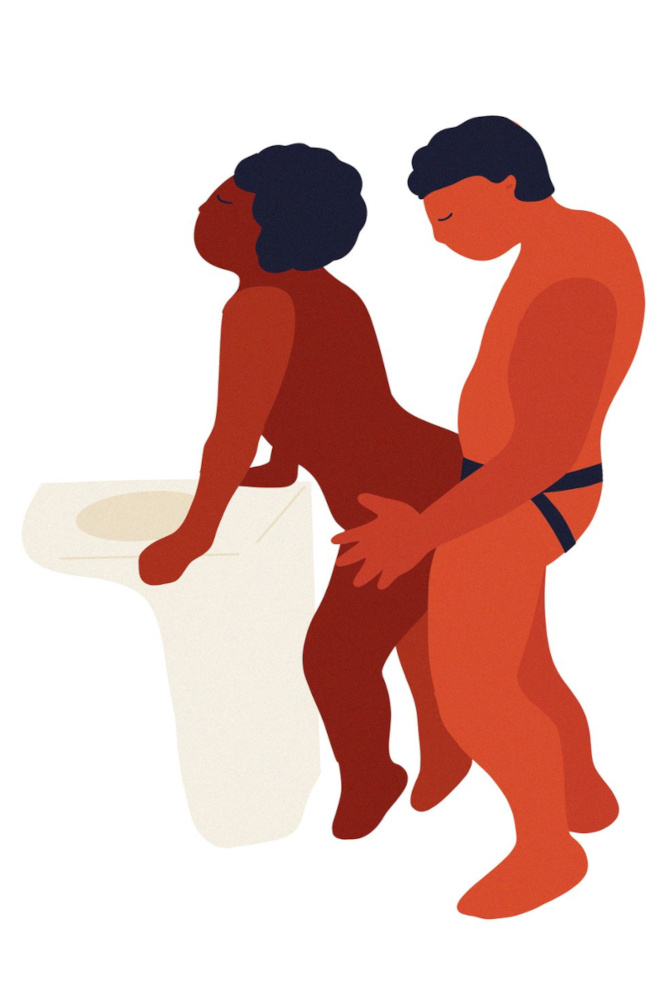

注意：通过调整双腿的宽度（张开腿或保持并拢），您可以改变插入感觉的压力量。如果并拢双腿，您会感觉到直肠壁上的压力更大，但也会增加刺激强度，这是许多人使用的技巧，如果他们发现性玩具或阴茎没有提供期望的刺激量。相反的效果可以通过张开双腿实现，这样可以为更大的性玩具或阴茎分配更多空间，并减少刺激强度。

女牛仔式：伴侣平躺，您跪坐在阴茎或性玩具上。这对初学者来说是一个很好的姿势，因为它将速度和深度的完全控制权交给肛交接收者，强烈推荐给初学者，因为他们可以调整到更舒适的状态。女牛仔式姿势有几个变体，但最常见的是经典和反向女牛仔，它们的不同在于身体的旋转（要么面对伴侣（女牛仔），要么背对伴侣（反向女牛仔））。反向女牛仔略有优势，因为阴茎通常有轻微向上的曲度，这将更好地与您的直肠对齐，但差异可能对每个人不明显。以下提供此姿势的示例：

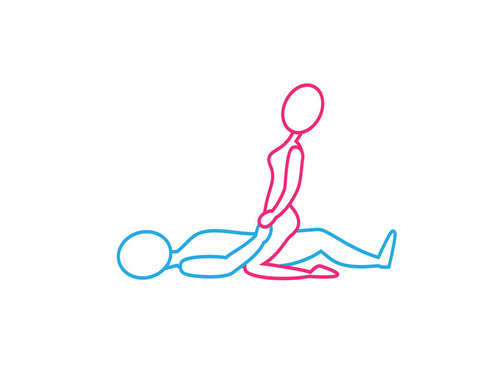

蹲姿：如我们在[解剖结构](#Anatomy)章节先前讨论的，通过蹲下，您自然地对齐直肠和结肠，并且也有放松周围肌肉的反射。蹲姿还分配了直肠中的大量空间，此姿势可能是非常大插入的最佳姿势，许多有经验的人使用它来增加肛门拉伸能力。对于与伴侣的性行为，此姿势可能效果不佳，因为此姿势相当累人，您可能想抓住某物以将身体重量分配到更多位置，您可能发现穿高跟鞋并站在稳固地面上时此姿势更舒适一些。以下提供此姿势的示例：

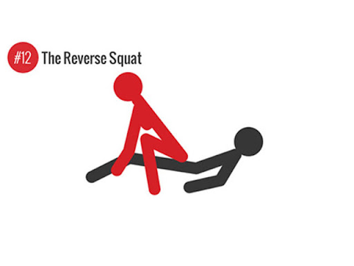

向左倾斜：这是一个特殊的姿势，与伴侣一起做没有意义，但如果您进行肛门深度训练，它非常特殊。在[解剖结构](#Anatomy)章节中，我们了解到结肠弯曲并沿着左侧延伸，结肠形成直肠乙状结肠交界处，并使结肠向左侧弯曲。您可以右侧躺下，帮助重力将结肠向下拉，使直肠乙状结肠交界处的角度不那么尖锐，但也可以弯曲身体以帮助使结肠更直。此姿势有点难以掌握，但您应在某个时候感觉到差异。仰卧并稍微向左倾斜，使右腿在右侧向上推，但左腿可以自由移动，然后弯曲腹部，使弯曲在左侧，此曲度应使结肠向左侧与直肠对齐，并允许您从右侧向左侧在结肠内插入长性玩具。考虑搜索"HotKinkyJo Pink Dress belly bulge"，这位色情明星似乎在每次深度肛交插入时都使用此姿势。

侧卧勺式：这种依偎式的性姿势也适合肛交，因为双腿没有张开，您可以感觉到相当强烈的刺激。这是一个非常初学者友好的姿势，并且有双手自由的优点。直肠的角度也合适，您也不应感到单点的大量压力。此姿势有一些变体，包括抬起一条腿以减少刺激强度的变体。此性姿势对孕妇也相当受欢迎。以下提供此姿势的示例：


还有许多其他姿势可以尝试，但列出的姿势应让您了解未在此列出的姿势的预期。希望您现在理解，为了愉悦的插入，尽可能直地对齐直肠与肛门很重要。您可能想知道，为什么传教士姿势没有列在这里，您现在可能应该理解此姿势不太适合肛交。这并不意味着它不能用于肛交，许多人确实喜欢它，但它有一个缺点，即在直肠和肛门之间形成相当尖锐的角度，这使得较长的插入不舒服，有时甚至疼痛。您可以调整几乎任何性姿势以适合肛交，但如果您记得[解剖结构](#Anatomy)章节中直肠浅端的小延伸，那么插入必须非常浅（仅几厘米深），这在某些情况下可能足够，但需要大量练习以免伤害伴侣。考虑到在此姿势中可能伤害伴侣，这似乎是男性刺激前列腺的可接受姿势，因为您不需要深度插入来刺激前列腺，但您需要意识到角度。

即使有可能的不适，您可能仍然发现传教士姿势非常适合肛交。我们稍后将在[高潮](#Orgasms)章节中了解到，性感带并不很深，通过练习，它可以适合男性和女性。为了在一定程度上减少不适，考虑在背部和头部后面放一个枕头。以下提供此姿势的示例（针对肛交调整）：

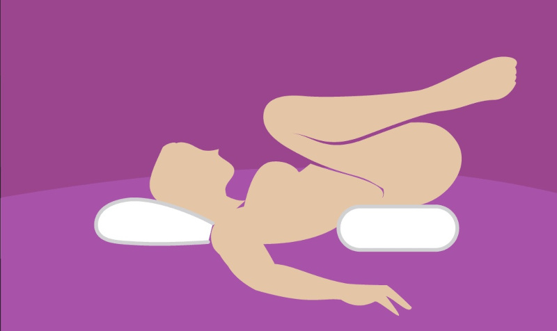

**重要提示**：肛交期间突然移动可能危险。随着时间的推移，您将学会多少移动对您来说是可接受的，以免改变直肠（甚至结肠）的角度，但对初学者来说，建议限制臀部和上半身的移动，以减少疼痛的机会。如果您的伴侣没有经验，那么警告他/她前几次抽插要慢，以便身体适应变化。这对使用性爱机器进行插入的人来说极其关键，这些机器不关心您的疼痛，它们继续以您设置的插入角度插入您，姿势的变化可能导致以不期望的角度强力插入。

# 学会享受肛交

您阅读本指南很可能是因为您的伴侣直接或间接施压要求肛交，或者您想参与涉及肛交的幻想，但您似乎不太享受肛交。您绝不应强迫任何人进行肛交，但如果您对肛交感到好奇，并出于任何原因想更享受它，那么您来对地方了。

当您进行任何类型的肛交游戏时，会遇到各种新的感觉，大多数人不会觉得愉悦，因为他们熟悉使用肛门和直肠排便，换句话说，他们习惯于物体从直肠排出，而不是进入。他们也不习惯肛门周围或直肠内的触摸。他们将直肠内的运动与上厕所联系起来，而不是唤起的感觉。关联是学会享受肛交的关键。

我们可以将享受肛交的旅程分为这些里程碑：

- 享受肛门周围的触摸
- 享受肛门括约肌游戏
- 克服排便反射
- 将肛门刺激与愉悦关联

注意：提到的里程碑应在您独处时达到，如果伴侣施压要求达到这些里程碑，您学会享受肛交的可能性较小。这些里程碑可能需要数周或数月才能达到，不要急于求成。

**享受肛门周围的触摸：** 您应该做的第一步是独处并体验对肛门的简单触摸。此阶段不建议尝试将物体插入肛门。考虑淋浴或盆浴，仅从外部触摸肛门。注意您的感受，承认您正在感受的是对肛门的触摸。继续各种类型的触摸，尝试轻轻摩擦肛门，尝试轻拍它，尝试轻微对肛门施加压力而不将手指插入肛门。玩弄您的肛门。目标是习惯肛门周围的各种触摸。

注意：如果触摸肛门时感到不适，则可能是由于您的思维定势。如果您的思维定势使您将触摸肛门与不适事物关联，那么首先开始思考这些仅仅是触摸。如果发现用手指触摸肛门令人厌恶，则考虑使用手套甚至性玩具。触摸肛门时应感到中性甚至愉悦，而不是厌恶。

**享受肛门括约肌游戏：** 当习惯对肛门的简单触摸后，可以开始将物体插入肛门，物体可以是您的手指或性玩具。不要将物体深插入直肠，仅足以通过内肛门括约肌（通常2-4厘米深）。将物体插入直肠时，应结合[预热](#Warmup)章节中提到的技巧。感觉预热后，应开始缓慢取出物体并缓慢再次插入。目标是创造缓慢持续的运动，让您习惯肛门括约肌收缩和放松的感觉。确保使用润滑剂，不应感到不适。放松思想，注意两个肛门括约肌如何持续收缩和放松。

*提示：* 许多人喜欢剃除肛门区域的体毛，因为体毛增加摩擦量，这可能导致使用阴茎或性玩具进行肛交时愉悦感降低。剃毛不是唯一选择，您也可以使用蜜蜡脱毛拔出体毛。虽然蜜蜡脱毛更疼痛（但可以习惯），剃毛有增加内生毛发和刺激的风险（可以通过适当的护肤最小化）。您也可以跳过脱毛，但那样摩擦量会增加，大多数人说该区域无体毛更愉悦。

**克服排便反射：** 可能是关于肛交的第二常见抱怨是，插入期间人们有排便冲动。这是自然反射，但幸运的是您可以克服它。在前一阶段，您应该习惯物体通过肛门括约肌的感觉，但您可能已经经历了轻微的排便冲动。在此阶段，应将物体更深地插入直肠，并且当开始内外移动物体时，很可能体验到更强的排便冲动。许多人喜欢使用肛塞来克服此冲动，但这仅在开始时有效。最初可以使用肛塞习惯物体在直肠内的感觉（考虑长时间佩戴肛塞），这将在您的旅程中有所帮助（并使其更有趣），但您需要通过运动训练自己。一种方法是使用肛塞并定期模仿插入运动，但更有效的方法是每天（或每隔一天）花半小时用性玩具插入肛门。目标是习惯直肠内的运动。从缓慢运动开始，逐渐增加到更快运动。如果开始感到排便冲动，则减慢速度或尝试将性玩具留在体内直到冲动消失。别忘了润滑剂。

注意：最后两个阶段可以重叠。许多人发现克服排便反射非常困难，但结合前一阶段的原理有很大帮助。

注意：如果直肠不清洁，则更可能经历排便冲动。考虑使用[清洁](#Cleansing)章节中描述的方法。最好避免使用液体清洁自己，因为训练过程需要频繁进行，不建议频繁清洁。

**将肛门刺激与愉悦关联：** 可以说是最重要的阶段。让我们非常清楚，**如果没有对生殖器的持续刺激，您学会享受肛交的可能性非常小**。在此阶段，应将自慰与肛门训练课程结合。原理非常简单，当插入肛门时，摩擦阴茎/阴蒂，但这可能变得有点困难。如果在进行任何类型的肛门刺激时仍然感到任何不适，那么很可能您的性唤起水平下降，刺激生殖器不会有太大作用。应确保可以找到环境、性玩具、视觉或音频材料或任何其他对常规肛门训练课程的补充，以帮助您性唤起。有些人仅从肛交的想法就高度唤起，但有些人在肛交期间需要持续的心理或身体刺激以保持高性唤起水平。目标很简单，通过在肛门刺激时自慰，将肛门刺激与愉悦关联。在肛门刺激时达到高潮。

注意：同时自慰和肛门刺激可能很困难，需要相当多的协调性。继续练习，您将形成肌肉记忆，有助于您的旅程。

当您在自己进行单独肛门游戏时达到所有提到的里程碑后，可以尝试与伴侣进行肛交。要么要求伴侣在肛交期间刺激您的生殖器，要么自己刺激，可以使用手或振动棒，任何您觉得更愉悦的方式。对于免手刺激，可以寻找振动阴茎环（男性）或可插入的阴道假阳具（女性）。

注意：刚开始进行任何类型的肛门游戏时，不要期望通过肛门刺激达到高潮。这需要大量练习和投入。策略```不是```在开始享受肛交后立即切断生殖器刺激，策略是在每次肛门游戏或性行为期间逐渐减少生殖器刺激的量，直到有信心享受肛门刺激超过常规生殖器刺激。更猛烈地撞击肛门不会让您更快达到高潮。

本章仅关注如何学会享受接受肛交，但关于享受给予肛交也有一些内容。肛交是一种癖好，并非每个人都喜欢。如果伴侣不喜欢给予肛交，则应与伴侣沟通并表达您的欲望。如果您向他们展示肛交带给您多少愉悦以及您能带给他们多少愉悦，更可能教会某人享受给予肛交。也可以在您的癖好和伴侣的癖好之间找到妥协，考虑将两种癖好关联，例如，在肛交时穿着性感服装。

*提示：* 肛交是一种癖好。癖好是与性事物的关联。将肛交与性事物关联。

# 重新连接

在上一章中，我们讨论了开始享受肛交需要达到的里程碑，但达到这些里程碑很困难且需要大量时间，可能需要数月甚至数年，取决于个人。虽然熟能生巧，但我们相信您将从本章中受益匪浅，以增加开始享受肛交甚至达到肛交高潮的机会。

您的思想是与各种身体部位连接的复杂事物。每当思想发现唤起的事物时，开始向全身发送信号，尤其是向骨盆区域发送信号。当刺激生殖器时，您向大脑发送信号，如果条件合适，大脑触发高潮。高潮是思想中的事件，而不是生殖器中的事件（[来源](https://www.sciencedirect.com/topics/biochemistry-genetics-and-molecular-biology/orgasm)）。为了更享受肛门刺激，我们需要教导大脑将愉悦与肛门刺激关联。我们需要教导大脑，当我们触摸肛门区域而不是生殖器时，我们想要感受愉悦，如果需要，这是一个重新连接的过程。

注意："重新连接"并不意味着在重新连接过程结束时您将不使用阴茎或阴蒂，它仅意味着更少的阴茎/阴蒂刺激，更多的肛门刺激。尽管没有什么能阻止您同时进行两种类型的刺激。本章仅关于教导您更享受肛门刺激。

想法非常简单：在接受更多肛门刺激和更少阴茎/阴蒂刺激时达到高潮。在数月或数年的时间跨度内重复此过程多次。假设您非常一致地进行游戏课程，例如您的自慰课程可能如下（记住，这不是严格的）：
课程1：像往常一样开始自慰，在课程中期决定触摸肛门，甚至按压它，然后在感觉合适时正常达到高潮
课程2：像往常一样开始自慰，在课程中期决定通过尝试将手指插入肛门来挑逗自己，然后在感觉合适时正常达到高潮
课程3：进行肛门预热，然后开始自慰，在肛门周围画圈，然后挑逗自己，之后将手指更深地插入肛门。然后在感觉合适时正常达到高潮，同时手指在肛门内。
课程4：进行肛门预热，然后开始自慰，决定尝试插入两根手指并玩弄肛门，之后在感觉合适时正常达到高潮，同时两根手指在肛门内
课程5：进行肛门预热，然后开始自慰，抓住性玩具并缓慢抽插，同时用阴茎/阴蒂自慰。然后在感觉合适时正常达到高潮，同时性玩具在肛门内
课程6：进行肛门预热，然后开始自慰，使用性玩具探索直肠内的各个区域，在刺激阴茎/阴蒂时进行抽插。之后在感觉合适时达到高潮，同时刺激肛门区域和生殖器。
课程7：进行肛门预热，然后开始自慰。抓住性玩具，但现在刺激肛门，并短暂停止刺激阴茎/阴蒂（可能将手从生殖器移开），然后返回刺激生殖器。之后在感觉合适时达到高潮，同时刺激肛门区域和生殖器
课程8：进行肛门预热，然后开始自慰。进行常规肛门刺激，但这次尝试在刺激阴茎/阴蒂时接近高潮，然后停止。让身体平静下来，但继续刺激肛门。然后返回刺激阴茎/阴蒂（边缘控制），不要停止肛门刺激太长时间。之后在感觉合适时达到高潮，同时刺激肛门区域和生殖器。
课程9：进行肛门预热，然后开始自慰。刺激肛门，接近高潮，然后停止并重复（边缘控制），但这次尝试减少阴茎/阴蒂刺激的量。之后在感觉合适时达到高潮，同时刺激肛门区域和生殖器
课程10-50：进行肛门预热，然后开始自慰。更多肛门刺激，仅短暂触摸生殖器以感觉更接近高潮。之后在感觉合适时达到高潮，同时刺激肛门区域和生殖器
课程51-100：进行肛门预热，只是觉得不需要自慰，仅仅享受对肛门区域的每一次触摸，有时通过刺激生殖器将自己推向高潮

阅读此抽象计划后，我们需要提取一些关键点：

- 在肛门刺激时达到高潮至关重要
- 边缘控制极其有效，让自己接近高潮，然后停止，但继续刺激肛门
- 如果能通过短暂触摸生殖器将自己推向高潮，那么您走在正确的轨道上
- 对女性来说，可能刺激G点或A点而不是阴蒂，但这取决于个人的偏好
- 在许多课程的时间跨度内，逐渐减少生殖器刺激的量，增加肛门刺激

重新连接过程还有另一个关键组成部分。大多数女性由于各种原因在此过程中会更成功，但男性往往对此感到困难。简单来说，大多数男性认为，如果想达到高潮，只需更用力摩擦阴茎，但这在肛门愉悦方面不起作用（至少在开始时）。当涉及肛门愉悦时，感官体验是关键，女性往往更擅长为自己创造这些体验。如果不熟悉为身体创造此类体验，别担心，本指南为您提供帮助，请继续阅读。

**重要提示：** 学习享受肛交时，不要开始快速抽插性玩具或手指。肛门不像阴茎，不要更用力摩擦以达到高潮，它不是那样工作的。您将需要大量时间，甚至数月，才能最终享受肛交到可能导致肛交高潮的水平。想象每次肛门游戏时进行一次缓慢的感官按摩，而不是快速冲刺。也许有一天您会享受非常粗暴的肛交，但强烈建议您缓慢开始，需要缓慢探索身体。这甚至与可能严重伤害自己无关，这只是建议您缓慢学习。许多男性简单地忽略这一点，几乎无法达到甚至被认为是轻度肛门愉悦的任何事物，不要像他们一样，缓慢进行。

让我们给您一个关于"重新连接"课程应如何进行的视角（尽管每个人不同，可能有不同的体验）。您到舒适的地方，思想开始增加性唤起水平，开始触摸身体，身体对触摸变得敏感。缓慢开始刺激私密区域（阴茎和/或肛门），并缓慢增加强度。开始玩弄肛门，缓慢插入手指或性玩具，让身体适应感觉一段时间。然后开始用手指或性玩具进行缓慢运动，开始感觉很好，因此继续缓慢进行小的抽插、画圈或其他类型的运动，并一直思考感觉多么美好。另一只手继续刺激身体的不同部位，胸部、腹部、颈部，任何您喜欢的地方。几分钟后尝试不同的运动或增加强度，继续享受如何通过肛门带来各种感觉。通过改变抽插或运动来探索更多感觉，尝试不同的角度和速度，但从不用力按压任何东西，从不快速进行。只是想享受每一种微小的感觉。开始注意到各种感觉，手如何滑动，床单如何摩擦皮肤，如何呼吸，一切都为您的愉悦做出贡献。阴茎/阴蒂不时用来增强愉悦，但不是焦点。肛门区域将获得更多关注，但不要过度关注它，应关注整个身体。

有一个大型社区参与称为"高潮剥夺"的癖好，即剥夺个人的高潮。一个有些相关的癖好称为"仅限肛交生活方式"，大致定义为避免阴茎-阴道性交的欲望。我们将在后面的章节中讨论高潮剥夺，但现在不要将高潮剥夺用于重新连接过程。虽然有些人可能能够享受肛交，并且重新连接过程对他们来说可能非常快，但大多数人需要肛门和生殖器刺激一起达到高潮。在某个时刻，您可能发现这极其唤起，但现在——享受带肛门刺激的高潮。

# 高潮

当一个人达到高潮时，身体经历许多不同的过程，但达到高潮可能相当令人沮丧。为了增加达到高潮的机会，我们首先学习了生殖器官的解剖结构，但现在应讨论什么```可以```触发身体的高潮。由于男女生殖器官区域的解剖结构差异很大，高潮的细节将分为两个章节，每个性别一章，但首先有一些相似之处需要考虑。

我们必须首先承认肛门如何充满大量神经末梢，这使得肛门周围的任何刺激立即被察觉。直肠周围的区域也充满神经末梢，但直肠的内壁提供了我们可以通过直肠靶向刺激的器官的通道。

虽然接下来的章节将分为与女性相关的信息和与男性相关的另一章信息，但它们仍共享一些有用的信息，并且您可能会发现适用于相反性别的技术。此外，您永远不知道这些信息何时也会对您有用。

通过肛门刺激达到高潮的最常见错误之一是强迫它。花时间享受刺激至关重要，但许多人似乎无法达到高潮的更常见原因是给肛门肌肉造成很大压力。当您有推动性玩具或阴茎向外的冲动时（想象您吃了辛辣食物，现在它刺激了您的直肠，您使用很大力量将所有东西推出），这表明您做错了什么。有些人倾向于继续直到通过阴茎或阴道泄漏某种液体，但这更可能是由于直肠壁刺激引起的强迫肌肉收缩，而不是由于实际高潮。为防止这种刺激，必须回到[预热](#Warmup)章节，确保已适当预热肌肉，初学者应考虑尝试狗爬式姿势以减轻直肠的重量。当您强迫性玩具或阴茎通过横襞时，它们会感觉到插入作为刺激，并引起推动物体向外的反射，由于多种原因，您不希望触发此反射，我们在[健康](#Health)章节中描述了这些原因，因为它可能造成长期损伤。

注意：暂停插入然后返回通常不能解决刺激问题。您需要适当的预热。

许多人喜欢剃除肛门区域的体毛，因为体毛增加摩擦量，这可能导致使用阴茎或性玩具进行肛交时愉悦感降低。剃毛不是唯一选择，您也可以使用蜜蜡脱毛拔出体毛。虽然蜜蜡脱毛更疼痛（但可以习惯），剃毛有增加内生毛发和刺激的风险（可以通过适当的护肤最小化）。您也可以跳过脱毛，但那样摩擦量会增加，大多数人说该区域无体毛更愉悦。

性交后感到"低落"或"悲伤"感相当常见，这可能与高潮后内啡肽突然下降有关。这在成长于性压抑文化中的人中更为明显，这些人将难以欣赏自己的身体。如果肛交给人一种顺从感，肛交可能有类似效果，这在参与BDSM的人中相当常见，并且这种效果可能更明显，因为顺从给予甚至更高的内啡肽激增，随后下降（"sub drop"）。可能最小化此效果的最佳方法是简单承认这是一种神经化学现象并为此做好准备。在BDSM社区中，顺从可能被带到极端，他们喜欢使用"后戏"，伴侣展示另一个人对他们意味着多少，这也是各种零食补充失去能量的好时机。在所谓的"sissy"社区中可以看到类似效果，人们在高潮后后悔自己的行为（有时称为"nut clarity"），但这也是由相同的内啡肽下降引起的，需要某种补充。独自达到高潮时（没有伴侣），有些人喜欢幻想与伴侣拥抱和肯定的后戏，他们宁愿一起完成性行为。您也可以在感觉到内啡肽下降后通过简单地将思想从中转移开来找到活动受益。

当进行单独课程时，人们能够使用大型性玩具相当常见，因为您预期每次抽插、角度、速度等。当与人性交时，您将顺从于伴侣，无法预测完整的动作。因此，许多人在使用更大的性玩具时会更加困难，每当提前与伴侣计划肛交时，应考虑到这一点。

在与伴侣肛交期间，接收者应进行PC肌收缩，这些动作对给予者来说似乎他的阴茎被挤压。许多男性会享受阴茎在直肠内被挤压的刺激增加，这些PC肌收缩将增加接收者达到高潮的机会。这与性别无关，男性和女性都会进行这些收缩以刺激周围器官和神经。

有些人可能在开始肛门游戏时经历性唤起下降。这很可能是心理问题。一个可能的原因是在进行肛交时期望过高，开始时感觉不是很强烈，因此许多人在前几次抽插过去后有点失望，但没有给予很多愉悦，需要时间和练习才能达到给予震撼高潮的感觉水平。另一个可能的原因可能是担心释放粪便，为此您可以简单地确保已适当清洁自己，此类"意外"不会发生，必须学会放松并接受插入。另一个可能的原因是肛交仍然是"禁忌"，为此必须通过学习更多关于肛交的知识并理解许多人这样做来克服这种感觉。性唤起对于达到肛交高潮至关重要，必须在肛交前和肛交期间高度唤起，尽一切努力保持性唤起水平非常高。

注意：大型性玩具或阴茎同时刺激大面积，有些人可能享受许多敏感区域被刺激的压倒性感觉，但有些人喜欢一次能够专注于单个区域。这是每个人应探索的个人偏好。刺激单个区域在几分钟后可能看起来有点"无聊"，最佳方法似乎是找出最有希望结果的方式，然后以不断增加强度直到建立高潮的方式专注于这些方法。

边缘控制在想要达到肛交高潮的人中相当流行，也是BDSM社区中高潮剥夺的非常流行方式。通常，边缘控制是治疗早泄的一种方式（主要是男性），使用边缘控制增加高潮强度是可以的，但不应每天多次定期使用。当每天多次长时间使用而不给予高潮机会时，很可能随时间改变性唤起水平。像一切事物一样，适度使用是好的。

虽然女性会享受对斯基恩氏腺的更强烈压力，但男性的前列腺往往对强烈压力反应不佳，很可能降低达到肛交高潮的机会。这可以解释为女性有斯基恩氏腺位于骨盆骨前部，这意味着在肛交期间刺激此区域需要您穿透两个不同的组织，这些组织无论如何都不是很薄。另一方面，男性的前列腺非常靠近直肠壁，几乎不需要那么多压力。

从解剖学上看，刺激深深嵌入直肠的肛交点似乎没有多大意义，对女性来说，A点和G点离肛门很近，对男性来说，P点和精囊也非常靠近肛门，但通过刺激直肠中更深层的组织应该可能给予感觉。直肠周围有许多称为骨盆神经丛的神经束，它们似乎能够劫持刺激并引起生殖器官被直接刺激的感觉，它们似乎也负责向大脑发送关于性唤起的信号。类似类比可用于某些人在看到明亮阳光时引起打喷嚏的情况，这种效应称为光喷嚏反射，肛交中似乎存在类似效应。

注意：您可以使用P点按摩器进行G点按摩，反之亦然！

要达到高潮，首先解决压力源至关重要。我们许多人在日常生活中有复杂情况，这将妨碍享受性行为。这对男性尤其如此，大多数在肛门刺激期间无法享受自己的情况与压力有关。考虑在肛交前消除压力源的所有可能方法。如果担心有人会听到您，放一些音乐。如果担心会弄脏，使用灌肠清洁自己并在身下放一条毛巾。男性往往对伴侣会怎么想以及他们的男子气概会如何受到影响感到不安全，在这种情况下，伴侣必须保证这不会影响卧室外的任何事情。如果压力由更复杂的问题引起，那么首先寻找解决问题的方法。必须防止自己在肛交期间担心。

有两种达到高潮的心理方法，它们称为坦陀罗和幻想。坦陀罗是在整个课程中保持放松，专注于当前的刺激并忽略其他想法，这种方法的思想是保持头脑清晰并享受当下。第二种方法是在享受当前刺激的同时幻想更色情的体验，这通常涉及幻想伴侣或某种情况，如地点或刺激类型。您应探索这两种选项，看看哪种最适合您。

*提示：* 通常，要在肛门区域诱导高潮，需要在该区域输送更多血流。您可以使用坦陀罗和其他色情按摩中使用的非常常见的方法。想法非常简单，想象用鼻子吸气，想象空气从头部流向骨盆区域。然后缓慢呼气，想象空气从骨盆区域通过嘴流出。我们将此方法称为"呼吸技巧"，可以大大增加您的愉悦和达到高潮的机会。此方法也可用于更强烈的课程中以限制刺激量。记住，呼吸。有趣的是，古代冥想技术依赖于"脉轮"来集中能量，其中一个脉轮与前列腺（和其他生殖器官）相关，称为"第二脉轮"（或"根脉轮"，取决于问谁），它与幸福感相关。此类技术通常倾向于以将气流关联为能量流的方式集中思想。也许我们的祖先有所发现。

注意：您将在接下来的章节中看到许多达到高潮的不同技巧，但请记住，关键是节律性的内部收缩。

# 高潮（女性）

虽然本指南专注于肛交的愉悦，但我们必须包括女性可以体验的其他类型性愉悦的概述，因为肛交高潮取决于整体性唤起。我们将在此讨论女性可以体验的各种高潮、G点、U点、阴蒂、A点等。并非所有女性都能成功体验高潮，因此本指南可以帮助您和您的伴侣为她达到高潮。

在我们深入探讨高潮的物理方面之前，必须涉及（尤其是年轻）女性的性话题。即使在现代大多数国家，年轻女性被教导性行为是有风险、有疾病的，女性的生殖器官导致月经和怀孕，虽然这很重要，但这也对性设置了抑郁和恐惧的观点。许多女性在性行为期间难以享受自己，仅仅因为没有人真正告诉她们可以，幸运的是这正在改变，但由于我们超社交生活中的各种趋势，我们可以预期年轻女性对自己的身体感到不安全，并使用伴侣的性满足作为自己满足的衡量标准。这种趋势甚至走向极端措施，导致一些女性为生殖器进行整形手术（改变阴唇的唇），这导致更多问题，不仅因为此类手术危险，还因为它可能降低自身的性愉悦。女性倾向于去除阴毛，因为她们认为无毛的生殖器区域会使她们"更清洁"，男性不会感到厌恶。所有这些应让您了解一些女性谈论自己的性行为有多么害怕，这成为肛交的主要问题。如果女性不能接受自己的生殖器作为可以用来获得性愉悦的东西，那么您将很难确保女性通过"禁忌"进行的性刺激享受。在与女性进行任何性活动之前，应确保伴侣理解从她们的角度要求性愉悦是完全可接受的，并让她们告诉您她们想要什么。在我们从"荷兰性教育模式"中吸取教训之前，需要时间，直到那时，您将不得不成为教育者，确保您的女性感到被接受。考虑观看Peggy Orenstein关于女性性的讲座：

[](https://www.youtube.com/watch?v=mWA2uL8zXPI)

注意：在这些日子里，您可能会遇到许多女性，她们会对大/小阴唇、大/小阴蒂或许多其他关于生殖器官的不安全感感到不安全。此类女性需要找到自我接纳并首先理解自己的性行为，然后才能正确享受肛交等活动。整容手术风险高，很可能在刺激生殖器时降低敏感性，这也降低了达到高潮的机会。

在[解剖结构（女性）](#Anatomy-female)章节中，我们介绍了阴部神经，如您在[图](anatomy_female_pudendal.jpg)中所见，神经深入阴道唇（小阴唇/大阴唇），通过PC肌，沿着直肠并通过脊柱。当我们想理解女性肛交高潮时，通常简单地假设刺激此神经"热连线"了阴蒂或子宫等部位的刺激。女性倾向于描述肛门刺激就好像她们的主要生殖器被刺激，在这种情况下"热连线"效应可以解释它，尽管没有证据表明这是真的。我们在同一章节中也看到[腹下神经](anatomy_female_hypogastric.jpg)连接到生殖器官，一些来源甚至表明这两种神经都与女性高潮相关，引起颤抖、肌肉痉挛等（[来源](https://www.myvmc.com/lifestyles/female-orgasm/)）。这意味着当刺激这两种神经时，您应该能够触发高潮，并且阴部神经沿肛门外部分布的方式也使肛门游戏有望创造感官高潮（神经末梢比男性更靠近肛门）。

一些女性发现直接阴蒂刺激对她们来说太强烈，她们通常要求停止刺激，因为她们无法承受太多。肛门方法可以是不过度刺激阴蒂的良好替代方案，同时您可以刺激多个神经以创造刺激的多样性。大多数适合肛交的性姿势将刺激[穹窿](anatomy_female_spots.jpg)（A点），但如您所见，在某些情况下需要调整角度，以便能够刺激正确区域并调整长度，因为正确区域比阴道中的G点深几厘米。G点上方是斯基恩氏腺，要通过阴道刺激此区域，您需要对子宫前侧施加相当大的压力，这也意味着您需要通过肛门刺激创造相当大的前向角度，尽管大角度可能引起一些不适，因为您对直肠壁施加很大压力。

注意：当女性双腿张开时，可能很难达到高潮。当双腿并拢时，您有更高的机会刺激阴蒂脚（阴蒂连接的勃起组织部分）。

如果感觉女性不放松，并且即使在预热后内外括约肌仍然紧绷，则考虑刺激阴蒂达到高潮。这将放松女性的两个括约肌，这不会发生在男性身上，射精高潮会收紧内肛门括约肌，女性在阴蒂高潮期间倾向于放松此肌肉。这对女性进行肛交口交时也很有用。

有些人喜欢在女性被阴茎或不同物体插入时使用肛塞，但肛塞的"颈"和"底座"可能使"双插入"相当不舒服。肛塞底座有多种类型，但最常见的是"T型"或"圆形"，在阴道性交期间，最佳选择将是圆形底座，因为"T型"底座将不断进入阴道开口，尽管一些肛塞允许您在肛塞仍留在内部时将"T型"底座扭向一侧。肛塞的"颈"（底座前最薄的部分）将由于女性在插入期间会注意到的宽度急剧变化而引起一些不良感觉，因此逐渐增加宽度的柔软肛塞将是最合适的，您需要寻找"颈"宽尽可能接近"球体"宽度的肛塞。

可以用男性和假阳具进行双插入。此技术的主要思想是使用男性的身体作为假阳具的吸盘，并确保男性和假阳具的睾丸指向相反方向。如果男性插入阴道，进入狗爬式姿势，让男性的睾丸向下悬挂，然后将假阳具插入，睾丸面向上，并使用男性的耻骨作为吸盘（如果男性身体剃毛）。如果男性插入肛门，进入传教士姿势，让男性的睾丸向下悬挂，将假阳具插入阴道，睾丸面向上。这样，阴茎和假阳具都指向同一方向，并允许男性用他的身体控制两个抽插。注意吸盘可能引起吻痕，如果吸盘非常强，甚至取下它可能有点棘手。

**重要提示**：在色情视频中，您经常看到色情演员在肛交和阴道性交之间多次切换，但```不要这样做```，这极其危险，很可能导致阴道严重感染，请记住这些视频中的演员是专业人士（或不显示此错误的后果）。您可以从阴道切换到肛门，但```不能```从肛门切换到阴道。如果想从肛门切换到阴道，则```必须```更换安全套。

如您可能在[解剖结构（女性）](#Anatomy-female)章节和本章上文中所注意到的，如果刺激A点和G点（和其他点），您有最高的机会触发高潮，但从图中您可能注意到它们相距甚远。为了有最高的机会进行适当刺激，应将阴茎或性玩具调整到约45度角，但请记住，大力将引起很多不适，甚至可能损伤。为了获得最佳抽插刺激，考虑使用软硅胶玩具而不是硬金属或玻璃玩具，软玩具倾向于适应直肠的曲度，并增加在一次抽插中刺激[所有点](anatomy_female_allspots.jpg)的机会。如果确实想使用硬玩具，则考虑使用"摇摆"动作而不是抽插，让玩具的尖端仅通过摇摆臀部击中多个性感带。这称为45度规则（[来源](https://www.refinery29.com/en-us/anal-sex-position-penetration-rules)）。当在这些性感带上进行刺激时，可以引起盆底肌（PC肌）的收缩，最终可以使它们自动，从而导致高潮。

对直肠中脊柱后部（性感带对面）的压力可能导致神经发出排便信号并引起肠道运动。在此信号传递期间，结肠开始伸直，PC肌收缩停止。这对那些进行肛门深度游戏的人可能有用，因为您可以某种程度上自愿触发信号，但这对于那些试图达到肛交高潮的人来说可能是不希望的，因为自动和节律性的PC肌收缩被阻止。

注意：考虑在肛交前20-30分钟使用"Doc Johnson Mood - Naughty 2 XL"肛塞的建议，以放松直肠皱襞，并减少肛交期间推动阴茎/玩具的冲动。

女性可以体验一种与常规肛交高潮略有不同的高潮类型，称为肛门诱导高潮。这种类型的高潮源于肛门括约肌和直肠本身，而不是腹部肌肉区域或生殖器区域。高潮可以描述为身体周围的颤动，让您颤抖，但不是您会描述为肌肉痉挛的东西。如果在这种类型的高潮期间移除性玩具或阴茎，您可以注意到肛门如何进行许多不自主的收缩和放松。似乎通过包括节律性呼吸（通过喉咙进行短促呼气，源自胃部）可以增加达到这种类型高潮的机会。肛门诱导高潮通常不涉及从前列腺或精囊泄漏任何类型的液体，并且它们没有不应期。

注意：呼吸可以对增加达到任何类型高潮的机会产生明显影响。考虑使用胃部通过喉咙进行短促和节律性的呼气。呼吸和肛门或直肠肌肉收缩似乎相关。

一些女性在阴道或肛门中难以接受阴茎的全长，这在传教士姿势中带来缺点，因为男性的骨盆骨从未到达阴蒂，并未为其创造足够的刺激，狗爬式姿势中也存在相同问题，因为睾丸可能也无法到达阴蒂。性唤起时阴道的平均长度约为10厘米，尽管阴道尺寸与阴茎长度一样存在很大差异。色情演员利用较大的阴茎优势，不将其完全插入女性体内，以使其在相机上更具吸引力，因为当阴茎未完全插入时，您可以看到两个生殖器。较短阴茎的优势是女性更可能拒绝尝试肛交。

潮吹是在性刺激期间从尿道射液的行为，许多人认为这是达到高潮状态的最终指标，但情况并非总是如此。女性可以产生两种类型的射液，一种是乳白色液体（可能）来自斯基恩氏腺（男性前列腺腺的对应物），另一种是稀释的无味液体（可能）来自膀胱。科学并不完全了解这种液体出现的原因、地点和原因，我们不完全确定是否所有女性都有体验潮吹所需的解剖结构。虽然乳白色液体极为罕见且量非常小，但稀释的无味液体是您在色情片中经常看到的，并且根据女性射液前消耗的水量，在某些情况下甚至可达900毫升。虽然只有高达54%的女性经历过射液（[来源](https://pubmed.ncbi.nlm.nih.gov/23634659/)），但即使在"潮吹者"中，射液也不频繁，一些专注于潮吹技巧的个体报告取得了更好的结果。潮吹并不总是意味着女性已达到高潮的"顶峰"，也可能意味着女性处于轻度高潮状态，一些女性甚至报告潮吹有时感觉"奇怪"且不愉悦。经常经历潮吹的女性确实报告可以使用"勾引动作"或使用外部阴蒂刺激（后者不太常见）引起潮吹，但当两种（勾引和阴蒂刺激）方法都使用时，潮吹似乎更频繁。即使在经常潮吹者中，潮吹时的高潮

## 方法

在本章中，我们将讨论一些可能帮助您达到肛交高潮的方法，但首先我们应该谈谈性唤起。这之前已经提到过，但让我们再次明确——要达到肛交高潮，您需要```大量```的性唤起。您常规观看色情内容的性唤起水平很可能不够，尤其是对于没有经验的肛交玩家。有许多方法可以增加您的性唤起水平（查看[性欲](#Sexual-desire)章节）。您的常规勃起是不够的，您需要一种状态，在这种状态下您呼吸沉重，甚至可能感到头晕。

我们应该简要涉及一种称为"sissy"的癖好，因为该社区的许多人对肛交感兴趣，并且很可能阅读本指南。之前在重新连接过程中，我们提到高潮剥夺不是学会享受肛交的有效方法，但在学会享受肛交后，高潮剥夺可以非常有效地达到肛交高潮。如果您不熟悉sissies，那么本质上他们所做的是戴上阴茎贞操笼，剥夺自己阴茎刺激的愉悦，并用肛门刺激取而代之。他们通常结合观看大量色情内容、进行口交和许多其他增加性唤起水平的活动。在某个时刻，他们的身体因缺乏高潮释放而高度受挫，他们可以相当容易地触发肛交高潮。这并不意味着您需要出去买一个贞操笼，但他们对高潮剥夺的投入似乎非常有效。关键要点是sissies进行多天甚至极端情况下多年的高潮剥夺，并不断将自己置于高度唤起的情景中。这积累了很大的张力，您正在寻找的就是这种高张力，您只需要找出自己的方式来获得这种性张力。

虽然没有明确简单的方法能保证肛交高潮，但我们相信我们有一些接近万无一失的方法，可以让您入门并允许您随时间调整。您可能渴望开始，所以让我们从制作清单开始：

- 获取性玩具：选择具有非常明显龟头和明显血管的假阳具（[示例](orgasms_male_dildo.jpg)）。您也可以获取前列腺按摩器，如[Njoy Pure Wand](https://www.njoytoys.com/product/purewand/)或[T-explorer Crystal Glass Dildo](https://www.amazon.com/T-explorer-Masturbation-Personal-Massager-Stimulation/dp/B00NK5JXYQ)或类似玩具。现在，不要使用[Aneros](#aneros)，此性玩具是一个完全不同的话题，但对大多数男性非常有效。
- 重新连接自己：完成整个[重新连接](#Rewiring)过程，当您享受臀部内的一切时返回这里（不是字面意思）
- 可能多天不自慰：如果避免射精约5天，那么您可能有更高的机会达到高潮，但超过此时间可能没有太大好处。
- 为肛交做准备：这取决于您，有些人想进行灌肠，但您至少需要进行[预热](#Warmup)。您希望肛门准备好被拉伸。
- 感到舒适：感到不受干扰、安全、平静和放松很重要。锁门，创造舒适的环境，洗澡等等。如果您只考虑工作和问题，那么需要再试一次，您的思想需要处于准备享受愉悦的心态。
- 获得性唤起：尽一切努力让自己性唤起。查看[性欲](#Sexual-desire)章节以获取技巧。
- 获取润滑剂：获取相当多的润滑剂，确保阅读[润滑剂](#Lube)章节，以便找到最适合您的润滑剂。

现在是步骤。虽然当涉及性愉悦时，从来不是一个清晰的逐步过程，但我们相信您想要一个，所以这里有一些您应该采取的步骤，这些步骤将增加获得肛交高潮的机会（是的，它不保证，您需要接受这个事实）。如果不是肛交高潮，我们确信您无论如何都会非常享受这个过程。

注意：以下步骤将以"某种"色情方式书写，这是故意的。整个过程应该非常感性，而不是非常物理。使用示例程序作为想法，并构建自己的场景。遗憾的是，大多数男性难以创造色情场景，因此以下步骤应被阅读为关于您肛交高潮的非常短的色情小说。

1) 玩弄您的身体：刺激整个身体非常重要，请务必查看[重新连接](#Rewiring)章节，了解您的游戏课程应如何，尤其是创造给自己感性体验视角的部分。不要试图匆忙行事，花甚至数小时将自己带到每个触摸似乎高度敏感的状态是正常的。使用您的想象力。幻想各种癖好。如果发现大型假阳具令人兴奋，那么幻想大型假阳具滑过您的身体。如果您喜欢BDSM，那么幻想您如何被束缚并用于愉悦。做任何您觉得兴奋的事情，但需要保持身体敏感并渴望接受更多。您需要不耐烦地等待接受肛门刺激的时刻，并渴望它。

2) 玩弄您的肛门：采用您在[重新连接](#Rewiring)过程中发现的最佳程序。每个人不同，但如果您没有想法，这里我们将提供一个您在此阶段可以执行的众多可能程序之一。当手在身体上滑动时，缓慢开始触摸生殖器。手指在周围滑动，用触摸挑逗自己。缓慢开始加入对肛门的触摸，在肛门周围画圈几分钟，不时按压肛门挑逗，仿佛想进入它。缓慢开始用手指进入肛门，感受肛门周围的每一块肌肉。拉伸肛门括约肌，将它们拉向两侧。手指在直肠内滑动，进行几分钟，继续不时挑逗生殖器。移开手指，然后缓慢再次放入，重复此过程几分钟，享受每一个动作。不要匆忙，就在那里，感受身体发生的一切。不要设置计时器，只要感觉愉悦就继续。随着每个新动作增加强度。如果开始猛烈撞击直肠，那么您错过了重点。您需要缓慢进行，以便思想可以注意小细节，如润滑的手指轻微搔痒肛门，或肛门如何感觉手指的脊状。您在这里是为了旅程，而不是高潮。

3) 玩弄您的假阳具：采用您在[重新连接](#Rewiring)过程中发现的最佳程序，但如果您再次没有想法，那么这里有一个示例程序。缓慢将假阳具插入肛门，考虑使用"挤压法"帮助无痛进入。让假阳具在体内停留几秒钟或几分钟，同时手在身体和生殖器上滑动。想象假阳具现在在体内，用肛门感受其大小和形状。幻想它将如何对待您的肛门，感受身体接受新物体在体内。无需匆忙，只是让它在那里停留一会儿。开始进行小的抽插，希望您从[预热](#Warmup)中学到了一些东西，并知道如何使用假阳具拉直肠，所以缓慢将假阳具插入一半，并在内外进行缓慢抽插。继续缓慢抽插，感受假阳具如何在体内缓慢为自己腾出空间，每次抽插如何拉伸肛门，如何轻松滑入体内，如何触摸直肠深处的某个部分，但您想更多地感受它，所以决定将其更深地插入体内，这让您对自己的能力感到惊讶。决定改变假阳具的角度，所以缓慢向一侧摆动假阳具，然后向另一侧摆动，继续拉伸直肠以为假阳具腾出更多空间，感受假阳具如何打开您。进行更快的抽插，持续几分钟，每分钟假阳具插入越来越深。无需尽可能快地抽插，不惜一切代价避免。在整个过程中使用另一只手轻微刺激生殖器，但此时直肠是真正的愉悦给予者。直肠已经接受了相当多的刺激数十分钟，但前列腺尚未受到太多关注。当肛门蠕动想要更多，想要让脚趾卷曲的东西时，可能是时候进一步前进了。

4) 找到您的前列腺：希望到现在您已经阅读了[解剖结构（男性）](#Anatomy-male)，并知道前列腺位于直肠内约5厘米处，朝向胃部。虽然您可能想用假阳具尽可能用力撞击前列腺，请不要这样做，这很可能很痛苦，并且您将在该课程中失去达到肛交高潮的能力，因为您会迅速过度刺激前列腺并使其麻木。相反，应首先轻轻定位前列腺。将假阳具插入直肠，指向胃部，并保持上下滑动，直到找到一个开始从内部刺痛阴茎的位置。找到前列腺的通常指标是需要排尿或即将射精的感觉，但似乎没有东西出来。这是因为尿道穿过前列腺中心。如果您参与更深的肛交游戏，那么可以体验到更深区域，在那里您感到更强烈的排尿冲动，这很可能是您的膀胱，需要将刺激更多地移动到直肠的浅端。当即将射精时，前列腺变得更大，因为精囊中的液体被排入前列腺。总的来说，耐心和轻柔的压力很重要，但高水平的性唤起非常重要。前列腺不应该是硬的，它具有"柔软"的质地。找到前列腺的另一个指标是当您有想要射精的感觉时。找到前列腺后，是时候进入下一步了。无论做什么，不要试图推动它、挤压它、踢它或任何其他动作。轻轻承认体内有一个敏感点，并且您知道它在哪里，您只是在为更重要的东西做准备，但现在，将假阳具保持在目标（前列腺）上，但要轻柔，不要用力按压。

注意：不要一找到前列腺就全力出击。再次强调，肛交高潮不像您的阴茎高潮那样工作，您不能仅通过更用力按压前列腺使自己达到高潮。它不会起作用，并且您将毁掉您的课程，直到下次有机会进行肛门游戏。

1) 玩弄您的前列腺：想象玩弄一只可爱的小猫，您轻轻触摸它，搔痒它，而不是用尽全力猛击小猫。轻柔的玩耍态度必须持续，学习肛交高潮时没有粗暴和快速的空间，也许有一天您会达到那里，但不是今天，抱歉。假阳具在手中，另一只手在身体和生殖器上滑动，您可以开始寻找各种您觉得愉悦的前列腺动作。首先，进入更适合前列腺刺激的姿势（尽管每个人可能有自己的偏好），例如狗爬式或仰卧是最常用的姿势。完成后，需要开始玩弄前列腺。考虑从前列腺顶部向下滑动假阳具，或在前列腺周围画圈，或轻拍前列腺，甚至可能推动前列腺。记住缓慢轻柔开始，逐渐增加速度和强度。当涉及时间安排时，这始终是个人偏好，应始终倾听身体认为愉悦的内容，但需要确保不要过早过度推动，需要花时间，这通常意味着以相同的速度和动作尝试几分钟，然后要么切换，要么增加速度或强度。您正在寻找的是某种东西从内部触摸阴茎并且您享受它的感觉。当您享受它时，可能是时候前进并开始加热事情。

2) 建立张力：希望您每天都在做凯格尔运动，因为它们现在将非常有用。当您找到了前列腺绝对喜欢的一个特殊小动作时，可能是时候增加强度了，但不是通过更用力按压或更快抽插假阳具。该技术包括两部分——呼吸和凯格尔运动。在之前的章节中，我们向您介绍了一种坦陀罗呼吸方法，涉及想象深呼吸创造"能量"流从嘴到骨盆区域，然后从骨盆区域通过嘴流出。此呼吸技巧应进行多次，并应考虑将呼吸与前列腺刺激动作同步。例如，开始深吸气，想象空气流向生殖器，开始吸气时对前列腺进行特殊的轻柔动作，并在呼吸中或接近完全吸气状态时收缩PC肌（[示例](orgasms_male_flex.gif)）（吸气时进行凯格尔运动），呼气并放松PC肌，再次对前列腺进行特殊的轻柔动作。保持此节奏，这可能需要一些时间来练习肌肉协调性。速度不应快，每次迭代吸气约2秒，呼气约2秒，不需要具体，只需要找到可以维持且不太快的节奏。继续几分钟，寻找开始感到非常独特感觉的感觉，您会将其描述为阴茎内部的温暖。别忘了不时触摸生殖器以增加愉悦水平。

3) 加速：这里的想法是您不是开始尽可能快地撞击前列腺，而是允许增加呼吸节奏和PC肌收缩节奏。您的手不决定速度，您的呼吸和PC肌决定，您只是用拿着假阳具的手调整到相同的速度。花费几分钟（5-10分钟，或更长时间，享受您的感觉）后，您很可能想要更多，但抵制开始撞击肛门的冲动，而是缓慢开始增加呼吸节奏，增加PC肌收缩速度，并调整假阳具抽插速度。不要在一分钟或更短时间内就追求最大速度，在不同速度下花费更多时间，但不要过度追求速度。如果您太快太早，很可能会过度刺激前列腺，遗憾的是无法回头，前列腺很可能变得不那么敏感，甚至可能感到麻木，但您可以通过简单不进行太快来克服这一点，慢慢来。您正在寻找的是一种感觉极度高水平愉悦和可以被描述为"高潮"呼吸（快速且有些短促的非常节奏性呼吸）的状态。您的身体很可能想自己创造这种呼吸，您应该允许它，但记住幻想您的感觉。整个骨盆区域应该感到非常温暖，大多数男性将此状态描述为排尿冲动，但您应该继续。继续为身体带来愉悦数分钟，或只要感到高水平愉悦。

4) 微调：遗憾的是，您不能将相同的节奏保持数小时（或者至少您可能因各种原因不想这样），而是应寻找您感觉会将您推向新高度的最后一个小调整。找到这个小调整更像是一门艺术而不是技术，它总是根据各种因素变化，但幸运的是，您是最了解什么对您感觉恰到好处的人。当增加节奏时，您应该能够找到这个节奏、这个角度、这个动作以及所有上述感觉压倒性的组合。有人说这种状态感觉非常头晕，仿佛处于无意识状态，仿佛想逃离感觉，但又不想停止，仿佛整个身体开始感受到前列腺被触摸，仿佛针开始出现在全身，以及许多其他可以被描述为非常愉悦和专注的感觉。不要停止。

5) 做您所做的：当涉及任何类型高潮时的最佳技巧非常简单——```不要```改变任何东西！当您简单地继续做您正在做的事情时，您的身体更有可能将自己推向边缘并引起高潮。不要开始更快地撞击肛门，保持相同。始终非常注意您的感觉，承认它并享受它，但不要改变它。

注意：达到肛交高潮并不简单，需要大量练习。您很可能不会在第一次肛门游戏课程中成功。您会遇到的一个常见结果是，您找到了这种特殊状态，并且感觉只需要多一点就能将自己推向边缘并达到高潮，所以保持相同的节奏，按照本指南的指示做一切，但一段时间后刺激感觉不如之前好——这很常见，但遗憾的是修复并不简单。您的第一个想法可能是下次决定玩弄前列腺时尝试更快，但这不太可能奏效。这里的最佳建议是享受您拥有的，注意所有感觉，保持头脑清晰，排除与性唤起无关的任何事情，并继续练习前列腺刺激更多课程。

1) 终局：请不要因为没有达到高潮而感到难过，您真的需要学会享受过程。但如果确实发生了什么，您会知道。感觉通常可以描述为全身颤抖，从胃部或骨盆区域开始并辐射到全身的温暖爆炸，以及非常强烈的放松。有时您可能有较轻的高潮，只有这种温暖效果，有时体验更强烈，使全身抽搐。但有时只是感觉身体对每次触摸都很敏感。无论您经历了什么，感激身体给予您的一切，不要为了达到高潮而奔跑，这种心态非常干扰您的愉悦。享受旅程，而不是目的地。

注意：每个人不同，继续练习，保持性唤起水平高，并继续享受它！您在这里多次听到这一点，这是有原因的。真的。

## 玩具

在本章中，我们将提供一些选择用于刺激前列腺的性玩具的技巧。

振动性玩具通常不推荐给初学者。它们倾向于容易过度刺激您应该用于肌肉收缩的区域。结果，前列腺等器官变得麻木，您得不到所需的反馈，表明您正在使用正确的肌肉。这些振动性玩具将使您使用更多力量，进而使区域更加麻木，并在几分钟内进一步远离前列腺高潮。最好使用像Aneros这样的玩具，首先学习如何隔离正确的肌肉。

注意：至少9厘米长（不含底座）的肛塞有机会刺激前列腺，但这很大程度上取决于肛塞球体的位置。大多数肛塞是对称的，并且倾向于将球体放在浅端，这使得球体刺激您的内肛门括约肌而不是前列腺，因为它相当高（并朝向耻骨）。一些肛塞专门设计用于刺激前列腺，它们将具有不对称的泪滴形状。

一些为男性设计的肛门玩具（如Aneros）将有一个朝向会阴的"标签"，这用于所谓的"外部前列腺按摩"。通过对会阴施加压力，您可以对前列腺增加额外的刺激。一些男性倾向于非常喜欢这个区域的刺激，因为它非常敏感。您可以在解剖图中找到此类玩具的示例[此处](orgasms_male_perineum.jpg)，许多前列腺按摩器利用同时刺激前列腺和会阴。在性唤起期间，背神经通过会阴突出，使肛门显得在臀部"更深"，女性倾向于没有如此明显突出的背神经。与内部前列腺按摩类似，当开始感觉到需要排尿或射精的感觉时，您可以在外部找到前列腺。

对于按摩前列腺，最适合初学者的玩具将是Aneros（和类似的仿制品），这些是非常特殊的玩具，您应该跳到[Aneros](#aneros)章节，在尝试各种其他性玩具之前了解更多关于Aneros的信息，但它有一个缺点，您需要有点幸运才能找到适合您解剖结构的尺寸和设计，这主要是猜测。并非每个人都能从这些玩具中实现前列腺高潮，无论出于何种原因。有一个非常流行的性玩具替代品称为[Njoy Pure Wand](https://www.njoytoys.com/product/purewand/)，这是一个非常昂贵的玩具，但具有其他制造商甚至无法挑战的非常高质量。Pure Wand是一个重的玩具，需要大量练习才能习惯，但它确实为用户提供了更多适应每个人解剖结构的适应性。更便宜的选择称为[T-explorer Crystal Glass Dildo](https://www.amazon.com/T-explorer-Masturbation-Personal-Massager-Stimulation/dp/B00NK5JXYQ)，它似乎具有相同的功能。我们可以将最后两个性玩具称为手动前列腺按摩器，因为您需要同时用手刺激前列腺并收缩PC肌，同时担心不要对前列腺施加太大压力，它们不适合初学者，但如果Aneros似乎对您不起作用，您可以尝试。

"Njoy Pure Wand"在刺激方面为您提供了很多选择。您可以仰卧，可以仰卧，可以处于狗爬式姿势等等。此玩具的一个有趣特点是您可以在坐着时使用它，这可能是您寻找实现免手高潮的方式。考虑将性玩具放置成未进入的一端朝向尾骨，然后坐在枕头或软垫椅子上，向后倾斜，使身体形成120-140度角，然后使用非常小的摇摆动作和肌肉收缩来刺激前列腺。您也可以翻转玩具，使未进入的一端以相同的120-140度身体角度朝向阴茎，再次使用小的摇摆动作和肌肉收缩来刺激前列腺。

注意：选择具有非常明显龟头和明显血管的假阳具（[示例](orgasms_male_dildo.jpg)），您不应该戳前列腺，您应该使用具有明显龟头的假阳具牢固地刮擦它（圆圈部分最重要）。

## 前列腺按摩器

在寻找前列腺按摩器时，有压倒性的可能玩具可供选择，它们都声称创造难以忘怀的感觉。遗憾的是，没有一种前列腺按摩器对每个人都效果最好，每个人喜欢不同类型的刺激，这使得不知道自己喜欢什么的新手非常困难。本章主要针对男性，因为前列腺存在于男性中，但其中一些玩具是通用的，许多特性也可以为有G点的女性提供愉悦的刺激。

有多种方法可以刺激前列腺，但通常可以将它们分为3大类：

- 振动
- 压力
- 手动刺激

**振动：**
市场上大多数前列腺按摩器将是振动前列腺按摩器。与振动假阳具的区别在于，振动前列腺按摩器具有弯曲形状以增加接触前列腺的机会。此外，许多振动前列腺按摩器将延伸其底座以到达会阴，从而也从外部按摩前列腺。许多振动前列腺按摩器将类似于肛塞，以确保设备在使用时保持在原位。许多前列腺按摩器确实有多种刺激前列腺的方式，但在大多数情况下，振动是最强大的刺激类型，并压倒其他类型的刺激。虽然振动前列腺按摩器在寻找前列腺按摩器时最常见，但它们仍然有多个缺点，可能使找到好的前列腺按摩器非常困难。对肛塞式前列腺按摩器最常见的抱怨是，玩具需要匹配您自己的个体解剖结构，这意味着玩具的长度和角度必须至少在一定程度上到达您的前列腺，这对大多数男性来说可能不是问题，但对一些人（尤其是较高的男性）来说可能变得非常令人沮丧，这些男性会发现大多数肛塞式振动前列腺按摩器根本对他们不起作用。另一个问题是，不像肛塞那样保持在原位的按摩器，您需要不断重新定位它们以确保到达前列腺，这可以将放松课程的期望变成不断抽插玩具的现实。对振动前列腺按摩器的另一个常见抱怨是，即使振动以适当的方式直接施加到前列腺，振动感觉也不好，这个问题可能是由于振动马达质量不足引起的，高质量的振动器将花费更多，但与廉价的振动前列腺按摩器相比，振动感觉更愉悦。虽然用户可能由于产品质量低而不喜欢振动，但用户也可能只是不喜欢振动，并且在多次其他用户推荐后学习这一点可能变得非常令人沮丧。振动前列腺按摩器的问题在于它们可能非常强大，许多用户会在使用几分钟后发现性玩具不太刺激，甚至发现刺激令人讨厌，这对许多用户发生，因为前列腺需要轻轻刺激，并且刺激需要非常缓慢地增加，而许多振动前列腺按摩器由于缺乏详细的速度控制而无法提供。虽然振动前列腺按摩器有许多（潜在）缺陷，但这是许多用户找到对前列腺按摩的热情的最常见方式，市场上充满了无数产品，并且是最简单使用的。购买振动前列腺按摩器时，您需要猜测是否会喜欢前列腺上的振动，还需要猜测玩具的形状是否会到达前列腺，遗憾的是，除了简单地尝试之外，没有明确的方法知道这一点。您还需要确保性玩具保持在原位（如果性玩具应该留在内部而不需要持续互动），并且需要确保振动器有很多选项来调节振动的速度和强度，幸运的是，这两个要求可以在评论和产品规格中找到。

**压力：**
虽然一些用户喜欢振动，但一些用户发现振动在几分钟内使前列腺麻木，这些用户可能喜欢更微妙的刺激前列腺的方式——通过对周围区域施加压力。这种类型的刺激与简单地按压前列腺不同，通过对周围区域施加压力，我们意味着对整个直肠并因此对前列腺施加压力。最常见的性玩具是通过使用肛塞，这些与由于肛塞形状而保持在原位的振动前列腺按摩器不同，这些肛塞更大，可能不适合初学者，因为这些肛塞需要大于3厘米直径。刺激非常微妙，用户通过外部运动（如行走、蹲下、打屁股或类似运动）获得大部分刺激，这些运动允许肛塞轻微移动。关于前列腺按摩的肛塞非常常见的用例是在性交期间使用它们，它们提供非常强烈的刺激，因为在阴茎刺激期间您收缩PC肌，从而刺激前列腺，但通过使用肛塞，您增加了刺激（对前列腺施加压力），这在射精期间变得非常强烈。虽然许多用户确实喜欢肛塞提供的压力，但可能不足以满足所有用户，许多人仍然更喜欢振动前列腺按摩器提供的更明显的刺激，幸运的是有振动肛塞可以提供所需的刺激。肛塞有许多可能的形状，但为了增加前列腺刺激，应考虑寻找弯曲的肛塞。

**手动刺激：**
要刺激前列腺，您可以要求伴侣刺激它，但也可以使用设计用于按摩前列腺的性玩具，或者可以使用几乎任何可以到达前列腺的性玩具（这不能用您自己的手指对自己完成）。手动刺激是通过在前列腺上（或周围）创造特定运动来完成的，这可以是圆周运动摩擦前列腺、勾引动作、轻拍、雨刷动作或几乎任何产生摩擦、压力或振动的动作。虽然这种类型的刺激似乎是压力和振动的组合，但它因可以使用的可能运动种类繁多和可调节性而不同。手动刺激允许您调整刺激角度，增加或减少压力，变化速度和强度、大小，甚至与前列腺刺激不直接相关的额外刺激类型。手动刺激的主要缺点是它主要是手动的，需要持续互动（尽管使用性爱机器或伴侣可以消除此缺点），这是最常见的抱怨，因为在不断创造抽插和/或PC肌收缩后，您变得筋疲力尽。虽然手动刺激听起来简单，但需要大量练习和大量自我控制，这是因为很容易对前列腺施加太大压力并使其麻木，也很难克制自己不要进行太快，因为您可能太喜欢刺激并希望快速达到高潮，但这不会发生，因为您使前列腺对刺激麻木。您的伴侣也可以用手指、阴茎或性玩具创造太强烈的刺激，使前列腺对刺激麻木。与振动前列腺按摩器类似，您希望非常逐渐地增加刺激，幸运的是，手动刺激可以提供每种可能的速度和强度组合，但想要更快达到高潮的欲望只会使前列腺脱敏，您失去所有愉悦。专门设计的性玩具将弯曲，以使其更容易到达前列腺，而不会对肛门括约肌增加不适的压力，因为常规直假阳具需要以非常尖锐的角度才能到达前列腺，这个角度拉动肛门括约肌的一侧造成不适。与振动和压力型前列腺按摩器相比，手动刺激可以让您体验肛门括约肌的额外肛门刺激，这可以增加在达到前列腺高潮的同时达到肛门诱导高潮的机会，因为性玩具可以具有非常明显的纹理，并在抽插期间刺激肛门括约肌。

如果您想知道接受肛交的男性如何发现阴茎（或绑带式假阳具）的插入是愉悦的，因为肛交期间的阴茎（或阴茎形状的性玩具）并没有真正到达前列腺（除非您处于允许非常尖锐角度抽插的姿势），那么这是由于持续的PC肌收缩。在肛交期间达到前列腺高潮的技巧是不断收缩和释放PC肌，这使得前列腺稍微突出，足以让阴茎（或阴茎形状的性玩具）刺激前列腺。如果您认为这与使用振动前列腺按摩器获得的刺激强度相差甚远，那么这是正确的，但您必须记住，前列腺刺激需要非常轻柔地进行，即使是粗暴的肛交也只会轻柔地刺激前列腺，这正是您想要的，而不是在几分钟内结束的快速而强烈的刺激。

在寻找下一个将刺激前列腺的性玩具时，应始终考虑在[材料](#Materials)章节中找到的建议，但您可能仍然对市场上可能的选择感到不知所措。以下列出每种刺激类型的一些最受欢迎选项：

- 振动：[Lovense Edge 2](https://www.lovense.com/adjustable-prostate-massager)、[Lelo Hugo](https://www.lelo.com/hugo)
- 压力：Doc Johnson Mood - Naughty 2 XL、[SquarePegToys Mega Milk’it v.2.0](https://www.squarepegtoys.com/shop/mega-milkit/)、[njoy Pfun Plug](https://www.njoytoys.com/product/pfun-plug/)
- 手动刺激：[Aneros](#aneros)、[njoy Pure Wand](https://www.njoytoys.com/product/purewand/)、[硅胶G点魔杖](prostate_massagers_wand.jpg)

# 其他肛交方法

虽然插入式肛交是最常见的，但它不是提供性刺激的唯一选择。在这里，您可以了解其他类型的刺激，可以用来为肛门游戏创造多样性。

一种流行的提供刺激的方式是肛交口交（rimming），即用舌头刺激肛门。虽然对许多人来说，这个动作意味着将舌头放入肛门，但实际上舌头到达内肛门括约肌并不常见，相反，大多数刺激是在肛门外部和（有时）稍微进入后（外肛门括约肌）进行的。进行肛交口交时，考虑将伴侣的臀部放在毛巾或枕头上，使伴侣处于较高水平，以减少可能经历的颈部压力，伴侣在臀部稍高时也会感到更放松（放松在肛交口交中非常重要）。这里不需要润滑剂，但您可能想要一些润滑剂，以防想从肛交口交过渡到插入式性交。如果饮食良好并注意排便，应该能够找到排空肠道的时刻，并且只需从外部清洗该区域即可参与肛交口交，但您可能仍然想清洁直肠以减少感染风险。```不要```在清洁口腔之前从肛交口交过渡到使用舌头刺激阴蒂/阴道，可以使用40%酒精清洁，然后吞下，或者使用非薄荷/非薄荷/非刺激性漱口水（但附近有地方可以吐出，否则需要去洗手间），否则很容易导致阴道感染。要进行这种类型的刺激，首先使用平舌，从会阴到尾骨缓慢舔舐，直到感觉到伴侣放松，然后使用舌头进行节律性和略微变化（不要使用太多变化，坚持几种变化）的刺激，可以使用轻拍动作，可以使用热或冷空气，但让伴侣适应刺激，不要过于频繁地切换。完成刺激后，用40%酒精或漱口水漱口，考虑甚至用水漱口，然后用酒精/漱口水漱口，以减少对阴蒂/阴道的可能刺激。

绑带式假阳具已经变得相当流行，这是一种使用绑带式假阳具插入男性的行为。这在女性-男性伴侣中相当流行，许多伴侣报告在理解每个伴侣必须为给予性愉悦付出多少努力后，彼此尊重增加。许多男性想将这种性活动带入卧室，但许多人担心伴侣不会喜欢，对此问题最常见的解决方法似乎是自信地表现出兴趣，例如，提出主题并说"我读了一篇文章，发现它很有趣"或类似的话。一些伴侣不喜欢绑带式假阳具的想法，不要不尊重，而是尝试找到对双方都有效的共同点，考虑教育伴侣，但不要强迫他们不想要的东西。绑带式假阳具可以在不使用绑带的情况下完成，这可能使女性更容易理解插入的角度和速度，而不使用绑带。实际技术与使用性玩具在单独课程中进行前列腺刺激的方法没有太大区别，有关单独肛门游戏的技巧，请继续阅读下文。肛交给予者必须记住，速度必须逐渐增加，不能以快速抽插开始，需要在加速之前允许肛交接收者适应当前的刺激。考虑在下一次课程之前提供关于绑带式假阳具（或其他类型刺激）的反馈，在课程后立即提供反馈可能给人留下坏印象，并使伴侣感到不被欣赏，而是在开始下一次课程之前沟通您想尝试的内容。

许多男性幻想绑带式假阳具或与真实阴茎发生性关系，但在许多情况下，初学者往往由于经验不足而高度紧张，导致肛交甚至疼痛，更不用说感到不舒服。为了克服这一点，强烈建议参与单独肛门游戏，以更好地了解自己的身体。考虑使用性玩具在没有伴侣任何外部压力的情况下自己探索感觉。以下提供一个非常有趣的使用假阳具进行前列腺刺激的指南，相同原则将适用于绑带式假阳具甚至手指刺激。

## Aneros

有一种非常特殊类型的性玩具，专门为男性设计以按摩前列腺。这些玩具可以称为生物反馈前列腺按摩器，制造这些性玩具最受欢迎的公司称为"Aneros"。它们具有非常独特的设计，略微弯曲的尖端和底部独特的标签。使这些性玩具特殊的是它们的使用方式，它们是前列腺按摩器，但不是用手刺激，而是用PC肌创造刺激。达到前列腺高潮在很大程度上取决于多次收缩PC肌的能力，但也取决于能够以节律性方式进行。每次收缩PC肌时，Aneros对前列腺产生非常轻微的刺激，这种用肌肉创造的轻柔敲击足以将感觉累积到高潮。此性玩具拥有自己章节的原因是因为它有很高的成功率，许多人能够从中达到高潮，但它也教导用户如何收缩PC肌并从中接收刺激，这在任何类型的肛门刺激中都至关重要。以下提供最畅销的Aneros玩具之一"Aneros Helix Trident"的图片：

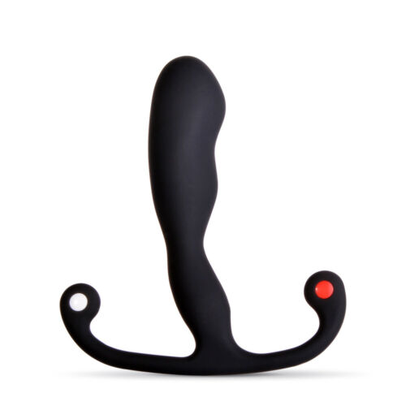

注意：通过"Aneros"，我们将指任何制造生物反馈前列腺按摩器的性玩具制造商，Aneros只是最受欢迎的一个。

Forrest Andrews 主持的一个很棒的研讨会，他长期使用 Aneros，后来加入了该公司。考虑观看"Prostate Massage 101 - The Ins and Outs of Prostate Play"研讨会：

[](https://www.youtube.com/watch?v=xAWUvRrJHII)

许多人发现找到适合每个人的 Aneros 玩具相当令人筋疲力尽。甚至可能看起来他们的产品在相互竞争，使选择更加困难。Aneros 的价格不菲，这使得选择更加困难。我们能给出的最佳建议是简单地猜测可能适合您的正确玩具。幸运的是，Aneros 不是唯一制造此类玩具的公司。有多家公司制造"类似 Aneros"的玩具，它们是仿制品，每个人需要决定是支持设计了玩具并使用高质量材料的研究人员，还是选择仿制品。如果您对更便宜的替代品感兴趣，搜索名为"Hunthold"、"YOYOHOT"或"XCushio"的性玩具，您甚至可以搜索"前列腺按摩器"找到更多这些仿制品牌，它们会因为底部独特的标签形状而相当突出。

注意：许多人发现原始的 Aneros 太短，无法到达前列腺顶部，因此仿制品可能更适合他们。

Aneros 拥有庞大的粉丝群，存在许多分享技巧的社区。我们不会详细介绍它们，因为它们大多依赖与常规前列腺按摩相同的原则。如果您对 Aneros 用户分享的技巧感兴趣，应寻找"Super-o Aneros"并挖掘各种论坛，但购买时性玩具提供的说明也相当充分。这里我们将提示一个在网络上流传的视频，可以通过搜索"Multiple Male Prostate Orgasms (MMO) Aneros Helix Syn"找到，该视频展示了一个男性使用 Aneros 的 48 分钟课程，并在课程期间有一些评论。这个视频很好地展示了从外部看体验几乎是静态的，您看不到太多动作，但如果仔细观察，可以注意到男性在课程期间多次收缩他的 PC 肌。这个视频还展示了此类前列腺游戏的另一个事实——它非常非常长，您需要分配大量空闲时间和大量放松才能达到高潮。

注意：您可以在进行常规性行为时使用 Aneros 类型玩具，在刺激期间可以体验肛门高潮，因为性玩具会在射精期间的不自主肌肉收缩期间刺激您的前列腺。

对 Aneros 最常见的抱怨之一是它似乎不起作用。问题是许多人对性玩具有很高的期望，他们往往忘记了用户需要大量练习才能达到 Aneros 宣称能够提供的免手高潮。最佳方法是没有任何期望，而是享受当下。

# 训练

在之前的章节中，我们讨论了如何开始肛交，并包含了各种技巧和窍门，以便在参与肛门游戏或肛交时达到愉悦。在接下来的部分中，我们将讨论一个非常常见的话题，涉及训练您的肛门、直肠、结肠甚至其他与肛门相关的器官。

虽然每个人都有自己的理由参与肛交，并有自己的目标，但通常人们进行肛门训练主要有两个原因：为与伴侣的肛交做更多准备，或体验大型或长型性玩具可以带来的强烈刺激。您可能看过一两个视频，可能想在自己身上体验所看到的内容，但绝不应直接尝试大型性玩具或要求伴侣在肛交时粗暴，这一切都需要练习，通过肛门训练，您可能能够实现目标。

注意：当涉及尺寸时，有些人可能由于髋骨和肌肉结构而无法插入极大的性玩具。如果您希望有一天能够接受极大的性玩具，请注意，无论训练量如何，并非每个人都能做到这一点，但在许多情况下，通过适当的训练，您可能能够实现目标。请务必现实并对自己诚实。即使不幸，您也可以在肛门游戏方面取得其他成就。

继续阅读，了解如何能够接受直径大得多的性玩具或阴茎、更长的性玩具，如何实现肛门张开，如何实现拳交等等。

## 拉伸

没有太多证据表明使用大型性玩具拉伸肛门、直肠或结肠会产生长期影响。有些人甚至报告说，只要保持在最大"自然"排便尺寸以下（直径小于5.7厘米），您甚至可以体验到更强的肛门括约肌，这与瑜伽的效果类似，因为它拉伸您的肌肉超过常规运动，使肌肉更具弹性。您也可以超过该直径，只要进行温和的拉伸，仍然不会经历任何长期影响，但请注意，这是基于个体报告，因为对此类问题根本没有足够的研究。如果您以缓慢的方式练习肛门游戏，那么您也不应经历肛门外观的很大变化。

有一些拉伸可以对直肠产生永久性改变，但这与更极端的肛门游戏类型相关，如拳交和故意脱垂游戏。这种极端拉伸可以拉伸将结肠和直肠锚定在腹壁的内部组织（肠系膜组织），最终可能导致无意的直肠脱垂。有些人喜欢故意制造脱垂，通常一旦人停止推动，脱垂就会缩回内部，但随着时间的推移，肠系膜组织可能会被拉伸，故意脱垂可能变成无意脱垂。

注意：思考肛门拉伸的正确方式不是作为目标驱动的活动，而是作为肌肉放松活动。将肛门拉伸视为肛门瑜伽，您学会控制肌肉并按需放松它们。

在本指南中，我们故意避免了常见的"向下用力"方法，即对直肠施加压力以插入更大的玩具。此方法不推荐，只应用于那些经验丰富且了解频繁对肛门肌肉施加压力可能导致永久性损伤的人。此方法依赖于您呼气并推动直肠，使其适应排出更大的粪便，但不是排出粪便，而是强迫性玩具进入，这可以帮助您获得额外的拉伸量，但这也非常危险，因为它可能导致肌肉撕裂。

总是非常诱人去挑战极限，在高性唤起期间，您倾向于忽略理性思考，在许多情况下，您会开始认为可以将大型性玩具插入，只需要再用力一点，但这很危险，应摒弃这种方法以防止受伤。推荐的拉伸肛门括约肌的方法是使用增量尺寸的性玩具。对每个人来说没有黄金数字，但考虑以下拉伸肛门括约肌的路径：

- 初学者从直径2.0厘米的性玩具开始
- 使用相同尺寸玩数周，直到几乎无力和不适地插入性玩具
- 将下一个性玩具的直径增加不超过3毫米，在我们的案例中，寻找直径约2.3厘米的性玩具
- 使用相同尺寸玩，直到感觉不到不适
- 再次将直径增加不超过3毫米
- 重复此过程，直到感觉性玩具无法插入，因为骨盆骨不允许

总是有一个问题：应该多久进行一次肛门拉伸，答案尚无定论，但有一些准则应遵循。通常，拉伸肛门括约肌会导致肛门组织中的微小撕裂，您甚至看不到血液，因为这些微小撕裂太小而无法察觉，但它们会限制您的拉伸能力。进行肛门游戏时，您可以每周进行多次（您可能对频繁灌肠导致的结肠健康有些担忧），只要饮食良好且不强迫自己，那么简单的肛门游戏而不过度拉伸肛门括约肌（能够轻松接受性玩具或阴茎）不应引起任何问题。当试图达到新极限时，每周多次进行肛门拉伸不是一个好主意，您需要让组织愈合，一周对大多数人来说似乎是合理的时间，但应始终寻找身体的信号。如果感觉到灼烧感或一般不适，这些在之前的肛门拉伸课程中没有出现，那么可能需要等待更长时间让组织愈合。请记住，即使非常缓慢地进行，肛门拉伸也相当残酷。

您最终会有很多性玩具，但随着时间的推移，您很可能会停止使用较小的性玩具，但开始时不能跳过较小的尺寸。随着时间的推移，您很可能会停止使用直径小于4.0厘米的性玩具，甚至可能更大。另一种方法是获取充气假阳具（不是充气肛塞），但必须小心不要在插入时充气，它不应用作窥器，而应作为可以随时间改变尺寸的假阳具使用。如果在插入时充气假阳具（或肛塞），很容易受伤。

没有特定的方法来拉伸肛门括约肌以容纳大型性玩具，但这里我们将描述几种可用于达到新极限的程序。这些对初学者不友好，初学者应在数月时间内保持小的逐渐宽度增加，但对于更进阶的人，我们可以描述针对各种目标的程序。以下提供这些程序。

注意：当试图达到新极限时，您的姿势可以产生巨大差异，在进行更极端的肛门游戏（如拳交）时变得非常明显。每个人不同，大多数人将能够在[蹲姿](pose_squat.jpg)或更舒适的姿势（如[女牛仔姿势](pose_cowgirl.jpg)）（通过坐在性玩具上）中接受更大的物体，有些人会偏好[狗爬式姿势](pose_doggy_style.jpg)。张开或并拢双腿也会产生影响，尽管大多数人会偏好张开双腿。尝试多种姿势，您应注意到一种姿势与其他姿势的差异。

逐渐增加宽度：这是一种非常直接的方法，它```必须```是您拉伸程序的一部分，您应有一定经验才能开始增加宽度。从预热开始，然后玩可以舒适插入的假阳具，从您拥有的最小假阳具开始，玩几分钟，然后转到下一个更大的假阳具。您可以进行大于3毫米的跳跃，但只有在这不是您曾经能够插入的最大尺寸时才应这样做，并避免直径跳跃大于1.0厘米，要合理，如果感到不适，则减小尺寸并使用较小尺寸玩，直到感觉舒适。当接近已知的先前极限时，开始增加直径不超过3毫米。插入当前已知最宽的性玩具并保持几分钟，然后开始缓慢抽插几分钟，然后保持性玩具在内部几分钟，然后开始抽插，重复此过程多次，直到对当前宽度感到舒适。增加宽度，尝试插入性玩具而不使用太多力量，不对肛门肌肉造成压力，考虑改变姿势以找到更容易的入口。重复保持-抽插过程，直到对新宽度感到舒适。即使这种逐渐增加宽度也会导致微小撕裂，并会在下次课程中引起不适，建议每周使用此方法不超过一次，并在转向更大尺寸之前重复课程至少1个月。

双插入与性玩具：进行肛门双插入（或DP）是许多人的幻想，可以通过练习实现。您需要两个假阳具，一个较大，一个较小，或者它们可以尺寸相同。方法非常简单，从较小的假阳具开始，玩直到可以无任何不适或费力地插入（5-10分钟）。然后用较大的假阳具替换较小的假阳具，玩假阳具直到可以无任何不适或费力地插入（5-10分钟）。再次用较小的假阳具替换较大的假阳具，这次在插入时使用圆周运动，使用假阳具通过不寻常的角度抽插以更拉伸肛门括约肌（5-10分钟）。用较大的假阳具替换较小的假阳具，并重复圆周运动和不寻常角度的抽插以拉伸肛门括约肌（5-10分钟）。感觉舒适后，插入较大的假阳具，并在假阳具侧面滑动一根手指，考虑滑动手指在最靠近尾骨的一侧。手指围绕假阳具画圈，重复此动作，直到可以轻松滑动手指。使用2或3根手指重复此过程，从一侧插入开始，围绕假阳具画圈，然后插入下一根手指，然后重复。当对多根手指与较大假阳具一起感到舒适时，移开手指，将假阳具滑得更深，然后在较小的假阳具上重新涂抹润滑剂。将较小的假阳具滑到最靠近尾骨的一侧，让两个假阳具在直肠中停留一会儿，并稳定地开始进行抽插动作。您应每周重复此方法不超过一次，持续3-6个月（之后可以转向更高级的拉伸方法）。

注意：当拉伸肛门括约肌和直肠时，大型性玩具会对控制人体休息时身体功能的副交感神经系统产生压力。对许多没有经验的人来说，这种感觉会产生"推出"的反射，但必须学会抵抗这种冲动，并允许性玩具简单地停留在直肠中。如果感觉无法忍受，则移除性玩具，尝试放松，几分钟后再试。

双插入与阴茎：可以在肛门中接受双插入（DP）。首先与每个阴茎进行肛交约5-10分钟。让拥有最大阴茎的男性躺在床上或类似家具上，使他的腿悬在边缘，然后坐在躺下的男性身上，将阴茎尽可能深地插入肛门。向前倾身，使两人的胸部接触，然后允许第二个男性将他的阴茎插入肛门的上侧（最靠近尾骨）。您可能会觉得尴尬，有些人无法定位自己以接受DP，躺下的男性会发现进行抽插很复杂，因此调整角度、速度和深度，找到适合您的方法。这是一种更高级的拉伸类型，因为您对抽插的控制要少得多，并且更可能产生微小撕裂。您应每周重复此方法不超过一次。

增加宽度和深度：要达到更远，您将需要各种尺寸的性玩具，但请确保尝试达到的宽度不超过比先前最大宽度大3毫米。考虑首先训练"双插入与性玩具"，并使用添加手指的方法逐渐增加宽度。当感觉训练足够时，考虑开始拉伸程序，使用直径约4厘米、长度至少20厘米的假阳具，玩这个假阳具，直到可以舒适地全长度插入并进行抽插而不感到刺激。全长度插入后，将假阳具保持在内部几分钟，继续抽插，然后将假阳具完全插入内部保持几分钟，然后再次开始抽插，重复此过程多次。将宽度增加到直径5.0厘米以上，长度相似，玩假阳具直到可以舒适地全长度插入，重复此过程，直到可以舒适地全长度插入假阳具，重复保持-抽插过程。在深度增加宽度可能需要数月时间，在许多课程中训练宽度，不要在一次课程中强迫。将宽度增加到直径6.0厘米，玩假阳具直到可以舒适地全长度插入，重复保持-抽插过程。

增加宽度可以是非常感性的体验，因为直肠和肛门周围均匀分布，让您感觉"饱满"。所谓的"尺寸女王"（喜欢大型性玩具或阴茎的人）享受这种感觉。每个人不同，每个人都有自己的极限。肛门括约肌可以拉伸得非常远，但必须正确且缓慢地进行，达到6.0厘米及以上尺寸需要数年时间，但有可能无法进一步拉伸，有时您的肌肉根本无法承受这样的拉伸，或者受到骨盆骨尺寸的限制。遗憾的是，极限将存在，您需要接受它们。有些人在达到最大宽度时喜欢探索其他选项，并尝试达到最大深度。

## 深度

您可以拉伸直肠和结肠的深度，这称为深度训练。您可以达到惊人的深度，甚至有人能够将手臂插入肛门直至腋窝的视频，这是由于结肠的解剖结构，因为在拉直肠乙状结肠交界处后，它相当直。如果您需要数年时间才能达到非常大的性玩具宽度，那么达到大深度则需要双倍时间，因为结肠比肛门脆弱得多，并且比宽度训练更容易受伤。对于深度训练，您将需要特殊的性玩具，有时称为"肛门探针"或"深度探针"，它们非常柔软且长，类似蛇形，没有太多纹理，以免刺激结肠。此类性玩具的一个例子是"SquarePeg Toys Depth Probe"（[示例](stretching_probe.jpg)）。拉伸结肠必须非常缓慢地进行，一般想法是缓慢滑入探针，让它在内部停留几分钟，然后可以进行非常缓慢和轻柔的抽插。您无法在所有深度以相同的速度插入深度探针（您不能单次抽插插入），需要缓慢进行，甚至拉回以在下次抽插时重试，这意味着您不能在结肠中进行快速和深的抽插，它们必须小且逐渐增加深度。在深度游戏期间，需要特别注意放松结肠，这需要多年的练习，一般想法不是给肌肉施加压力，不要试图推出任何东西，放松肌肉，并允许直肠乙状结肠交界处拉直。在深度训练中，姿势非常重要，我们通过了多个解剖章节来理解直肠和结肠的曲度，应使用此信息找到最合适的姿势，一般想法是使结肠和直肠尽可能直，[蹲姿](pose_squat.jpg)是其中之一，另一个先前提到的是向左倾斜，利用重力拉直肠乙状结肠交界处。在进行深度训练时，可以在姿势之间切换，有些姿势允许更容易通过直肠乙状结肠交界处，后来其他姿势更适合深入结肠，如果发现难以达到新深度，考虑切换姿势。请记住，需要非常缓慢地进行，深度训练更像是引导性玩具通过结肠的过程，而不是将性玩具抽插进出。

注意：对大多数人来说，结肠在最窄部分约4.0厘米宽（未经深度训练），并且相当可拉伸，但结肠内的压力将对初学者引起非常明显的不适。如果刚开始深度训练，考虑使用宽度小于4.0厘米的深度探针。

**重要提示：** 如果感到突然的剧痛，```不要```立即拉出性玩具，不缓慢移除性玩具将经历剧烈疼痛。轻轻移除性玩具，并尽可能冷静下来，在压力期间，很可能导致直肠乙状结肠交界处形成锐角，并使从结肠移除任何物体更加困难。

## 张开

通常当有人提到张开时，很可能指的是肛门（或阴道）在阴茎或其他物体已被移除后仍然可见地张开的情况。结果，肛门（或阴道）保持张开，并产生"张开"效果。虽然对每个人来说可能不容易，但有一些非常简单的技巧可以实现肛门张开。本指南不涵盖如何实现阴道张开。

肛门张开可以以几种不同的形式实现，但在本指南中，我们将仅关注最简单的一种方法。肛门张开也可以以其他方式实现，但此方法将给您最快的结果，并且易于以后使用。我们将介绍一种允许您在狗爬式姿势中创建肛门张开的方法，您很可能在色情片中经常看到相同的张开。

在我们深入具体步骤之前，您应了解张开背后的基本原理：

- 您的肛门需要放松，查看[预热](#Warmup)章节
- 您的肛门需要拉伸，张开不适合初学者（尽管有些人可能很早就能做到），请务必查看[拉伸](#Stretching)章节，并进行相当数量的肛门拉伸
- 您需要进入狗爬式姿势，脸朝下，臀部抬起（还有其他允许肛门张开的姿势，狗爬式是最简单的）
- 当阴茎、假阳具或物体从肛门移除时，需要放松肛门，不要收缩或推出
- 当阴茎、假阳具或物体移除时，需要张开臀部（成功张开的大秘密）
- 需要允许空气流入直肠
- 当空气流入直肠时，肛门倾向于更张开

从上述基本原理中，您现在应理解大秘密是张开臀部并允许空气流入直肠。棘手的部分是达到肛门想要保持张开的状态。为了更好地理解如何实现这一点，考虑这个简单的程序（推荐伴侣）：

  1. 预热肛门，进行相当多的拉伸，确保感觉放松
  2. 以狗爬式姿势躺下，确保头朝下，臀部尽可能抬高，考虑也拱起背部
  3. 玩弄肛门，使用假阳具创建抽插动作，或要求伴侣在此姿势下花一些时间与您的肛门在一起，需要习惯此姿势并感觉放松
  4. 用双手抓住臀部，尽可能将臀部张开
  5. （与伴侣）要求伴侣移除他们的阴茎（或假阳具），有些人在缓慢移除性玩具或阴茎时可能有更好的成功，有些人在相当快但不至于疼痛或不适地移除性玩具或阴茎时可能有更好的成功，记住继续张开臀部。/（单独肛门游戏课程）使用几根手指，从肛门移除性玩具，这很复杂，可能需要多次尝试移除性玩具
  6. 重复抽插动作、臀部张开和性玩具/阴茎移除，需要多少次就重复多少次
  7. 当感觉到空气在张开臀部时流入直肠时，那么您知道您正在张开！
  8. 不要推出空气、收缩或移动，很可能会关闭肛门并停止肛门张开

注意：肛门关闭后，您允许空气流入直肠，空气仍在直肠中，并在再次将性玩具或阴茎插入肛门时引起轻微不适和排气声。为避免此情况，最好在性玩具或阴茎插入肛门之前推出空气。这需要大量练习才能找到准确的时间，但在完成张开后无需将空气保留在直肠中，它只会引起不适。

如您所见，张开并不困难，但确实需要大量练习。最困难的部分是学会放松肛门。每当空气开始流入时，最常见的反应是收缩肛门。结果，肛门关闭，停止张开。在单独肛门游戏课程中，您可能也有一些困难移除性玩具，有些人发现可以简单地让性玩具掉出。记住也要张开臀部，有些人喜欢使用胶带（不推荐，因为移除胶带很可能以痛苦的方式移除体毛），也有专门的工具，如[Spread'ems](https://spreadme.co)，或者您可以要求伴侣为您张开臀部。

## 拳交

拳交是一种非常高级的肛交形式，涉及将整个拳头放入直肠（或阴道）。它需要给予者和接收者都有很多经验，但如果操作得当，由于拳头产生的大压力，可以提供非常强烈的刺激。男性拳头往往更大（平均直径约7.0厘米），女性拳头往往稍小（平均直径约5.5厘米），但尽管如此，两者都是非常大的物体，这并不妨碍一些非常有经验的人挑战极限，并在肛门中接受双拳、三拳甚至四拳。有些人也喜欢挑战深度极限，能够接受拳头直至腋窝。拳交需要大量练习和技能，需要数年时间。

肛交确实有受伤风险，但在进行拳交时，这种风险急剧增加。不是因为拳交本身危险，我们之前讨论过肛门宽度游戏似乎没有任何证据会导致长期损伤，但拳交往往相当残酷，可能损伤周围器官。用拳头缓慢拉伸肛门括约肌将是一种非常感性的体验，但在某些情况下，肛交给予者（拳交者）喜欢快速而激烈（有时甚至进行所谓的"拳击拳交"），这种快速而激烈的拳交通常是严重损伤的原因，当拳交深度超过手腕时，风险增加更多。您需要对直肠和结肠的组织非常细致，它们非常脆弱。

要训练自己进行拳交，查看[拉伸](#Stretching)章节，并仅在能够轻松无不适地插入直径大于6.0厘米或7.0厘米的性玩具（取决于您打算接受哪种拳头，女性或男性拳头）时。

# 随机提示

考虑使用可冲洗的婴儿湿巾在需要时清洁伴侣

不要以目标为导向，不应专注于实现某些东西，无论是高潮、宽度、长度还是其他，应只专注于享受美好时光。如果专注于目标，很可能无法达到高潮，甚至可能受伤。

侧躺时，可以向后拱起背部，这可以产生轻微分开臀部的效果。

从角落撕开安全套包装，不要从中间撕开包装，从中心撕开包装有损坏安全套的风险。

可以将背部按摩器放在性玩具上用作振动器，尽管有些背部按摩器可能非常强大，甚至可能刺激。
# 目录

- [目录](#目录)
- [引言](#引言)
- [简而言之](#简而言之)
- [进行肛交的理由](#进行肛交的理由)
- [安全须知](#安全须知)
- [解剖结构](#解剖结构)
  - [解剖结构（女性）](#解剖结构女性)
  - [解剖结构（男性）](#解剖结构男性)
  - [PC肌](#pc肌)
- [健康状况](#健康状况)
- [饮食调整](#饮食调整)
- [清洁准备](#清洁准备)
- [性欲](#性欲)
- [润滑剂](#润滑剂)
- [预热准备](#预热准备)
- [肛门按摩](#肛门按摩)
- [性玩具](#性玩具)
  - [肛塞](#肛塞)
  - [材料](#材料)
- [姿势](#姿势)
- [学会享受肛交](#学会享受肛交)
- [重新连接](#重新连接)
- [高潮](#高潮)
- [高潮（女性）](#高潮女性)
  - [方法](#方法)
  - [玩具](#玩具)
  - [前列腺按摩器](#前列腺按摩器)
- [其他肛交方法](#其他肛交方法)
  - [Aneros](#aneros)
- [训练](#训练)
  - [拉伸](#拉伸)
  - [深度](#深度)
  - [张开](#张开)
  - [拳交](#拳交)
- [随机提示](#随机提示)

# 引言

警告：本指南虽主要包含技术性信息，但可能也包含部分露骨内容。除非您已达到法定同意年龄（大多数国家为18岁或21岁），否则不得阅读本文档内容。

警告：本文档不构成医疗建议，您需自行承担使用其中信息所带来的风险。

肛交早已为人所知，其历史或许与人类有记载的历史一样悠久，但即便如此，外界仍存在大量错误信息。为防止此类错误信息进一步传播，本指南将为您提供有关肛交及其相关事项的详细信息，帮助您和伴侣获得愉悦的体验。

肛交看似简单，实则比常规性交复杂得多，需要掌握相当多的知识才能确保安全与愉悦。本指南将重点介绍男女双方的解剖结构、卫生、健康、准备工作、技巧、器具、建议等各方面内容，以确保您正确进行。初学者可能会想跳过某些章节，但我们强烈建议您通读全文，以全面理解肛交各个方面的细节。

肛交（以及性行为整体）这一领域有时缺乏科学证据，有时也难以得出理性结论，原因可能是证据不足，也可能是由于逻辑谬误所致。本指南虽会包含一些科学事实，但大量信息来源于个人经验报告——即人们分享自己使用各种方法的成功经历。然而，这些方法大多缺乏科学验证，且由于信息来源本身存在选择性偏差，因此难以保证其绝对真实性。本指南会尝试解释某些方法及其可能成立的原因，但读者需自行判断哪些内容值得相信。本指南应被视为一份经验报告汇编，读者可自行决定如何使用其中信息，以及是否承认其中可能存在的逻辑谬误。

# 简而言之

警告：本指南包含大量关键信息，可防止你对自己和他人造成伤害。强烈建议完整阅读本指南。

注意：如果你打算阅读完整指南，则建议跳过本章。本章省略了许多细节，跳过了大量可能的替代方式，仅提供一种最快但仍安全的肛交入门方法。

如果你不是那种喜欢阅读的人，只想直接开始，那么请注意：肛交并不简单。但如果你执意跳过关键信息，本章将提供最低限度的必要内容。请务必注意，如果你打算跳过所有其他章节，至少不要跳过本章。以下内容将默认你是接受肛交的一方（被插入者）。

**步骤:**

1) 从触摸开始：并非每个人都喜欢肛交，但很多人可以学着去享受它。在淋浴时触摸肛门数日。轻轻按压肛门以熟悉这种感觉。用手指在肛门周围摩擦，但先不要将手指插入肛门。<u>原则：习惯于有东西触碰臀部的感觉</u>。
*注意：灌肠或冲洗不适合此阶段。在淋浴时进行，可以洗掉任何粪便。目前请避免灌肠或冲洗。*

2) 购买合适的润滑剂：润滑剂是必需品，不要用肥皂，不要用唾液，你需要润滑剂，否则你很可能会受伤且根本感受不到任何快感。关于润滑剂有很多变量，但为简单起见，只需购买一款体面的水基润滑剂。在你所在地区或网上查看评价，现在还不需要买最好的润滑剂，几乎任何水基润滑剂都可以。<u>原则：购买水基润滑剂，任何你能在可信赖商店买到的润滑剂目前都可以。</u>
*注意：如果你对买哪种润滑剂感到迷茫，可以考虑查看这张[图片](lube_ph.jpg)，看看那些标记为pH值5或6的润滑剂。*

3) 清洁，首次：先不要使用灌肠或冲洗。在进行肛交游戏前几天规划你的饮食。避免辛辣食物，避免垃圾食品，避免加工食品。在进行肛交游戏前几天吃富含纤维的膳食。在你计划进行肛交游戏当天，照常去厕所排空结肠。<u>原则：肛交游戏前几天保持良好饮食，去厕所排便，不要使用灌肠或冲洗。</u>

4) 插入一根（或两根）手指：在淋浴中触摸肛门几天后，你可以开始使用手指。在其中一根手指上涂抹足量润滑剂。开始将手指插入肛门，但不要用力推入。尝试只插入指尖，然后挤压肛门，使你能感觉到手指被轻微挤压。保持挤压几秒钟，然后放松肛门。一旦你放松肛门，你应该会注意到手指几乎是自己滑进去的。重复挤压过程，直到你的手指完全插入肛门。将手指在肛门内停留一会儿，然后尝试在内部移动手指，轻轻摆动，做小的抽插动作。尝试两根手指。<u>原则：习惯于有东西在肛门内的感觉。</u>

5) 购买一个好的假阳具：购买一个小尺寸的（顶端直径小于3厘米开始）假阳具，材质要好（硅胶、不锈钢、玻璃；在了解更多知识前避免购买其他材质）。肛门塞也可以使用，但建议从假阳具开始。仿真的假阳具可以，实心的也可以，带珠的也可以，形状并不重要，只要小就行。不要使用家用物品，受伤或感染的风险太高。<u>原则：购买一个体面的假阳具，要小的。</u>
*注意：硅胶假阳具通常是首选，尽管一开始你可能想使用不锈钢或玻璃假阳具。使用硬质性玩具有很多缺点，但硅胶性玩具用于肛门时往往会留下明显的气味。*

6) 用假阳具进行肛交游戏，首次：保持良好饮食，在进行肛交游戏前去厕所排空结肠，不要使用灌肠或冲洗。最好在淋浴时进行。在手指上涂抹润滑剂，慢慢将一根手指插入肛门，如果需要可使用挤压方法。摆动手指，将手指向两侧移动以轻轻拉伸肛门。涂抹润滑剂插入另一根手指并重复。考虑尝试三根手指，别忘了添加润滑剂。当你感觉准备好后，在假阳具上涂抹润滑剂并慢慢将其插入肛门，如果需要可使用挤压方法。现在不需要将假阳具插得很深，进去几厘米就够了。让假阳具在直肠内停留一会儿。尝试将假阳具向两侧移动，尝试做小的抽插动作。<u>原则：用手指热身肛门肌肉，使用润滑剂，慢慢将假阳具插入直肠并进展到做小的抽插动作。</u>
*注意：如果你是初学者，切勿尝试在不热身的情况下插入假阳具。使用手指和挤压方法为接纳更大的物体做好准备。*

7) 倾听你的身体：肛交**不**应该疼痛。它应该是愉悦的。如果你感到疼痛甚至不适，那意味着你的身体正试图向你发出信号，表明某些地方不对劲。倾听这些感觉，它们至关重要。每当你感到疼痛，就意味着停下来尝试别的方法。不要等待疼痛消失，否则你可能需要去医院。出血意味着立即停止，无需多问。暗色血液意味着你**立刻**需要看医生。<u>原则：疼痛意味着你做错了什么，停下来。</u>
*注意：网上充斥着糟糕的建议。你能找到的最坏建议之一是"你会习惯疼痛的"。避免此类建议，避免提倡这种鲁莽行为的人。*

8) 通过肛交刺激自己：照常，保持良好饮食，在进行肛交游戏前去厕所，不要使用灌肠或冲洗。最好在淋浴时进行。重复步骤7中描述的步骤，但在抽插假阳具时，你应该开始慢慢用传统方式（阴茎/阴蒂/阴道）刺激自己。如果可以，尝试达到高潮。重复几次，直到你开始发现肛交令人愉悦。肛交刺激不要过快或过猛，不要太深，它暂时还不会像传统自慰那样令人愉悦。<u>原则：将肛交游戏融入你的传统自慰方式中，保持轻柔。</u>
*注意：慢慢地融入肛交游戏非常重要。你需要训练你的身体将肛交游戏与快感联系起来，这需要时间和大量练习。不要急于求成。在你以更传统的方式达到高潮时，假阳具几乎不动也是可以的。*

9) 冲洗，或许：只有当你开始觉得肛交令人愉悦时，**可选择性**地在肛交游戏前使用水或弱盐水溶液清洁自己。此阶段**不要**进行灌肠。灌肠使用大量水，你需要找到一个非常小的冲洗器并使用非常少量的液体（不超过100毫升，是的，就那么少）。冲洗前，去厕所排空结肠。将冲洗器灌入不超过100毫升的液体。在冲洗器喷嘴上涂抹润滑剂并将其插入肛门。将冲洗器液体挤出一半，让液体在直肠内停留一会儿，可以考虑跳跃并轻轻摇晃身体。坐在马桶上，让所有液体排出。用冲洗器内剩余的液体重复上述步骤。大约30分钟后去厕所排出任何残留物。<u>原则：不要使用大量液体，挤出并排出。</u>
*注意：灌肠或使用超过100毫升液体不适合初学者。专注于更好的饮食而非更多液体。大量液体会引起恶心，并将几分钟的冲洗过程变成长达数小时的不适过程。*

10) 更多的肛交：此时，你应该能够热身肛门肌肉并将肛交游戏融入你的常规自慰环节中。在你的肛交游戏过程中，你可能仍然有想上厕所的冲动。这是一种自然反射，会随着练习而消失。继续在自慰时用假阳具练习，在接下来的每次过程中慢慢将更多注意力放在肛交游戏上。多次重复此过程，直到你不再有排出假阳具的冲动。<u>原则：更多的肛交，学会忽略排出的冲动。</u>
*注意：如果你担心会弄脏，可以考虑在身下垫一条毛巾。肛交可能会弄得一团糟，习惯它。*

11) 与伴侣的肛交：只有现在你准备好了。是否使用冲洗器，由你决定。照常热身你的肛门肌肉，使用你的手指和你的假阳具，不要跳过热身。始终使用润滑剂。指导你的伴侣缓慢开始，并指导你的伴侣找到完美的速度、深度和姿势，直到你感到舒适。在被插入时结合阴茎/阴蒂刺激，以帮助你发现肛交更令人愉悦。不要去想可能会弄得一团糟。<u>原则：热身，**热身**，缓慢而轻柔，享受自己。</u>

**警告：** 切勿在同一次性爱过程中从肛交切换到阴道性交。这有非常高的引起感染的风险。你可以从阴道性交切换到肛交，但反之则不行。

*提示：* 肛交后（给予方和接受方）排尿以最小化感染风险。

**常见问题**:

1. 我把假阳具插入肛门后开始快速抽插，但毫无反应，为什么？
\- 肛交不能采用男性自慰的方式。那种方法根本行不通。
2. 但肛交高潮在哪里？
\- 要通过肛交达到高潮需要你阅读对应章节
3. 接下来该怎么做？
\- 探索！尝试不同类型的性玩具，试试更大尺寸的性玩具，但你真的应该阅读完整指南
4. 为什么没有关于放松的步骤？
\- 有的，多个步骤都涉及放松，本章给出的建议比单纯说"放松"更具体
5. 我听说肛塞对肛交很有帮助，是真的吗？
\- 肛塞可以是肛交前很好的准备工具，不过假阳具会更适合实际插入
6. 我什么都试过了还是觉得肛交不愉悦，为什么？
\- 尝试在开始肛交前大幅提升性兴奋度，但这也可能意味着肛交确实不适合你
7. 我看到粪便了，应该停止吗？
\- 用纸巾擦干净就好，肛交就是会有点混乱，接受这个事实

# 进行肛交的理由

对许多人来说可能很难理解为何要进行肛交。根据2014年的一项[研究](https://www.ncbi.nlm.nih.gov/pmc/articles/PMC4379393/)，女性进行肛交的原因多样，包括避免阴道性交（经期、怀孕）、取悦伴侣、自身快感需求、性工作、药物影响以及不知可以拒绝肛交。虽然其中某些原因我们不应讨论，但其他原因对女性相当有益，特别是获取快感和避免阴道性交。

虽然尚未有广泛研究专门调查通过肛交达到高潮的成功率（美国国家性健康与行为调查参与者数量不足），但确实存在相当数量的个人报告称能通过肛交达到高潮。这项调查的结果在一篇文章中被综述，显示进行肛交的女性达到高潮的频率远高于其他任何性行为方式，你可以在[此处](https://metro.co.uk/2015/08/25/this-is-the-best-way-to-give-a-woman-an-orgasm-apparently-5359272/)阅读更多相关信息。

有篇文章试图阐释进行肛交的女性为何更可能达到各类高潮，你可以在[这里](https://slate.com/technology/2010/10/why-do-women-who-have-anal-sex-get-more-orgasms.amp)阅读该文。

另一篇文章描述了肛交高潮与阴道高潮期间盆底肌收缩（这块肌肉包裹着连接生殖器的神经）的相似性，你可通过[此链接](https://lioness.io/blogs/sex-guides/anal-orgasms-vs-vaginal-orgasms-double-penetration)查看该文。

你很可能会遇到完全反对肛交的人，其中许多人可能自我批判且缺乏正念，这将成为男女双方达到高潮的障碍。但你需要记住，性行为是双方（或多方）的共同协议且需要彼此同意。如果你成功说服伴侣尝试，只要他们能摒弃无益的念头，（在操作得当的情况下）将有许多有趣的感官体验等待着你们。

通过本指南，我们将探索肛交过程中与肛交相关的器官所具有的一些非常有趣的特征，并尝试解释为何肛交可能带来更强烈的高潮体验。

# 安全须知

尽管关于肛交存在大量错误信息，但最具破坏性的谬论都与肛交安全相关。本章旨在澄清这些错误信息，让你能安全地进行肛交。以下是一些至关重要的安全信息。

肛交```不```应该疼痛：出于某些原因，网络鼓吹肛交可以有点疼痛且你会逐渐适应，但这是```错误```的，肛交过程中```不```应该感到任何疼痛。在后续章节中你将了解到直肠及其他肛交相关部位有多么脆弱。疼痛永远意味着出现问题需要停止。若感到尖锐剧痛，这表示你需要立即停止，不容迟疑。肛交如果操作不当可能很危险，因此必须确保倾听身体的信号。直肠与结肠神经末梢较少，这意味着受伤时可能不易感到疼痛。

少量出血```不```正常：网络上另一种奇怪的说法是存在"肛门处女膜"，且前几次出血是正常的——但从解剖学角度看这也是极其危险且错误的。不存在"肛门处女膜"，肛交过程中任何出血量都不可接受。由于直肠和结肠非常脆弱，极易损伤其组织构成，因此出血直接表明你已受伤（即使未感疼痛，因为这些区域神经末梢稀少）。红色意味着停止，不容犹豫。根据出血量和血液颜色，甚至可能需要立即就医。

不适感```不```正常：若感到不适，这是另一个异常信号。肛交应带来愉悦，不适感表明你的姿势、角度、润滑、预热、材质、放松程度或其他环节存在问题。肛交中最常见的抱怨之一是想排便的冲动，但即使这种冲动也不该出现，这意味着你需要重新评估准备工作。不适感是身体发出的另一个需要立即停止的信号。常见谬论认为不适感会随时间消失，但这也不应依赖，最好从一开始就通过充分准备消除不适感。

强迫推进```不```可取：使用各种玩具进行肛交时，容易试图用力将玩具推入体内，这非常危险。对多数人而言，肛门是限制可插入玩具/阴茎尺寸的肌肉（对更有经验者限制部位可能是直肠甚至结肠），但必须记住肛门是肌肉组织，极易因肌肉撕裂而受损。肛交应被视为"肛门瑜伽"，重点是学会放松肌肉而非强迫它们。请将举重心态留在健身房，勿带入肛交中。这也适用于阴茎（甚至手指）肛交，阴茎应以极小阻力滑入，否则就是操作有误。

唾液```不可```替代润滑剂：直肠不会像阴道那样分泌天然润滑液，事实上肛门与直肠本身非常干燥，完全不适合肛交。实际上，唾液含有能分解油脂的酶，这意味着唾液会使该区域更干燥（例如频繁舔唇会导致嘴唇更干裂）。切勿省略润滑步骤，你需要大量润滑剂，甚至需要定期补充。缺乏润滑会增加直肠乃至结肠微撕裂的风险，更不必说对你和伴侣造成的不适。使用润滑剂也能让肛交体验更愉悦。

```禁止```从肛门转换到阴道：直肠具有适合排便的特定微生物群与各种细菌，阴道极易被直肠细菌感染。为预防感染，最好完全避免从肛门转换到阴道（可从阴道转换到肛门，反之则不可）。有些人甚至会在肛交时遮盖阴道以最大限度降低风险。同样也不建议从肛门转换到口交（肛对口）。

```禁止```将无防脱底座（或系绳）的玩具插入肛门：许多人发现将圆形球体等物品完全插入直肠很刺激，但这非常危险。直肠可能产生真空效应而将玩具完全"吸入"，由于你很可能会放松肛门相关肌肉，此时很可能形成通向直肠的笔直路径。随后玩具可能滑得更深，越过直肠乙状结肠交界处——该部位很可能已充分伸直使玩具轻易进入结肠。当你停止放松肛门相关肌肉时，直肠乙状结肠交界处会重新形成锐角，导致玩具完全卡在体内，此时你```必须```立即就医。最佳做法是始终使用带防脱底座的玩具以防止玩具完全滑入。若发生此类意外，请保持镇静，因为紧张会导致肌肉收缩。注意，玩具可能在数秒内消失。

```禁止```使用随机物品作为性玩具：直肠与结肠非常脆弱，随机家用物品可能带有手指无法察觉的锋利边缘。物品材质也可能不适合肛交，可能导致感染等并发症。若必须使用家用物品作为性玩具，至少应考虑佩戴安全套以降低受伤风险。

```禁止```使用麻醉剂或止痛药：许多人认为可以通过麻醉剂（如具有麻醉效果的润滑剂）消除不适感，但这很危险，因为这会阻止身体发出异常信号。肛交过程中必须始终倾听身体的信号，麻醉剂和止痛药会让你在伤势发展为急症前无法感知损伤。使用麻醉产品来"加速"肛交过程可能很诱人，但风险不值得承担，实际上这会降低整体快感。

```禁止```将药物与肛交结合：药物种类繁多且作用各异，虽然某些药物能增强感官敏感性（有些人报告肛交时产生特殊感受），但有些药物会降低各种感官敏感度（包括酒精），这会产生类似麻醉剂和止痛药的风险。某些药物甚至产生反效果——非但不能放松肌肉，例如酒精反而可能收紧肛交相关肌肉。有人宣称酒精是肛交良药，但请记住酒精具有镇静作用会降低痛觉敏感性，这很危险。使用药物的另一影响是扭曲理性思维过程，可能导致危险决策，例如突然产生实现极端性幻想的冲动。肛交场景中非常流行的药物"poppers"（亚硝酸酯）具有放松肛门括约肌的效果，但因有导致视力丧失或心脏问题的报告而被视为高危药物。出于显而易见的原因，任何药物都不推荐用于肛交，为了自身安全最好完全不用药物享受肛交，它们不值得冒险。

```禁止```向直肠灌注随机液体：出于某些原因，有人决定通过灌肠将酒精注入直肠，这是极其危险的想法且可能导致死亡（[来源](https://www.healthline.com/health/alcohol/alcohol-enema#risks)）。当酒精灌入直肠时，会快速被身体吸收导致"醉酒"，问题在于人们常低估酒精的吸收效率。或许通过灌注极少量且经水稀释的酒精能相对安全，但为自身安全考虑，通常不建议灌注任何非水液体。

```禁止```缺乏耐心：请谨记保持耐心，充分预热并在增大尺寸时谨慎操作。循序渐进至关重要，操之过急只会让情况恶化。

与阴道性交类似，肛交也会传播性病，因此若对伴侣状况不确定，强烈建议使用安全套。另需注意的是，直肠内含有各种细菌的微生物群可能感染阴茎，所以无论如何最好在肛交时使用安全套。

遗憾的是，肛交安全是许多人未予足够重视的话题，导致许多人受伤，有些甚至最终住院。因性活动就医的尴尬可能让你认为是不就医的好理由，但请记住剧痛和出血可能意味着内脏损伤，这在多数情况下是致命的。结肠内的异物极易因身体活动导致内脏损伤。必要时切勿忽视就医需求。

**重要提示**："何时需要就医"的分类标准较为模糊，且如本指南开篇所述，本文并非医疗文件，因此请勿过度依赖建议，但仍需将其纳入考量。一如既往，采取（或不采取）任何行动的风险均由您自行承担。

考虑在肛交过程中发现少量鲜血且出血已停止的情况：此时可能是直肠表层组织出现微小撕裂，很可能在一周或更长时间内自愈。请避免进行任何肛交至少一周，待伤口愈合后观察是否再次出血。若再次出血，需延长避免肛交的时间。建议更换性玩具、调整姿势、深度、润滑剂及其他变量，以防未来受伤。

考虑在肛交时感到剧痛但未发现出血的情况：剧痛表明需立即停止肛交，并确认是否出现出血（血液可能需要时间才会显现）。若未出血，很可能（但非绝对）意味着目前无需就医，但无法完全确定，建议咨询医生以确保未造成永久性器官损伤。

考虑在肛交时发现暗红色血液的情况（无论是否感到疼痛）：此时毫无疑问，您```必须```立即就医。无论损伤何处，这很可能是需要医疗干预的致命性损伤。

考虑性玩具无法取出的情况（被卡住）：首先保持镇静，避免突然动作。若插入物未发生旋转，可尝试采用蹲姿，像排便般轻柔推出玩具（```切勿```过度用力）。若物体仍卡住，则遗憾地需要立即就医（不可等到次日，因为睡眠期间可能损伤结肠）。

如您所见，许多情况下肛交可能导致送医。毫无疑问，肛交存在危险性，但只要采取足够安全措施，您和伴侣仍可享受其中。本章内容可能显得肛交风险过高，但请记住许多人都在进行肛交（有些人甚至只进行肛交或选择"仅限肛交的生活方式"），您只需稍加预防并掌握相关知识即可避免事故发生。请继续阅读以更好理解肛交相关器官的解剖结构及如何预防损伤。

# 解剖结构

虽然男女生理在许多方面颇为相似，但肛交相关器官的解剖结构存在显著差异。为更好理解这些差异，我们首先应审视其共同点。让我们先研究结肠以更深入理解肛交涉及的器官部位。请参考下图（[来源](https://www.cancer.gov/publications/dictionaries/cancer-terms/def/colon)）：


在肛交中我们主要关注以下部位：

- 肛门括约肌
- 直肠
- 乙状结肠
- 降结肠
- 横结肠

根据您的经验水平及参与的肛交类型，您将与结肠的这些部位产生交互（按此特定顺序）。大多数人主要与直肠和乙状结肠交互，结肠其他部位仅适用于经验丰富者。个体差异显著，结肠各部位的尺寸与特征各不相同，但理解结肠各部位的可能维度对预防损伤至关重要。请参考下图（[来源](https://www.dynalook.com/14th-international-ls-dyna-conference/simulation/looping-formation-during-colonoscopy-a-simulation)）：


从图中可见直肠平均长度为4+15厘米（包含弯曲段）。这非常重要，因为平均阴茎长度接近直肠总长，但有些阴茎更长可能超过直肠长度——这可能造成问题，因为存在以此方式损伤人体的可能性。有人报告称通过多年使用各种性玩具增加了直肠长度，从而能使用更长的玩具或阴茎，不过此类报告基于个体经验。

结肠（及直肠）非常重要的组成部分是其构成组织。肛交最常见的损伤与结肠组织的穿刺或挫伤相关。常见损伤的原因是这些组织并非为承受外力而设计，其强度仅够处理排便需求，而非外来物体。请参考下图（[来源](https://medivisuals1.com/a-section-of-the-wall-of-the-colon-505138-01xg.aspx)）：


这是"结肠壁"（胃肠壁）的简图，这些是构成您结肠的组织。这些组织看似厚实，实则非常脆弱且易受损。黏膜是最表层，含有防止结肠干燥的凝胶状物质。"黏膜肌层"是薄层肌肉组织。其下方是包含血管和淋巴结的黏膜下层（[来源](https://www.kenhub.com/en/library/anatomy/the-colon)）。此图应让您意识到损伤结肠组织可能导致不同程度出血甚至需要立即就医的风险。请利用这些信息更好地理解自身极限，因为自我损伤相当容易。

注意：您必须假设肛交过程中结肠自身不产生润滑。润滑结肠的黏液仅足够输送粪便，远不足以防止肛交过程中的结肠挫伤。请务必添加更多润滑剂，这是```必需```的，唾液不是足够的润滑剂。

在直肠之前我们会遇到肛门。这是一组防止意外排便的肌肉群。这些肌肉也相当柔韧，可大幅拉伸且能承受广泛伸展——只要操作得当且缓慢。请参考下图（[来源](https://teachmeanatomy.info/abdomen/gi-tract/anal-canal/)）：


注意：肛门密集分布着神经末梢，极其敏感，甚至能感知最轻微的刺激。这对某些类型的肛交游戏非常有用，但若不谨慎也可能导致剧痛。

此处重点在于两块称为外括约肌和内括约肌的肌肉。它们可想象为环状肌肉，能放松或收缩，但两者存在显著差异。外括约肌是大多数人所谓的肛门，是您肉眼可见的"密封圈"，属于随意肌，这意味着您可随时控制它。内括约肌是位于外括约肌后方的肌肉（外括约肌甚至包裹着内括约肌），属于不随意肌，需要通过练习学习如何间接控制（[来源](https://teachmeanatomy.info/abdomen/gi-tract/anal-canal/)）。肛交疼痛最常见的抱怨很可能由其中一块肌肉引起，但更可能源于对内括约肌缺乏某种控制。虽然外括约肌可轻易打开，内括约肌则需要预热、练习和适当护理。如果您是初学者，这些肌肉应是关注重点，因为它们决定了"痛苦"与"愉悦"的差异，本指南后续将提供更多关于如何对待这些肌肉的细节。

在括约肌上方可见齿状线。这是解剖学的重要标志，因为此线之后组织结构发生变化（[来源](https://www.statpearls.com/ArticleLibrary/viewarticle/32348)）。此线上方可见肛柱——直肠壁上的垂直皱襞，您有时能感受到这些肛柱纹理的细微变化（[来源](https://www.imaios.com/en/e-Anatomy/Anatomical-Parts/anal-columns)）。在肛交中，此部位不扮演重要角色（尽管由于结构变化在解剖学上很重要），但此线可能具有纹理且标志着更脆弱组织的起始点。请参考下图（[来源](https://teachmeanatomy.info/abdomen/gi-tract/anal-canal/)）：


本指南后续将讨论痔疮，它值得在肛柱旁特别关注。痔疮是直肠内部或外部的静脉肿胀或扩大，可能导致疼痛和/或出血（[来源](https://my.clevelandclinic.org/health/diseases/15120-hemorrhoids)）。通常我们都有一定程度痔疮，但若引起不适则应避免肛交。理解痔疮可能的位置很重要，以便在出现问题时就医。请参考下图（[来源](https://doctorbutlers.com/resources/what-are-hemorrhoids/)）：


当内外括约肌都打开时，您将进入直肠。这是身体相当脆弱的部位，适用于结肠的预防措施同样适用于直肠，因为两者结构（几乎）相同。在将性玩具插入直肠前，我们会遇到肛直角，这是由称为"耻骨直肠肌"的肌肉形成的角度，该肌肉（某种程度上）包裹直肠形成弹弓状肌群，此肌肉创造的直肠角度称为"肛直角"。该肌肉在排便过程中与肛门内外括约肌协同工作（[来源](https://www.ncbi.nlm.nih.gov/books/NBK556078/)）。这意味着当身体接收到排便信号时该肌肉会放松。您可以通过脚尖内扣、双膝并拢来减小肛直角，这也能减少盆底肌的张力。请参考下图（[来源](https://gut.bmj.com/content/59/9/1288)）：


这个锐角会阻碍您无不适地插入各种物体进入直肠。该肌肉似乎对轻微压力（无需很大）有反应，只需保持压力直到感觉锐角减小，但还有其他方法也应纳入您的预热程序。直肠一个至关重要的特征是其折叠结构，肛交时```必须```考虑此点。请参考下图（[来源](https://oncohemakey.com/rectal-anatomy-clinical-perspective/)）：


折叠结构由3个直肠瓣组成，形成看似微弯的路径，但实际上相当明显，忽略此特征可能导致不适甚至严重损伤。这些直肠瓣的功能似乎是支撑粪便重量，使其不立即到达肛门括约肌，从而避免立即产生便意（[来源](https://en.wikipedia.org/wiki/Transverse_folds_of_rectum)）。肛交过程中，由于直肠更多呈S形而非笔直，这些皱襞阻碍了直接进入直肠的路径。直肠壁相当柔韧，个体报告显示通过适当预热可将S形拉直许多。皱襞并非直肠唯一的弯曲，直肠本身更向背部倾斜，请参考下图（[来源](https://cdn.citl.illinois.edu/courses/CHLH206/ch3_4_anatomy_lecture/web_data/file17.htm)）：


尽管这是男性解剖图，但女性直肠所在部位的解剖结构并无差异（生殖器官不同）。站立时，直肠与肛门形成较大角度，这意味着站立姿势肛交的插入角度不能与肛门角度相同（其他姿势容错率更高），这是您必须考虑的因素，因为插入可能危险，您必须理解每个姿势下直肠的角度。这也意味着笔直的性玩具并非最适合肛交，略带弯曲的玩具更为合适。下图展示了阴茎或性玩具的角度以减少插入时的不适：


应有专门章节讨论适合肛交的姿势，但此处应让您基本理解直肠的形状——这对预防损伤至关重要。与直肠相连的是乙状结肠，但在此之前我们会遇到解剖学中称为直肠乙状结肠交界处的特殊标志。这个区域被许多人称为"弯道"，因为此处的结肠弯曲角度非常尖锐。当使用较长玩具或较长阴茎进行肛交时，很可能到达直肠乙状结肠交界处，由于角度尖锐可能导致不适甚至损伤。结肠的朝向在两个方向上成角，确切角度对初学者可能不那么重要，但对于想练习深度肛交者方向变得非常重要，不过了解大致方向仍有裨益。请参考下图（[来源](http://www.endoscopy-colon-explorer.com/colon-3d-2/)）：


静息状态下，直肠的弯曲朝向您的背部，随后在直肠乙状结肠交界处形成锐角，使乙状结肠弯向腹部肌肉（胃部），继而转向身体左侧。

静息状态下，直肠具有非常尖锐的肛直角，但您的结肠在直肠乙状结肠交界处也形成锐角，这适合保持粪便在结肠内，使您不会持续产生便意。当您给身体发出排便信号时，肛直角不再尖锐，直肠变得相当平直，您的结肠也会伸直——这种同步动作适合排出结肠内的粪便。肛交的目标通常包括学会放松耻骨直肠肌和结肠，```而无需```使用药物或强迫手段。网络上传播着极其危险的错误信息，声称应使用各种物体甚至拳头强迫肌肉后推，并建议使用"poppers"等药物辅助——这些都是可能造成严重内脏损伤的极坏建议。耻骨直肠肌不会因更多外力而放松，结肠也不会因外力而松弛；当这些肌肉受压迫时实际会产生反效果。除了练习，没有其他安全方法能减小肛直角和直肠乙状结肠交界处的锐度。幸运的是，有些姿势可以帮助拉直直肠乙状结肠交界处，其中最受欢迎的姿势之一是蹲姿，它能自然放松耻骨直肠肌和结肠本身（[来源](https://www.researchgate.net/figure/Puborectalis-muscle-in-the-sitting-and-squatting-postures-sources-and-Natures_fig3_277276701)）。请参考下图（[来源](https://medicalxpress.com/news/2016-08-toilet-squatting.html)）：


虽然我们提到不应使用大力放松耻骨直肠肌，但可以使用轻微力量。后续我们将介绍一种简单的肛门预热方法，涉及收缩和放松肌肉，在放松过程中我们将体会到拉伸肛门括约肌和减小肛直角所需的力量是多么微小。拉伸耻骨直肠肌所需的力量很小，使用伴侣阴茎的正常插入就足以拉伸它，并为直肠的性高潮相关部位提供更多刺激空间。请参考下图（[来源](https://www.researchgate.net/figure/Anorectal-examination-Note-Reprinted-from-GastroClinics-vol-383-Bouras-eP-Tangalos_fig2_279170248)）：


随着时间的推移，您可以学会放松耻骨直肠肌和结肠（使用各种技巧），这会提高肛交的整体舒适度。当通过直肠乙状结肠交界处后，直肠变为乙状结肠——这是经验丰富者用于深度肛交的区域。乙状结肠相当狭窄，对大多数人而言宽度约4厘米（[来源](https://www.dynalook.com/14th-international-ls-dyna-conference/simulation/looping-formation-during-colonoscopy-a-simulation)），但它相当柔韧，可随时间推移被拉伸。拉伸结肠部位（包括乙状结肠）相当危险，因为结肠几乎没有神经末梢，但您能感受到膨胀感（[来源](https://www.blairlewismd.com/services/colonoscopy)）。这意味着您不会在结肠中感受到疼痛、触觉或温度变化，最初可能无法感知致命损伤。结肠壁比直肠壁更为脆弱，因此深度肛交必须极其谨慎。

在乙状结肠与降结肠之间，您会遇到一个轻微弯曲。通常人们在深度肛交中甚至不会注意到它，但有时他们会注意到结肠的狭窄部分，有时甚至用手在腹部辅助移动肛探（性玩具），引导肛探通过结肠。降结肠与横结肠之间有一个更尖锐的弯曲，这通常是经验最丰富者试图到达的区域，需要大量练习。

本章涵盖了男女生理共有的解剖学基础知识，但相似性到此为止。在后续章节中，我们将从解剖学角度审视不同性别的差异。

## 解剖结构（女性）

男女之间最显著的差异在于生殖器官区域，但这些差异也给直肠解剖结构带来一些变化。请参考下图（[来源](https://www.magonlinelibrary.com/doi/abs/10.12968/bjon.2018.27.22.1306)）：


从这些图中可以比较出直肠附近器官位置的细微差异。女性似乎有子宫位于膀胱和直肠之间。这可能解释了为何肛交对女性而言是愉悦的，因为此图可能暗示通过子宫对阴道产生刺激，尽管这可能不完全准确。女性解剖的一个重要方面是膀胱并非紧邻直肠。通过直肠刺激膀胱并不是许多人似乎喜欢的感受，因为它会产生尿意。幸运的是，女性的膀胱距离直肠相当远，但这并不意味着可以忽略直肠的曲度，过于强烈的刺激也可能不受欢迎。

另一个差异在于骨盆。女性的髋部更宽但更短，女性骨盆更适合分娩。请参考下图（[来源](https://www.registerednursern.com/male-vs-female-pelvis/)）：


女性的盆腔也更宽，耻骨弓也更宽（这使得女性臀部底部看起来更圆润）。盆腔被两块称为坐骨棘的小骨头包围，它们融合在您的骨盆上。请参考下图（[来源](https://www.open.edu/openlearncreate/mod/oucontent/view.php?id=36&printable=1)）：


这些小块骨头是您在臀部下部感觉到的骨头，几乎紧邻肛门。在肛交过程中，这些骨骼特征并不非常关键，但当您使用更大的性玩具进行更高级的肛交游戏时，它们变得相当重要。直肠和结肠随时间推移相当可拉伸，但骨盆骨不可拉伸。您骨盆中的大多数骨头在青春期融合，并在17岁时完成融合（[来源](https://carta.anthropogeny.org/moca/topics/age-pelvic-bone-fusion)）。在18岁之前，骨盆骨应被视为坚固且无法改变的，虽然有些骨头继续融合，但这对肛交并不重要。

由于骨骼融合，您将有一个非常明确的性玩具尺寸限制，即能插入直肠的最大尺寸。您的坐骨棘将限制可用于肛交游戏的性玩具直径。这是无法绕过的限制，尽管这限制了圆形性玩具的直径，但并不限制椭圆形性玩具的直径。此限制可能让从事更极端活动（如拳交）的高级爱好者感到沮丧。建议接受此限制，并专注于其他类型的刺激。

与女性进行肛交时，必须考虑的最重要部分是神经解剖结构，因为这与男性有显著差异，可能原因在于生殖器官的位置。让我们首先检查女性外阴的神经。请参考下图（[来源](https://courses.lumenlearning.com/atd-herkimer-biologyofaging/chapter/anatomy-and-physiology-of-the-female-reproductive-system/)）：


女性外阴最敏感的部分将是阴蒂。虽然外阴的其他部分如"小阴唇"和"大阴唇"相当敏感，但阴蒂因其含有非常密集的勃起组织而极为敏感。外部可通过阴蒂包皮下触及阴蒂，但这仅是阴蒂所连接神经的一小部分。构成阴蒂的勃起组织位于骨盆骨上方。请参考下图（[来源](https://quizlet.com/ca/488283155/ana300-lecture-11-flash-cards/)）：


大多数女性在阴蒂受到适当刺激时可达到高潮。这不是女性唯一能达到的高潮类型，但许多女性有很大机会达到此类高潮，因为她们中许多人已发展出个人方法。阴道高潮可能是那些偏好较长阴茎的女性的特征（[来源](https://pubmed.ncbi.nlm.nih.gov/23006745/)）。阴蒂高潮可能表明刺激勃起组织可使女性达到高潮。在生殖器官附近有一条称为"阴部神经"的神经，它分支成多个较小的神经，沿着盆底底部延伸至直肠和阴蒂。请参考下图（[来源](https://www.alilamedicalmedia.com/media/f2807b32-9a5f-11e3-90f3-83cc20702c19-pudendal-nerve-in-female-lateral)）：


阴部神经的功能是为阴蒂背神经（从阴部神经分支到阴蒂的神经）提供感觉（[来源](https://en.wikipedia.org/wiki/Pudendal_nerve#Function)）。研究似乎还表明，阴部神经损伤会导致性功能障碍（[来源](https://www.ncbi.nlm.nih.gov/pmc/articles/PMC8261452/)）。阴部神经为阴蒂提供神经的特征似乎表明，您可以通过刺激阴部神经获得性刺激，这正是许多人用来解释女性肛交高潮的原因，尽管许多女性报告需要刺激阴蒂才能达到肛交高潮，但她们中许多人通过练习能够消除阴蒂刺激。

这些神经被一块称为"盆底肌"或"耻尾肌"的肌肉包围，但最常被称为"PC肌"，然而这块肌肉值得单独一章，因为它在实现肛交高潮中非常重要，并且需要特殊练习来增加达到高潮的机会。

嵌入女性生殖器官的另一条神经是腹下神经。该神经的功能是通过交感神经系统发送信号以阻止膀胱收缩并收缩尿道内括约肌（[来源](https://www.sciencedirect.com/topics/neuroscience/hypogastric-nerve)）。这条神经从脊柱延伸至直肠和阴道内部的性感带。请参考下图（[来源](https://www.kenhub.com/en/library/anatomy/hypogastric-nerve)）：


当我们关注刺激时，通常对G点感兴趣，它大致位于骨盆骨前侧下方一个相当尖锐的角度，并且我们对穹窿（A点）感兴趣，它比阴道中的G点更深地进入直肠。当您想确保刺激到正确区域时，这可能非常关键。请参考下图（[来源](https://www.anatomynote.com/human-anatomy/reproductive-system-anatomy/sectional-view-of-female-reproductive-organ-diagram/)）：


一些（也许是所有）女性在G点周围有特殊腺体，称为斯基恩氏腺，更像是一组腺体集合。这些腺体被认为是女性射精液（一种潮吹）的来源（[来源](https://www.ncbi.nlm.nih.gov/books/NBK547703/)）。该器官产生的液体量（如果有）因人而异，有时也很难找到这些腺体。液体通过斯基恩氏管排出，遗憾的是确切解剖结构可能有所不同，它们可能位于子宫侧面甚至外部。请参考下图（[来源](https://www.newscientist.com/article/dn2495-bigger-is-better-when-it-comes-to-the-g-spot/)）：


斯基恩氏腺通常被称为"女性前列腺"。该器官的完整目的尚不十分明确，您可以找到各种导管连接到该腺体或其他腺体的解剖图，这些腺体负责在性唤起期间为阴道产生润滑。从上图中需要注意的一点是，"女性前列腺"无法直接从直肠触及（与男性解剖结构相反），这意味着您仅通过肛交无法刺激此部位，但可能通过调整直肠内的插入角度间接刺激它。请参考下图以更好地查看各种性感带的位置（[来源](https://www.researchgate.net/figure/Deep-Vaginal-Erogenous-Zones-DVZs_fig3_333616787)）：


## 解剖结构（男性）

男女之间最显著的差异在于生殖器官区域，但这些差异也给直肠解剖结构带来一些变化。请参考下图（[来源](https://www.magonlinelibrary.com/doi/abs/10.12968/bjon.2018.27.22.1306)）：


您可以重新查阅[解剖结构（女性）](#Anatomy-female)部分以了解差异，但最显著的差异是前列腺非常靠近直肠，膀胱也是如此。另一点需要注意的是，前列腺非常靠近会阴（肛门与阴道/阴茎之间的区域）。刺激前列腺时很容易意外刺激到膀胱，这会产生许多人描述为尿意的不适感。

另一个差异在于骨盆。男性的骨盆更窄但更长，男性骨盆并非为分娩设计。请参考下图（[来源](https://www.registerednursern.com/male-vs-female-pelvis/)）：


男性的盆腔更窄但更深，耻骨弓也更窄（这使得男性臀部底部看起来更方正）。盆腔被两块称为坐骨棘的小骨头包围，它们融合在您的骨盆上。请参考下图（[来源](https://onlinesciencenotes.com/differences-between-male-pelvis-and-female-pelvis/)）：


这些小块骨头是您在臀部下部感觉到的骨头，几乎紧邻肛门。在肛交过程中，这些骨骼特征并不非常关键，但当您使用更大的性玩具进行更高级的肛交游戏时，它们变得相当重要。直肠和结肠随时间推移相当可拉伸，但骨盆骨不可拉伸。您骨盆中的大多数骨头在青春期融合，并在17岁时完成融合（[来源](https://carta.anthropogeny.org/moca/topics/age-pelvic-bone-fusion)）。在18岁之前，骨盆骨应被视为坚固且无法改变的，虽然有些骨头继续融合，但这对肛交并不重要。

由于骨骼融合，您将有一个非常明确的性玩具尺寸限制，即能插入直肠的最大尺寸。您的坐骨棘将限制可用于肛交游戏的性玩具直径。这是无法绕过的限制，尽管这限制了圆形性玩具的直径，但并不限制椭圆形性玩具的直径。此限制可能让从事更极端活动（如拳交）的高级爱好者感到沮丧。建议接受此限制，并专注于其他类型的刺激。

与男性进行肛交时，必须考虑的最重要部分是神经解剖结构，因为这与女性有显著差异，可能原因在于生殖器官的位置。让我们首先检查男性阴茎的神经。请参考下图（[来源](https://www.britannica.com/science/penis)）：


男性阴茎最敏感的部分将是龟头（通常称为阴茎头部）。阴茎的其他部分如阴茎体和睾丸相当敏感，龟头因其含有非常密集的勃起组织而最为敏感。未割包皮的阴茎有包皮覆盖龟头（割过包皮的阴茎则没有包皮），与女性阴蒂相比，阴茎龟头外部暴露得相当充分，但许多勃起组织仍位于骨盆骨上。请参考下图（[来源](https://quizlet.com/ca/488283155/ana300-lecture-11-flash-cards/)）：


大多数男性在龟头受到适当刺激时达到高潮。虽然男性能达到几种类型的高潮，但似乎只有射精高潮在男性中最常见。与女性类似，男性似乎在龟头周围的敏感区域受到刺激时也能达到高潮，这也可能表明刺激勃起组织可使男性达到高潮。在生殖器官附近有一条称为"阴部神经"的神经，它分支成多个较小的神经，沿着盆底底部延伸至直肠和阴茎。请参考下图（[来源](https://www.alilamedicalmedia.com/media/f2807b32-9a5f-11e3-90f3-83cc20702c19-pudendal-nerve-in-female-lateral)）：

大多数女性在阴蒂受到适当刺激时可达到高潮。这不是女性唯一能达到的高潮类型，但许多女性有很大机会达到此类高潮，因为她们中许多人已发展出个人方法。阴道高潮可能是那些偏好较长阴茎的女性的特征（[来源](https://pubmed.ncbi.nlm.nih.gov/23006745/)）。阴蒂高潮可能表明刺激勃起组织可使女性达到高潮，女性勃起组织周围的神经被一条称为"阴部神经"的神经包围，它沿着盆底底部延伸至直肠和阴蒂。请参考下图（[来源](https://www.alilamedicalmedia.com/media/174e771a-9a70-11e3-b43c-ebb24c8a68db-male-pudendal-nerve)）：


阴部神经的功能是为阴茎背神经（从阴部神经分支到阴茎的神经）提供感觉（[来源](https://en.wikipedia.org/wiki/Pudendal_nerve#Function)）。研究似乎还表明，阴部神经损伤会导致性功能障碍（[来源](https://www.ncbi.nlm.nih.gov/pmc/articles/PMC8261452/)）。阴部神经为阴茎提供神经的特征似乎表明，您可以像女性一样通过刺激阴部神经获得性刺激，但许多男性报告直接刺激前列腺比刺激周围神经的成功率更高。有许多关于男性通过肛交达到高潮的各种方法的个体报告，这值得单独一章讨论。从图中可以看出，阴部神经也延伸到睾丸，这可能解释了为什么男性报告在口交时，当伴侣也包括一些睾丸刺激时，会达到强烈的高潮。您还可以从图中看出，阴部神经非常靠近会阴。

这些神经被一块称为"盆底肌"或"耻尾肌"的肌肉包围，但最常被称为"PC肌"，然而这块肌肉值得单独一章，因为它在实现肛交高潮中非常重要，并且需要特殊练习来增加达到高潮的机会。

肛门与阴茎之间的区域相当敏感，称为会阴。该区域包含两块重要的肌肉：坐骨海绵体肌和球海绵体肌，这些肌肉直接连接到您的阴茎基部，并在男性最常见的高潮类型中收缩，这些肌肉似乎与产生射精有关。一些男性使用的一个技巧是在射精前用手指按压会阴以增加高潮强度。请参考下图（[来源](https://en.wikipedia.org/wiki/Transverse_perineal_muscles)）：


紧邻前列腺的是精囊。这是两个小腺体，储存并产生构成精液大部分的液体。在射精过程中，精囊中的液体被排入射精管，然后与精子和其他生殖液混合（[来源](https://www.webmd.com/men/seminal-vesicle-what-to-know)）。由于这些腺体非常靠近前列腺，并且负责产生大部分精液，因此隔离前列腺并实现前列腺诱导的高潮将有些困难。请参考下图（[来源](https://www.macmillan.org.uk/cancer-information-and-support/prostate-cancer/the-prostate)）：


考珀氏腺（或尿道球腺）是男性生殖系统中位于前列腺下方的豌豆大小腺体。它们在射精前产生浓稠的透明黏液，排入海绵体尿道（[来源](https://pubmed.ncbi.nlm.nih.gov/15811067/#:~:text=Cowper's%20glands%20are%20pea%20sized,drains%20into%20the%20spongy%20urethra.)）。许多人称这些腺体产生的液体为"预射精液"。请参考下图（[来源](https://en.wikipedia.org/wiki/Male_accessory_gland)）：


## PC肌

PC肌（有时称为盆底肌）或"耻尾肌"是位于盆底、支撑膀胱和直肠以帮助控制尿流的肌肉（[来源](https://www.uclahealth.org/urology/prostate-cancer/kegel-exercises-for-men)）。这是一块值得特别关注的肌肉，因为它包围着可能与触发高潮相关的多个区域。有些研究未发现该肌肉的紧实度与女性性快感增加之间存在相关性（[来源](https://pubmed.ncbi.nlm.nih.gov/7345161/)），但其他研究报告了相反结论（[来源](https://www.scielo.br/j/fm/a/Zy3kbm3dtcXT6TrcyZKVFkb/?lang=en)）。如前所述，由读者自行决定相信何种信息以及如何使用以下内容。

为使本章具有实用性，我们需要假设PC肌确实在达到各类高潮中发挥作用。在二维图片中理解该肌肉的确切位置相当困难，不过您只需了解大致位置即可。请参考下图（[来源](https://www.wikihow.com/Do-PC-Muscle-Exercises)）：


虽然此图仅为示意（PC肌实际位于骨盆骨正上方），但它展示了PC肌如何延伸至各个器官的视角。查看该肌肉的俯视图也很有用，但PC肌的优秀解剖图相当罕见，因此最好不要过于纠结精确位置。请参考下图（[来源](https://www.kenhub.com/en/library/anatomy/muscles-of-the-pelvic-floor)）：


PC肌的明显功能是控制膀胱的尿流。当您在小便时尝试中断尿流，就是在收缩PC肌。这是相当细微的肌肉运动，但足以停止尿流。男性可通过观察阴茎注意到肌肉的外部收缩——阴茎会轻微缩短；女性可能不易从外部察觉这些肌肉收缩，但其他区域会显示细微运动。有些人无法中断尿流，这表明PC肌过弱；而能够中断尿流则表明PC肌足够紧实。

这些细微的肌肉收缩可能从内部对前列腺、子宫、阴茎、阴蒂、阴部神经、直肠、勃起组织及其他部位产生刺激。高潮期间PC肌会不自主收缩，许多人描述这种感受更加愉悦，这可能支持PC肌引起内部刺激的观点。这些细微收缩对尝试达到前列腺高潮的男性尤为重要，因为有一款专为男性设计的肛交玩具值得特别关注，但该玩具需要长时间持续的细微PC肌收缩，这可能非常耗费体力。女性报告PC肌收缩有类似效果，但同样需要PC肌具备相当强的耐力。无论您是否想将紧实的PC肌与增加的性快感联系起来，理论上当PC肌适当紧实以承受多次收缩时，您至少应有更高的达到高潮的机会。

紧实PC肌最简单的方法是中断尿流，但出于显而易见的原因，这不是锻炼PC肌的好方法。更好的方式是为PC肌设计专门的锻炼计划。有些指南建议进行称为"臀桥"的臀部锻炼，但此锻炼仍需您专门关注PC肌，因为单纯的"臀桥"不会使PC肌收缩到所需程度（通常您只对臀部进行"挤压"），因此需要单独收缩它。您可以尝试在臀部锻炼中加入PC肌收缩，但建议首先通过特定练习理解该动作。

这些练习称为"凯格尔运动"，您可以找到各种解释这些练习的视频，以下视频作为女性示例：

[](https://www.youtube.com/watch?v=Wjb20SXIvA4)

以下视频作为男性示例：

[](https://www.youtube.com/watch?v=MJ7EfGu03-0)

根据您当前盆底肌的状态，大多数人可能需要3到6周才能看到一些效果，但有些人可能需要更长时间。为取得效果，正确进行练习很重要，以确保不浪费时间，因为您可能需要在每周大多数日子里每天多次进行这些练习。请确保遵循凯格尔运动指南（如上述视频），以获得最佳效果。

实际上，年轻时PC肌较弱的情况并不常见。更常见于老年人，尤其是处于绝经后阶段、性生活不活跃且大部分时间坐在椅子上的女性。要达到肛交或前列腺高潮，您需要更紧实的PC肌以及经过训练的能力——能够按要求连续多次收缩和放松它们。请注意，此肌肉也可能存在过度紧张的情况。

尽管如此，许多热衷于达到前列腺高潮的人描述凯格尔练习的必要性，就像运动员需要训练才能获得奖牌一样——换句话说，如果没有非常强健的PC肌，您将无法达到如此强烈的高潮。有些人甚至描述他们的能力包括能够进行3-4小时的凯格尔运动，在站立、坐着、吃饭、思考以及任何时候都能进行。

# 健康状况

总体而言肛交是安全的，但某些健康状况可能造成许多并发症。在进行肛交之前，您应确保整体健康状况良好，人类本非为肛交而生，因此这些器官不适合进行插入或拉伸等活动。在许多情况下，人们想将不良副作用归咎于肛交，而实际上潜在问题往往是真正原因。虽然本指南不会详细说明如何保持健康生活，但会提及应在肛交前治疗的健康问题。

注意：为更好理解某些健康状况，可能需要图片，但这些图片可能包含令人不适的内容，许多人宁愿不看。因此，仅提供如何查找视觉示例的提示。

一种相当常见的状况是痔疮，即肛门和直肠内外形成的肿胀、扩大的静脉（[来源](https://my.clevelandclinic.org/health/diseases/15120-hemorrhoids)）。痔疮可能由排便过度用力、超重、怀孕、肛交等原因引起（[来源](https://www.webmd.com/digestive-disorders/understanding-hemorrhoids-basics)）。由于肛门或直肠周围静脉肿胀、扩大，您可能经历疼痛、瘙痒、出血等症状。如果您确实认为自己患有痔疮，在进行任何肛交前寻求医疗治疗很重要，因为肛交会使状况恶化。搜索"hemorrhoids"可找到此状况的示例。虽然许多资料声称肛交可能导致痔疮，但有些声称不太可能引起痔疮（[来源](https://www.medicalnewstoday.com/articles/324637)），这需要读者自行判断，因为明确的因果关系可能不存在。许多人发现积极健康的生活方式、富含纤维的饮食、减少如厕时的用力（不要过度用力）以及缓慢进行肛门训练足以预防痔疮。有些人进行肛门甚至直肠"泵送"，但强烈不推荐，因为极易导致痔疮。整天坐着的人与痔疮之间存在强相关性，请找到任何能让自己保持活跃的方法。

如果确实遇到痔疮，有一些家庭治疗方法。痔疮有两种类型：外痔（从外部可见）和内痔（从外部不可见），治疗方案因类型而异。对于外痔，通常有乳膏形式的局部解决方案，可在当地药店寻找含有氢化可的松、三苄糖苷或类似化合物的乳膏；用金缕梅轻柔擦拭该区域、冷敷、湿巾也可能有帮助（[来源](https://www.webmd.com/digestive-disorders/understanding-hemorrhoids-treatment-medref)），但效果可能有限。对于内痔，大多数直肠乳膏可能效果不佳，通常此类痔疮的治疗采用药丸形式，可在当地药店寻找含有地奥司明、橙皮苷或类似用于治疗血管状况的化合物的药物。请记住多喝水和保持活跃以进一步预防痔疮。
**重要提示**：如果您的痔疮状况在几天内没有改善，则应就医，因为您的状况很可能无法通过非处方药改善。

注意：扩张肛门以拉伸肛门括约肌可能改善痔疮状况（[来源](https://www.ncbi.nlm.nih.gov/pmc/articles/PMC1438823/)），尽管此类研究有限。也有人报告肛门扩张减少了痔疮发作频率，但此类报告也属个体经验。

直肠脱垂是更严重的状况，发生在直肠滑出肛门时（[来源](https://www.mayoclinic.org/diseases-conditions/rectal-prolapse/symptoms-causes/syc-20352837)）。虽然此状况不需要立即就医，但如果您经历直肠脱垂，应真正关注。许多人会描述结果为"直肠脱出"。搜索"rectal prolapse"可找到此状况的示例。有些人发现直肠脱垂很刺激，但这是需要治疗的医疗状况，未能治疗可能导致坏疽（器官坏死）（[来源](https://www.betterhealth.vic.gov.au/health/conditionsandtreatments/rectal-prolapse)）。为预防直肠脱垂，您应保持富含纤维的饮食，减少如厕时的用力程度（不要过度用力）（[来源](https://www.medicalnews.today.com/articles/319977)），避免任何形式的"肛门泵送"，并包括凯格尔运动以加强周围肌肉（[来源](https://myhealth.alberta.ca/Health/Pages/conditions.aspx?hwid=hw181291)）。如果您经历过肛门脱垂，应避免任何形式的肛交。

肛裂是指肛门内衬的薄而湿润的组织（黏膜）出现小撕裂（[来源](https://www.mayoclinic.org/diseases-conditions/anal-fissure/symptoms-causes/syc-20351424#:~:text=An%20anal%20fissure%20is%20a,and%20bleeding%20with%20bowel%20movements.)）。类似情况可能发生在直肠或结肠，有时称为"微撕裂"，结果可能导致肛交时出血，但也可能发生在排便时。一生中某个时刻出现少量出血是正常的，但这可能表明您需要改变饮食以预防未来此类问题。如果您确实经历仅几滴的少量出血，则无需担心，但应注意在伤口完全愈合前不应进行任何肛交。直肠密集分布着血管，撕裂会导致出血；微撕裂可能不会导致出血，可能感觉为刺激感，它们通常很快自愈。

肛门组织吸收性非常强（极其强），这意味着您很容易感染各种性传播疾病/感染。您也因直肠中少量粪便而具有感染伴侣的高风险。您应始终确保您和伴侣已接受检测并接种了最常见疾病的疫苗。

在较长时间的肛交过程中，您可能开始注意到性玩具或阴茎上有白色液体状物质。这是因为结肠/直肠的黏液与润滑剂混合，并在摩擦作用下开始形成白色泡沫。少量情况下这是正常的，您可以预期肛交后出现少量多余黏液，特别是如果您进行了灌肠清洁结肠，但这可能表明肛门组织受到刺激。第二天出现过多黏液可能表明您正在经历可能由感染引起的肛门分泌物。如果您怀疑自己有肛门分泌物，则应联系医生。

可能发生感染，这可能由各种原因引起，其中大多数与卫生问题相关，例如，由于性玩具的材质类型，您可能经历性玩具上细菌增加并最终导致感染。如果您在肛交后的第二天发烧，可能已引起感染，可能需要就医。

许多人担心肛交会使肛门括约肌过于松弛，导致无法"憋住粪便"。这是一个非常普遍的谬论，甚至有人报告他们现在能够更强烈地收缩肛门括约肌（甚至增加了伴侣的快感），似乎肛交与肛门括约肌功能障碍之间没有相关性，但这仅适用于您不急于进行肛门训练、并通过适当预热缓慢拉伸肌肉的情况。如果不谨慎，您可能经历严重的肌肉撕裂，应始终缓慢进行，并非常缓慢地增加肛交玩具的尺寸。

从这些状况中您应看到一种模式：如果您保持健康的生活方式、锻炼、良好饮食、不对直肠或肛门施加过大压力（不过度用力或"泵送"）并总体保持谨慎，则可以避免这些医疗状况。

一些进行更高级肛交游戏（使用非常大的玩具甚至拳头）的人有时会担心长期影响。对于不超过阴茎尺寸的人来说，这不应成为问题，但对于试图测试极限的人来说，这个问题变得相关。长期影响的简短答案是未知的，我们根本没有关于此主题的任何研究。我们拥有的唯一证据是多人从事更极端的肛门深度和尺寸游戏数十年，只要他们缓慢进行并采取大量预防措施，就没有经历任何副作用。

肛交最极端的形式之一是拳交。这涉及将拳头放入直肠甚至更深。这非常危险，因为需要另一个人引导拳头通过一个人的直肠和/或结肠，但您必须依赖接收方和给予方都经验丰富，而这并非总是如此。甚至有可能需要进行手术，打开腹部肌肉以修复拳交造成的损伤（[来源](https://www.fistclub.depthvortex.com/as_laparotomy.html)）。尽管如此，拳交是一种非常强烈的刺激，可以安全进行，但这值得单独一章讨论。

一些男性喜欢使用贞操带，甚至将其永久化作为极端恋物癖形式，以被迫只能获得肛交高潮，但这似乎不安全。多项研究已将频繁自慰与晚年降低前列腺癌风险联系起来（[来源](https://www.healthline.com/health/prostate-cancer/ejaculation-prostate-cancer)）。此类射精高潮剥夺的主要问题是它不允许您正确排空前列腺中的精液，可能导致前列腺增大甚至癌症。有些类型的肛交游戏可以在不接触阴茎的情况下引起射精高潮，此类高潮可能降低前列腺癌风险，但总体而言高潮剥夺是一种极端恋物癖，您必须非常谨慎。

似乎没有关于前列腺癌及其原因的结论性证据，也没有前列腺按摩有助于降低前列腺癌风险的结论性证据，但我们确实知道前列腺按摩可以缓解前列腺癌可能引起的症状。虽然我们不确定前列腺按摩是否在某种程度上预防前列腺癌，但我们确实知道前列腺按摩确实有助于缓解疼痛和其他症状，并且我们知道它不会使情况恶化，反而增加性快感。您可以找到的各种研究似乎将前列腺按摩与降低前列腺癌风险相关联，并且既然它确实增加性快感，为什么不尝试一下呢。

男性喜欢满足的一种流行癖好是"尿道探条"。这涉及将金属棒放入阴茎以拉伸尿道。这被视为极端性行为，您应小心。如果您没有足够频繁地清洁金属棒，存在导致尿道感染的风险，但也存在损害前列腺的风险。有些人有一个想法，使用非常长的金属棒进行尿道探条，从尿道刺激前列腺，同时通过肛门刺激前列腺。虽然这似乎是创造双面刺激的有趣方式，但相当危险，因为您创造了损害前列腺的风险。如果您仍然坚持尝试这种极端形式的前列腺刺激，请确保在结合它们之前分别获得大量此类刺激的经验。始终使用完全无菌的尿道探条，由304或316不锈钢制成（不要使用铬或铝），不要让其他物质接触您的尿道探条。您可能需要非常长的弯曲金属棒才能到达前列腺。再次强调，这强烈不推荐，因为您可能因两侧压力造成撕裂，甚至可能无法用尿道探条到达前列腺。请记住，您的阴茎内部更长，需要非常长的尿道探条，这也会造成损害射精管的新危险。

# 饮食调整

肛交存在一个令人不快的方面，许多人出于显而易见的原因对此反感，但幸运的是，您可以采取一些措施让肛交准备过程不那么侵扰性。改善肛交准备工作和整体质量的措施之一就是饮食调整。保持健康饮食有无数理由，其中之一实际上能让肛交体验更好，这可以通过几个简单的步骤实现，同时也能改善您的整体健康。我们应关注对粪便稠度有影响的食物，所有食物都会对稠度产生影响，但有些食物的影响相当显著。我们期望达到的目标是减少排便频率（不频繁排便），并形成半软但成型的粪便（非多块状）。以下列出已知会使粪便更稀薄的食物（应避免这些食物）：

- 乳制品（牛奶、奶油、奶酪、酸奶、乳清蛋白等），它们似乎会加速某些人的肠道蠕动，但并非所有人（[来源](https://pubmed.ncbi.nlm.nih.gov/17522613/)）
- 红肉，有些人似乎无法正常消化大量脂肪和蛋白质（[来源](https://www.geelongmedicalgroup.com.au/2018/02/signs-that-your-body-might-not-be-properly-digesting-meat)），脂肪消化不良的一个指标是粪便漂浮
- 垃圾/加工食品，这些食物因高度加工而快速通过消化系统，身体会迅速排出多余部分，这些食物还可能刺激结肠
- 辛辣食物，它们会触发加速肠道蠕动的过程，可能与刺激有关（[来源](https://www.verywellhealth.com/why-does-spicy-food-cause-diarrhea-1088717)），这包括大蒜和洋葱
- 人工甜味剂，甚至有些产品标签警告具有通便作用（常见于许多汽水、口香糖、糖果等）（[来源](https://www.ncbi.nlm.nih.gov/pmc/articles/PMC6363527/)）
- 咖啡因，它是一种兴奋剂，已知也会刺激消化系统（[来源](https://www.healthline.com/health-news/does-coffee-help-your-digestive-system-experts-arent-convinced)），请记住咖啡、大多数茶、汽水及许多其他食物都含有咖啡因
- 过量果糖，这是水果中的天然糖分，但过量摄入（通常过量存在于糖果中）可能对某些人产生通便作用，即使是新鲜水果（[来源](https://www.webmd.com/digestive-disorders/news/20030714/fructose-may-cause-digestive-problems)）
- 西兰花和花椰菜，它们含有高量维生素，有些人可能无法耐受（[来源](https://web.archive.org/web/20250116121324/https://www.livestrong.com/article/349377-stomach-cramps-after-eating-broccoli/)）
- 酒精，它会改变身体吸收液体的方式（可能导致腹泻或便秘），啤酒和葡萄酒尤其如此（[来源](https://www.medicalnewstoday.com/articles/does-alcohol-make-you-poop)）

这是一个相当长的清单，您需要理解无需从饮食中完全剔除所有这些食物，这只是可能引起肠道蠕动的一些最常见食物清单。如果您确实经历排便过于频繁或粪便过软，请考虑检查此清单以找出可能导致此问题的食物。尝试各种组合，看看是否能找到保持粪便稠度的方法。

注意：个体差异存在，可能有些食物某人无法耐受并导致排便问题。如果不确定是什么引起问题，请考虑记录摄入的食物，并尝试在出现腹泻等症状时发现规律。

有许多食物您应该摄入，但主要是纤维和未加工的生食。纤维很特殊，因为它能增加粪便体积，这对消化系统有益，因为它允许食物缓慢通过结肠。以下列出将减少排便频率的食物：

- 全谷物，这些食物未经加工，含有需要长时间消化的复合碳水化合物，同时也含有纤维（[来源](https://healthyeating.sfgate.com/whole-grains-bowel-movements-10363.html)），例如藜麦、黑麦、糙米、扁豆、全麦意面等
- 蔬菜，大多数含有纤维，例如胡萝卜、甜菜、洋蓟等
- 水果，大多数也含有纤维，例如苹果、香蕉、橙子等
- 浆果，例如覆盆子、草莓、蓝莓等
- 豆类，例如白豆、腰豆、海军豆等
- 坚果，例如杏仁、开心果、山核桃等
- 种子，例如奇亚籽、亚麻籽、南瓜籽等
- 更多选择，大多数未加工、生的新鲜食物都含有显著量的纤维

注意：要找到更多具有复合碳水化合物结构以减缓消化的食物，可以寻找低GI（升糖指数）食物，不过只要不过量摄入果糖，低GL（血糖负荷）食物也适合。

摄入过多纤维也不可取，可能导致便秘、腹胀或排气过多等消化问题。为预防因纤维过多引起的便秘，可以增加水分摄入。与其计算每个人的纤维需求量，不如直接观察粪便状况，网上有多种指南（[示例](https://www.healthline.com/health/digestive-health/types-of-poop)）可帮助您发现当前饮食中的问题。健康的肠道有助于整体健康，没有健康的肠道，研究甚至发现与自闭症存在相关性（[来源](https://www.ncbi.nlm.nih.gov/pmc/articles/PMC4425030/)）。

有可能建立了均衡饮食，但粪便仍然过软。一个可能原因是缺乏"收敛性"食物。为解决此问题，可以考虑采用"BRAT饮食法"，即清淡、低纤维饮食，许多情况下推荐饮食包括多吃香蕉、苹果酱、米饭和吐司（BRAT）。其他具有收敛粪便作用的食物示例包括饼干、熟麦片（如燕麦片或小麦奶油粥）、淡茶、苹果汁或无气汽水、肉汤、煮或烤土豆（[来源](https://www.healthline.com/health/brat-diet)）。

注意：稀水样粪便也不可取，因为它会给结肠和直肠带来很大压力。年轻时，发生痔疮和直肠脱垂的几率较小，但随着年龄增长，您会增加形成痔疮和意外脱垂的风险。请密切关注饮食。

纤维可分为两类：可溶性纤维和不可溶性纤维。当讨论粪便稠度时，可溶性纤维会使粪便更稀薄，而不可溶性纤维会使粪便更坚实。不可溶性纤维不在肠道内溶解，大部分直接通过，换句话说，它只是增加粪便体积，提高形成成型固体粪便的几率。可溶性纤维在肠道内溶解，但也会发生需要肠道细菌参与的发酵过程，此类纤维分解后产生更稀薄的粪便，在此过程中产生大量气体。建立均衡饮食以帮助形成柔软（但成型的固体）粪便的理念，是帮助您减少肛交前使用侵扰性清洁方法的需要，如果粪便状况良好，您甚至可能只需在肛交前坐在马桶上，就有信心不会弄脏。

大多数食物同时含有可溶性和不可溶性纤维，幸运的是有些食物含不可溶性纤维远多于可溶性纤维。以下列出高含量不可溶性纤维的食物：

- 生菜叶
- 菠菜
- 红薯
- 浅色扁豆
- 藜麦
- 甜菜根
- 糙米
- 橙子
- 菠萝
- 山核桃
- 蓝莓
- 熟香蕉
- 荞麦
- 西红柿
- 黄瓜
- 甜椒
- 切达干酪
- 葡萄
- 酸菜

注意：开始高纤维饮食的常见抱怨是胃胀气和排气过多。转向主要含不可溶性纤维的食物可减少高纤维饮食的副作用。

以下列出高含量可溶性纤维的食物，如果怀疑粪便过稀或经历胃胀气、胃气增多，请考虑从饮食中移除这些食物：

- 苹果
- 梨
- 意大利面
- 全麦食品
- 胡萝卜
- 未熟香蕉
- 大多数坚果
- 豌豆
- 大多数豆类
- 小麦
- 等等

注意：随着时间的推移，您的身体可能适应高可溶性纤维饮食并减少上述副作用。应逐渐增加纤维摄入量，或将饮食中的所有食物替换为不含大量可溶性纤维的食物。

与消化系统健康相关的话题是益生菌。有些食物，例如发酵乳制品（如酸奶），可以改善肠道微生物群，这有助于消化食物和改善健康。您也可以饮用含益生菌的补充剂以达到类似效果。一些研究甚至发现，通过适量摄入益生菌可以预防各种皮肤病（[来源](https://pubmed.ncbi.nlm.nih.gov/24364369/)）。虽然研究显示了益生菌的重要性，但似乎没有研究表明，如果消化系统已正常运作，服用益生菌有何益处。这引发了关于肛交中使用大量侵扰性清洁方法时肠道健康的问题，但此问题的答案尚无定论，缺乏证据，然而许多人声称他们感觉有所改善，这将留给读者决定是否饮用益生菌以最小化对肠道微生物群的干扰。

注意：益生菌可以帮助促进分解可溶性纤维的发酵过程。考虑在饮食中添加益生菌以帮助消化可溶性纤维。遗憾的是，研究无法证实益生菌有助于减少胃气，您需要摄入更多不可溶性纤维以减少胃胀气和胃气。

如果摄入过多酸性食物或缺乏适当纤维摄入，可能经历"肛门炎"，即肛门周围组织的刺激。这可能导致瘙痒、疼痛甚至出血。如果遇到此类问题，请考虑检查饮食以找出原因，避免使用粗糙的卫生纸。与通常仅出现在肛门或直肠一侧的痔疮相比，肛门炎通常环绕整个肛门。

如果在肛交时弯腰使用灌肠清洁后多次排气，可能面临过度清洁与饮食问题结合的问题。纤维允许吸收肠道中的各种油脂和糖分，但没有足够的纤维，这些油脂和糖分可能开始发酵并导致排气。考虑在饮食中添加纤维，甚至可以在当前餐食中添加混合种子。

您应密切关注消化系统的原因是，大多数人会使用非常侵扰性的清洁方法（如灌肠）为肛交做准备。这些方法会在一定程度上干扰肠道微生物群，尽管干扰程度尚不明确。另一个原因是，"稀水样"粪便通常需要个人对肛门肌肉施加很大压力才能开始排便，这可能导致痔疮；当粪便过硬时也会出现同样问题，甚至导致便秘。出于所有这些原因，您需要确保粪便既不太软也不太硬。如果想避免各种健康问题并获得更愉悦的肛交体验，建议在进行肛交前调整饮食。

# 清洁准备

大多数人在进行肛交前希望进行适当清洁，通过清洁可以减少"脏乱"并增加肛交快感。不做任何清洁可能在肛交过程中遇到一些粪便，您和伴侣可能对此反感，而且粪便的存在也可能因便意引起不适。每当直肠感知到粪便存在时，您可能产生开始排便的反射，许多人会感到不适。清洁有多种方法，每种方法各有优缺点。

在讨论可能的方法之前，我们应涉及深度主题。有些清洁方法仅适用于不使用长性玩具的肛交游戏，有些适合快速肛交，有些更适合长时间肛交，大多数情况下取决于个人需求。如先前[解剖结构](#Anatomy)章节所述，直肠是肛交时首先需要清洁的部分，但必须确保不完全放松结肠（不得拉直直肠乙状结肠交界处），否则最终会在肛交过程中接触到结肠未清洁部分。许多人起初会觉得这很棘手，有时想放松肌肉，有时又不想，但又无法直接控制该肌肉。因此，初学者在学习更好控制所需肌肉之前，最好使用比所需更深的清洁方法。对于有一定经验者，需要决定想达到多深，然后仅清洁那些部分，例如，对于使用阴茎的常规肛交，实际上不需要清洁直肠乙状结肠交界处（RSJ）以外的任何部分。

清洁部分是大多数人反感的（除非您有灌肠癖好），因为此过程可能需要10分钟到超过一小时（取决于所选方法和深度要求），幸运的是，随着练习，所需清洁时间会减少。如果遵循[饮食](#Diet)章节中的饮食建议，应经历较少排便，这也意味着应预期排出较少粪便（总量应相同，但应更容易排出），但许多人报告称，肛门深度游戏（进行超过RSJ的肛门训练）显著简化了清洁过程，这应该发生，因为您正在拉伸结肠的狭窄部分，该部分阻止粪便以更快速度和更大尺寸移动。

目前已知有3种清洁方法，这些方法按侵入性从小到大排列：

- 坐在马桶上
- 冲洗
- 灌肠

您可能认为上厕所并不是真正的清洁方法，但这实际上对某些人来说足够了，原因是您的饮食。我们专门用一整章讨论饮食，并谈到关注粪便稠度的重要性，但良好饮食的一个不太明显的好处是可预测的排便。饮食均衡的人可以轻松预测何时需要排便。排便频率是每个人需要弄清楚的事情，但了解此时间表可以将清洁需求减少到肛交前仅坐在马桶上，以最自然的方式排空结肠。请记住，排出粪便时不得过度用力，否则可能长期导致小问题（更多内容见[健康](#Health)章节）。如果对自己的排便没有信心，则此方法可能不适合您。

注意：肛交过程中，有时遇到一些粪便是正常的。您应理解，伴侣也应理解。

冲洗是用液体（最常见是水）冲洗直肠的行为，这意味着水不应通过直肠乙状结肠交界处（RSJ）。这是一种侵入性不大且实际上相当快速的清洁方法。具体操作是使用特殊设备（有些变体可以使用家用物品自制，但不推荐），确切的设备类型将在本章后面列出。冲洗可能有点棘手，因为必须确保不让水通过直肠乙状结肠交界处（RSJ），确定这一点并不直接，但大多数人会描述为直肠内压力突然释放（这意味着水已从直肠逸出进入结肠）。水是否会通过RSJ取决于水量和压力，因此出于冲洗目的，每次将液体释放到直肠时应使用少量水和较小压力（小水柱）。此方法快速、相当简单，但仍可能因放松而意外将粪便从结肠释放到直肠。

灌肠是用液体（最常见是水）冲洗直肠和结肠的行为，与冲洗的区别在于灌肠允许水通过直肠乙状结肠交界处（RSJ），这允许更深层的清洁。灌肠需要特殊设备，相同设备可用于灌肠和冲洗。灌肠看似简单，但存在一些风险，因为它需要显著的水量和压力。风险可以通过一些预防措施避免，甚至存在专门设备以降低风险，通常风险源于意外在直肠和结肠中产生过大压力，这通常发生在使用淋浴头灌肠时，可能产生非常强大的水流，在某些情况下可能损伤结肠或直肠组织。灌肠将非常侵入性，因为用水冲洗消化系统的大部分，干扰肠道微生物群。此清洁方法可能花费大量时间，对某些人甚至超过一小时。

注意：避免使用大力排出水，长期可能形成痔疮，因为尝试用力将任何东西排出直肠时会对血管施加很大压力。

进行灌肠或冲洗需要某种设备，以下列出一些可用的常见设备类型：

- 灌肠袋，将其放在高于自己的支架上，将润滑过的喷嘴插入肛门，重力将迫使水进入直肠，侧躺时效果最佳。此方法可能相当慢，但可能是所有（包括冲洗直肠/结肠的）方法中最安全的选项，[示例](cleansing_enema_bag.jpg)
- 灌肠球，挤压它们吸入水，将润滑过的喷嘴插入肛门，再次挤压球以将水释放到直肠/结肠，可大可小，可轻松创建所需压力（也可能产生过大压力，确保不要挤压过猛），可能相当侵入性，花费一些时间，易于运输或储存，[示例](cleansing_enema_bulb.jpg)
- 灌肠淋浴头附件，用特殊附件替换淋浴头，将润滑过的喷嘴插入肛门，打开水龙头阀门，可以创建多种水量和压力（始终缓慢开始，非常小心不要意外造成高水流），非常侵入性，但可以大大加快清洁时间，可能是最彻底的清洁方法，[示例](cleansing_enema_showerhead.jpg)
- 灌肠瓶附件，将塑料瓶装满水，用喷嘴替换塑料瓶盖，将润滑过的喷嘴插入肛门并挤压瓶子，这与灌肠球非常相似，[示例](cleansing_enema_bottle.jpg)

大多数人会选择使用淋浴头附件，因为它是最有效的清洁工具。购买前有几个考虑因素，首先是寻找硅胶喷嘴以减少感染和刺激的机会，其次是寻找具有多个开口的喷嘴（最好在喷嘴的各个侧面有开口，例如侧面和顶部，而不仅仅是喷嘴顶部），第三是寻找开口较大的喷嘴（不是小孔）。应寻找在喷嘴所有侧面有许多较大孔的喷嘴的原因是水压将分布，这将减少清洁期间因高水压受伤的机会。还应关注灌肠淋浴头附件是否与当前淋浴头兼容（或寻找适配器）。

注意：有些灌肠淋浴头附件将带有流量控制阀或类似限制水流的方法，以减少受伤机会。应寻找此类功能，但注意它们并非万无一失。

注意：如果淋浴头附件在顶部有单个开口，则无需将设备插入肛门。可以简单地将开口对准肛门，让液体进入直肠。与将喷嘴插入直肠内相比，这是进行灌肠的侵入性小得多的方式。

要使用灌肠球或淋浴头附件清洁直肠，准备水并确保是温水，但不冷也不热（温度变化大可能导致不良影响）。润滑喷嘴并缓慢将喷嘴插入肛门。如果使用淋浴头附件，则```缓慢```打开水龙头，让直肠充满水；如果使用灌肠球，则挤压球并重复过程（如果需要），直到感觉直肠有轻微压力（并暂时停止填充自己）。当感觉直肠的显著部分充满水时，可以选择立即坐在马桶上（或其他地方，但记住会造成混乱）释放水，这将防止水通过直肠乙状结肠交界处。也可以选择等待一会儿，让身体适应轻微压力，然后继续用水填充自己。

如果决定让水通过直肠乙状结肠交界处，则应在一段时间后感到直肠内水压带来的缓解，这通常是直肠乙状结肠交界处已拉直的指标，可以继续用水填充自己。需要相当长时间才会再次感到压力，会注意到腹部尺寸显著增加（腹部隆起），可以走得很远，但记住```缓慢```进行以防止受伤。在某个时刻应感到压力积聚，此时应停止水流并释放水。

有些人喜欢在将水释放到马桶前做几次深蹲、轻微摇晃身体、跳跃、走动和其他活动。他们这样做是为了确保水到达结肠/直肠的更深区域，但如果决定进行"腹部隆起"，则非常小心任何突然动作，因为当"腹部隆起"形成时结肠内压力很大。排出水也应轻柔进行，几乎不使用任何力（不要过度用力）。释放水可能需要相当长时间才能让所有水排出，几乎可以肯定总会有少量水残留并最终出现。

注意：使用肥皂水非常不推荐。肥皂非常刺激，会在很大程度上干扰肠道微生物群。可能时应使用过滤水进行灌肠。考虑创建盐水溶液进行灌肠以减少干扰。

如果需要进行冲洗，可以选择仅使用小塑料瓶。取下瓶盖并确保也取下瓶盖环，以免有任何锋利边缘。用温水装满瓶子，润滑瓶子顶部并将仅瓶子顶部插入肛门，然后挤压瓶子。这是一种非常快速但效率不高的清洁方法，适用于没有任何设备可用时。此方法不适合灌肠式清洁，应仅用于清洁直肠。这也不是很好的方法，因为大多数塑料瓶会有锋利边缘，存在在肛门造成小割伤的风险。

总是有一个问题：灌肠频率多高是安全的，遗憾的是对此主题研究不多。我们所知的是，冲洗与HIV风险增加之间存在一些相关性（[来源](https://sti.bmj.com/content/95/6/428?rss=1)），这似乎与肛门小裂伤风险增加有关，但对肠道微生物群再生速率研究不多，因此无法得出灌肠安全频率的结论。目前最常见的建议是不要每天灌肠，将灌肠限制在每周2-3天，冲洗也应如此。

**重要提示**：有些人进行灌肠（或冲洗）后可能感到恶心。这可能与结肠微生物群干扰有关，可视为刺激迹象。为最小化不良影响，可以创建盐水溶液替代水使用。要创建可用于灌肠球（或类似允许使用选定液体的设备）的非常简单盐水溶液，只需将1汤匙食盐（无添加剂）与2杯温蒸馏水混合。

*提示*：肛交前（或预热前）上厕所，通常清洁后内部仍有少量水残留。

# 性欲

任何性行为要带来快感都需要性欲，这对肛交尤其重要，因为生殖器没有直接刺激。虽然本章看似不必要（尤其对年轻人），但这是一个非常非常关键的主题，因为缺乏性欲是性行为不愉悦和无法达到高潮的最常见原因之一，这对试图达到前列腺高潮但不明白为何所有方法都不奏效的男性尤其如此。缺乏性欲是非常常见的问题，导致许多夫妻关系问题，幸运的是，您可以在没有治疗师的情况下做很多事情，仍然拥有充实的性生活。

注意：没有"神奇"的药丸、喷雾或液体可以增加性欲。性欲的内在运作非常复杂，科学尚未完全理解（目前）。性欲的主要成分似乎是心理性的，这意味着您更可能通过改变对性的看法甚至看性治疗师来修复性欲功能障碍，而不是浪费金钱购买网上未经验证的解决方案。信息素和类似产品无法修复性欲。

在性行为前和期间，您的身心经历的过程非常复杂且高度个体化，但我们可以做一些概括，创建一个（部分）性功能的简化模型。考虑每当您思考或进行性行为时，身心经历的以下过程：

1) 您发现与性思想产生关联的事物
2) 关联产生性思想
3) 性思想扩展
4) 您的身体为性行为做准备

在这个简化模型中有两个主要过程，前3步可称为"性欲"或使您想进行性行为的过程，最后第4步可称为"性唤起"或为性行为准备身体的过程。此模型也暗示您不能通过刺激生殖器自发想要性行为，但遗憾的是许多人拒绝接受需要心理刺激，并在达到（满意的）高潮时遇到问题。每当刺激生殖器时，您触发性思想，但没有适当的性欲，您是在"强迫"一个感觉不那么满意或根本不会发生的高潮。

性欲有许多方面，涉及性欲每个已知方面超出了本指南的范围，相反我们将关注进行性行为的最常见动机之一——感受性幻想。"感受"这个词非常关键，许多人有着奇怪甚至危险的性幻想，但只有少数人真正想实现它们。大多数人想要与性幻想相关的某种感觉，而不是完全实现幻想。性幻想可能复杂且不切实际，但大多数人追求的是身处性幻想中的感觉。

理解性幻想如何创造性欲的最佳方式是检查"强暴幻想"或"自愿非自愿幻想"，或简称为"被强迫性使用的幻想"。这些幻想可能不同，但共同主题是人们幻想被性虐待（被用作性对象或类似），但（几乎）没有人想被陌生人虐待，而是想感觉像被虐待（特别是对强暴幻想——被他们信任的人）。这一洞察让我们更好地理解性欲，从而可以调整前戏或性场景以更好地创造适当的性欲。相同概念可用于广泛的幻想，尤其是BDSM相关幻想，如鞭打（大多数人不想感受大量疼痛，大多数人想通过接受惩罚来表演疼痛）。

与伴侣的沟通非常重要，比您读过的任何关于沟通重要性的文章都重要。处理性功能障碍时，最佳修复方法是与伴侣交谈。大多数情况下，人们不习惯谈论性幻想，但应找到与伴侣沟通此类事情的方法，大多数情况下，好伴侣会理解甚至兴奋地表演您的幻想，记住要理解。与伴侣沟通性幻想时，少关注细节，多关注伴侣在性幻想中的感受方式，注意"不可抗拒"、"被填满"、"取悦他人"、"被惩罚"等线索，因为这些线索将为您提供如何增加伴侣性欲的提示。也可以要求自己描述性幻想并提取所需细节。如果性幻想看似平淡，考虑询问更多细节，如"房间颜色是什么"、"房间里还有谁"、"声音语调是什么"、"你穿着什么"。记住始终保持理解和非评判态度，这只是幻想，表演幻想只是一种表演。

由于性欲可以通过关联触发，应探索可能的癖好和恋物。您的思想可能发现某些物体或行为高度色情，并触发连锁反应以增加性欲。收集所有记忆，找出与性相关的事物，发现并利用所有恋物，幻想它们，并创造完美空间以享受唤起思想。如果尚未发现任何恋物，则可以从思考（或观看）最常见恋物的场景开始：

- 足部恋物
- 鞋子恋物
- 耳朵恋物
- 颜色恋物
- 头发恋物
- 内衣恋物
- 身体穿孔恋物
- 纹身恋物

注意：大多数人在年轻时通过条件学习发展恋物，通常人们在第一次性经历或以后生活中发展恋物，这不一定是第一次性交。恋物可能来自第一次勃起或性唤起期间的各种感觉，例如，年轻时在医疗检查期间勃起可能发展医疗场景恋物，年轻时在打屁股期间勃起可能发展打屁股恋物等等。这些关联可能伴随您一生，务必唤起童年记忆以发现隐藏的恋物。

虽然性欲在很大程度上受自身思想和周围场景影响，但还有许多其他因素会对性欲产生显著影响，有些问题可能难以解决，但大多数可以通过简单的生活方式改变解决，有些需要看医生，有些需要改善自身性格。以下列出可能降低性欲的一些常见因素：

- 关系问题
- 压力、焦虑或抑郁
- 激素水平失衡
- 酒精
- 不良饮食
- 超重
- 缺乏自信

注意：女性避孕药旨在增加某些激素水平以防止怀孕，但这种激素可能对性欲产生不利影响，使（某些）女性性欲降低。不要仅因怀疑降低性欲而停止使用避孕药，更可能是其他因素产生更大影响，医生开当前避孕药可能出于除避孕外的其他原因，可能是针对潜在医疗状况。

当性欲水平较高时，身体开始增加性唤起水平，对男性这通常意味着勃起，对女性这意味着开始分泌润滑液。在探索增加性唤起的方法之前，我们应理解称为"双重控制模型"的概念。大多数人熟悉"兴奋点"或增加性唤起的事物，但也有"扫兴点"会降低性唤起。双重控制模型最好通过假设性反应有加速踏板和刹车踏板来理解，人们有不同的敏感度踏板。考虑以下描述此模型极端的4种情况：

- 容易唤起但容易因某事扫兴的人（敏感加速器，敏感刹车）
- 容易唤起且容易保持唤起的人（敏感加速器，不敏感刹车）
- 难以唤起但容易保持唤起的人（不敏感加速器，不敏感刹车）
- 难以唤起且容易因某事扫兴的人（不敏感加速器，敏感刹车）

许多男性认为唤起始于刺激，他们假设思想因性敏感区受刺激而唤起，但这并非身体中发生的情况。唤起始于思想，思想向身体其他部分发出信号，触发为性行为准备身体的反应。虽然男性可以开始猛烈自慰并触发高潮，但这对女性无效，对肛门刺激也无效。思想有某些触发性反应的关联，这种关联触发身体反应的现象在实验中多次观察到，著名实验是巴甫洛夫的狗实验，狗被训练对与食物相关的铃声流口水（[来源](https://www.verywellmind.com/pavlovs-dogs-2794989)），类似实验也用于性反应。这些实验证明了经典条件反射的存在，它允许思想被训练将事物与反应关联。经典条件反射可能无意中发生，结果可能发展出恋物，物体或行为可能与色情或性活动甚至仅愉悦活动关联。

人们各不相同，对每个"踏板"有不同的敏感度。如果您是那种容易唤起且容易保持唤起的人，那么恭喜，但并非所有人都拥有这样的天赋。对于其他人，需要在自身思想上做一些工作。我们已经触及模型的一个方面，即唤起，除了简单地找到让您兴奋的事物、展现所有恋物、所有您发现唤起时刻的记忆外，没有太多关于唤起"加速"的内容。记住也关于触摸自己，思想可以将触摸与性快感关联，从而增加性唤起。可以纳入唤起程序的一件事是使用性敏感区，这些是触摸时激发性感觉的区域。确切点取决于性别，确切刺激方法（无论是圆周运动、摩擦、振动、戳刺、捏掐或其他）取决于个体，每个个体应探索最喜欢的方式。以下列出大多数人受刺激时发现性唤起的常见区域图，使用这些区域在肛交前增加性唤起（[来源](https://ro.co/health-guide/erogenous-zones-women-men/)）：


"刹车"方面复杂得多，可能让大多数人感到沮丧。容易扫兴的人对压力、疲劳、健康、外貌、心理问题等因素非常敏感。要保持性唤起，事情必须恰到好处，"恰到好处"对不同的人意味着不同的事物。在唤起期间，必须能够忽略日常问题，必须忘记需要缴税，必须忘记腿上有奇怪的胎记，必须忘记第二天早上需要为孩子准备餐食，必须为自己留出时间，享受时光而不担心任何事情，尤其不要担心因伴侣现在如此努力地试图唤起您或让您达到高潮而唤起不足。保持思想放松，保持身体放松，保持思想清晰，享受当下。

注意：在一方想要性而另一方不想要的关系中，更可能是一方需要更多时间来唤起和/或需要条件恰到好处。

大多数初学者在肛交时过于紧张，但练习瑜伽的人会知道，当思想放松时，肌肉更容易放松。肛交期间几乎不应紧张肌肉，应处于非常放松的状态。肛交前应找到作为个体觉得放松的例行程序。根据喜好和厌恶，考虑进行以下活动：

- 洗温水澡
- 洗半热水淋浴
- 听放松音乐
- 按摩（使用某种设备或伴侣）
- 使用引导呼吸练习
- 使用引导意象（或其他感官程序）
- 做瑜伽
- 冥想
- 等等

注意：伟哥和类似药物不增加唤起，它们仅增加勃起持续时间，此类药物不产生勃起，仍需要唤起以首先触发勃起。

每个人不同，每个人对他们发现唤起的事物反应不同，但在继续之前，我们必须解决称为唤起不一致的某些现象。这种现象可能让许多人困惑，请稍等片刻，因为它可能难以相信和理解这种现象可能影响性生活的程度。唤起不一致意味着性心理状态与性生理状态不匹配，换句话说，您可能被唤起，但身体不显示唤起迹象，**但**这是双向的，身体可能显示迹象，但您不感到唤起。

为更好理解，让我们举几个例子说明这在现实世界中可能如何表现。以下列出可以观察到唤起不一致的各种情况示例：

- 女性说她高度唤起，但阴道不产生天然润滑液
- 男性看到两只动物交配，男性勃起，但男性不认为看到动物交配是色情或色情内容，而是觉得恶心
- 男性刺激女性并注意到女性乳头变硬，男性假设女性高度唤起，但女性不感到唤起
- 男性的前列腺受刺激，但男性没有勃起，但男性感到高度唤起

男性倾向于将唤起与勃起关联，因为他们发现每当勃起时使用阴茎刺激容易达到高潮，但男性更能在没有高水平唤起的情况下强迫高潮。女性需要高水平唤起才能达到高潮，大多数女性需要大量关注她们发现唤起的事物（至少大多数女性）。男性往往难以理解勃起不意味着唤起，这让他们在无法通过肛门刺激达到高潮时感到沮丧，甚至女性在无法达到高潮时也可能变得沮丧。

注意：沮丧是即时的唤起杀手！

许多人一直非常担心，这对身体非常有害，压力是身心警觉的状态，如果长时间处于压力下，将对自身身体健康产生影响。慢性压力也将严重影响性表现。如果有压力，将难以唤起，许多男性会仅仅因为压力而经历突然的勃起功能障碍，如果开始担心，女性会失去生殖器敏感性。伴侣在性刺激期间思想走神并失去所有兴趣的情况太常见了。人们以目标为导向进行性行为也很常见，他们假设需要达到高潮，但这给个人带来很大表现压力（表现焦虑）。

应练习正念，训练自己不要因有扼杀唤起的想法而对自己生气，而是学习正念并使用其技术让思想清晰，活在当下，并简单地将自己的思想引导到真正想要的方向。表现焦虑非常常见，但以"乐趣为导向"是更好的主意，进行性行为以获得乐趣，如果性行为持续10分钟而没有高潮，那么祝贺自己，您获得了10分钟的愉悦。有些夫妻发现，通过改变心态可以处理表现焦虑，一方忽略自己的愉悦，确保另一方获得愉悦，这可能看似违反直觉，但想法是没有表现焦虑，看到伴侣获得愉悦给您一种轻松感。无论如何，确保专注于保持唤起。

当找出创造性欲和建立高水平性唤起的方法时，您大大增加了达到高潮的机会，但并非所有高潮都相等。如果所有高潮都相等，那么我们可以只是自慰并非常快速地完成，但人们发现各种性行为更令人满意，这种满意程度通常是人们追求的，而不是高潮本身。常见的谬论是，如果男性射精，那么他就满足了，但情况并非总是如此，男性也追求满足感，通常可以与性行为让他们感觉如何相关联，女性也是如此。专注于让您想要激情性行为的事物，而不是无聊的性行为，专注于行为本身，而不是高潮。

虽然女性性欲系统总是被描述为具有"旋钮和开关"的复杂系统，但男性性欲系统被描述为简单的"开/关开关"，但这根本不正确。对女性而言，性欲深深植根于情感联系，许多世纪以来，人们一直认为男性一直想要性行为，但直到最近人们才开始意识到男性的性欲与女性的性欲非常相似，两者都需要精力和缺乏压力才愿意进行性行为，但最重要的是男性也需要与伴侣的情感联系才能感到满足。男性往往更频繁地思考性，但女性对性敏感，这表明女性至少与男性一样愿意进行性行为，但需要满足某些条件。不要忽视男性性欲的复杂性，视觉刺激可能重要，但性感内衣并不总是让男性想要性行为，务必与男性伴侣沟通以更好地理解他们的需求。

# 润滑剂

大多数关于更好肛交的指南主要会说慢慢来并使用大量润滑剂。在前面的章节中，我们讨论了为什么慢慢来很重要，但同样的原因也适用于为什么要使用大量润滑剂和适当的润滑剂。人体自然不产生（足够的）润滑剂来达到所需的顺滑度，您可能熟悉女性在性唤起时阴道会产生天然润滑液，但这种机制在肛门或肛交涉及的任何其他部位根本不存在。没有润滑剂，您不仅可能感到不适，还可能遭受严重损伤。因此，使用大量润滑剂非常重要。

润滑剂有多种类型，大多数润滑剂适合肛交（少数例外），但根据具体行为选择合适的润滑剂很重要，无论是常规插入式肛交、拉伸、长期塞入、拳交还是其他。通常，您可以选择3种类型的润滑剂：

- 油基润滑剂
- 水基润滑剂
- 硅基润滑剂
- 混合润滑剂

注意：不，唾液不是好的润滑剂，您需要适当的润滑剂。

油基润滑剂将具有最高的顺滑度，它们持久耐用，有些人使用一些油基润滑剂作为按摩油。这些油适合长时间使用，因为不需要频繁重新涂抹润滑剂，但它确实有一些主要缺点。油倾向于平滑小的表面缺陷（如毛孔），这可能对由多孔材料（如TPR、TPE或PVC）制成的性玩具有些问题，这些材料可能随时间降解并滋生难以清洁的细菌。油基润滑剂通常含有某种凡士林的变体（凡士林），它相当惰性，但可能损坏包括乳胶在内的各种材料。油基润滑剂```应该```安全用于金属、玻璃和陶瓷性玩具，但硅胶性玩具仅当性玩具由纯硅胶制成时才安全，这在大多数情况下难以确定。为确保性玩具与油基润滑剂兼容，请检查性玩具制造商的主页。油基润滑剂很混乱，有些人可能因某些油堵塞皮肤毛孔而长痤疮。尽管如此，油基润滑剂非常顺滑且持久，因此是那些从事更高级肛交游戏（如拳交）的人首选的润滑剂。油基润滑剂往往相当昂贵，但许多人喜欢使用未精炼的椰子油或荷荷巴油，因为它们广泛可用且比替代品便宜。使用油基润滑剂后记得清洗性玩具。不建议将油基润滑剂用于阴道性交（[来源](https://www.self.com/story/6-lube-ingredients-to-avoid)）。

**重要提示**：```不推荐```将油基润滑剂与安全套一起使用，在某些情况下，您可能经历油基润滑剂使安全套劣化并最终破裂。一些油基润滑剂与一些安全套兼容，最好参考制造商主页以确保其产品兼容。

水基润滑剂相当顺滑，但它们往往干得快，需要频繁重新涂抹。它们易于清洗，价格便宜，大多数人不会因此产生任何皮肤问题。这些润滑剂可用于任何类型的性玩具，但使用后仍需清洗性玩具，尤其是由多孔材料制成的玩具。对于那些进行常规插入式肛交的人来说，这是最受欢迎的选择。通常这些润滑剂含有黄原胶，事实上您可以轻松用它自制润滑剂（[来源](https://sexualhealth.naturally-holistically.com/diy-personal-lubricants/xanthan-based-lubricant/)）。一些润滑剂含有甘油，它也很顺滑，但对某些人来说，大量使用时可能产生通便作用（[来源](https://www.drugs.com/mtm/glycerin-rectal.html)），也不推荐将甘油用于阴道性交（[来源](https://www.self.com/story/6-lube-ingredients-to-avoid)）。有些人可能对水基润滑剂产生刺激，这可能是由甘油引起的，如果是这种情况，请考虑寻找不含甘油的润滑剂。一些润滑剂含有PEG（聚乙二醇）的变体，这些分子需要大量水，因为PEG分子链吸收水，但请注意所有分子量PEG化合物的细胞毒性尚不清楚（[来源](https://pubs.rsc.org/en/content/articlelanding/2017/ra/c7ra00861a)），最安全的选项是寻找声誉良好的水基润滑剂。水基润滑剂将大量使用，许多人开始将粉末状润滑剂与水混合，目前声誉良好的润滑剂称为"X-Lube"和"K-Lube"，您只需将粉末与水混合即可制成大量润滑剂，许多人怀疑一家名为"Bad Dragon"的流行性玩具公司在其产品中使用非常相似的润滑剂。有一些报告对"J-Lube"的制造过程、安全性和PEG质量有疑虑，目前不推荐此润滑剂。水基润滑剂是肛交的事实标准，但在干燥或空调区域可能不是最佳选择，因为水基润滑剂在这些区域往往干得非常快。使用后记得清洗性玩具。

注意：如果润滑剂依赖PEG提供顺滑度，那么您应该能够通过在干燥区域喷洒一些水来恢复润滑剂的一些顺滑度。

硅基润滑剂是主要由硅胶制成的润滑剂。这些润滑剂是油基润滑剂和水基润滑剂的中间地带。它们比水基润滑剂更顺滑，低过敏性（意味着不太可能引起过敏反应），需要较少频繁重新涂抹，比油基润滑剂更容易清洗。当涉及与性玩具的兼容性时，有点复杂，但与油基润滑剂类似，您可以在硬质材料（如金属、玻璃和陶瓷）上使用硅基润滑剂。其他材料如TPR、TPE或PVC不应与硅基润滑剂一起使用，因为它们可能随时间劣化。硅胶玩具与硅基润滑剂一起使用是一个更复杂的话题，简而言之，为避免风险，不应将它们一起使用，即使是高质量的铂金硅胶性玩具也可能在使用多年后受损。在短时间内，您可能可以在铂金级硅胶性玩具上使用硅基润滑剂，但仍不推荐。您可以检查制造商的主页以确认（[来源](https://www.bloodandmilk.com/silicone-sex-toys-and-silicone-lube/)）。使用后记得清洗性玩具。

混合润滑剂是硅基和水基润滑剂的混合物，这些润滑剂往往结合了两者的优点。一些混合润滑剂含有12%硅胶，但百分比可以是任何值，简单来说，润滑剂的一部分是硅胶，另一部分是可以在水基润滑剂中找到的成分。虽然使用硅基润滑剂与软材料性玩具有些担忧，但混合润滑剂对此类玩具造成损坏的风险降低，因为浓度较小，但长期仍存在风险。它们相当容易清洗，顺滑，相当持久，这种特殊类型的润滑剂不是很常见广告。使用后记得清洗性玩具。

有些人报告使用各种润滑剂后产生刺激，可能是过敏反应，但更常见的是身体可能发现水基或混合润滑剂的pH水平和渗透压令人刺激。简单来说，pH水平描述水基溶液的酸性或碱性程度，渗透压描述溶解颗粒浓度与皮肤或阴道液体的比较。阴道发现pH水平4.5和渗透压小于1200 mOsm/kg最舒适，偏离这些值太多的润滑剂很可能引起不适，并使您更容易感染，尤其是尿路感染。对于直肠，pH水平5.5-7和渗透压小于1200 mOsm/kg最合适。使用最适合您所需性行为形式的润滑剂很重要，但遗憾的是并非所有供应商列出这些值。如果公司不披露其水基或混合润滑剂的pH水平，则应考虑寻找不同的制造商，遗憾的是渗透压很少列出。以下列出一些常见润滑剂的pH水平（[来源](https://dangerouslilly.com/lube-guide/)）：


注意：硅基和油基润滑剂没有pH水平，因为它们不含水。

甚至可以使用在商店能找到的非常简单成分在家自制润滑剂。网上有多种配方，但它们大致相同。要在家自制润滑剂，您需要1茶匙植物甘油、1/8茶匙黄原胶和4茶匙水。将植物甘油与黄原胶混合直至完全溶解，然后加入温水（非热水）。此类润滑剂不含任何防腐剂，因此应在几天内使用。

**重要提示**：避免使用含有麻醉剂的润滑剂，它们会阻止您在器官受到长期损伤前感知伤害。如果觉得需要使用麻醉剂，那么需要花更多时间预热和训练肛交，而不是麻醉阻止您造成严重损伤的疼痛。

许多初学者忽视润滑剂的重要性，一般规则是润滑剂不会太多（尽管不要试图找到润滑剂量的极限，它可能确实存在）。不使用足够润滑剂的缺点是可能的损伤和不适，但使用过多润滑剂的缺点是稍微更混乱，这种比较应让您知道安全总比后悔好。初学者可以使用的一个巧妙技巧是在肛交预热前使用"润滑剂注射器"，您可以填充此设备（[示例](lube_shooter.jpg)）润滑剂，将其插入肛门并在内部释放润滑剂。这不仅相当唤起，这足以确保预热时有足够的润滑剂。预热期间，您应该将润滑的手指（或小性玩具）插入肛门，但直肠中的许多区域尚未润滑，因此进行"润滑注射"将大大有助于润滑。

许多热情的肛交爱好者喜欢使用肛塞进行长期肛门拉伸，但他们最终遇到大多数润滑剂干得太快的问题（即使是油基的）。此问题及类似问题的解决方案是结合润滑剂，其中您想延长润滑剂的顺滑效果。考虑先在性玩具上使用水基润滑剂，然后在仍然顺滑时在其上使用油基润滑剂，这是许多人用来延长润滑剂顺滑度的巧妙技术。

*提示*：考虑获取可以单手使用的润滑剂。使肛交游戏更容易。

**重要提示**：润滑剂的pH水平很重要。对于肛交，最好寻找pH在6-7之间的润滑剂，但对于阴道性交，最好寻找pH在4-5之间的润滑剂。如果使用阴道润滑剂进行肛交，可能会感到灼烧感。如果使用肛交润滑剂进行阴道性交，可能会感染。有些人对此不太敏感。

注意：未精炼的椰子油和荷荷巴油被认为pH水平约为7，适合肛交。注意油相当难清洁。

# 预热准备

您听到初学者的大多数抱怨和问题很可能由不当预热引起。通常，预热是让身体（此处指肛门和直肠，甚至结肠）为肛交做好准备的过程。许多人喜欢忽视此过程的重要性，因为它需要时间，他们认为这些时间本可用于实际肛交，但这是非常错误的假设。您应更关注预热，最令人信服的理由很简单：预热将是区分肛交体验的关键因素——是充满沮丧、不适甚至损伤的经历，还是愉悦难忘的经历。随着时间和经验的积累，您可以发展出适合自己的预热程序，但对初学者来说，花额外时间确保准备充分非常重要。

虽然有许多可能的预热程序，我们将仅关注其中几种，因为它们似乎最受欢迎且最适合初学者，但这些方法甚至可以帮助更有经验的人。预热没有严格的时间限制，但考虑至少花费5分钟进行预热，初学者应花费更多时间，或直到能够轻松将至少两根手指插入肛门，但这不应成为目标，而应作为可以进入下一预热阶段的指标。

让我们将预热分为三个阶段：

- 肛门括约肌预热
- 直肠预热
- 直肠乙状结肠交界处预热（可能不需要，取决于肛交游戏的期望深度）

在第一阶段，应专注于肛门括约肌以确保它们放松。当能够几乎不用力将至少两根或更多手指插入肛门时，此阶段可结束，手指应轻松滑入。如果计划插入更大的玩具，请考虑从非常小的直径（一根或两根手指）开始预热，逐渐增加直径至接近目标直径（所有手指、部分拳头甚至整个拳头，也可以使用不同直径的各种玩具）。下面我们将介绍几种可用于预热肛门括约肌的方法，您可以选择其中一种方法或混合多种方法。

**重要提示**：肛门组织非常脆弱，指甲等尖锐物体容易造成小损伤。为避免损伤，请考虑修剪并使用指甲锉平滑任何粗糙边缘，但更好的是，每当用手指插入自己或伴侣时，使用橡胶手套（如丁腈手套）。

挤压法：最初拉伸两个肛门括约肌的最佳方法之一，且非常容易学习。如我们在[解剖结构](#Anatomy)章节所学，我们有两个肛门括约肌（外括约肌和内括约肌），但我们只能直接控制外肛门括约肌（可见的那个）。此方法依赖于能够放松外肛门括约肌，并允许部分手指在到达内肛门括约肌之前进入肛门。当手指部分进入时，开始尽可能用力挤压肛门（这是[PC肌](#PC_muscle)章节的练习将有所帮助的地方）几秒钟，然后通过停止挤压来放松肌肉。停止挤压时，应感觉手指几乎无压力地滑过内肛门括约肌，有些人描述为手指被肛门吸入。当手指通过内肛门括约肌后，开始将手指拉向一侧（向上或向两侧），您会注意到可以更大程度地拉伸肛门。重复此过程，将手指部分插入，开始挤压，停止挤压时开始拉手指以张开肛门。感觉肛门被拉伸后，用两根手指重复此过程。可以用更多手指甚至性玩具重复此过程。此方法非常适合初学者，因为它非常简单且很难误用。此方法也适合那些跳过肛门训练数周且肛门括约肌随时间收紧的人。此方法可用于任何姿势，也可用于伴侣。记住深呼吸并保持放松心态。搜索"Anal Play 101 with Kenneth Play and Riley Reyes (Sex Hack how To)"可找到此方法的视频演示。

注意：别忘了，您需要润滑剂！

捏掐法：更高级的方法，需要拉伸并放松内外肛门括约肌（考虑先进行挤压法），涉及肛门周围的捏掐动作。此方法依赖于在肛门上施加轻微压力，通过轻轻"捏掐"外肛门括约肌来触发肌肉放松。要执行此方法，应进入狗爬式姿势并脸朝下趴着（[示例](pose_doggy_facedown.jpg)）。用一只手触及肛门，将食指和中指插入外肛门括约肌外，将拇指放在肛门外部（想象制作黏土捏制陶器）。开始轻轻捏掐外肛门括约肌，并在肛门周围移动捏掐，也可以使用摩擦动作（滚动关节）或轻拍动作，或任何您觉得更愉悦的动作。捏掐时，通过轻微前后移动身体创造小的摇摆动作。一段时间后，应感觉到空气能够进入直肠，并感觉两个肛门括约肌完全放松张开。从这里可以进入更高级的方法——排气法。记住深呼吸并保持放松心态。

注意：别忘了，您需要润滑剂！

手指至拳交法：此方法涉及逐渐增加用于拉伸肛门括约肌的手指数量，以便能够容纳自己的拳头。此方法很可能对想要玩更大玩具或拳交的经验者有用，但初学者也可以使用此方法为自己进行更雄心勃勃的肛交游戏预热，因为此方法高度可调。此方法要求您处于舒适的姿势，允许双手轻松触及肛门，当别人用手指拉伸肛门肌肉时操作更简单，但此方法可能让伴侣拉伸得比您通常能承受的更远，因此确保伴侣了解您的极限。如果自己执行此方法（推荐），则很可能处于脸朝下的狗爬式姿势（[示例](pose_doggy_facedown.jpg)）、腿绕头姿势（[示例](pose_legs_behind_head.jpg)）、蜷曲天使姿势（[示例](pose_curled_angel.jpg)）、摇马姿势（[示例](pose_rocking_horse.jpg)）或其他姿势，任何您觉得舒适且能够用双手触及自己肛门的姿势。找到舒适姿势后，开始用一根手指插入肛门，缓慢增加到两根手指，直至四根手指。使用圆周运动并向肛门两侧施加压力，用轻微力将其张开。如我们在[解剖结构](#Anatomy)章节所学，直肠有指向腹部肌肉（胃部）的特定角度，认识此曲度并以匹配直肠角度的方式弯曲自己的手。当达到四根手指时，从第二只手引入额外一根手指，增加至8根手指，但不要使用太大力量，应能够几乎不用力滑入这些手指，而是专注于放松肌肉。当能够插入所有8根手指时，尝试轻轻向相反方向拉双手以张开肛门，应感觉到更大的拉伸。感觉肛门拉伸足够后，考虑尝试将整个拳头插入肛门，并尝试轻轻拳交以进一步拉伸肛门。虽然此方法听起来非常高级，但它高度可调，应能够为初学者调整此方法以将肛门拉伸到适当直径。记住深呼吸并保持放松心态。搜索"Anal Training Vol. 5 Fisting - Mohawk Molly"可找到此方法的视频演示。

注意：别忘了，您需要润滑剂！

排气法：此方法应与其他方法结合使用，首先拉伸张开肛门（推荐捏掐法，但其他方法也有效）。此方法的原理是仅使用空气故意制造非常响亮的排气声。开始预热时，需要进入脸朝下的狗爬式姿势（[示例](pose_doggy_facedown.jpg)），并开始使用上述方法之一拉伸肛门，直到感觉直肠充满空气。用嘴吸气（使用太阳神经丛肌肉），使腹部肌肉向地板下垂，以用直肠/结肠吸入更多空气。充满空气后，再次使用太阳神经丛肌肉推出空气（想象试图吸气收腹），应开始听到响亮的排气声。学习使其更响亮，但避免通过收缩周围肌肉对直肠施加压力，仅使用太阳神经丛肌肉。如果肛门再次闭合，重新执行先前方法之一以再次打开它。此方法相当高级，但大多数人可以学习它，它被认为是高级的并非因为复杂性（它非常简单），而是因为其用例，因为此方法为非常深的肛交游戏准备身体，此方法也可用于预热直肠和直肠乙状结肠交界处，因为它放松所有这些部位。记住深呼吸并保持放松心态。

拉伸内外肛门括约肌后，应能够插入期望的性玩具或阴茎而不感到疼痛、不适，且几乎不使用任何力量，相反，每当将物体插入肛门并拉伸更宽时，应感到相当愉悦的感觉，但尝试将物体插入更深时可能感到一些不适。为减少不适，必须预热直肠，但不是拉伸更宽，而是必须专注于使其"更直"。如我们在[解剖结构](#Anatomy)章节所学，直肠略微弯曲，并且有三个皱襞，为直肠创造有角度的S形。拉直过程仅在一定程度上有效，但这足以减少不适。以下列出两种可用于预热直肠的方法。

假阳具法：先前在[解剖结构](#Anatomy)章节中提到，直肠有特定角度，但如果以性玩具基座更指向阴茎/阴道的方式插入，则更容易插入玩具。要利用直肠的自然曲度预热直肠，只需以一定角度缓慢插入性玩具，让玩具在直肠内停留一段时间，您可以在此处查看角度示例[此处](anatomy_rectum_angle_dildo.jpg)。一段时间后应感到轻微缓解，此时可以开始向各个方向"摆动"玩具，仿佛试图将直肠向各个方向张开。这种摆动动作试图拉直肠的横襞。初学者常见的一个问题是，肛交期间感到强烈推动物体向外的冲动，在许多情况下，这种不适由不当的直肠预热引起，并且对直肠横襞边缘施加很大压力，尽管这不是不适的唯一原因。为减少外部物体对横襞的压力，继续以摆动动作使用性玩具（最好是直的），短暂停顿让身体适应外部物体，继续摆动动作，并逐渐包括短而慢的抽插，并开始缓慢插入。一段时间后，应感觉到性玩具进入直肠而没有任何不适。记住深呼吸并保持放松心态。以下提供一个简单图示，说明应如何调整性玩具角度，使其大致位于横襞中间：


注意：别忘了，您需要润滑剂！

肛塞法：许多人报告使用非常特定的肛塞取得巨大成功，显然它通过向横襞施加轻微压力以保持其平直的方式起作用。确切的玩具称为"Doc Johnson Mood - Naughty 2 XL"，特别注意名称和尺寸，这非常重要，因为其他型号和尺寸似乎没有此效果。肛塞长15厘米（6英寸），宽3.8厘米（1.5英寸），这不是一个小玩具，并非每个人都能将其用于预热。此玩具也作为预热肛门括约肌进行肛交的好方法，但通常此玩具对初学者不太适合。要使用此玩具进行预热，只需缓慢将玩具塞入肛门并完全插入，注意玩具的曲度以匹配自然的直肠角度。此方法的缺点是可能需要30分钟甚至一小时才能感受到效果，但您可以在不完全专注于肛交时自由使用此玩具，意味着可以在肛交前很长时间插入玩具并仍从中受益。此方法也可能放松直肠乙状结肠交界处，如果未进行完全灌肠，请注意此可能性。

注意：别忘了，您需要润滑剂！

排气法：先前描述，此方法也可用于放松直肠，但也可放松直肠乙状结肠交界处。如果未进行完全灌肠，请注意此点。

预热直肠后，您已准备好进行实际肛交。但如果对肛门深度游戏感兴趣，需要完成最后一个预热阶段。此处的深度游戏指任何长度达到直肠乙状结肠交界处的性玩具，较短的玩具可能不需要预热直肠乙状结肠交界处。请记住，直肠长度可在15厘米至30厘米之间，确定长度只是尝试不同长度物体的问题，15厘米在某些地区可被视为平均阴茎尺寸，但也能找到更长的阴茎，这意味着有可能确实需要预热直肠乙状结肠交界处以减少不适。如我们在[解剖结构](#Anatomy)章节所学，直肠乙状结肠交界处是一个非常尖锐的弯曲，由结肠在静息状态下的位置形成，但如果将直的性玩具插入直肠，玩具的顶端可能开始"戳"直肠壁并引起很多不适。为消除此不适，需要学会放松结肠并使直肠乙状结肠交界处形成的弯曲不那么尖锐，遗憾的是此肌肉不能按需控制，而是人们学会了间接控制它。

放松结肠需要练习，遗憾的是建议不多，但您可能仍发现以下信息有用，并找出适合您的程序。首先让我们记住，蹲姿非常好地对齐结肠与直肠（[示例](anatomy_rsj_squat.jpg)），您可以使用此姿势减少直肠乙状结肠交界处的角度，并开始使用更长的性玩具将玩具插入靠近直肠乙状结肠交界处。小心开始抽插玩具，但不要使用太大力量，因为直肠乙状结肠交界处以外的区域更脆弱且没有很多神经末梢，意味着容易造成损伤。可以将性玩具留在那里一段时间，让身体适应外来物体。此时目标不是将玩具推过直肠乙状结肠交界处，而是让其停留在交界处附近，让身体在外来物体存在下放松结肠。

另一个可以利用的优势是轻微收缩。身体对收缩动作有反应，因为它是想要排便的信号，这将触发放松结肠、放松横襞、放松肛门括约肌和其他变化的连锁反应，但这仅在您```不```施加很大压力时有效。许多人在肛交期间也使用此方法，他们轻微向外推动外来物体（想象坐着时放松肛门括约肌，可以感觉到轻微收缩）。

另一个可以做的调整是处于使身体向相反方向弯曲直肠乙状结肠交界处的姿势，这可以在半狗爬式/半蹲姿势中完成，在瑜伽中称为"牛式"，但需要修改——需要看向右肩后方。在此姿势中，弯曲上半身，使直肠乙状结肠交界处与肛门对齐并减少肛直角。半蹲姿势给您轻微优势，因为您在所有方向上对齐结肠，尽管这不如完全蹲姿有效。在狗爬式姿势中进行肛交时，修改为看向右肩后方，您会发现此姿势也有帮助，因为它仍然对齐结肠并拉直肠乙状结肠交界处（不含驼背）。您可以在此处找到姿势示例[此处](warmup_shoulder.jpg)及直肠和结肠对齐图示。

先前提到的"排气法"也适用于放松直肠乙状结肠交界处，请考虑将其纳入您的程序。

最后，我们可以推荐使用非常柔软和灵活的性玩具插入直肠乙状结肠交界处，但这必须在开始放松结肠后进行，不能强迫性玩具通过直肠乙状结肠交界处，因为它会对肌肉和结肠施加很大压力。那些参与深度拳交的人的一个常见错误是依赖力量拉直直肠乙状结肠交界处形成的弯曲，换句话说，拳交给予者将拳头深深插入直肠，并用力强迫结肠变直，但这非常危险，在许多情况下导致严重损伤。必须在将玩具插入直肠乙状结肠交界处之前通过其他方式拉直肠乙状结肠交界处。想法```不是```抽插玩具，而是轻轻滑过直肠乙状结肠交界处并让玩具停留在那里。为此，需要使用与肛门深度训练中相同的玩具，此类玩具的示例可在后续章节中找到。

**重要提示**：将性玩具插入直肠乙状结肠交界处后，```不要```突然移动或突然收缩肌肉。性玩具将阻止结肠完全恢复直肠乙状结肠交界处的角度，并对肌肉造成很大压力。这将导致剧痛和潜在损伤。

此时，您应已放松并预热内外肛门括约肌、直肠，以及根据选择甚至结肠。应能够插入期望的性玩具、阴茎或拳头，但如果不能，则要么预热不当，要么正在经历性玩具引起的刺激。在后续章节中，我们将讨论材料选择以减少进一步不适的机会。如果感到推动性玩具或阴茎向外的冲动，则有问题，此不适不太可能自行消失，应重新评估预热程序并重试。

注意：色情明星是专业人士，您看到的场景并未展示他们如何进行了大量预热（可能甚至数小时的准备）。他们训练有素且经验丰富，仅仅因为他们可以将圆球或性玩具完全插入直肠，并不意味着您也能做到。专业演员能够执行此类特技，因为他们已经练习多年，并学会了如何放松肌肉以防止尴尬的就医。

# 肛门按摩

肛门按摩是一种特殊形式的按摩，专注于刺激肛门周围及部分直肠内的神经。这项活动听起来可能像是肛门肌肉的简单预热和增加性唤起的方式，但肛门按摩有一个非常重要的特点——它可以教会一个人喜欢肛交。

肛门有非常密集的神经末梢，对于从未触摸过该区域的人来说，一次触摸有时会感觉强烈。从未有过肛交经历的人通常不觉得肛交非常愉悦（即使肌肉放松且肛交接收方不感到疼痛），在大多数情况下，这是由于此人不习惯肛门被触摸的感觉。肛门按摩是让此人习惯这种感觉的好方法，通过缓慢开始并将肛门区域的触摸感觉与愉悦联系起来，您可以（可能）教会某人喜欢肛交（当然，需经同意）。

**重要提示**：对女性进行肛门按摩时，防止任何液体从肛门流向阴道非常重要，因为这可能导致感染。最好用毛巾或其他物品遮盖阴道，以防止任何润滑剂或液体从肛门滴向阴道方向。

对一个人进行肛门按摩时，此人可以使用灌肠或其他方法清洁自己，但这不是必须的，此人应事先通过上厕所排空肠道，并且只要此人饮食良好，就不应出现粪便块。清洁后（或仅使用厕所后），考虑使用湿巾从外部清洗该区域。将此人放在床上、按摩桌或任何他们觉得舒适的表面上，将此人置于舒适的姿势。可以尝试的一些姿势是"瑜伽婴儿式"，可以尝试趴着，可以尝试侧躺并将一膝拉向胸部，或任何其他姿势。重点是确保此人舒适，考虑事先进行全身按摩。

*提示*：使用枕头让此人感觉更舒适，对于大多数姿势，胸部下方的枕头将增加舒适度。

注意：与任何按摩一样，考虑使用按摩油。对于内部肛门按摩，考虑使用润滑剂，油基和硅基润滑剂对肛门按摩效果最佳。

从臀部区域开始按摩，在臀部区域周围使用轻微但明显的抚摸，不要过于轻微，需要施加一些压力来按摩肌肉。与此人沟通以更好地了解需要施加多少压力，询问增加压力时感觉更好。有时此人甚至需要很大力量在臀部上才能通过臀部脂肪感受到压力。臀部和腿部的振动对某些人来说也可能感觉愉悦。专注于下背部、臀部和腿部。考虑挤压坐骨（臀部下部），这些区域非常敏感，可以带来很多感觉。

尝试用手轻轻以圆周运动张开臀部，或尝试轻轻相互摩擦臀部。尝试用热或冷空气吹肛门区域以带来不同的感觉，询问此人觉得什么更愉悦。尝试按摩尾骨，该区域不需要很大压力，因为皮肤非常靠近骨骼，但需要注意此人开始感觉到您正在按摩该区域的迹象，因为也可能未施加足够压力，考虑询问此人是否希望在该区域施加更多压力。

*提示*：增加压力并让此人说"停"当压力过大时，以找到此人偏好的压力程度。

注意：进行内部肛门按摩（以及外部肛门按摩）时，您会想要使用手套，但请确保尺寸合适。指尖的小褶皱可能感觉不愉快。记住使用不含刺激性材料的手套，考虑使用丁腈手套，因为有些人对乳胶过敏。

缓慢引入对肛门的触摸。引入对肛门刺激的一个非常简单的方法是简单地将手指放在肛门上并保持一段时间，询问压力感觉。尝试沿着臀部中间滑动您的手。毛发生长方向在身体周围变化，此人会发现沿毛发生长方向的按摩最愉悦，对于臀部区域，毛发通常向上生长，大腿后部也向上生长。用手在肛门上振动，同时用另一只手握住臀部，可能非常愉悦。尝试在肛门上使用松散的拳头以引入不同种类的振动。

*提示*：鼓励此人深呼吸并缓慢呼吸以增加放松。

用手指抚摸肛门，尝试使用以下动作：

- 肛门周围的圆周运动
- 用手指在肛门周围做爬行运动
- 用手侧滑动运动
- 按压运动
- 上下运动
- 用拇指从两侧拍打肛门

注意：人们习惯于刺激，但不要过于频繁地改变动作。允许此人适应感觉，然后改变。

用拇指在肛门上挑逗此人，寻找肛门放松的迹象，因为此人愿意允许进入。用拇指施加足够压力，使其即将进入，但不要立即推入，在进入前挑逗此人。当此人放松外肛门括约肌并允许拇指进入后，让拇指停留在内肛门括约肌前，同时用另一只手按摩臀部。考虑移开拇指，继续肛门周围的运动，然后多次返回将手指插入肛门。将食指插入内肛门括约肌，并让其停留一段时间。您可以要求此人挤压手指然后放松，以允许手指进一步滑入。

手指进入后，考虑使用圆周运动、上下运动、按压（勾引）运动和肛门内的振动。记住用另一只手按摩臀部，尝试揉捏、按压或轻拍动作以增加变化。考虑用手指在肛门周围施加压力进出滑动。考虑切换到拇指以执行类似动作、揉捏动作、圆周运动、滑动运动等。靠近胃部（非尾骨）的直肠部分对大多数人来说更具刺激性。您可以随时将手指从肛门移开，继续外部按摩。

*提示*：当您引入新的按摩动作且此人改变甚至停止呼吸时，很可能您的新动作是此人不喜欢的。

肛门按摩是向初学者介绍肛交游戏的好方法，您可以将其用作预热或作为一种放松形式。它是前列腺按摩的绝佳补充，因为您可以刺激并放松接收方。

# 性玩具

性玩具的种类可能仅受想象力限制，它们有各种形状、尺寸、颜色、硬度等特征，但我们可以做一些分类，以便您更有机会找到完美的性玩具。您可能可以跳过购买性玩具，仅依赖自己的手指（或伴侣的手指），或依赖伴侣的阴茎，但如您在[预热](#Warmup)章节所见，使用专门的性玩具为肛交预热要容易得多，它们还能为您的性生活带来全新的感觉。以下列出肛交中最常见的性玩具类型的综合列表。

假阳具：可能最常见的性玩具类型，是类似阴茎形状或任何尺寸或长度的物体。有写实假阳具、实心假阳具、双头假阳具、带吸盘假阳具、带睾丸假阳具、射精假阳具、振动假阳具和各种变体。它们通过对直肠壁施加压力和通过插入刺激周围神经来带来感觉。选择```不是```完全光滑的假阳具非常重要，这听起来可能违反直觉，因为直肠组织脆弱，但表面缺乏任何变化会使刺激效果降低，因此最佳选择是获取具有非常明显血管和龟头的写实假阳具。确保选择具有防脱底座的假阳具，以减少玩具意外完全滑入肛门的风险。

振动棒：这是一种通常看起来像超大号长子弹的物体，它们通过振动带来感觉。它们可以有各种形状或尺寸，有些是遥控的，有些有多个振动马达，有些有温和振动，有些有强烈振动，有些安静，有些响亮。它们通常表面光滑，这使得大多数振动棒对肛交不是非常有用，但这并不意味着不能使用，您仍然可以从这些振动中获得刺激，尽管此性玩具更适合女性和阴道性交。振动棒很少带有防脱底座，这使得它们在肛交中使用有点危险，因为玩具有滑入太深无法取出的风险。

肛塞：专门为肛交设计的性玩具。它们可以有各种尺寸和长度，也有形状更适合特定任务。肛塞的主要理念是插入并让其保持静止而不从肛门掉出。它们的底座也可以有各种形状，使其更适合各种场合。肛塞在肛交场景中非常受欢迎，值得单独一章，因为有很多需要了解。它们对男性和女性效果都很好，因为它们会在直肠内产生内部压力并拉伸肛门括约肌，许多人觉得这非常性感。有些肛塞具有振动功能，有些肛塞是可充气的，有些有中空中心（隧道）和许多其他变体。这些性玩具甚至用于所谓的"长期塞入"，即将肛塞留置数小时甚至数天，但这需要非常特定的肛塞。

扩张器：通常成套出现，是设计用于治疗女性性疼痛综合征的物体，但也可用于训练肛门括约肌以能够容纳更大的物体进行肛交。这些套装包含多个不同尺寸的类似假阳具的物体，但几乎没有纹理。与具有非常明显球状或龟头的肛塞或假阳具不同，扩张器在整个玩具长度上逐渐增加直径，或仅在顶部有小脊。理念是缓慢使用它们，学会放松肛交（或阴道性交）所需的肌肉，并习惯插入的感觉。确保扩张器有防脱底座，以防止性玩具卡在直肠内。

肛珠：一种由多个球体通过绳子或类似绳子的物体连接在一起的玩具。此性玩具通过在插入或取出玩具时反复拉伸肛门括约肌来创造刺激。虽然此玩具似乎不像假阳具那样产生大量刺激，但打开和关闭肛门括约肌的感觉可能非常强烈，许多人喜欢它。确保肛珠有防脱底部，因为玩具有完全滑入直肠的风险。

前列腺按摩器：这些性玩具专门为男性设计以刺激前列腺。需要单独一章来讨论前列腺按摩器，因为这是男性对接受肛交插入感兴趣的最常见原因。它们可以采取肛塞、假阳具或魔杖的形式。它们可以是振动的或需要手动刺激（由您或伴侣），有一种特殊类型的设备称为"Aneros"（实际上是一个品牌），值得单独一章，因为它掌握了达到前列腺高潮的关键技术。

窥器：医生用于手术目的进入直肠（或子宫）的医疗设备，但许多人发现此设备可用作各种刺激的性玩具。窥器不适合初学者，因为过度张开肛门括约肌很容易受伤。设计不同，但有些设计在插入时表面积非常小，因此对肛门括约肌施加很大压力（[示例](sex_toys_dilator.jpg)），您应寻找插入时表面积大的窥器（[示例](sex_toys_speculum.jpg)）。这些玩具很有趣，通常人们喜欢用它们玩液体。

人造拳头：顾名思义，这些是形状像拳头的性玩具。此类玩具的目的是模仿真实拳头拳交时的刺激。它们可以有各种尺寸，可以是指向手指的拳头，可以是常规拳头形状，甚至可以是多个拳头融合在一起。此玩具只有最进阶的人才能使用，但许多人描述大小和指关节形状产生的巨大压力非常刺激。

深度探针：要进入非常深的区域，如直肠乙状结肠交界处或结肠，您将需要为此目的设计的特殊玩具。这些深度探针高度灵活（它们无法支撑自身重量）且非常长（20厘米以上），通常直径不大（通常约4厘米，这是大多数人结肠最窄点），通常表面没有任何纹理（但有些纹理丰富）。这种特殊性玩具的目的是以尽可能小的摩擦力缓慢滑入结肠，由于玩具高度灵活，它们很容易适应结肠的曲度。肛门深度训练是一个进阶话题，值得单独一章。

绑带式假阳具：类似内裤，允许您在前面安装性玩具。绑带式假阳具的目的是允许女性（或在某些情况下男性）成为（肛交）性行为给予者，而不仅仅是接收者。由于绑带允许您安装几乎任何玩具（具有适当适配器），因此允许（肛交）性行为接收者在体验与人性交的某种真实感的同时，体验广泛的刺激。在购买绑带式假阳具或新性玩具前，注意绑带所需的适配器类型，有些绑带式假阳具包括性玩具。

魔杖：这是一种专门为阴道性交设计的性玩具，遗憾的是振动和此玩具的形状不会比普通振动棒提供更多刺激。

性爱机器：一种可用于插入式性交的设备，这些设备有各种尺寸和功率范围。它们通过放置具有兼容绑带的玩具并使用电动机创造抽插来工作。其中一些设备非常响亮，但有些噪音不大。这些设备可能非常粗暴，使用可能非常危险，因为意外的旋钮转动可能立即使用全力插入直肠并造成严重损伤，性爱机器不适合初学者。大多数性爱机器将带有"Vac-U-Loc"适配器或"XLR"适配器，要使用您的玩具，需要确保它们与性爱机器兼容，您可以购买各种转换器，允许您在性爱机器上使用不同类型的适配器，包括常规吸盘。

灌肠袋：有些人发现在体内有水时非常唤起，因为它会在直肠和结肠的许多区域产生分布压力。您也可以使用灌肠袋将医生办公室的相同刺激带回家。灌肠袋比淋浴头附件安全得多，因为水压不足以造成损伤。

充气玩具：使用充气玩具时必须特别小心。这些是可以充气到更大尺寸的玩具。一方面，它们是很好的工具，可以替代您可能用于肛门训练的许多不同尺寸的性玩具，方便的充气玩具可以节省空间，但这确实存在风险。许多人喜欢在插入时充气玩具并感觉玩具膨胀，但这可能造成损伤，因为您不完全了解尺寸并过度拉伸肌肉。许多人也喜欢充气玩具并将其推出，但这也不推荐，因为您对肌肉施加很大压力，可能随时间导致医疗状况（如痔疮或直肠脱垂）。使用充气玩具的最佳方式是在未插入时充气，然后像普通假阳具或普通肛塞一样使用它们。

还有许多其他性玩具，但它们不值得在此提及，因为它们不常见或根本不适合肛交。上面提到了很多性玩具，但您可能仍然想知道，用于肛交的性玩具应该寻找什么样的特性。最适合肛交的性玩具将由半灵活、表面光滑但带有脊状（如血管和明显的龟头）、柔软材料、对身体安全、易于清洁的材料制成，并且为了最大愉悦，您想要一个具有轻微弯曲、某种程度上匹配直肠自然曲度的性玩具。

*提示*：有时找不到完美的玩具，有些公司根据您的尺寸为您设计定制的"幻想性玩具"。

**重要提示**：你们中的一些人会有使用各种家用物品作为性玩具的想法，但存在损伤和中毒的风险。我们不能推荐使用任何家用物品作为性玩具。如果确实想冒险使用此类物品作为性玩具，至少考虑使用安全套，但记住即使是安全套也会破裂。无论您不购买专用性玩具的原因是什么，请考虑寻找购买高质量性玩具的方法，这些性玩具可以使用多年，性玩具专门设计以带来最大愉悦，家用物品并非为此设计。

## 肛塞

肛塞是肛交的重要组成部分，因为它们带来一种非常特殊的内部压力感，大多数人觉得非常愉悦。肛塞有多种类型，它们有各种形状和尺寸，但这里我们将重点讨论使用肛塞时的几个重要原则。

大多数肛塞具有防脱底座、细颈、宽球体和尖端的独特形状。细颈的理念是您可以将肛塞插入肛门，它不应掉出。肛塞将有足够长的颈，使肛塞的球体正好位于内肛门括约肌上方和直肠开始处，并有充足空间，对大多数人来说，球体将是产生刺激的部分，因为它对周围神经施加压力，并应增加性唤起。肛塞的颈将决定对肛门括约肌产生多大的持续拉伸，颈是大多数人在尝试训练更大直径性玩具时寻找的，因为佩戴较宽颈的肛塞将增加两个肛门括约肌受到的拉伸量。长时间佩戴宽颈肛塞不会非常愉悦，因为肛门括约肌想要恢复到闭合状态，但阻止这将导致一些不适。

肛塞的底座可以是任何形状，但大多数肛塞将带有圆形底座或T型底座。选择哪种形状的底座取决于个人偏好，但如果打算长时间佩戴肛塞，并且坐着时也佩戴，则考虑获取T型底座，它们位于臀部之间，减少对臀部的摩擦，这是对圆形底座的常见抱怨。男性会发现T型底座更具刺激性，因为它们倾向于从外部按摩前列腺，但女性也可能发现T型底座更具刺激性，因为底座的标签可以通过会阴刺激阴部神经。

许多人喜欢使用肛塞对直肠周围的神经进行持续刺激，并创造持续的性唤起，甚至在夜间。大多数肛塞不适合夜间佩戴，并在睡眠时引起很多不适。选择非多孔材料非常重要，以减少引起感染的可能性，但选择柔软材料也很重要，以防止因直肠内有硬物而在睡眠期间受伤。似乎只有一种材料满足这两个要求，那就是硅胶，且肛塞仍需是铂金硅胶肛塞。肛塞爱好者倾向于推荐[SquarePegToys Egg Plug](toys_eggplug.jpg)作为最符合人体工程学且最适合夜间佩戴的肛塞。大多数肛塞在佩戴几小时后会变得不舒服，这可能是由润滑剂干燥并开始刺激内外肛门括约肌引起的。为减少夜间润滑剂干燥的机会，许多人在肛塞上涂抹油基润滑剂（如椰子油），然后在其上添加水基润滑剂，这防止润滑剂完全干燥。

注意：如果感觉肛塞的润滑剂已干燥，可以将肛塞稍微推入肛门，让少量润滑剂从直肠滴入肛门括约肌。

有些人喜欢整天佩戴肛塞，这是可能的，此类人为这种长时间肛塞佩戴做准备。通常，您应有适当的饮食，排便不频繁，粪便应是固体的，这意味着您可以一直佩戴肛塞，并在需要上厕所时立即取出，而不会面临太多不便。人们甚至随身携带少量润滑剂，以便在上完厕所或感觉白天润滑剂干燥后重新涂抹在肛塞上。您需要不时清洁肛塞以防止细菌滋生，并且可以预期肛塞会有非常明显的气味，硅胶和其他类似橡胶的材料很可能随时间产生非常独特的气味，金属和玻璃玩具不太可能产生令人不快的气味。

**重要提示**：选择长期佩戴的肛塞时，材料选择非常重要。塑料材料（如TPE/TPR、果冻胶、PVC等）是多孔的，几乎无法清洁，需要经常清洁性玩具以防止无法控制的细菌滋生，可能导致感染。金属性玩具也存在风险，因为它们可能导致金属中毒，必须确保要使用的肛塞是对身体安全的医用级不锈钢。玻璃玩具被认为是长期使用的安全材料，因为它不是多孔的。另一个考虑是选择柔软的肛塞而不是硬的，白天（或夜间）您会大量活动，硬肛塞有刺穿直肠壁的风险。长期佩戴的最佳选择是使用定期清洁的铂金软硅胶肛塞，但也可以选择玻璃肛塞。

注意：不建议在睡眠时使用非常长的性玩具（如那些通过直肠乙状结肠交界处的玩具）。睡眠期间，您倾向于无意识地移动，结肠和直肠应不受限制地移动，但性玩具可能阻止这一点并对肌肉造成很大压力。最好在睡眠期间仅使用位于直肠浅端的肛塞。

*提示*：有些人长时间使用肛塞可能经历腹泻。为防止此情况，可以尝试使用不同类型的润滑剂（尤其是不含甘油的润滑剂），也可以通过短时间使用肛塞并逐渐增加佩戴时间来培养耐受性。确保不发展成腹泻。

必须特别关注之前提到的称为"Doc Johnson Mood - Naughty 2 XL"的肛塞，它有助于拉直肠的横襞。此肛塞具有独特的形状，作为肛交前的预热效果很好。在肛交前佩戴此肛塞30分钟或一小时，可以大大减少许多人在肛交期间感到的不适。

## 材料

性玩具可以由多种材料制成，这些材料具有不同的特性，导致性玩具有不同的特征和价格范围。有些材料使性玩具更便宜，有些材料使玩具透明，有些材料使玩具极其灵活，有些材料对某些人使用可能危险。购买玩具时，您会遇到一长串可能的材料，更糟糕的是，一些公司将其特殊的不同材料混合物作为自己的材料类型进行营销，使得确定此材料的特性更加困难。

有几个原因使性玩具材料可能使用危险，最常见的是使用多孔材料。由多孔材料制成的性玩具往往便宜得多，因为可以有气穴来增加玩具的体积，但这带来显著的缺点。由于多孔性玩具有小气穴，这些气穴可能是各种细菌的完美滋生地，遗憾的是，即使是专门的性玩具清洁剂也无法完全去除细菌，您可能随时间经历显著的细菌滋生，可能导致感染（[来源](https://www.nytimes.com/wirecutter/guides/how-to-clean-sex-toys/)）。避免的最佳选择是简单避免由多孔材料制成的廉价玩具。

另一个关键方面是，有些玩具可能含有邻苯二甲酸盐。这些是使塑料更柔软的化合物，邻苯二甲酸盐用于各种产品，包括化妆品，但最近对其毒性存在担忧，一些研究甚至发现与神经发育问题、多动症综合征、肾脏损伤甚至生殖器官损伤之间的相关性（[来源](https://noharm-uscanada.org/issues/us-canada/phthalates-and-dehp)）。一些研究甚至声称塑料摄入可能缩小男性阴茎尺寸（[来源](https://www.menshealth.com.au/study-links-plastic-to-smaller-genitals?category=news)）。得出此相关性的研究存在一些注意事项，但为了自身安全，应寻找不含邻苯二甲酸盐的玩具，这通常是公司的强大广告点，因此如果他们的玩具不含邻苯二甲酸盐，他们通常会使其相当明显。

如前所述，公司可以创建自己的混合物以创建新材料，但它们通常属于已知类别。以下列出最常见的```可能```有毒的材料类型：

- TPR/TPE，性用品店最常见的材料，是多孔的，这些玩具有非常明显和强烈的气味，通常非常便宜，较旧的性玩具很可能含有邻苯二甲酸盐，新一代TPR/TPE性玩具可能不含邻苯二甲酸盐。
- PVC，廉价材料，是多孔的，这些玩具有非常明显和强烈的气味，很可能含有邻苯二甲酸盐。
- Fanta Flesh/CyberSkin，这种材料感觉像真实皮肤，但非常多孔。
- 果冻胶，常见材料，因为它高度灵活且便宜，但非常多孔。
- 乳胶，乳胶似乎没有多孔玩具或含邻苯二甲酸盐玩具的相同风险，但许多人对乳胶有过敏反应，出现皮疹、爆发甚至灼伤，首先确保不对乳胶过敏。
- 金属，这种材料不是多孔的，通常相当光滑，但风险源于可能使用低质量金属，这些金属可能有毒，廉价玩具通常由质量可疑的金属制成，应避免。

注意：有些人确实购买这些材料的性玩具，并将性玩具视为一次性玩具。他们使用几次然后扔掉，因为无法正确清洁它们。如果非常喜欢某个玩具，那么只需在性玩具上戴上安全套。

您能找到的大多数玩具实际上确实含有这些材料之一，这使得找到好的性玩具变得复杂。幸运的是，有几种材料```可以```被认为是安全的：

- 硅胶，所有性玩具的首选材料，易于清洁，可以煮沸（用于清洁），可以非常灵活，玩具通常非常昂贵，因为材料不是多孔的且玩具重，确保获取高质量的硅胶玩具，廉价硅胶对身体不安全。
- ABS塑料，廉价材料，但使用安全，它不是非常光滑的材料，需要大量润滑剂，通常非常硬（完全不灵活），
- 玻璃，非常光滑的材料，不需要大量润滑剂，不是多孔的，易于清洁，可以煮沸（用于清洁），但通常非常昂贵且完全不灵活，也存在打破玩具的小风险。
- 木材，不是性玩具的非常常见材料，但只要木材表面光滑就不是多孔的，易于清洁，可以煮沸（用于清洁），它们完全没有灵活性，这些日子可能很难找到。
- 金属，只要知道金属是高质量的，它可以是安全的材料，可能相当昂贵。

遗憾的是，有些情况下公司没有完全披露其材料的纯度，因此引发了一些争议。虽然其中一些争议包括滥用名人，我们只想关注他们使用的材料，由读者决定商业道德对他/她有多重要。以下列出```可能```含有有毒玩具的玩具列表，即使它们宣传为无毒玩具：

- Doc Johnson（已知有些玩具含有邻苯二甲酸盐）

注意：如果公司出现在此列表中，并不意味着他们所有的玩具都有低质量材料。此列表应告诉您在选择性玩具时对这些公司更加谨慎。

选择高质量玩具对自身安全至关重要，但找到高质量的玩具有点困难。幸运的是，我们可以列出目前已知在性玩具中使用高质量材料的公司：

- Bad dragon（铂金硅胶玩具）
- Hankey's Toys（铂金硅胶玩具）
- SquarePegToys（铂金硅胶玩具）
- Sinnovator（铂金硅胶玩具）
- Njoy（316L不锈钢玩具）
- OXBALLS（铂金硅胶玩具）

注意：制作自己的硅胶玩具是可能的，但过程漫长、昂贵且非常复杂。简单购买高质量的硅胶性玩具是更好的选择。

许多参与拳交的人倾向于使用橡胶手套以减少受伤的机会。有些人使用乳胶橡胶手套，但有些人对乳胶有过敏反应。用于肛门拳交（以及手指插入）的相同选择是使用丁腈手套。这些是医生在医疗治疗中使用的相同手套。它们可以有各种颜色，但通常有明显的蓝色调。它们便宜且以大包装出售，被视为一次性手套（[示例](materials_nitrile.jpg)）。

注意：如果经历灼烧感、想要移除性玩具的冲动或一般刺激，则可能对性玩具的材料过敏。因此，最好多花一点钱购买铂金硅胶玩具，而不是购买多个塑料基性玩具，结果发现对它们过敏或它们引起感染。

# 姿势

当我们选择了肛交的"工具"后，应该快速涉及性姿势的话题。任何性姿势都可能以某种方式用于肛交，但有些姿势非常适合肛交，并推荐给初学者。如果我们列出所有可用于肛交的性姿势，列表将需要自己的指南，相反，我们将列出一些值得尝试的常见和有趣的姿势。其中一些姿势适合与伴侣一起，有些适合使用性玩具进行肛交游戏，有些适合两种情况。以下列出各种肛交姿势。

经典狗爬式：可能是最常见的肛交姿势，此姿势适合肛交，因为您的直肠几乎与地面水平对齐。狗爬式姿势有很多变体，但这里我们将关注最常见的变体，即头部与臀部大致水平并拱起背部。这对初学者来说也是一个很好的姿势，因为在此姿势中，您让直肠因重力下垂，并几乎与直肠乙状结肠交界处对齐，此姿势还允许直肠"吸入"空气，并允许仅用空气扩张直肠，尽管在经典狗爬式中此效果最小，但它确实消除了相当明显的直肠壁压力。此姿势还允许肛交接收者前后移动，您可以调节插入深度（尽管不多）。许多性姿势可能很累，但此姿势容易保持，您可以靠在肘部或手掌上休息。许多人在此姿势中倾向于拱起背部，但这会对直肠造成压力，看起来也不吸引人。以下提供此姿势的示例：


脸朝下狗爬式：狗爬式姿势的变体，但不是靠在肘部或手掌上，而是靠在上半身，形成45度角（如果足够灵活，甚至更大的角度）。此姿势需要下背肌肉和臀部的一些灵活性。与经典狗爬式姿势相比，此变体一旦内外肛门括约肌放松，就会"吸入"空气进入直肠和结肠，此效果在此变体中更加明显，并将扩张您的直肠，让您更享受插入。您看到的"巨大肛门张开"的大多数视频通常在此姿势中完成，因为此姿势在肌肉放松时保持肛门张开最多。此姿势中的移动比经典狗爬式姿势小得多。肛交给予者可能需要在你上方而不是与你水平（半蹲姿势），以便他的阴茎角度与您的直肠角度匹配。以下提供此姿势的示例：


站立狗爬式：您不必站立，但上半身的角度使不同狗爬式姿势变体产生差异。此姿势很可能需要一些设备，您需要保持约60度的向上锐角，可以通过让伴侣向上抱住您、靠在墙上或靠在椅子上来创造这样的角度。先前我们提到了一种对齐直肠和结肠的蹲姿变体（[示例](warmup_shoulder.jpg)），相同原理将适用于使您上半身向上的狗爬式姿势。在此姿势中，您的伴侣很可能需要与您的臀部在同一水平。以下提供此姿势的示例：


注意：通过调整双腿的宽度（张开腿或保持并拢），您可以改变插入感觉的压力量。如果并拢双腿，您会感觉到直肠壁上的压力更大，但也会增加刺激强度，这是许多人使用的技巧，如果他们发现性玩具或阴茎没有提供期望的刺激量。相反的效果可以通过张开双腿实现，这样可以为更大的性玩具或阴茎分配更多空间，并减少刺激强度。

女牛仔式：伴侣平躺，您跪坐在阴茎或性玩具上。这对初学者来说是一个很好的姿势，因为它将速度和深度的完全控制权交给肛交接收者，强烈推荐给初学者，因为他们可以调整到更舒适的状态。女牛仔式姿势有几个变体，但最常见的是经典和反向女牛仔，它们的不同在于身体的旋转（要么面对伴侣（女牛仔），要么背对伴侣（反向女牛仔））。反向女牛仔略有优势，因为阴茎通常有轻微向上的曲度，这将更好地与您的直肠对齐，但差异可能对每个人不明显。以下提供此姿势的示例：


蹲姿：如我们在[解剖结构](#Anatomy)章节先前讨论的，通过蹲下，您自然地对齐直肠和结肠，并且也有放松周围肌肉的反射。蹲姿还分配了直肠中的大量空间，此姿势可能是非常大插入的最佳姿势，许多有经验的人使用它来增加肛门拉伸能力。对于与伴侣的性行为，此姿势可能效果不佳，因为此姿势相当累人，您可能想抓住某物以将身体重量分配到更多位置，您可能发现穿高跟鞋并站在稳固地面上时此姿势更舒适一些。以下提供此姿势的示例：


向左倾斜：这是一个特殊的姿势，与伴侣一起做没有意义，但如果您进行肛门深度训练，它非常特殊。在[解剖结构](#Anatomy)章节中，我们了解到结肠弯曲并沿着左侧延伸，结肠形成直肠乙状结肠交界处，并使结肠向左侧弯曲。您可以右侧躺下，帮助重力将结肠向下拉，使直肠乙状结肠交界处的角度不那么尖锐，但也可以弯曲身体以帮助使结肠更直。此姿势有点难以掌握，但您应在某个时候感觉到差异。仰卧并稍微向左倾斜，使右腿在右侧向上推，但左腿可以自由移动，然后弯曲腹部，使弯曲在左侧，此曲度应使结肠向左侧与直肠对齐，并允许您从右侧向左侧在结肠内插入长性玩具。考虑搜索"HotKinkyJo Pink Dress belly bulge"，这位色情明星似乎在每次深度肛交插入时都使用此姿势。

侧卧勺式：这种依偎式的性姿势也适合肛交，因为双腿没有张开，您可以感觉到相当强烈的刺激。这是一个非常初学者友好的姿势，并且有双手自由的优点。直肠的角度也合适，您也不应感到单点的大量压力。此姿势有一些变体，包括抬起一条腿以减少刺激强度的变体。此性姿势对孕妇也相当受欢迎。以下提供此姿势的示例：


还有许多其他姿势可以尝试，但列出的姿势应让您了解未在此列出的姿势的预期。希望您现在理解，为了愉悦的插入，尽可能直地对齐直肠与肛门很重要。您可能想知道，为什么传教士姿势没有列在这里，您现在可能应该理解此姿势不太适合肛交。这并不意味着它不能用于肛交，许多人确实喜欢它，但它有一个缺点，即在直肠和肛门之间形成相当尖锐的角度，这使得较长的插入不舒服，有时甚至疼痛。您可以调整几乎任何性姿势以适合肛交，但如果您记得[解剖结构](#Anatomy)章节中直肠浅端的小延伸，那么插入必须非常浅（仅几厘米深），这在某些情况下可能足够，但需要大量练习以免伤害伴侣。考虑到在此姿势中可能伤害伴侣，这似乎是男性刺激前列腺的可接受姿势，因为您不需要深度插入来刺激前列腺，但您需要意识到角度。

即使有可能的不适，您可能仍然发现传教士姿势非常适合肛交。我们稍后将在[高潮](#Orgasms)章节中了解到，性感带并不很深，通过练习，它可以适合男性和女性。为了在一定程度上减少不适，考虑在背部和头部后面放一个枕头。以下提供此姿势的示例（针对肛交调整）：


**重要提示**：肛交期间突然移动可能危险。随着时间的推移，您将学会多少移动对您来说是可接受的，以免改变直肠（甚至结肠）的角度，但对初学者来说，建议限制臀部和上半身的移动，以减少疼痛的机会。如果您的伴侣没有经验，那么警告他/她前几次抽插要慢，以便身体适应变化。这对使用性爱机器进行插入的人来说极其关键，这些机器不关心您的疼痛，它们继续以您设置的插入角度插入您，姿势的变化可能导致以不期望的角度强力插入。

# 学会享受肛交

您阅读本指南很可能是因为您的伴侣直接或间接施压要求肛交，或者您想参与涉及肛交的幻想，但您似乎不太享受肛交。您绝不应强迫任何人进行肛交，但如果您对肛交感到好奇，并出于任何原因想更享受它，那么您来对地方了。

当您进行任何类型的肛交游戏时，会遇到各种新的感觉，大多数人不会觉得愉悦，因为他们熟悉使用肛门和直肠排便，换句话说，他们习惯于物体从直肠排出，而不是进入。他们也不习惯肛门周围或直肠内的触摸。他们将直肠内的运动与上厕所联系起来，而不是唤起的感觉。关联是学会享受肛交的关键。

我们可以将享受肛交的旅程分为这些里程碑：

- 享受肛门周围的触摸
- 享受肛门括约肌游戏
- 克服排便反射
- 将肛门刺激与愉悦关联

注意：提到的里程碑应在您独处时达到，如果伴侣施压要求达到这些里程碑，您学会享受肛交的可能性较小。这些里程碑可能需要数周或数月才能达到，不要急于求成。

**享受肛门周围的触摸：** 您应该做的第一步是独处并体验对肛门的简单触摸。此阶段不建议尝试将物体插入肛门。考虑淋浴或盆浴，仅从外部触摸肛门。注意您的感受，承认您正在感受的是对肛门的触摸。继续各种类型的触摸，尝试轻轻摩擦肛门，尝试轻拍它，尝试轻微对肛门施加压力而不将手指插入肛门。玩弄您的肛门。目标是习惯肛门周围的各种触摸。

注意：如果触摸肛门时感到不适，则可能是由于您的思维定势。如果您的思维定势使您将触摸肛门与不适事物关联，那么首先开始思考这些仅仅是触摸。如果发现用手指触摸肛门令人厌恶，则考虑使用手套甚至性玩具。触摸肛门时应感到中性甚至愉悦，而不是厌恶。

**享受肛门括约肌游戏：** 当习惯对肛门的简单触摸后，可以开始将物体插入肛门，物体可以是您的手指或性玩具。不要将物体深插入直肠，仅足以通过内肛门括约肌（通常2-4厘米深）。将物体插入直肠时，应结合[预热](#Warmup)章节中提到的技巧。感觉预热后，应开始缓慢取出物体并缓慢再次插入。目标是创造缓慢持续的运动，让您习惯肛门括约肌收缩和放松的感觉。确保使用润滑剂，不应感到不适。放松思想，注意两个肛门括约肌如何持续收缩和放松。

*提示：* 许多人喜欢剃除肛门区域的体毛，因为体毛增加摩擦量，这可能导致使用阴茎或性玩具进行肛交时愉悦感降低。剃毛不是唯一选择，您也可以使用蜜蜡脱毛拔出体毛。虽然蜜蜡脱毛更疼痛（但可以习惯），剃毛有增加内生毛发和刺激的风险（可以通过适当的护肤最小化）。您也可以跳过脱毛，但那样摩擦量会增加，大多数人说该区域无体毛更愉悦。

**克服排便反射：** 可能是关于肛交的第二常见抱怨是，插入期间人们有排便冲动。这是自然反射，但幸运的是您可以克服它。在前一阶段，您应该习惯物体通过肛门括约肌的感觉，但您可能已经经历了轻微的排便冲动。在此阶段，应将物体更深地插入直肠，并且当开始内外移动物体时，很可能体验到更强的排便冲动。许多人喜欢使用肛塞来克服此冲动，但这仅在开始时有效。最初可以使用肛塞习惯物体在直肠内的感觉（考虑长时间佩戴肛塞），这将在您的旅程中有所帮助（并使其更有趣），但您需要通过运动训练自己。一种方法是使用肛塞并定期模仿插入运动，但更有效的方法是每天（或每隔一天）花半小时用性玩具插入肛门。目标是习惯直肠内的运动。从缓慢运动开始，逐渐增加到更快运动。如果开始感到排便冲动，则减慢速度或尝试将性玩具留在体内直到冲动消失。别忘了润滑剂。

注意：最后两个阶段可以重叠。许多人发现克服排便反射非常困难，但结合前一阶段的原理有很大帮助。

注意：如果直肠不清洁，则更可能经历排便冲动。考虑使用[清洁](#Cleansing)章节中描述的方法。最好避免使用液体清洁自己，因为训练过程需要频繁进行，不建议频繁清洁。

**将肛门刺激与愉悦关联：** 可以说是最重要的阶段。让我们非常清楚，**如果没有对生殖器的持续刺激，您学会享受肛交的可能性非常小**。在此阶段，应将自慰与肛门训练课程结合。原理非常简单，当插入肛门时，摩擦阴茎/阴蒂，但这可能变得有点困难。如果在进行任何类型的肛门刺激时仍然感到任何不适，那么很可能您的性唤起水平下降，刺激生殖器不会有太大作用。应确保可以找到环境、性玩具、视觉或音频材料或任何其他对常规肛门训练课程的补充，以帮助您性唤起。有些人仅从肛交的想法就高度唤起，但有些人在肛交期间需要持续的心理或身体刺激以保持高性唤起水平。目标很简单，通过在肛门刺激时自慰，将肛门刺激与愉悦关联。在肛门刺激时达到高潮。

注意：同时自慰和肛门刺激可能很困难，需要相当多的协调性。继续练习，您将形成肌肉记忆，有助于您的旅程。

当您在自己进行单独肛门游戏时达到所有提到的里程碑后，可以尝试与伴侣进行肛交。要么要求伴侣在肛交期间刺激您的生殖器，要么自己刺激，可以使用手或振动棒，任何您觉得更愉悦的方式。对于免手刺激，可以寻找振动阴茎环（男性）或可插入的阴道假阳具（女性）。

注意：刚开始进行任何类型的肛门游戏时，不要期望通过肛门刺激达到高潮。这需要大量练习和投入。策略```不是```在开始享受肛交后立即切断生殖器刺激，策略是在每次肛门游戏或性行为期间逐渐减少生殖器刺激的量，直到有信心享受肛门刺激超过常规生殖器刺激。更猛烈地撞击肛门不会让您更快达到高潮。

本章仅关注如何学会享受接受肛交，但关于享受给予肛交也有一些内容。肛交是一种癖好，并非每个人都喜欢。如果伴侣不喜欢给予肛交，则应与伴侣沟通并表达您的欲望。如果您向他们展示肛交带给您多少愉悦以及您能带给他们多少愉悦，更可能教会某人享受给予肛交。也可以在您的癖好和伴侣的癖好之间找到妥协，考虑将两种癖好关联，例如，在肛交时穿着性感服装。

*提示：* 肛交是一种癖好。癖好是与性事物的关联。将肛交与性事物关联。

# 重新连接

在上一章中，我们讨论了开始享受肛交需要达到的里程碑，但达到这些里程碑很困难且需要大量时间，可能需要数月甚至数年，取决于个人。虽然熟能生巧，但我们相信您将从本章中受益匪浅，以增加开始享受肛交甚至达到肛交高潮的机会。

您的思想是与各种身体部位连接的复杂事物。每当思想发现唤起的事物时，开始向全身发送信号，尤其是向骨盆区域发送信号。当刺激生殖器时，您向大脑发送信号，如果条件合适，大脑触发高潮。高潮是思想中的事件，而不是生殖器中的事件（[来源](https://www.sciencedirect.com/topics/biochemistry-genetics-and-molecular-biology/orgasm)）。为了更享受肛门刺激，我们需要教导大脑将愉悦与肛门刺激关联。我们需要教导大脑，当我们触摸肛门区域而不是生殖器时，我们想要感受愉悦，如果需要，这是一个重新连接的过程。

注意："重新连接"并不意味着在重新连接过程结束时您将不使用阴茎或阴蒂，它仅意味着更少的阴茎/阴蒂刺激，更多的肛门刺激。尽管没有什么能阻止您同时进行两种类型的刺激。本章仅关于教导您更享受肛门刺激。

想法非常简单：在接受更多肛门刺激和更少阴茎/阴蒂刺激时达到高潮。在数月或数年的时间跨度内重复此过程多次。假设您非常一致地进行游戏课程，例如您的自慰课程可能如下（记住，这不是严格的）：
- 课程1：像往常一样开始自慰，在课程中期决定触摸肛门，甚至按压它，然后在感觉合适时正常达到高潮
- 课程2：像往常一样开始自慰，在课程中期决定通过尝试将手指插入肛门来挑逗自己，然后在感觉合适时正常达到高潮
- 课程3：进行肛门预热，然后开始自慰，在肛门周围画圈，然后挑逗自己，之后将手指更深地插入肛门。然后在感觉合适时正常达到高潮，同时手指在肛门内。
- 课程4：进行肛门预热，然后开始自慰，决定尝试插入两根手指并玩弄肛门，之后在感觉合适时正常达到高潮，同时两根手指在肛门内
- 课程5：进行肛门预热，然后开始自慰，抓住性玩具并缓慢抽插，同时用阴茎/阴蒂自慰。然后在感觉合适时正常达到高潮，同时性玩具在肛门内
- 课程6：进行肛门预热，然后开始自慰，使用性玩具探索直肠内的各个区域，在刺激阴茎/阴蒂时进行抽插。之后在感觉合适时达到高潮，同时刺激肛门区域和生殖器。
- 课程7：进行肛门预热，然后开始自慰。抓住性玩具，但现在刺激肛门，并短暂停止刺激阴茎/阴蒂（可能将手从生殖器移开），然后返回刺激生殖器。之后在感觉合适时达到高潮，同时刺激肛门区域和生殖器
- 课程8：进行肛门预热，然后开始自慰。进行常规肛门刺激，但这次尝试在刺激阴茎/阴蒂时接近高潮，然后停止。让身体平静下来，但继续刺激肛门。然后返回刺激阴茎/阴蒂（边缘控制），不要停止肛门刺激太长时间。之后在感觉合适时达到高潮，同时刺激肛门区域和生殖器。
- 课程9：进行肛门预热，然后开始自慰。刺激肛门，接近高潮，然后停止并重复（边缘控制），但这次尝试减少阴茎/阴蒂刺激的量。之后在感觉合适时达到高潮，同时刺激肛门区域和生殖器
- 课程10-50：进行肛门预热，然后开始自慰。更多肛门刺激，仅短暂触摸生殖器以感觉更接近高潮。之后在感觉合适时达到高潮，同时刺激肛门区域和生殖器
- 课程51-100：进行肛门预热，只是觉得不需要自慰，仅仅享受对肛门区域的每一次触摸，有时通过刺激生殖器将自己推向高潮

阅读此抽象计划后，我们需要提取一些关键点：

- 在肛门刺激时达到高潮至关重要
- 边缘控制极其有效，让自己接近高潮，然后停止，但继续刺激肛门
- 如果能通过短暂触摸生殖器将自己推向高潮，那么您走在正确的轨道上
- 对女性来说，可能刺激G点或A点而不是阴蒂，但这取决于个人的偏好
- 在许多课程的时间跨度内，逐渐减少生殖器刺激的量，增加肛门刺激

重新连接过程还有另一个关键组成部分。大多数女性由于各种原因在此过程中会更成功，但男性往往对此感到困难。简单来说，大多数男性认为，如果想达到高潮，只需更用力摩擦阴茎，但这在肛门愉悦方面不起作用（至少在开始时）。当涉及肛门愉悦时，感官体验是关键，女性往往更擅长为自己创造这些体验。如果不熟悉为身体创造此类体验，别担心，本指南为您提供帮助，请继续阅读。

**重要提示：** 学习享受肛交时，不要开始快速抽插性玩具或手指。肛门不像阴茎，不要更用力摩擦以达到高潮，它不是那样工作的。您将需要大量时间，甚至数月，才能最终享受肛交到可能导致肛交高潮的水平。想象每次肛门游戏时进行一次缓慢的感官按摩，而不是快速冲刺。也许有一天您会享受非常粗暴的肛交，但强烈建议您缓慢开始，需要缓慢探索身体。这甚至与可能严重伤害自己无关，这只是建议您缓慢学习。许多男性简单地忽略这一点，几乎无法达到甚至被认为是轻度肛门愉悦的任何事物，不要像他们一样，缓慢进行。

让我们给您一个关于"重新连接"课程应如何进行的视角（尽管每个人不同，可能有不同的体验）。您到舒适的地方，思想开始增加性唤起水平，开始触摸身体，身体对触摸变得敏感。缓慢开始刺激私密区域（阴茎和/或肛门），并缓慢增加强度。开始玩弄肛门，缓慢插入手指或性玩具，让身体适应感觉一段时间。然后开始用手指或性玩具进行缓慢运动，开始感觉很好，因此继续缓慢进行小的抽插、画圈或其他类型的运动，并一直思考感觉多么美好。另一只手继续刺激身体的不同部位，胸部、腹部、颈部，任何您喜欢的地方。几分钟后尝试不同的运动或增加强度，继续享受如何通过肛门带来各种感觉。通过改变抽插或运动来探索更多感觉，尝试不同的角度和速度，但从不用力按压任何东西，从不快速进行。只是想享受每一种微小的感觉。开始注意到各种感觉，手如何滑动，床单如何摩擦皮肤，如何呼吸，一切都为您的愉悦做出贡献。阴茎/阴蒂不时用来增强愉悦，但不是焦点。肛门区域将获得更多关注，但不要过度关注它，应关注整个身体。

有一个大型社区参与称为"高潮剥夺"的癖好，即剥夺个人的高潮。一个有些相关的癖好称为"仅限肛交生活方式"，大致定义为避免阴茎-阴道性交的欲望。我们将在后面的章节中讨论高潮剥夺，但现在不要将高潮剥夺用于重新连接过程。虽然有些人可能能够享受肛交，并且重新连接过程对他们来说可能非常快，但大多数人需要肛门和生殖器刺激一起达到高潮。在某个时刻，您可能发现这极其唤起，但现在——享受带肛门刺激的高潮。

# 高潮

当一个人达到高潮时，身体经历许多不同的过程，但达到高潮可能相当令人沮丧。为了增加达到高潮的机会，我们首先学习了生殖器官的解剖结构，但现在应讨论什么```可以```触发身体的高潮。由于男女生殖器官区域的解剖结构差异很大，高潮的细节将分为两个章节，每个性别一章，但首先有一些相似之处需要考虑。

我们必须首先承认肛门如何充满大量神经末梢，这使得肛门周围的任何刺激立即被察觉。直肠周围的区域也充满神经末梢，但直肠的内壁提供了我们可以通过直肠靶向刺激的器官的通道。

虽然接下来的章节将分为与女性相关的信息和与男性相关的另一章信息，但它们仍共享一些有用的信息，并且您可能会发现适用于相反性别的技术。此外，您永远不知道这些信息何时也会对您有用。

通过肛门刺激达到高潮的最常见错误之一是强迫它。花时间享受刺激至关重要，但许多人似乎无法达到高潮的更常见原因是给肛门肌肉造成很大压力。当您有推动性玩具或阴茎向外的冲动时（想象您吃了辛辣食物，现在它刺激了您的直肠，您使用很大力量将所有东西推出），这表明您做错了什么。有些人倾向于继续直到通过阴茎或阴道泄漏某种液体，但这更可能是由于直肠壁刺激引起的强迫肌肉收缩，而不是由于实际高潮。为防止这种刺激，必须回到[预热](#Warmup)章节，确保已适当预热肌肉，初学者应考虑尝试狗爬式姿势以减轻直肠的重量。当您强迫性玩具或阴茎通过横襞时，它们会感觉到插入作为刺激，并引起推动物体向外的反射，由于多种原因，您不希望触发此反射，我们在[健康](#Health)章节中描述了这些原因，因为它可能造成长期损伤。

注意：暂停插入然后返回通常不能解决刺激问题。您需要适当的预热。

许多人喜欢剃除肛门区域的体毛，因为体毛增加摩擦量，这可能导致使用阴茎或性玩具进行肛交时愉悦感降低。剃毛不是唯一选择，您也可以使用蜜蜡脱毛拔出体毛。虽然蜜蜡脱毛更疼痛（但可以习惯），剃毛有增加内生毛发和刺激的风险（可以通过适当的护肤最小化）。您也可以跳过脱毛，但那样摩擦量会增加，大多数人说该区域无体毛更愉悦。

性交后感到"低落"或"悲伤"感相当常见，这可能与高潮后内啡肽突然下降有关。这在成长于性压抑文化中的人中更为明显，这些人将难以欣赏自己的身体。如果肛交给人一种顺从感，肛交可能有类似效果，这在参与BDSM的人中相当常见，并且这种效果可能更明显，因为顺从给予甚至更高的内啡肽激增，随后下降（"sub drop"）。可能最小化此效果的最佳方法是简单承认这是一种神经化学现象并为此做好准备。在BDSM社区中，顺从可能被带到极端，他们喜欢使用"后戏"，伴侣展示另一个人对他们意味着多少，这也是各种零食补充失去能量的好时机。在所谓的"sissy"社区中可以看到类似效果，人们在高潮后后悔自己的行为（有时称为"nut clarity"），但这也是由相同的内啡肽下降引起的，需要某种补充。独自达到高潮时（没有伴侣），有些人喜欢幻想与伴侣拥抱和肯定的后戏，他们宁愿一起完成性行为。您也可以在感觉到内啡肽下降后通过简单地将思想从中转移开来找到活动受益。

当进行单独课程时，人们能够使用大型性玩具相当常见，因为您预期每次抽插、角度、速度等。当与人性交时，您将顺从于伴侣，无法预测完整的动作。因此，许多人在使用更大的性玩具时会更加困难，每当提前与伴侣计划肛交时，应考虑到这一点。

在与伴侣肛交期间，接收者应进行PC肌收缩，这些动作对给予者来说似乎他的阴茎被挤压。许多男性会享受阴茎在直肠内被挤压的刺激增加，这些PC肌收缩将增加接收者达到高潮的机会。这与性别无关，男性和女性都会进行这些收缩以刺激周围器官和神经。

有些人可能在开始肛门游戏时经历性唤起下降。这很可能是心理问题。一个可能的原因是在进行肛交时期望过高，开始时感觉不是很强烈，因此许多人在前几次抽插过去后有点失望，但没有给予很多愉悦，需要时间和练习才能达到给予震撼高潮的感觉水平。另一个可能的原因可能是担心释放粪便，为此您可以简单地确保已适当清洁自己，此类"意外"不会发生，必须学会放松并接受插入。另一个可能的原因是肛交仍然是"禁忌"，为此必须通过学习更多关于肛交的知识并理解许多人这样做来克服这种感觉。性唤起对于达到肛交高潮至关重要，必须在肛交前和肛交期间高度唤起，尽一切努力保持性唤起水平非常高。

注意：大型性玩具或阴茎同时刺激大面积，有些人可能享受许多敏感区域被刺激的压倒性感觉，但有些人喜欢一次能够专注于单个区域。这是每个人应探索的个人偏好。刺激单个区域在几分钟后可能看起来有点"无聊"，最佳方法似乎是找出最有希望结果的方式，然后以不断增加强度直到建立高潮的方式专注于这些方法。

边缘控制在想要达到肛交高潮的人中相当流行，也是BDSM社区中高潮剥夺的非常流行方式。通常，边缘控制是治疗早泄的一种方式（主要是男性），使用边缘控制增加高潮强度是可以的，但不应每天多次定期使用。当每天多次长时间使用而不给予高潮机会时，很可能随时间改变性唤起水平。像一切事物一样，适度使用是好的。

虽然女性会享受对斯基恩氏腺的更强烈压力，但男性的前列腺往往对强烈压力反应不佳，很可能降低达到肛交高潮的机会。这可以解释为女性有斯基恩氏腺位于骨盆骨前部，这意味着在肛交期间刺激此区域需要您穿透两个不同的组织，这些组织无论如何都不是很薄。另一方面，男性的前列腺非常靠近直肠壁，几乎不需要那么多压力。

从解剖学上看，刺激深深嵌入直肠的肛交点似乎没有多大意义，对女性来说，A点和G点离肛门很近，对男性来说，P点和精囊也非常靠近肛门，但通过刺激直肠中更深层的组织应该可能给予感觉。直肠周围有许多称为骨盆神经丛的神经束，它们似乎能够劫持刺激并引起生殖器官被直接刺激的感觉，它们似乎也负责向大脑发送关于性唤起的信号。类似类比可用于某些人在看到明亮阳光时引起打喷嚏的情况，这种效应称为光喷嚏反射，肛交中似乎存在类似效应。

注意：您可以使用P点按摩器进行G点按摩，反之亦然！

要达到高潮，首先解决压力源至关重要。我们许多人在日常生活中有复杂情况，这将妨碍享受性行为。这对男性尤其如此，大多数在肛门刺激期间无法享受自己的情况与压力有关。考虑在肛交前消除压力源的所有可能方法。如果担心有人会听到您，放一些音乐。如果担心会弄脏，使用灌肠清洁自己并在身下放一条毛巾。男性往往对伴侣会怎么想以及他们的男子气概会如何受到影响感到不安全，在这种情况下，伴侣必须保证这不会影响卧室外的任何事情。如果压力由更复杂的问题引起，那么首先寻找解决问题的方法。必须防止自己在肛交期间担心。

有两种达到高潮的心理方法，它们称为坦陀罗和幻想。坦陀罗是在整个课程中保持放松，专注于当前的刺激并忽略其他想法，这种方法的思想是保持头脑清晰并享受当下。第二种方法是在享受当前刺激的同时幻想更色情的体验，这通常涉及幻想伴侣或某种情况，如地点或刺激类型。您应探索这两种选项，看看哪种最适合您。

*提示：* 通常，要在肛门区域诱导高潮，需要在该区域输送更多血流。您可以使用坦陀罗和其他色情按摩中使用的非常常见的方法。想法非常简单，想象用鼻子吸气，想象空气从头部流向骨盆区域。然后缓慢呼气，想象空气从骨盆区域通过嘴流出。我们将此方法称为"呼吸技巧"，可以大大增加您的愉悦和达到高潮的机会。此方法也可用于更强烈的课程中以限制刺激量。记住，呼吸。有趣的是，古代冥想技术依赖于"脉轮"来集中能量，其中一个脉轮与前列腺（和其他生殖器官）相关，称为"第二脉轮"（或"根脉轮"，取决于问谁），它与幸福感相关。此类技术通常倾向于以将气流关联为能量流的方式集中思想。也许我们的祖先有所发现。

注意：您将在接下来的章节中看到许多达到高潮的不同技巧，但请记住，关键是节律性的内部收缩。

# 高潮（女性）

虽然本指南专注于肛交的愉悦，但我们必须包括女性可以体验的其他类型性愉悦的概述，因为肛交高潮取决于整体性唤起。我们将在此讨论女性可以体验的各种高潮、G点、U点、阴蒂、A点等。并非所有女性都能成功体验高潮，因此本指南可以帮助您和您的伴侣为她达到高潮。

在我们深入探讨高潮的物理方面之前，必须涉及（尤其是年轻）女性的性话题。即使在现代大多数国家，年轻女性被教导性行为是有风险、有疾病的，女性的生殖器官导致月经和怀孕，虽然这很重要，但这也对性设置了抑郁和恐惧的观点。许多女性在性行为期间难以享受自己，仅仅因为没有人真正告诉她们可以，幸运的是这正在改变，但由于我们超社交生活中的各种趋势，我们可以预期年轻女性对自己的身体感到不安全，并使用伴侣的性满足作为自己满足的衡量标准。这种趋势甚至走向极端措施，导致一些女性为生殖器进行整形手术（改变阴唇的唇），这导致更多问题，不仅因为此类手术危险，还因为它可能降低自身的性愉悦。女性倾向于去除阴毛，因为她们认为无毛的生殖器区域会使她们"更清洁"，男性不会感到厌恶。所有这些应让您了解一些女性谈论自己的性行为有多么害怕，这成为肛交的主要问题。如果女性不能接受自己的生殖器作为可以用来获得性愉悦的东西，那么您将很难确保女性通过"禁忌"进行的性刺激享受。在与女性进行任何性活动之前，应确保伴侣理解从她们的角度要求性愉悦是完全可接受的，并让她们告诉您她们想要什么。在我们从"荷兰性教育模式"中吸取教训之前，需要时间，直到那时，您将不得不成为教育者，确保您的女性感到被接受。考虑观看Peggy Orenstein关于女性性的讲座：

[](https://www.youtube.com/watch?v=mWA2uL8zXPI)

注意：在这些日子里，您可能会遇到许多女性，她们会对大/小阴唇、大/小阴蒂或许多其他关于生殖器官的不安全感感到不安全。此类女性需要找到自我接纳并首先理解自己的性行为，然后才能正确享受肛交等活动。整容手术风险高，很可能在刺激生殖器时降低敏感性，这也降低了达到高潮的机会。

在[解剖结构（女性）](#Anatomy-female)章节中，我们介绍了阴部神经，如您在[图](anatomy_female_pudendal.jpg)中所见，神经深入阴道唇（小阴唇/大阴唇），通过PC肌，沿着直肠并通过脊柱。当我们想理解女性肛交高潮时，通常简单地假设刺激此神经"热连线"了阴蒂或子宫等部位的刺激。女性倾向于描述肛门刺激就好像她们的主要生殖器被刺激，在这种情况下"热连线"效应可以解释它，尽管没有证据表明这是真的。我们在同一章节中也看到[腹下神经](anatomy_female_hypogastric.jpg)连接到生殖器官，一些来源甚至表明这两种神经都与女性高潮相关，引起颤抖、肌肉痉挛等（[来源](https://www.myvmc.com/lifestyles/female-orgasm/)）。这意味着当刺激这两种神经时，您应该能够触发高潮，并且阴部神经沿肛门外部分布的方式也使肛门游戏有望创造感官高潮（神经末梢比男性更靠近肛门）。

一些女性发现直接阴蒂刺激对她们来说太强烈，她们通常要求停止刺激，因为她们无法承受太多。肛门方法可以是不过度刺激阴蒂的良好替代方案，同时您可以刺激多个神经以创造刺激的多样性。大多数适合肛交的性姿势将刺激[穹窿](anatomy_female_spots.jpg)（A点），但如您所见，在某些情况下需要调整角度，以便能够刺激正确区域并调整长度，因为正确区域比阴道中的G点深几厘米。G点上方是斯基恩氏腺，要通过阴道刺激此区域，您需要对子宫前侧施加相当大的压力，这也意味着您需要通过肛门刺激创造相当大的前向角度，尽管大角度可能引起一些不适，因为您对直肠壁施加很大压力。

注意：当女性双腿张开时，可能很难达到高潮。当双腿并拢时，您有更高的机会刺激阴蒂脚（阴蒂连接的勃起组织部分）。

如果感觉女性不放松，并且即使在预热后内外括约肌仍然紧绷，则考虑刺激阴蒂达到高潮。这将放松女性的两个括约肌，这不会发生在男性身上，射精高潮会收紧内肛门括约肌，女性在阴蒂高潮期间倾向于放松此肌肉。这对女性进行肛交口交时也很有用。

有些人喜欢在女性被阴茎或不同物体插入时使用肛塞，但肛塞的"颈"和"底座"可能使"双插入"相当不舒服。肛塞底座有多种类型，但最常见的是"T型"或"圆形"，在阴道性交期间，最佳选择将是圆形底座，因为"T型"底座将不断进入阴道开口，尽管一些肛塞允许您在肛塞仍留在内部时将"T型"底座扭向一侧。肛塞的"颈"（底座前最薄的部分）将由于女性在插入期间会注意到的宽度急剧变化而引起一些不良感觉，因此逐渐增加宽度的柔软肛塞将是最合适的，您需要寻找"颈"宽尽可能接近"球体"宽度的肛塞。

可以用男性和假阳具进行双插入。此技术的主要思想是使用男性的身体作为假阳具的吸盘，并确保男性和假阳具的睾丸指向相反方向。如果男性插入阴道，进入狗爬式姿势，让男性的睾丸向下悬挂，然后将假阳具插入，睾丸面向上，并使用男性的耻骨作为吸盘（如果男性身体剃毛）。如果男性插入肛门，进入传教士姿势，让男性的睾丸向下悬挂，将假阳具插入阴道，睾丸面向上。这样，阴茎和假阳具都指向同一方向，并允许男性用他的身体控制两个抽插。注意吸盘可能引起吻痕，如果吸盘非常强，甚至取下它可能有点棘手。

**重要提示**：在色情视频中，您经常看到色情演员在肛交和阴道性交之间多次切换，但```不要这样做```，这极其危险，很可能导致阴道严重感染，请记住这些视频中的演员是专业人士（或不显示此错误的后果）。您可以从阴道切换到肛门，但```不能```从肛门切换到阴道。如果想从肛门切换到阴道，则```必须```更换安全套。

如您可能在[解剖结构（女性）](#Anatomy-female)章节和本章上文中所注意到的，如果刺激A点和G点（和其他点），您有最高的机会触发高潮，但从图中您可能注意到它们相距甚远。为了有最高的机会进行适当刺激，应将阴茎或性玩具调整到约45度角，但请记住，大力将引起很多不适，甚至可能损伤。为了获得最佳抽插刺激，考虑使用软硅胶玩具而不是硬金属或玻璃玩具，软玩具倾向于适应直肠的曲度，并增加在一次抽插中刺激[所有点](anatomy_female_allspots.jpg)的机会。如果确实想使用硬玩具，则考虑使用"摇摆"动作而不是抽插，让玩具的尖端仅通过摇摆臀部击中多个性感带。这称为45度规则（[来源](https://www.refinery29.com/en-us/anal-sex-position-penetration-rules)）。当在这些性感带上进行刺激时，可以引起盆底肌（PC肌）的收缩，最终可以使它们自动，从而导致高潮。

对直肠中脊柱后部（性感带对面）的压力可能导致神经发出排便信号并引起肠道运动。在此信号传递期间，结肠开始伸直，PC肌收缩停止。这对那些进行肛门深度游戏的人可能有用，因为您可以某种程度上自愿触发信号，但这对于那些试图达到肛交高潮的人来说可能是不希望的，因为自动和节律性的PC肌收缩被阻止。

注意：考虑在肛交前20-30分钟使用"Doc Johnson Mood - Naughty 2 XL"肛塞的建议，以放松直肠皱襞，并减少肛交期间推动阴茎/玩具的冲动。

女性可以体验一种与常规肛交高潮略有不同的高潮类型，称为肛门诱导高潮。这种类型的高潮源于肛门括约肌和直肠本身，而不是腹部肌肉区域或生殖器区域。高潮可以描述为身体周围的颤动，让您颤抖，但不是您会描述为肌肉痉挛的东西。如果在这种类型的高潮期间移除性玩具或阴茎，您可以注意到肛门如何进行许多不自主的收缩和放松。似乎通过包括节律性呼吸（通过喉咙进行短促呼气，源自胃部）可以增加达到这种类型高潮的机会。肛门诱导高潮通常不涉及从前列腺或精囊泄漏任何类型的液体，并且它们没有不应期。

注意：呼吸可以对增加达到任何类型高潮的机会产生明显影响。考虑使用胃部通过喉咙进行短促和节律性的呼气。呼吸和肛门或直肠肌肉收缩似乎相关。

一些女性在阴道或肛门中难以接受阴茎的全长，这在传教士姿势中带来缺点，因为男性的骨盆骨从未到达阴蒂，并未为其创造足够的刺激，狗爬式姿势中也存在相同问题，因为睾丸可能也无法到达阴蒂。性唤起时阴道的平均长度约为10厘米，尽管阴道尺寸与阴茎长度一样存在很大差异。色情演员利用较大的阴茎优势，不将其完全插入女性体内，以使其在相机上更具吸引力，因为当阴茎未完全插入时，您可以看到两个生殖器。较短阴茎的优势是女性更可能拒绝尝试肛交。

潮吹是在性刺激期间从尿道射液的行为，许多人认为这是达到高潮状态的最终指标，但情况并非总是如此。女性可以产生两种类型的射液，一种是乳白色液体（可能）来自斯基恩氏腺（男性前列腺腺的对应物），另一种是稀释的无味液体（可能）来自膀胱。科学并不完全了解这种液体出现的原因、地点和原因，我们不完全确定是否所有女性都有体验潮吹所需的解剖结构。虽然乳白色液体极为罕见且量非常小，但稀释的无味液体是您在色情片中经常看到的，并且根据女性射液前消耗的水量，在某些情况下甚至可达900毫升。虽然只有高达54%的女性经历过射液（[来源](https://pubmed.ncbi.nlm.nih.gov/23634659/)），但即使在"潮吹者"中，射液也不频繁，一些专注于潮吹技巧的个体报告取得了更好的结果。潮吹并不总是意味着女性已达到高潮的"顶峰"，也可能意味着女性处于轻度高潮状态，一些女性甚至报告潮吹有时感觉"奇怪"且不愉悦。经常经历潮吹的女性确实报告可以使用"勾引动作"或使用外部阴蒂刺激（后者不太常见）引起潮吹，但当两种（勾引和阴蒂刺激）方法都使用时，潮吹似乎更频繁。即使在经常潮吹者中，潮吹时的高潮

## 方法

在本章中，我们将讨论一些可能帮助您达到肛交高潮的方法，但首先我们应该谈谈性唤起。这之前已经提到过，但让我们再次明确——要达到肛交高潮，您需要```大量```的性唤起。您常规观看色情内容的性唤起水平很可能不够，尤其是对于没有经验的肛交玩家。有许多方法可以增加您的性唤起水平（查看[性欲](#Sexual-desire)章节）。您的常规勃起是不够的，您需要一种状态，在这种状态下您呼吸沉重，甚至可能感到头晕。

我们应该简要涉及一种称为"sissy"的癖好，因为该社区的许多人对肛交感兴趣，并且很可能阅读本指南。之前在重新连接过程中，我们提到高潮剥夺不是学会享受肛交的有效方法，但在学会享受肛交后，高潮剥夺可以非常有效地达到肛交高潮。如果您不熟悉sissies，那么本质上他们所做的是戴上阴茎贞操笼，剥夺自己阴茎刺激的愉悦，并用肛门刺激取而代之。他们通常结合观看大量色情内容、进行口交和许多其他增加性唤起水平的活动。在某个时刻，他们的身体因缺乏高潮释放而高度受挫，他们可以相当容易地触发肛交高潮。这并不意味着您需要出去买一个贞操笼，但他们对高潮剥夺的投入似乎非常有效。关键要点是sissies进行多天甚至极端情况下多年的高潮剥夺，并不断将自己置于高度唤起的情景中。这积累了很大的张力，您正在寻找的就是这种高张力，您只需要找出自己的方式来获得这种性张力。

虽然没有明确简单的方法能保证肛交高潮，但我们相信我们有一些接近万无一失的方法，可以让您入门并允许您随时间调整。您可能渴望开始，所以让我们从制作清单开始：

- 获取性玩具：选择具有非常明显龟头和明显血管的假阳具（[示例](orgasms_male_dildo.jpg)）。您也可以获取前列腺按摩器，如[Njoy Pure Wand](https://www.njoytoys.com/product/purewand/)或[T-explorer Crystal Glass Dildo](https://www.amazon.com/T-explorer-Masturbation-Personal-Massager-Stimulation/dp/B00NK5JXYQ)或类似玩具。现在，不要使用[Aneros](#aneros)，此性玩具是一个完全不同的话题，但对大多数男性非常有效。
- 重新连接自己：完成整个[重新连接](#Rewiring)过程，当您享受臀部内的一切时返回这里（不是字面意思）
- 可能多天不自慰：如果避免射精约5天，那么您可能有更高的机会达到高潮，但超过此时间可能没有太大好处。
- 为肛交做准备：这取决于您，有些人想进行灌肠，但您至少需要进行[预热](#Warmup)。您希望肛门准备好被拉伸。
- 感到舒适：感到不受干扰、安全、平静和放松很重要。锁门，创造舒适的环境，洗澡等等。如果您只考虑工作和问题，那么需要再试一次，您的思想需要处于准备享受愉悦的心态。
- 获得性唤起：尽一切努力让自己性唤起。查看[性欲](#Sexual-desire)章节以获取技巧。
- 获取润滑剂：获取相当多的润滑剂，确保阅读[润滑剂](#Lube)章节，以便找到最适合您的润滑剂。

现在是步骤。虽然当涉及性愉悦时，从来不是一个清晰的逐步过程，但我们相信您想要一个，所以这里有一些您应该采取的步骤，这些步骤将增加获得肛交高潮的机会（是的，它不保证，您需要接受这个事实）。如果不是肛交高潮，我们确信您无论如何都会非常享受这个过程。

注意：以下步骤将以"某种"色情方式书写，这是故意的。整个过程应该非常感性，而不是非常物理。使用示例程序作为想法，并构建自己的场景。遗憾的是，大多数男性难以创造色情场景，因此以下步骤应被阅读为关于您肛交高潮的非常短的色情小说。

1) 玩弄您的身体：刺激整个身体非常重要，请务必查看[重新连接](#Rewiring)章节，了解您的游戏课程应如何，尤其是创造给自己感性体验视角的部分。不要试图匆忙行事，花甚至数小时将自己带到每个触摸似乎高度敏感的状态是正常的。使用您的想象力。幻想各种癖好。如果发现大型假阳具令人兴奋，那么幻想大型假阳具滑过您的身体。如果您喜欢BDSM，那么幻想您如何被束缚并用于愉悦。做任何您觉得兴奋的事情，但需要保持身体敏感并渴望接受更多。您需要不耐烦地等待接受肛门刺激的时刻，并渴望它。

2) 玩弄您的肛门：采用您在[重新连接](#Rewiring)过程中发现的最佳程序。每个人不同，但如果您没有想法，这里我们将提供一个您在此阶段可以执行的众多可能程序之一。当手在身体上滑动时，缓慢开始触摸生殖器。手指在周围滑动，用触摸挑逗自己。缓慢开始加入对肛门的触摸，在肛门周围画圈几分钟，不时按压肛门挑逗，仿佛想进入它。缓慢开始用手指进入肛门，感受肛门周围的每一块肌肉。拉伸肛门括约肌，将它们拉向两侧。手指在直肠内滑动，进行几分钟，继续不时挑逗生殖器。移开手指，然后缓慢再次放入，重复此过程几分钟，享受每一个动作。不要匆忙，就在那里，感受身体发生的一切。不要设置计时器，只要感觉愉悦就继续。随着每个新动作增加强度。如果开始猛烈撞击直肠，那么您错过了重点。您需要缓慢进行，以便思想可以注意小细节，如润滑的手指轻微搔痒肛门，或肛门如何感觉手指的脊状。您在这里是为了旅程，而不是高潮。

3) 玩弄您的假阳具：采用您在[重新连接](#Rewiring)过程中发现的最佳程序，但如果您再次没有想法，那么这里有一个示例程序。缓慢将假阳具插入肛门，考虑使用"挤压法"帮助无痛进入。让假阳具在体内停留几秒钟或几分钟，同时手在身体和生殖器上滑动。想象假阳具现在在体内，用肛门感受其大小和形状。幻想它将如何对待您的肛门，感受身体接受新物体在体内。无需匆忙，只是让它在那里停留一会儿。开始进行小的抽插，希望您从[预热](#Warmup)中学到了一些东西，并知道如何使用假阳具拉直肠，所以缓慢将假阳具插入一半，并在内外进行缓慢抽插。继续缓慢抽插，感受假阳具如何在体内缓慢为自己腾出空间，每次抽插如何拉伸肛门，如何轻松滑入体内，如何触摸直肠深处的某个部分，但您想更多地感受它，所以决定将其更深地插入体内，这让您对自己的能力感到惊讶。决定改变假阳具的角度，所以缓慢向一侧摆动假阳具，然后向另一侧摆动，继续拉伸直肠以为假阳具腾出更多空间，感受假阳具如何打开您。进行更快的抽插，持续几分钟，每分钟假阳具插入越来越深。无需尽可能快地抽插，不惜一切代价避免。在整个过程中使用另一只手轻微刺激生殖器，但此时直肠是真正的愉悦给予者。直肠已经接受了相当多的刺激数十分钟，但前列腺尚未受到太多关注。当肛门蠕动想要更多，想要让脚趾卷曲的东西时，可能是时候进一步前进了。

4) 找到您的前列腺：希望到现在您已经阅读了[解剖结构（男性）](#Anatomy-male)，并知道前列腺位于直肠内约5厘米处，朝向胃部。虽然您可能想用假阳具尽可能用力撞击前列腺，请不要这样做，这很可能很痛苦，并且您将在该课程中失去达到肛交高潮的能力，因为您会迅速过度刺激前列腺并使其麻木。相反，应首先轻轻定位前列腺。将假阳具插入直肠，指向胃部，并保持上下滑动，直到找到一个开始从内部刺痛阴茎的位置。找到前列腺的通常指标是需要排尿或即将射精的感觉，但似乎没有东西出来。这是因为尿道穿过前列腺中心。如果您参与更深的肛交游戏，那么可以体验到更深区域，在那里您感到更强烈的排尿冲动，这很可能是您的膀胱，需要将刺激更多地移动到直肠的浅端。当即将射精时，前列腺变得更大，因为精囊中的液体被排入前列腺。总的来说，耐心和轻柔的压力很重要，但高水平的性唤起非常重要。前列腺不应该是硬的，它具有"柔软"的质地。找到前列腺的另一个指标是当您有想要射精的感觉时。找到前列腺后，是时候进入下一步了。无论做什么，不要试图推动它、挤压它、踢它或任何其他动作。轻轻承认体内有一个敏感点，并且您知道它在哪里，您只是在为更重要的东西做准备，但现在，将假阳具保持在目标（前列腺）上，但要轻柔，不要用力按压。

注意：不要一找到前列腺就全力出击。再次强调，肛交高潮不像您的阴茎高潮那样工作，您不能仅通过更用力按压前列腺使自己达到高潮。它不会起作用，并且您将毁掉您的课程，直到下次有机会进行肛门游戏。

1) 玩弄您的前列腺：想象玩弄一只可爱的小猫，您轻轻触摸它，搔痒它，而不是用尽全力猛击小猫。轻柔的玩耍态度必须持续，学习肛交高潮时没有粗暴和快速的空间，也许有一天您会达到那里，但不是今天，抱歉。假阳具在手中，另一只手在身体和生殖器上滑动，您可以开始寻找各种您觉得愉悦的前列腺动作。首先，进入更适合前列腺刺激的姿势（尽管每个人可能有自己的偏好），例如狗爬式或仰卧是最常用的姿势。完成后，需要开始玩弄前列腺。考虑从前列腺顶部向下滑动假阳具，或在前列腺周围画圈，或轻拍前列腺，甚至可能推动前列腺。记住缓慢轻柔开始，逐渐增加速度和强度。当涉及时间安排时，这始终是个人偏好，应始终倾听身体认为愉悦的内容，但需要确保不要过早过度推动，需要花时间，这通常意味着以相同的速度和动作尝试几分钟，然后要么切换，要么增加速度或强度。您正在寻找的是某种东西从内部触摸阴茎并且您享受它的感觉。当您享受它时，可能是时候前进并开始加热事情。

2) 建立张力：希望您每天都在做凯格尔运动，因为它们现在将非常有用。当您找到了前列腺绝对喜欢的一个特殊小动作时，可能是时候增加强度了，但不是通过更用力按压或更快抽插假阳具。该技术包括两部分——呼吸和凯格尔运动。在之前的章节中，我们向您介绍了一种坦陀罗呼吸方法，涉及想象深呼吸创造"能量"流从嘴到骨盆区域，然后从骨盆区域通过嘴流出。此呼吸技巧应进行多次，并应考虑将呼吸与前列腺刺激动作同步。例如，开始深吸气，想象空气流向生殖器，开始吸气时对前列腺进行特殊的轻柔动作，并在呼吸中或接近完全吸气状态时收缩PC肌（[示例](orgasms_male_flex.gif)）（吸气时进行凯格尔运动），呼气并放松PC肌，再次对前列腺进行特殊的轻柔动作。保持此节奏，这可能需要一些时间来练习肌肉协调性。速度不应快，每次迭代吸气约2秒，呼气约2秒，不需要具体，只需要找到可以维持且不太快的节奏。继续几分钟，寻找开始感到非常独特感觉的感觉，您会将其描述为阴茎内部的温暖。别忘了不时触摸生殖器以增加愉悦水平。

3) 加速：这里的想法是您不是开始尽可能快地撞击前列腺，而是允许增加呼吸节奏和PC肌收缩节奏。您的手不决定速度，您的呼吸和PC肌决定，您只是用拿着假阳具的手调整到相同的速度。花费几分钟（5-10分钟，或更长时间，享受您的感觉）后，您很可能想要更多，但抵制开始撞击肛门的冲动，而是缓慢开始增加呼吸节奏，增加PC肌收缩速度，并调整假阳具抽插速度。不要在一分钟或更短时间内就追求最大速度，在不同速度下花费更多时间，但不要过度追求速度。如果您太快太早，很可能会过度刺激前列腺，遗憾的是无法回头，前列腺很可能变得不那么敏感，甚至可能感到麻木，但您可以通过简单不进行太快来克服这一点，慢慢来。您正在寻找的是一种感觉极度高水平愉悦和可以被描述为"高潮"呼吸（快速且有些短促的非常节奏性呼吸）的状态。您的身体很可能想自己创造这种呼吸，您应该允许它，但记住幻想您的感觉。整个骨盆区域应该感到非常温暖，大多数男性将此状态描述为排尿冲动，但您应该继续。继续为身体带来愉悦数分钟，或只要感到高水平愉悦。

4) 微调：遗憾的是，您不能将相同的节奏保持数小时（或者至少您可能因各种原因不想这样），而是应寻找您感觉会将您推向新高度的最后一个小调整。找到这个小调整更像是一门艺术而不是技术，它总是根据各种因素变化，但幸运的是，您是最了解什么对您感觉恰到好处的人。当增加节奏时，您应该能够找到这个节奏、这个角度、这个动作以及所有上述感觉压倒性的组合。有人说这种状态感觉非常头晕，仿佛处于无意识状态，仿佛想逃离感觉，但又不想停止，仿佛整个身体开始感受到前列腺被触摸，仿佛针开始出现在全身，以及许多其他可以被描述为非常愉悦和专注的感觉。不要停止。

5) 做您所做的：当涉及任何类型高潮时的最佳技巧非常简单——```不要```改变任何东西！当您简单地继续做您正在做的事情时，您的身体更有可能将自己推向边缘并引起高潮。不要开始更快地撞击肛门，保持相同。始终非常注意您的感觉，承认它并享受它，但不要改变它。

注意：达到肛交高潮并不简单，需要大量练习。您很可能不会在第一次肛门游戏课程中成功。您会遇到的一个常见结果是，您找到了这种特殊状态，并且感觉只需要多一点就能将自己推向边缘并达到高潮，所以保持相同的节奏，按照本指南的指示做一切，但一段时间后刺激感觉不如之前好——这很常见，但遗憾的是修复并不简单。您的第一个想法可能是下次决定玩弄前列腺时尝试更快，但这不太可能奏效。这里的最佳建议是享受您拥有的，注意所有感觉，保持头脑清晰，排除与性唤起无关的任何事情，并继续练习前列腺刺激更多课程。

1) 终局：请不要因为没有达到高潮而感到难过，您真的需要学会享受过程。但如果确实发生了什么，您会知道。感觉通常可以描述为全身颤抖，从胃部或骨盆区域开始并辐射到全身的温暖爆炸，以及非常强烈的放松。有时您可能有较轻的高潮，只有这种温暖效果，有时体验更强烈，使全身抽搐。但有时只是感觉身体对每次触摸都很敏感。无论您经历了什么，感激身体给予您的一切，不要为了达到高潮而奔跑，这种心态非常干扰您的愉悦。享受旅程，而不是目的地。

注意：每个人不同，继续练习，保持性唤起水平高，并继续享受它！您在这里多次听到这一点，这是有原因的。真的。

## 玩具

在本章中，我们将提供一些选择用于刺激前列腺的性玩具的技巧。

振动性玩具通常不推荐给初学者。它们倾向于容易过度刺激您应该用于肌肉收缩的区域。结果，前列腺等器官变得麻木，您得不到所需的反馈，表明您正在使用正确的肌肉。这些振动性玩具将使您使用更多力量，进而使区域更加麻木，并在几分钟内进一步远离前列腺高潮。最好使用像Aneros这样的玩具，首先学习如何隔离正确的肌肉。

注意：至少9厘米长（不含底座）的肛塞有机会刺激前列腺，但这很大程度上取决于肛塞球体的位置。大多数肛塞是对称的，并且倾向于将球体放在浅端，这使得球体刺激您的内肛门括约肌而不是前列腺，因为它相当高（并朝向耻骨）。一些肛塞专门设计用于刺激前列腺，它们将具有不对称的泪滴形状。

一些为男性设计的肛门玩具（如Aneros）将有一个朝向会阴的"标签"，这用于所谓的"外部前列腺按摩"。通过对会阴施加压力，您可以对前列腺增加额外的刺激。一些男性倾向于非常喜欢这个区域的刺激，因为它非常敏感。您可以在解剖图中找到此类玩具的示例[此处](orgasms_male_perineum.jpg)，许多前列腺按摩器利用同时刺激前列腺和会阴。在性唤起期间，背神经通过会阴突出，使肛门显得在臀部"更深"，女性倾向于没有如此明显突出的背神经。与内部前列腺按摩类似，当开始感觉到需要排尿或射精的感觉时，您可以在外部找到前列腺。

对于按摩前列腺，最适合初学者的玩具将是Aneros（和类似的仿制品），这些是非常特殊的玩具，您应该跳到[Aneros](#aneros)章节，在尝试各种其他性玩具之前了解更多关于Aneros的信息，但它有一个缺点，您需要有点幸运才能找到适合您解剖结构的尺寸和设计，这主要是猜测。并非每个人都能从这些玩具中实现前列腺高潮，无论出于何种原因。有一个非常流行的性玩具替代品称为[Njoy Pure Wand](https://www.njoytoys.com/product/purewand/)，这是一个非常昂贵的玩具，但具有其他制造商甚至无法挑战的非常高质量。Pure Wand是一个重的玩具，需要大量练习才能习惯，但它确实为用户提供了更多适应每个人解剖结构的适应性。更便宜的选择称为[T-explorer Crystal Glass Dildo](https://www.amazon.com/T-explorer-Masturbation-Personal-Massager-Stimulation/dp/B00NK5JXYQ)，它似乎具有相同的功能。我们可以将最后两个性玩具称为手动前列腺按摩器，因为您需要同时用手刺激前列腺并收缩PC肌，同时担心不要对前列腺施加太大压力，它们不适合初学者，但如果Aneros似乎对您不起作用，您可以尝试。

"Njoy Pure Wand"在刺激方面为您提供了很多选择。您可以仰卧，可以仰卧，可以处于狗爬式姿势等等。此玩具的一个有趣特点是您可以在坐着时使用它，这可能是您寻找实现免手高潮的方式。考虑将性玩具放置成未进入的一端朝向尾骨，然后坐在枕头或软垫椅子上，向后倾斜，使身体形成120-140度角，然后使用非常小的摇摆动作和肌肉收缩来刺激前列腺。您也可以翻转玩具，使未进入的一端以相同的120-140度身体角度朝向阴茎，再次使用小的摇摆动作和肌肉收缩来刺激前列腺。

注意：选择具有非常明显龟头和明显血管的假阳具（[示例](orgasms_male_dildo.jpg)），您不应该戳前列腺，您应该使用具有明显龟头的假阳具牢固地刮擦它（圆圈部分最重要）。

## 前列腺按摩器

在寻找前列腺按摩器时，有压倒性的可能玩具可供选择，它们都声称创造难以忘怀的感觉。遗憾的是，没有一种前列腺按摩器对每个人都效果最好，每个人喜欢不同类型的刺激，这使得不知道自己喜欢什么的新手非常困难。本章主要针对男性，因为前列腺存在于男性中，但其中一些玩具是通用的，许多特性也可以为有G点的女性提供愉悦的刺激。

有多种方法可以刺激前列腺，但通常可以将它们分为3大类：

- 振动
- 压力
- 手动刺激

**振动：**
市场上大多数前列腺按摩器将是振动前列腺按摩器。与振动假阳具的区别在于，振动前列腺按摩器具有弯曲形状以增加接触前列腺的机会。此外，许多振动前列腺按摩器将延伸其底座以到达会阴，从而也从外部按摩前列腺。许多振动前列腺按摩器将类似于肛塞，以确保设备在使用时保持在原位。许多前列腺按摩器确实有多种刺激前列腺的方式，但在大多数情况下，振动是最强大的刺激类型，并压倒其他类型的刺激。虽然振动前列腺按摩器在寻找前列腺按摩器时最常见，但它们仍然有多个缺点，可能使找到好的前列腺按摩器非常困难。对肛塞式前列腺按摩器最常见的抱怨是，玩具需要匹配您自己的个体解剖结构，这意味着玩具的长度和角度必须至少在一定程度上到达您的前列腺，这对大多数男性来说可能不是问题，但对一些人（尤其是较高的男性）来说可能变得非常令人沮丧，这些男性会发现大多数肛塞式振动前列腺按摩器根本对他们不起作用。另一个问题是，不像肛塞那样保持在原位的按摩器，您需要不断重新定位它们以确保到达前列腺，这可以将放松课程的期望变成不断抽插玩具的现实。对振动前列腺按摩器的另一个常见抱怨是，即使振动以适当的方式直接施加到前列腺，振动感觉也不好，这个问题可能是由于振动马达质量不足引起的，高质量的振动器将花费更多，但与廉价的振动前列腺按摩器相比，振动感觉更愉悦。虽然用户可能由于产品质量低而不喜欢振动，但用户也可能只是不喜欢振动，并且在多次其他用户推荐后学习这一点可能变得非常令人沮丧。振动前列腺按摩器的问题在于它们可能非常强大，许多用户会在使用几分钟后发现性玩具不太刺激，甚至发现刺激令人讨厌，这对许多用户发生，因为前列腺需要轻轻刺激，并且刺激需要非常缓慢地增加，而许多振动前列腺按摩器由于缺乏详细的速度控制而无法提供。虽然振动前列腺按摩器有许多（潜在）缺陷，但这是许多用户找到对前列腺按摩的热情的最常见方式，市场上充满了无数产品，并且是最简单使用的。购买振动前列腺按摩器时，您需要猜测是否会喜欢前列腺上的振动，还需要猜测玩具的形状是否会到达前列腺，遗憾的是，除了简单地尝试之外，没有明确的方法知道这一点。您还需要确保性玩具保持在原位（如果性玩具应该留在内部而不需要持续互动），并且需要确保振动器有很多选项来调节振动的速度和强度，幸运的是，这两个要求可以在评论和产品规格中找到。

**压力：**
虽然一些用户喜欢振动，但一些用户发现振动在几分钟内使前列腺麻木，这些用户可能喜欢更微妙的刺激前列腺的方式——通过对周围区域施加压力。这种类型的刺激与简单地按压前列腺不同，通过对周围区域施加压力，我们意味着对整个直肠并因此对前列腺施加压力。最常见的性玩具是通过使用肛塞，这些与由于肛塞形状而保持在原位的振动前列腺按摩器不同，这些肛塞更大，可能不适合初学者，因为这些肛塞需要大于3厘米直径。刺激非常微妙，用户通过外部运动（如行走、蹲下、打屁股或类似运动）获得大部分刺激，这些运动允许肛塞轻微移动。关于前列腺按摩的肛塞非常常见的用例是在性交期间使用它们，它们提供非常强烈的刺激，因为在阴茎刺激期间您收缩PC肌，从而刺激前列腺，但通过使用肛塞，您增加了刺激（对前列腺施加压力），这在射精期间变得非常强烈。虽然许多用户确实喜欢肛塞提供的压力，但可能不足以满足所有用户，许多人仍然更喜欢振动前列腺按摩器提供的更明显的刺激，幸运的是有振动肛塞可以提供所需的刺激。肛塞有许多可能的形状，但为了增加前列腺刺激，应考虑寻找弯曲的肛塞。

**手动刺激：**
要刺激前列腺，您可以要求伴侣刺激它，但也可以使用设计用于按摩前列腺的性玩具，或者可以使用几乎任何可以到达前列腺的性玩具（这不能用您自己的手指对自己完成）。手动刺激是通过在前列腺上（或周围）创造特定运动来完成的，这可以是圆周运动摩擦前列腺、勾引动作、轻拍、雨刷动作或几乎任何产生摩擦、压力或振动的动作。虽然这种类型的刺激似乎是压力和振动的组合，但它因可以使用的可能运动种类繁多和可调节性而不同。手动刺激允许您调整刺激角度，增加或减少压力，变化速度和强度、大小，甚至与前列腺刺激不直接相关的额外刺激类型。手动刺激的主要缺点是它主要是手动的，需要持续互动（尽管使用性爱机器或伴侣可以消除此缺点），这是最常见的抱怨，因为在不断创造抽插和/或PC肌收缩后，您变得筋疲力尽。虽然手动刺激听起来简单，但需要大量练习和大量自我控制，这是因为很容易对前列腺施加太大压力并使其麻木，也很难克制自己不要进行太快，因为您可能太喜欢刺激并希望快速达到高潮，但这不会发生，因为您使前列腺对刺激麻木。您的伴侣也可以用手指、阴茎或性玩具创造太强烈的刺激，使前列腺对刺激麻木。与振动前列腺按摩器类似，您希望非常逐渐地增加刺激，幸运的是，手动刺激可以提供每种可能的速度和强度组合，但想要更快达到高潮的欲望只会使前列腺脱敏，您失去所有愉悦。专门设计的性玩具将弯曲，以使其更容易到达前列腺，而不会对肛门括约肌增加不适的压力，因为常规直假阳具需要以非常尖锐的角度才能到达前列腺，这个角度拉动肛门括约肌的一侧造成不适。与振动和压力型前列腺按摩器相比，手动刺激可以让您体验肛门括约肌的额外肛门刺激，这可以增加在达到前列腺高潮的同时达到肛门诱导高潮的机会，因为性玩具可以具有非常明显的纹理，并在抽插期间刺激肛门括约肌。

如果您想知道接受肛交的男性如何发现阴茎（或绑带式假阳具）的插入是愉悦的，因为肛交期间的阴茎（或阴茎形状的性玩具）并没有真正到达前列腺（除非您处于允许非常尖锐角度抽插的姿势），那么这是由于持续的PC肌收缩。在肛交期间达到前列腺高潮的技巧是不断收缩和释放PC肌，这使得前列腺稍微突出，足以让阴茎（或阴茎形状的性玩具）刺激前列腺。如果您认为这与使用振动前列腺按摩器获得的刺激强度相差甚远，那么这是正确的，但您必须记住，前列腺刺激需要非常轻柔地进行，即使是粗暴的肛交也只会轻柔地刺激前列腺，这正是您想要的，而不是在几分钟内结束的快速而强烈的刺激。

在寻找下一个将刺激前列腺的性玩具时，应始终考虑在[材料](#Materials)章节中找到的建议，但您可能仍然对市场上可能的选择感到不知所措。以下列出每种刺激类型的一些最受欢迎选项：

- 振动：[Lovense Edge 2](https://www.lovense.com/adjustable-prostate-massager)、[Lelo Hugo](https://www.lelo.com/hugo)
- 压力：Doc Johnson Mood - Naughty 2 XL、[SquarePegToys Mega Milk’it v.2.0](https://www.squarepegtoys.com/shop/mega-milkit/)、[njoy Pfun Plug](https://www.njoytoys.com/product/pfun-plug/)
- 手动刺激：[Aneros](#aneros)、[njoy Pure Wand](https://www.njoytoys.com/product/purewand/)、[硅胶G点魔杖](prostate_massagers_wand.jpg)

# 其他肛交方法

虽然插入式肛交是最常见的，但它不是提供性刺激的唯一选择。在这里，您可以了解其他类型的刺激，可以用来为肛门游戏创造多样性。

一种流行的提供刺激的方式是肛交口交（rimming），即用舌头刺激肛门。虽然对许多人来说，这个动作意味着将舌头放入肛门，但实际上舌头到达内肛门括约肌并不常见，相反，大多数刺激是在肛门外部和（有时）稍微进入后（外肛门括约肌）进行的。进行肛交口交时，考虑将伴侣的臀部放在毛巾或枕头上，使伴侣处于较高水平，以减少可能经历的颈部压力，伴侣在臀部稍高时也会感到更放松（放松在肛交口交中非常重要）。这里不需要润滑剂，但您可能想要一些润滑剂，以防想从肛交口交过渡到插入式性交。如果饮食良好并注意排便，应该能够找到排空肠道的时刻，并且只需从外部清洗该区域即可参与肛交口交，但您可能仍然想清洁直肠以减少感染风险。```不要```在清洁口腔之前从肛交口交过渡到使用舌头刺激阴蒂/阴道，可以使用40%酒精清洁，然后吞下，或者使用非薄荷/非薄荷/非刺激性漱口水（但附近有地方可以吐出，否则需要去洗手间），否则很容易导致阴道感染。要进行这种类型的刺激，首先使用平舌，从会阴到尾骨缓慢舔舐，直到感觉到伴侣放松，然后使用舌头进行节律性和略微变化（不要使用太多变化，坚持几种变化）的刺激，可以使用轻拍动作，可以使用热或冷空气，但让伴侣适应刺激，不要过于频繁地切换。完成刺激后，用40%酒精或漱口水漱口，考虑甚至用水漱口，然后用酒精/漱口水漱口，以减少对阴蒂/阴道的可能刺激。

绑带式假阳具已经变得相当流行，这是一种使用绑带式假阳具插入男性的行为。这在女性-男性伴侣中相当流行，许多伴侣报告在理解每个伴侣必须为给予性愉悦付出多少努力后，彼此尊重增加。许多男性想将这种性活动带入卧室，但许多人担心伴侣不会喜欢，对此问题最常见的解决方法似乎是自信地表现出兴趣，例如，提出主题并说"我读了一篇文章，发现它很有趣"或类似的话。一些伴侣不喜欢绑带式假阳具的想法，不要不尊重，而是尝试找到对双方都有效的共同点，考虑教育伴侣，但不要强迫他们不想要的东西。绑带式假阳具可以在不使用绑带的情况下完成，这可能使女性更容易理解插入的角度和速度，而不使用绑带。实际技术与使用性玩具在单独课程中进行前列腺刺激的方法没有太大区别，有关单独肛门游戏的技巧，请继续阅读下文。肛交给予者必须记住，速度必须逐渐增加，不能以快速抽插开始，需要在加速之前允许肛交接收者适应当前的刺激。考虑在下一次课程之前提供关于绑带式假阳具（或其他类型刺激）的反馈，在课程后立即提供反馈可能给人留下坏印象，并使伴侣感到不被欣赏，而是在开始下一次课程之前沟通您想尝试的内容。

许多男性幻想绑带式假阳具或与真实阴茎发生性关系，但在许多情况下，初学者往往由于经验不足而高度紧张，导致肛交甚至疼痛，更不用说感到不舒服。为了克服这一点，强烈建议参与单独肛门游戏，以更好地了解自己的身体。考虑使用性玩具在没有伴侣任何外部压力的情况下自己探索感觉。以下提供一个非常有趣的使用假阳具进行前列腺刺激的指南，相同原则将适用于绑带式假阳具甚至手指刺激。

## Aneros

有一种非常特殊类型的性玩具，专门为男性设计以按摩前列腺。这些玩具可以称为生物反馈前列腺按摩器，制造这些性玩具最受欢迎的公司称为"Aneros"。它们具有非常独特的设计，略微弯曲的尖端和底部独特的标签。使这些性玩具特殊的是它们的使用方式，它们是前列腺按摩器，但不是用手刺激，而是用PC肌创造刺激。达到前列腺高潮在很大程度上取决于多次收缩PC肌的能力，但也取决于能够以节律性方式进行。每次收缩PC肌时，Aneros对前列腺产生非常轻微的刺激，这种用肌肉创造的轻柔敲击足以将感觉累积到高潮。此性玩具拥有自己章节的原因是因为它有很高的成功率，许多人能够从中达到高潮，但它也教导用户如何收缩PC肌并从中接收刺激，这在任何类型的肛门刺激中都至关重要。以下提供最畅销的Aneros玩具之一"Aneros Helix Trident"的图片：


注意：通过"Aneros"，我们将指任何制造生物反馈前列腺按摩器的性玩具制造商，Aneros只是最受欢迎的一个。

Forrest Andrews 主持的一个很棒的研讨会，他长期使用 Aneros，后来加入了该公司。考虑观看"Prostate Massage 101 - The Ins and Outs of Prostate Play"研讨会：

[](https://www.youtube.com/watch?v=xAWUvRrJHII)

许多人发现找到适合每个人的 Aneros 玩具相当令人筋疲力尽。甚至可能看起来他们的产品在相互竞争，使选择更加困难。Aneros 的价格不菲，这使得选择更加困难。我们能给出的最佳建议是简单地猜测可能适合您的正确玩具。幸运的是，Aneros 不是唯一制造此类玩具的公司。有多家公司制造"类似 Aneros"的玩具，它们是仿制品，每个人需要决定是支持设计了玩具并使用高质量材料的研究人员，还是选择仿制品。如果您对更便宜的替代品感兴趣，搜索名为"Hunthold"、"YOYOHOT"或"XCushio"的性玩具，您甚至可以搜索"前列腺按摩器"找到更多这些仿制品牌，它们会因为底部独特的标签形状而相当突出。

注意：许多人发现原始的 Aneros 太短，无法到达前列腺顶部，因此仿制品可能更适合他们。

Aneros 拥有庞大的粉丝群，存在许多分享技巧的社区。我们不会详细介绍它们，因为它们大多依赖与常规前列腺按摩相同的原则。如果您对 Aneros 用户分享的技巧感兴趣，应寻找"Super-o Aneros"并挖掘各种论坛，但购买时性玩具提供的说明也相当充分。这里我们将提示一个在网络上流传的视频，可以通过搜索"Multiple Male Prostate Orgasms (MMO) Aneros Helix Syn"找到，该视频展示了一个男性使用 Aneros 的 48 分钟课程，并在课程期间有一些评论。这个视频很好地展示了从外部看体验几乎是静态的，您看不到太多动作，但如果仔细观察，可以注意到男性在课程期间多次收缩他的 PC 肌。这个视频还展示了此类前列腺游戏的另一个事实——它非常非常长，您需要分配大量空闲时间和大量放松才能达到高潮。

注意：您可以在进行常规性行为时使用 Aneros 类型玩具，在刺激期间可以体验肛门高潮，因为性玩具会在射精期间的不自主肌肉收缩期间刺激您的前列腺。

对 Aneros 最常见的抱怨之一是它似乎不起作用。问题是许多人对性玩具有很高的期望，他们往往忘记了用户需要大量练习才能达到 Aneros 宣称能够提供的免手高潮。最佳方法是没有任何期望，而是享受当下。

# 训练

在之前的章节中，我们讨论了如何开始肛交，并包含了各种技巧和窍门，以便在参与肛门游戏或肛交时达到愉悦。在接下来的部分中，我们将讨论一个非常常见的话题，涉及训练您的肛门、直肠、结肠甚至其他与肛门相关的器官。

虽然每个人都有自己的理由参与肛交，并有自己的目标，但通常人们进行肛门训练主要有两个原因：为与伴侣的肛交做更多准备，或体验大型或长型性玩具可以带来的强烈刺激。您可能看过一两个视频，可能想在自己身上体验所看到的内容，但绝不应直接尝试大型性玩具或要求伴侣在肛交时粗暴，这一切都需要练习，通过肛门训练，您可能能够实现目标。

注意：当涉及尺寸时，有些人可能由于髋骨和肌肉结构而无法插入极大的性玩具。如果您希望有一天能够接受极大的性玩具，请注意，无论训练量如何，并非每个人都能做到这一点，但在许多情况下，通过适当的训练，您可能能够实现目标。请务必现实并对自己诚实。即使不幸，您也可以在肛门游戏方面取得其他成就。

继续阅读，了解如何能够接受直径大得多的性玩具或阴茎、更长的性玩具，如何实现肛门张开，如何实现拳交等等。

## 拉伸

没有太多证据表明使用大型性玩具拉伸肛门、直肠或结肠会产生长期影响。有些人甚至报告说，只要保持在最大"自然"排便尺寸以下（直径小于5.7厘米），您甚至可以体验到更强的肛门括约肌，这与瑜伽的效果类似，因为它拉伸您的肌肉超过常规运动，使肌肉更具弹性。您也可以超过该直径，只要进行温和的拉伸，仍然不会经历任何长期影响，但请注意，这是基于个体报告，因为对此类问题根本没有足够的研究。如果您以缓慢的方式练习肛门游戏，那么您也不应经历肛门外观的很大变化。

有一些拉伸可以对直肠产生永久性改变，但这与更极端的肛门游戏类型相关，如拳交和故意脱垂游戏。这种极端拉伸可以拉伸将结肠和直肠锚定在腹壁的内部组织（肠系膜组织），最终可能导致无意的直肠脱垂。有些人喜欢故意制造脱垂，通常一旦人停止推动，脱垂就会缩回内部，但随着时间的推移，肠系膜组织可能会被拉伸，故意脱垂可能变成无意脱垂。

注意：思考肛门拉伸的正确方式不是作为目标驱动的活动，而是作为肌肉放松活动。将肛门拉伸视为肛门瑜伽，您学会控制肌肉并按需放松它们。

在本指南中，我们故意避免了常见的"向下用力"方法，即对直肠施加压力以插入更大的玩具。此方法不推荐，只应用于那些经验丰富且了解频繁对肛门肌肉施加压力可能导致永久性损伤的人。此方法依赖于您呼气并推动直肠，使其适应排出更大的粪便，但不是排出粪便，而是强迫性玩具进入，这可以帮助您获得额外的拉伸量，但这也非常危险，因为它可能导致肌肉撕裂。

总是非常诱人去挑战极限，在高性唤起期间，您倾向于忽略理性思考，在许多情况下，您会开始认为可以将大型性玩具插入，只需要再用力一点，但这很危险，应摒弃这种方法以防止受伤。推荐的拉伸肛门括约肌的方法是使用增量尺寸的性玩具。对每个人来说没有黄金数字，但考虑以下拉伸肛门括约肌的路径：

- 初学者从直径2.0厘米的性玩具开始
- 使用相同尺寸玩数周，直到几乎无力和不适地插入性玩具
- 将下一个性玩具的直径增加不超过3毫米，在我们的案例中，寻找直径约2.3厘米的性玩具
- 使用相同尺寸玩，直到感觉不到不适
- 再次将直径增加不超过3毫米
- 重复此过程，直到感觉性玩具无法插入，因为骨盆骨不允许

总是有一个问题：应该多久进行一次肛门拉伸，答案尚无定论，但有一些准则应遵循。通常，拉伸肛门括约肌会导致肛门组织中的微小撕裂，您甚至看不到血液，因为这些微小撕裂太小而无法察觉，但它们会限制您的拉伸能力。进行肛门游戏时，您可以每周进行多次（您可能对频繁灌肠导致的结肠健康有些担忧），只要饮食良好且不强迫自己，那么简单的肛门游戏而不过度拉伸肛门括约肌（能够轻松接受性玩具或阴茎）不应引起任何问题。当试图达到新极限时，每周多次进行肛门拉伸不是一个好主意，您需要让组织愈合，一周对大多数人来说似乎是合理的时间，但应始终寻找身体的信号。如果感觉到灼烧感或一般不适，这些在之前的肛门拉伸课程中没有出现，那么可能需要等待更长时间让组织愈合。请记住，即使非常缓慢地进行，肛门拉伸也相当残酷。

您最终会有很多性玩具，但随着时间的推移，您很可能会停止使用较小的性玩具，但开始时不能跳过较小的尺寸。随着时间的推移，您很可能会停止使用直径小于4.0厘米的性玩具，甚至可能更大。另一种方法是获取充气假阳具（不是充气肛塞），但必须小心不要在插入时充气，它不应用作窥器，而应作为可以随时间改变尺寸的假阳具使用。如果在插入时充气假阳具（或肛塞），很容易受伤。

没有特定的方法来拉伸肛门括约肌以容纳大型性玩具，但这里我们将描述几种可用于达到新极限的程序。这些对初学者不友好，初学者应在数月时间内保持小的逐渐宽度增加，但对于更进阶的人，我们可以描述针对各种目标的程序。以下提供这些程序。

注意：当试图达到新极限时，您的姿势可以产生巨大差异，在进行更极端的肛门游戏（如拳交）时变得非常明显。每个人不同，大多数人将能够在[蹲姿](pose_squat.jpg)或更舒适的姿势（如[女牛仔姿势](pose_cowgirl.jpg)）（通过坐在性玩具上）中接受更大的物体，有些人会偏好[狗爬式姿势](pose_doggy_style.jpg)。张开或并拢双腿也会产生影响，尽管大多数人会偏好张开双腿。尝试多种姿势，您应注意到一种姿势与其他姿势的差异。

逐渐增加宽度：这是一种非常直接的方法，它```必须```是您拉伸程序的一部分，您应有一定经验才能开始增加宽度。从预热开始，然后玩可以舒适插入的假阳具，从您拥有的最小假阳具开始，玩几分钟，然后转到下一个更大的假阳具。您可以进行大于3毫米的跳跃，但只有在这不是您曾经能够插入的最大尺寸时才应这样做，并避免直径跳跃大于1.0厘米，要合理，如果感到不适，则减小尺寸并使用较小尺寸玩，直到感觉舒适。当接近已知的先前极限时，开始增加直径不超过3毫米。插入当前已知最宽的性玩具并保持几分钟，然后开始缓慢抽插几分钟，然后保持性玩具在内部几分钟，然后开始抽插，重复此过程多次，直到对当前宽度感到舒适。增加宽度，尝试插入性玩具而不使用太多力量，不对肛门肌肉造成压力，考虑改变姿势以找到更容易的入口。重复保持-抽插过程，直到对新宽度感到舒适。即使这种逐渐增加宽度也会导致微小撕裂，并会在下次课程中引起不适，建议每周使用此方法不超过一次，并在转向更大尺寸之前重复课程至少1个月。

双插入与性玩具：进行肛门双插入（或DP）是许多人的幻想，可以通过练习实现。您需要两个假阳具，一个较大，一个较小，或者它们可以尺寸相同。方法非常简单，从较小的假阳具开始，玩直到可以无任何不适或费力地插入（5-10分钟）。然后用较大的假阳具替换较小的假阳具，玩假阳具直到可以无任何不适或费力地插入（5-10分钟）。再次用较小的假阳具替换较大的假阳具，这次在插入时使用圆周运动，使用假阳具通过不寻常的角度抽插以更拉伸肛门括约肌（5-10分钟）。用较大的假阳具替换较小的假阳具，并重复圆周运动和不寻常角度的抽插以拉伸肛门括约肌（5-10分钟）。感觉舒适后，插入较大的假阳具，并在假阳具侧面滑动一根手指，考虑滑动手指在最靠近尾骨的一侧。手指围绕假阳具画圈，重复此动作，直到可以轻松滑动手指。使用2或3根手指重复此过程，从一侧插入开始，围绕假阳具画圈，然后插入下一根手指，然后重复。当对多根手指与较大假阳具一起感到舒适时，移开手指，将假阳具滑得更深，然后在较小的假阳具上重新涂抹润滑剂。将较小的假阳具滑到最靠近尾骨的一侧，让两个假阳具在直肠中停留一会儿，并稳定地开始进行抽插动作。您应每周重复此方法不超过一次，持续3-6个月（之后可以转向更高级的拉伸方法）。

注意：当拉伸肛门括约肌和直肠时，大型性玩具会对控制人体休息时身体功能的副交感神经系统产生压力。对许多没有经验的人来说，这种感觉会产生"推出"的反射，但必须学会抵抗这种冲动，并允许性玩具简单地停留在直肠中。如果感觉无法忍受，则移除性玩具，尝试放松，几分钟后再试。

双插入与阴茎：可以在肛门中接受双插入（DP）。首先与每个阴茎进行肛交约5-10分钟。让拥有最大阴茎的男性躺在床上或类似家具上，使他的腿悬在边缘，然后坐在躺下的男性身上，将阴茎尽可能深地插入肛门。向前倾身，使两人的胸部接触，然后允许第二个男性将他的阴茎插入肛门的上侧（最靠近尾骨）。您可能会觉得尴尬，有些人无法定位自己以接受DP，躺下的男性会发现进行抽插很复杂，因此调整角度、速度和深度，找到适合您的方法。这是一种更高级的拉伸类型，因为您对抽插的控制要少得多，并且更可能产生微小撕裂。您应每周重复此方法不超过一次。

增加宽度和深度：要达到更远，您将需要各种尺寸的性玩具，但请确保尝试达到的宽度不超过比先前最大宽度大3毫米。考虑首先训练"双插入与性玩具"，并使用添加手指的方法逐渐增加宽度。当感觉训练足够时，考虑开始拉伸程序，使用直径约4厘米、长度至少20厘米的假阳具，玩这个假阳具，直到可以舒适地全长度插入并进行抽插而不感到刺激。全长度插入后，将假阳具保持在内部几分钟，继续抽插，然后将假阳具完全插入内部保持几分钟，然后再次开始抽插，重复此过程多次。将宽度增加到直径5.0厘米以上，长度相似，玩假阳具直到可以舒适地全长度插入，重复此过程，直到可以舒适地全长度插入假阳具，重复保持-抽插过程。在深度增加宽度可能需要数月时间，在许多课程中训练宽度，不要在一次课程中强迫。将宽度增加到直径6.0厘米，玩假阳具直到可以舒适地全长度插入，重复保持-抽插过程。

增加宽度可以是非常感性的体验，因为直肠和肛门周围均匀分布，让您感觉"饱满"。所谓的"尺寸女王"（喜欢大型性玩具或阴茎的人）享受这种感觉。每个人不同，每个人都有自己的极限。肛门括约肌可以拉伸得非常远，但必须正确且缓慢地进行，达到6.0厘米及以上尺寸需要数年时间，但有可能无法进一步拉伸，有时您的肌肉根本无法承受这样的拉伸，或者受到骨盆骨尺寸的限制。遗憾的是，极限将存在，您需要接受它们。有些人在达到最大宽度时喜欢探索其他选项，并尝试达到最大深度。

## 深度

您可以拉伸直肠和结肠的深度，这称为深度训练。您可以达到惊人的深度，甚至有人能够将手臂插入肛门直至腋窝的视频，这是由于结肠的解剖结构，因为在拉直肠乙状结肠交界处后，它相当直。如果您需要数年时间才能达到非常大的性玩具宽度，那么达到大深度则需要双倍时间，因为结肠比肛门脆弱得多，并且比宽度训练更容易受伤。对于深度训练，您将需要特殊的性玩具，有时称为"肛门探针"或"深度探针"，它们非常柔软且长，类似蛇形，没有太多纹理，以免刺激结肠。此类性玩具的一个例子是"SquarePeg Toys Depth Probe"（[示例](stretching_probe.jpg)）。拉伸结肠必须非常缓慢地进行，一般想法是缓慢滑入探针，让它在内部停留几分钟，然后可以进行非常缓慢和轻柔的抽插。您无法在所有深度以相同的速度插入深度探针（您不能单次抽插插入），需要缓慢进行，甚至拉回以在下次抽插时重试，这意味着您不能在结肠中进行快速和深的抽插，它们必须小且逐渐增加深度。在深度游戏期间，需要特别注意放松结肠，这需要多年的练习，一般想法不是给肌肉施加压力，不要试图推出任何东西，放松肌肉，并允许直肠乙状结肠交界处拉直。在深度训练中，姿势非常重要，我们通过了多个解剖章节来理解直肠和结肠的曲度，应使用此信息找到最合适的姿势，一般想法是使结肠和直肠尽可能直，[蹲姿](pose_squat.jpg)是其中之一，另一个先前提到的是向左倾斜，利用重力拉直肠乙状结肠交界处。在进行深度训练时，可以在姿势之间切换，有些姿势允许更容易通过直肠乙状结肠交界处，后来其他姿势更适合深入结肠，如果发现难以达到新深度，考虑切换姿势。请记住，需要非常缓慢地进行，深度训练更像是引导性玩具通过结肠的过程，而不是将性玩具抽插进出。

注意：对大多数人来说，结肠在最窄部分约4.0厘米宽（未经深度训练），并且相当可拉伸，但结肠内的压力将对初学者引起非常明显的不适。如果刚开始深度训练，考虑使用宽度小于4.0厘米的深度探针。

**重要提示：** 如果感到突然的剧痛，```不要```立即拉出性玩具，不缓慢移除性玩具将经历剧烈疼痛。轻轻移除性玩具，并尽可能冷静下来，在压力期间，很可能导致直肠乙状结肠交界处形成锐角，并使从结肠移除任何物体更加困难。

## 张开

通常当有人提到张开时，很可能指的是肛门（或阴道）在阴茎或其他物体已被移除后仍然可见地张开的情况。结果，肛门（或阴道）保持张开，并产生"张开"效果。虽然对每个人来说可能不容易，但有一些非常简单的技巧可以实现肛门张开。本指南不涵盖如何实现阴道张开。

肛门张开可以以几种不同的形式实现，但在本指南中，我们将仅关注最简单的一种方法。肛门张开也可以以其他方式实现，但此方法将给您最快的结果，并且易于以后使用。我们将介绍一种允许您在狗爬式姿势中创建肛门张开的方法，您很可能在色情片中经常看到相同的张开。

在我们深入具体步骤之前，您应了解张开背后的基本原理：

- 您的肛门需要放松，查看[预热](#Warmup)章节
- 您的肛门需要拉伸，张开不适合初学者（尽管有些人可能很早就能做到），请务必查看[拉伸](#Stretching)章节，并进行相当数量的肛门拉伸
- 您需要进入狗爬式姿势，脸朝下，臀部抬起（还有其他允许肛门张开的姿势，狗爬式是最简单的）
- 当阴茎、假阳具或物体从肛门移除时，需要放松肛门，不要收缩或推出
- 当阴茎、假阳具或物体移除时，需要张开臀部（成功张开的大秘密）
- 需要允许空气流入直肠
- 当空气流入直肠时，肛门倾向于更张开

从上述基本原理中，您现在应理解大秘密是张开臀部并允许空气流入直肠。棘手的部分是达到肛门想要保持张开的状态。为了更好地理解如何实现这一点，考虑这个简单的程序（推荐伴侣）：

  1. 预热肛门，进行相当多的拉伸，确保感觉放松
  2. 以狗爬式姿势躺下，确保头朝下，臀部尽可能抬高，考虑也拱起背部
  3. 玩弄肛门，使用假阳具创建抽插动作，或要求伴侣在此姿势下花一些时间与您的肛门在一起，需要习惯此姿势并感觉放松
  4. 用双手抓住臀部，尽可能将臀部张开
  5. （与伴侣）要求伴侣移除他们的阴茎（或假阳具），有些人在缓慢移除性玩具或阴茎时可能有更好的成功，有些人在相当快但不至于疼痛或不适地移除性玩具或阴茎时可能有更好的成功，记住继续张开臀部。/（单独肛门游戏课程）使用几根手指，从肛门移除性玩具，这很复杂，可能需要多次尝试移除性玩具
  6. 重复抽插动作、臀部张开和性玩具/阴茎移除，需要多少次就重复多少次
  7. 当感觉到空气在张开臀部时流入直肠时，那么您知道您正在张开！
  8. 不要推出空气、收缩或移动，很可能会关闭肛门并停止肛门张开

注意：肛门关闭后，您允许空气流入直肠，空气仍在直肠中，并在再次将性玩具或阴茎插入肛门时引起轻微不适和排气声。为避免此情况，最好在性玩具或阴茎插入肛门之前推出空气。这需要大量练习才能找到准确的时间，但在完成张开后无需将空气保留在直肠中，它只会引起不适。

如您所见，张开并不困难，但确实需要大量练习。最困难的部分是学会放松肛门。每当空气开始流入时，最常见的反应是收缩肛门。结果，肛门关闭，停止张开。在单独肛门游戏课程中，您可能也有一些困难移除性玩具，有些人发现可以简单地让性玩具掉出。记住也要张开臀部，有些人喜欢使用胶带（不推荐，因为移除胶带很可能以痛苦的方式移除体毛），也有专门的工具，如[Spread'ems](https://spreadme.co)，或者您可以要求伴侣为您张开臀部。

## 拳交

拳交是一种非常高级的肛交形式，涉及将整个拳头放入直肠（或阴道）。它需要给予者和接收者都有很多经验，但如果操作得当，由于拳头产生的大压力，可以提供非常强烈的刺激。男性拳头往往更大（平均直径约7.0厘米），女性拳头往往稍小（平均直径约5.5厘米），但尽管如此，两者都是非常大的物体，这并不妨碍一些非常有经验的人挑战极限，并在肛门中接受双拳、三拳甚至四拳。有些人也喜欢挑战深度极限，能够接受拳头直至腋窝。拳交需要大量练习和技能，需要数年时间。

肛交确实有受伤风险，但在进行拳交时，这种风险急剧增加。不是因为拳交本身危险，我们之前讨论过肛门宽度游戏似乎没有任何证据会导致长期损伤，但拳交往往相当残酷，可能损伤周围器官。用拳头缓慢拉伸肛门括约肌将是一种非常感性的体验，但在某些情况下，肛交给予者（拳交者）喜欢快速而激烈（有时甚至进行所谓的"拳击拳交"），这种快速而激烈的拳交通常是严重损伤的原因，当拳交深度超过手腕时，风险增加更多。您需要对直肠和结肠的组织非常细致，它们非常脆弱。

要训练自己进行拳交，查看[拉伸](#Stretching)章节，并仅在能够轻松无不适地插入直径大于6.0厘米或7.0厘米的性玩具（取决于您打算接受哪种拳头，女性或男性拳头）时。

# 随机提示

考虑使用可冲洗的婴儿湿巾在需要时清洁伴侣

不要以目标为导向，不应专注于实现某些东西，无论是高潮、宽度、长度还是其他，应只专注于享受美好时光。如果专注于目标，很可能无法达到高潮，甚至可能受伤。

侧躺时，可以向后拱起背部，这可以产生轻微分开臀部的效果。

从角落撕开安全套包装，不要从中间撕开包装，从中心撕开包装有损坏安全套的风险。

可以将背部按摩器放在性玩具上用作振动器，尽管有些背部按摩器可能非常强大，甚至可能刺激。
